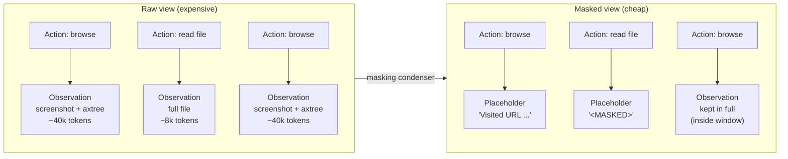
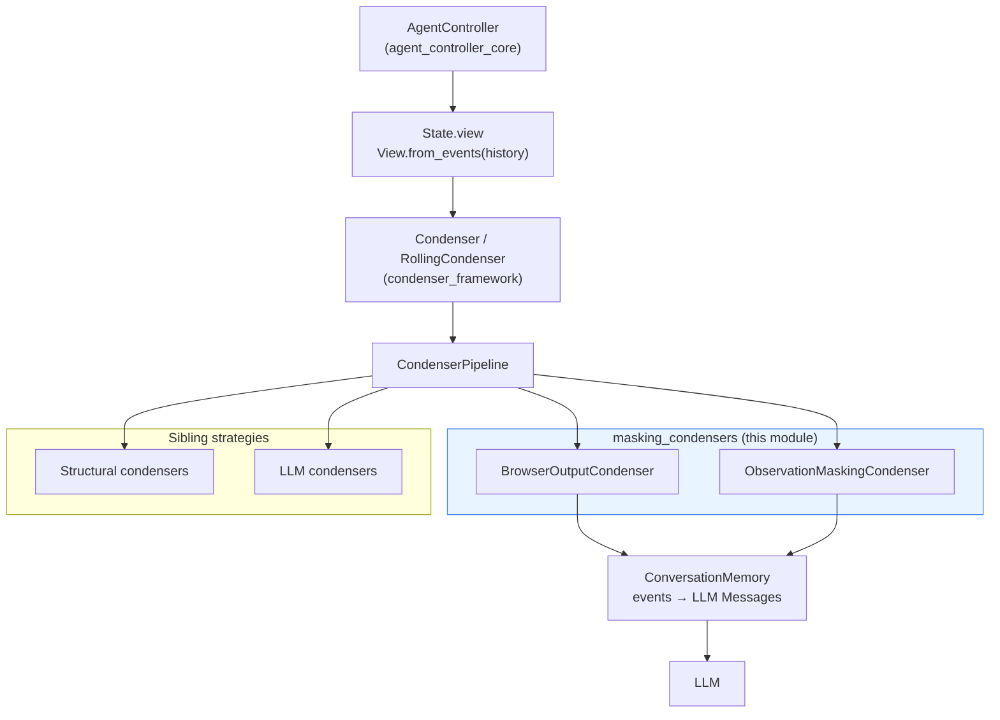
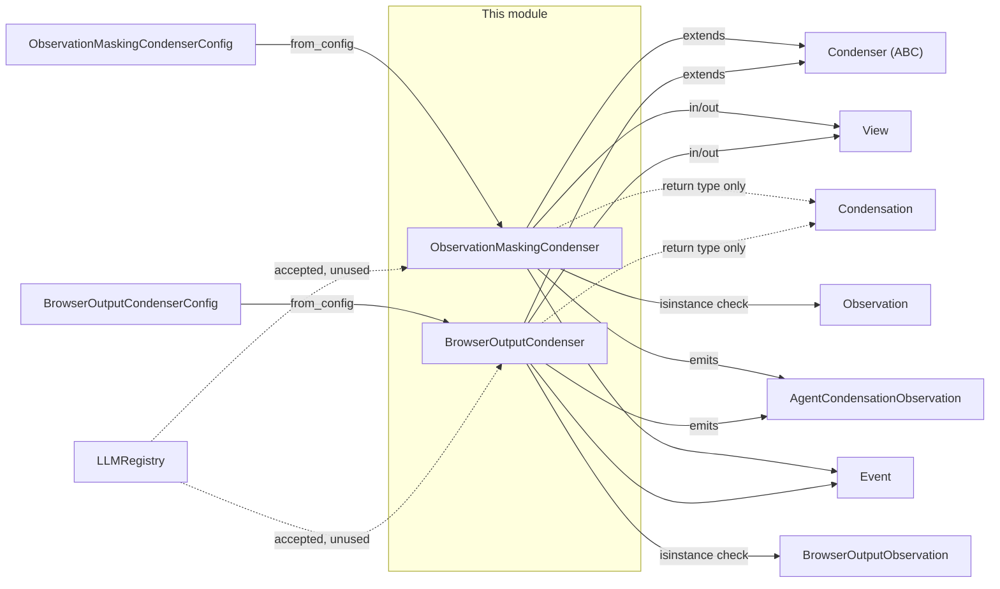
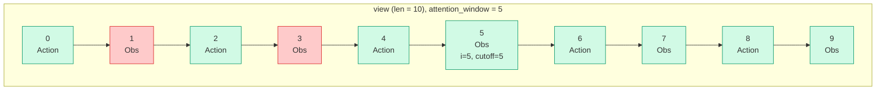
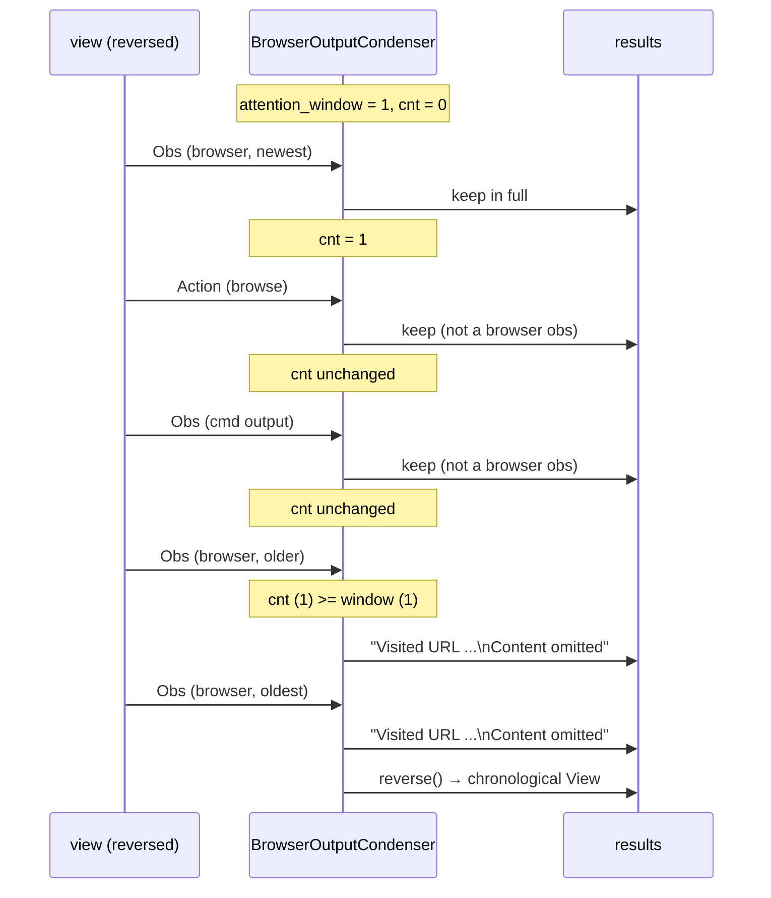
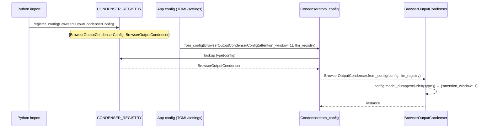
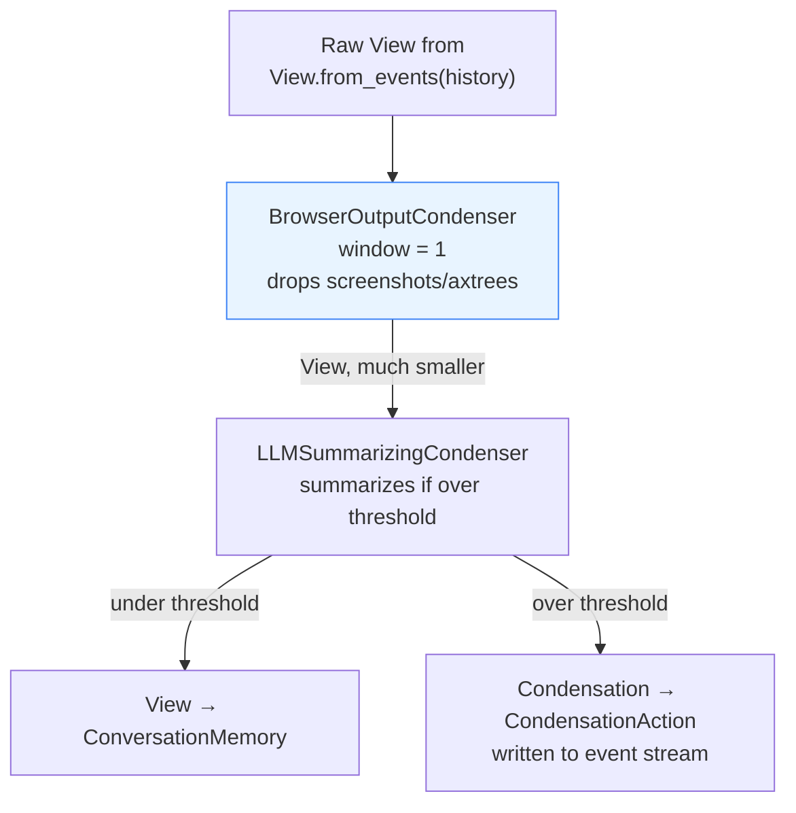
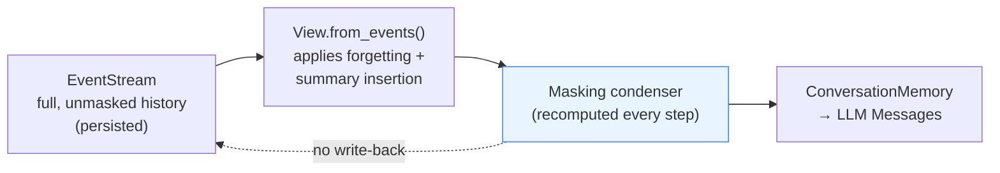

# Masking Condensers

## Introduction

The **masking condensers** are the cheapest way OpenHands keeps an agent's conversation
history small. Instead of deleting events or asking an LLM to write a summary, they
*keep every event in place* and only blank out the **content** of observations that are
old enough to no longer matter.

The module has two components:

| Component | File | What it masks |
| --- | --- | --- |
| `ObservationMaskingCondenser` | `openhands/memory/condenser/impl/observation_masking_condenser.py` | **Every** observation older than the attention window |
| `BrowserOutputCondenser` | `openhands/memory/condenser/impl/browser_output_condenser.py` | **Only** browser observations older than the attention window |

Both are stateless, deterministic, and make **no LLM calls**. That makes them fast,
free, and safe to put in front of an expensive condenser in a
[condenser pipeline](memory_and_condensers_condenser_framework.md).

---

## Why masking exists

An agent step sends the whole history to the model. Observations are the biggest part of
that history — a `read` of a large file, a long test log, or a browser page with a
screenshot plus an accessibility tree. Those payloads are useful for one or two steps
and then become dead weight that still costs tokens on every later step.

Masking solves this by replacing the payload with a short placeholder while keeping the
event slot itself. The model still sees *that* an action produced an observation (so the
action/observation pairing stays intact), it just no longer sees the bulky text.



---

## Place in the system

Masking condensers are ordinary `Condenser` subclasses. They plug into the same
framework as every other strategy, and the agent never talks to them directly — the
`Condenser.condensed_history(state)` entry point does.



Related module docs:

- [Condenser framework](memory_and_condensers_condenser_framework.md) — `Condenser`,
  `RollingCondenser`, `Condensation`, `View`, `CondenserPipeline`
- [Structural condensers](memory_and_condensers_structural_condensers.md) — strategies
  that *drop* events instead of masking them
- [LLM condensers](memory_and_condensers_llm_condensers.md) — strategies that summarize
  with a model
- [Conversation memory](memory_and_condensers_conversation_memory.md) — turns the
  resulting `View` into LLM messages
- [Core configuration](core_configuration.md) — the `*CondenserConfig` Pydantic models
- [Event system](event_system.md) — `Event`, `Observation`, `BrowserOutputObservation`
- [Agent controller core](agent_controller_core.md) — drives the condensation step

---

## Component dependencies



Two things to notice in the diagram:

1. **`Condensation` is never actually returned.** Both `condense` methods always
   return a `View`. `Condensation` only appears in the signature so the class matches
   the `Condenser` contract. Masking condensers therefore never write a
   `CondensationAction` to the event stream and never interrupt the agent's step.
2. **`LLMRegistry` is accepted but ignored.** `from_config` takes it because the
   framework passes it to every condenser uniformly. Neither masking condenser makes an
   LLM call.

---

## `ObservationMaskingCondenser`

### Behavior

Walks the view **front to back** with an index. Any event that is an `Observation` and
sits at index `i < len(view) - attention_window` is replaced by
`AgentCondensationObservation('<MASKED>')`. Everything else — all actions, plus
observations inside the window — passes through untouched.

```python
def condense(self, view: View) -> View | Condensation:
    results: list[Event] = []
    for i, event in enumerate(view):
        if isinstance(event, Observation) and i < len(view) - self.attention_window:
            results.append(AgentCondensationObservation('<MASKED>'))
        else:
            results.append(event)
    return View(events=results)
```

### The window is positional, not observation-counted

This is the most important detail to internalize. The window is measured in **total
events**, not in observations. With `attention_window = 5` and a history that alternates
action/observation, the last 5 slots hold roughly 2–3 observations. The window
effectively shrinks by half when the history is action-heavy.



Cutoff is `10 - 5 = 5`, so indices 0–4 are candidates for masking and indices 5–9 are
kept. Only the observations at 1 and 3 are masked — 2 of the 5 observations, not 5.

### Configuration mismatch worth knowing

`ObservationMaskingCondenserConfig.attention_window` defaults to **100**, while the
class constructor defaults to **5**. Since `from_config` always passes the config value
through, config-driven construction gets 100 and only direct instantiation
(`ObservationMaskingCondenser()`) gets 5. If you read the class signature and assume 5
is what production uses, you will be off by 20x.

### When to reach for it

Use it when the *content* of past observations is genuinely disposable and you want a
hard, predictable token ceiling with zero LLM cost. It is aggressive: a masked file read
or masked test log is unrecoverable from the model's point of view. For histories where
the agent needs to look back at earlier results, prefer an
[LLM summarizing condenser](memory_and_condensers_llm_condensers.md).

---

## `BrowserOutputCondenser`

### Behavior

A targeted variant. It masks **only** `BrowserOutputObservation` events, and it counts
the window in *browser observations* rather than in total events.

```python
def condense(self, view: View) -> View | Condensation:
    results: list[Event] = []
    cnt: int = 0
    for event in reversed(view):
        if isinstance(event, BrowserOutputObservation) and cnt >= self.attention_window:
            results.append(
                AgentCondensationObservation(f'Visited URL {event.url}\nContent omitted')
            )
        else:
            results.append(event)
            if isinstance(event, BrowserOutputObservation):
                cnt += 1
    return View(events=list(reversed(results)))
```

The reverse walk is what makes "most recent N browser outputs" work. `cnt` counts the
browser observations already kept; once it reaches `attention_window`, every further
(i.e. older) browser observation gets masked. The list is reversed back at the end to
restore chronological order.



### Why the placeholder keeps the URL

Unlike `<MASKED>`, the browser placeholder is `Visited URL {url}\nContent omitted`. The
URL is tiny and highly informative — it lets the agent reconstruct its own navigation
trail ("I already visited the docs page") without paying for the page body. That trail
is what browsing agents actually need from old steps.

### Why browser output is special-cased

`BrowserOutputObservation` carries `screenshot` (a base64 image), `set_of_marks`
(another image), `axtree_object`, `dom_object`, and `extra_element_properties`. As the
class docstring states, these are "really large and consume a lot of tokens without any
benefits in performance." Every prior page's screenshot and accessibility tree would
otherwise be resent on every step. This is why the default `attention_window` is **1** —
only the page the agent is currently looking at stays in full.

Both the class default and the config default are 1 here, so there is no mismatch to
watch for.

### Who uses it

Primarily the browsing agents — see
[browsing agents](agents_browsing.md) and
[visual browsing agent](agents_browsing_visual_agent.md). It is also safe to leave in a
general-purpose pipeline: on a history with no browser observations, it is a pure
pass-through.

---

## Side-by-side comparison

| | `ObservationMaskingCondenser` | `BrowserOutputCondenser` |
| --- | --- | --- |
| Masks | all `Observation` subclasses | only `BrowserOutputObservation` |
| Window unit | **total events** (positional index) | **browser observations** (counted) |
| Iteration | forward, with index | reverse, with counter |
| Placeholder | `<MASKED>` | `Visited URL {url}\nContent omitted` |
| Class default window | 5 | 1 |
| Config default window | **100** | 1 |
| Config `type` literal | `observation_masking` | `browser_output_masking` |
| LLM calls | none | none |
| Can return `Condensation` | no (always `View`) | no (always `View`) |
| Deterministic | yes | yes |

Both share the same three-part shape: an `attention_window` int, a `condense` that
rebuilds the event list with placeholders, and a `from_config` classmethod plus a
module-level `register_config(...)` call that wires the config type into the global
`CONDENSER_REGISTRY`.

---

## Registration and construction flow

Registration happens at **import time** via the module-level call at the bottom of each
file. This is why the condenser `impl` package must be imported before
`Condenser.from_config` can resolve these config types.



Note the `exclude={'type'}` in `model_dump` — the discriminator field is only for
Pydantic union resolution and is not a constructor argument. Passing it through would
raise a `TypeError`.

---

## Pipeline composition

Masking condensers shine as the **first stage** of a `CondenserPipeline`. They shrink
the payload cheaply so a downstream LLM condenser has less text to read (and therefore
costs less and is less likely to hit a context limit).



Because masking condensers never return a `Condensation`, they never short-circuit the
pipeline — `CondenserPipeline.condense` only breaks early on a `Condensation`, so a
masking stage always hands its `View` to the next stage.

### Ordering caveat

Put masking **before** LLM summarization, not after. Masking after a summarizer means
the summarizer already paid to read the full screenshots and accessibility trees, which
defeats the purpose. Also be careful stacking `ObservationMaskingCondenser` before an
LLM condenser with a small window: the summarizer will only see `<MASKED>` for older
events and cannot write a useful summary of them.

---

## Interaction with `View.from_events`

Masking condensers do **not** participate in the forgetting protocol that
`View.from_events` implements. That protocol works on event IDs recorded in
`CondensationAction.forgotten`, and masking condensers never emit one.

The practical consequence: **masking is not persisted.** It is recomputed from the raw
history on every single agent step.



This has upsides and downsides:

- **Upside:** non-destructive. The full observation is still on disk, so replay,
  the frontend timeline, and evaluation all see the real data. Change the window and the
  next step immediately reflects it.
- **Downside:** no token savings on storage, and the work is repeated each step (cheap,
  since it is a single list pass with `isinstance` checks).

Contrast this with [structural condensers](memory_and_condensers_structural_condensers.md),
which emit a `CondensationAction` so the trimming is recorded once and reapplied by
`View.from_events`.

---

## Practical notes and gotchas

**Placeholders replace, not annotate.** The masked slot becomes a brand-new
`AgentCondensationObservation`. It does not carry the original event's `id`, `cause`, or
`tool_call_metadata`. Downstream code that matches an observation back to its tool call
sees the placeholder, not the original. This is fine for
[`ConversationMemory`](memory_and_condensers_conversation_memory.md), which handles
`AgentCondensationObservation` as a plain text message, but is worth knowing before
writing new consumers.

**`attention_window` has `ge=1` on both configs.** A window of 0 is rejected by
Pydantic, so there is always at least one recent slot left unmasked.

**Masking every observation is aggressive.** With a small window,
`ObservationMaskingCondenser` will mask error messages, test failures, and command
output that the agent may still need. Prefer the narrow `BrowserOutputCondenser` when
the real problem is browser payload size specifically.

**Idempotence.** Running either condenser twice on the same view is safe. Placeholders
are `AgentCondensationObservation`, which is itself an `Observation` — so a second
`ObservationMaskingCondenser` pass would re-mask an already-masked slot with an
identical `<MASKED>` placeholder. Harmless, but it means the operation is not a no-op on
a second pass for that condenser. `BrowserOutputCondenser` *is* a true no-op on a second
pass, because placeholders are no longer `BrowserOutputObservation` instances (which
also means `cnt` no longer counts them — a masked browser slot does not consume window
budget on a re-run).

---

## Extending the module

To add a new masking strategy, follow the shape both classes share:

1. Subclass `Condenser` (not `RollingCondenser` — masking needs no threshold check and
   emits no `CondensationAction`).
2. Add a `*CondenserConfig` Pydantic model in
   [`condenser_config.py`](core_configuration.md) with a unique `type` literal and
   `extra='forbid'`.
3. Implement `condense(view) -> View` by rebuilding the event list, swapping targeted
   events for `AgentCondensationObservation` placeholders.
4. Implement `from_config` using `config.model_dump(exclude={'type'})`.
5. Call `YourCondenser.register_config(YourConfig)` at module level.
6. Make sure the module is imported so registration actually runs.

Keep placeholders short but informative — the `BrowserOutputCondenser` pattern of
retaining a cheap identifier (the URL) while dropping the expensive payload is the
better template to copy.
