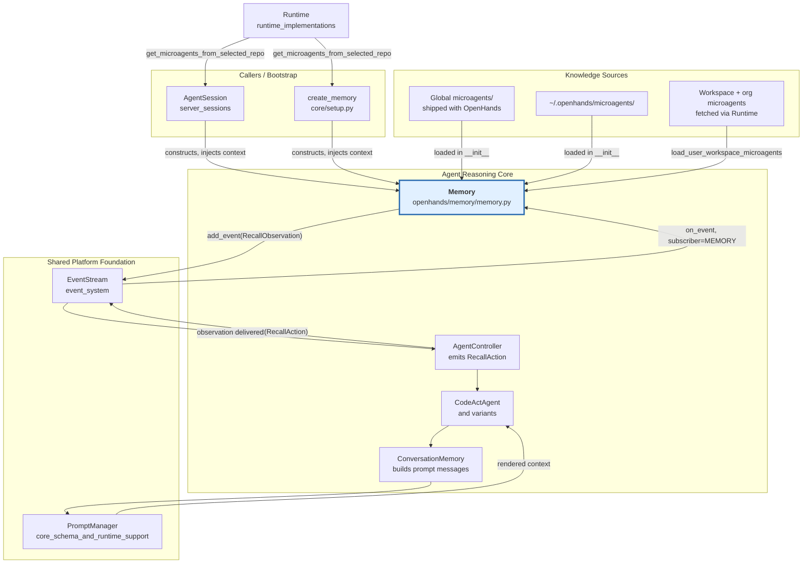
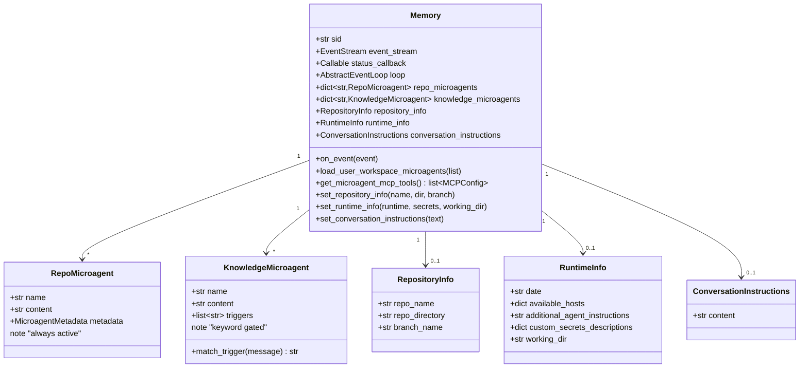
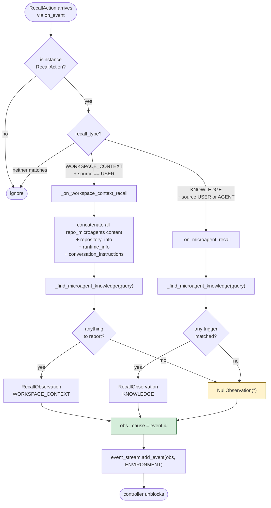
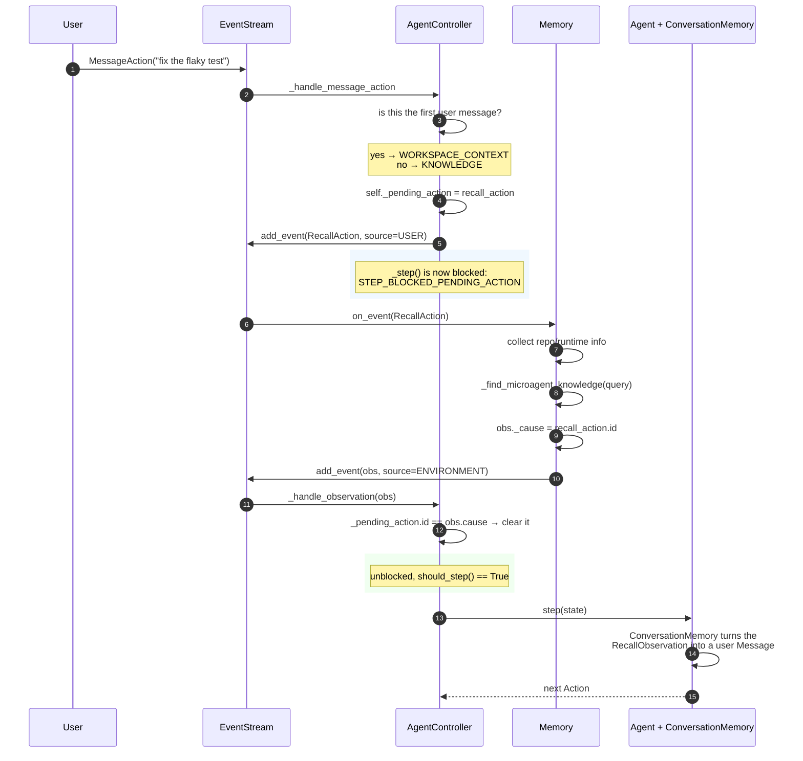
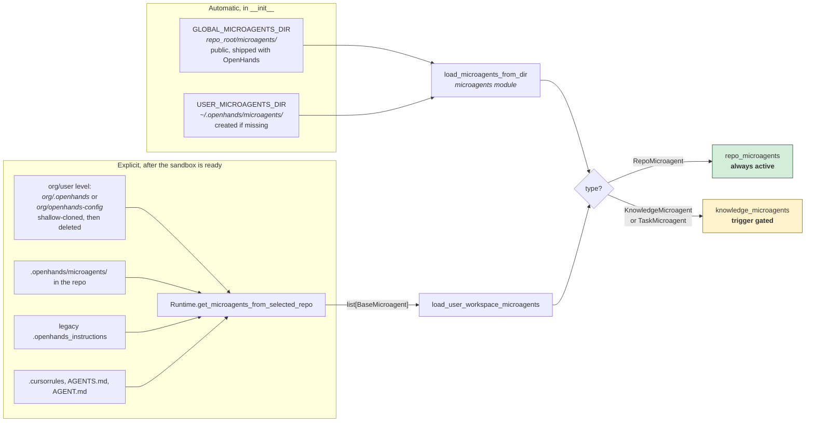
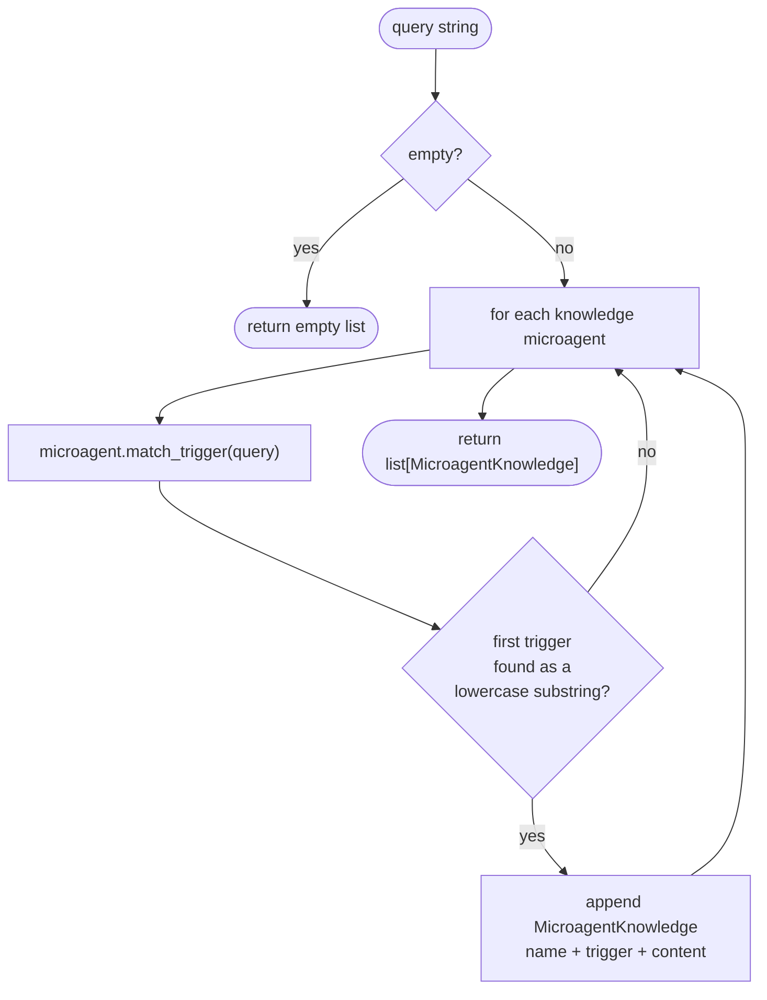
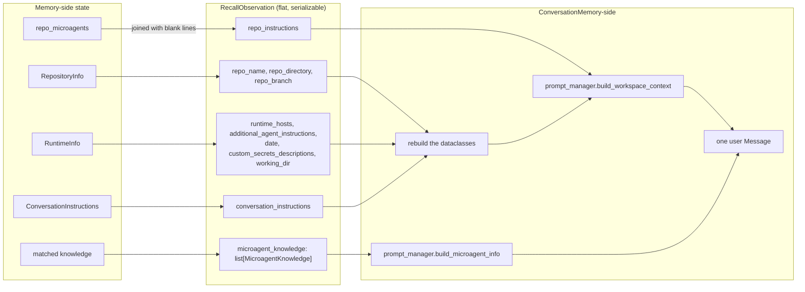
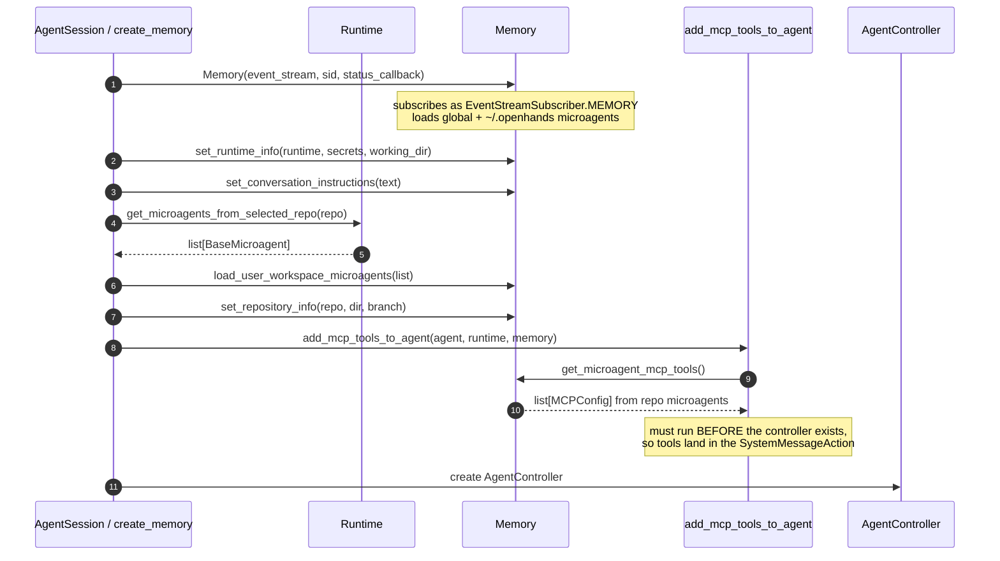
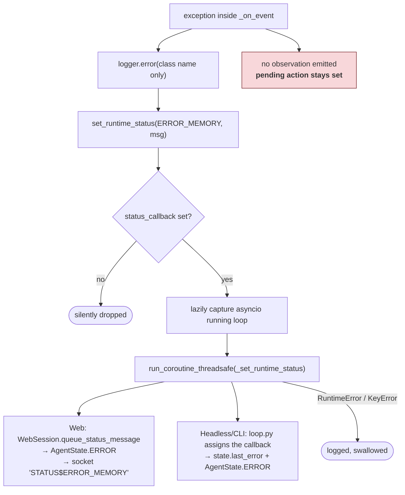
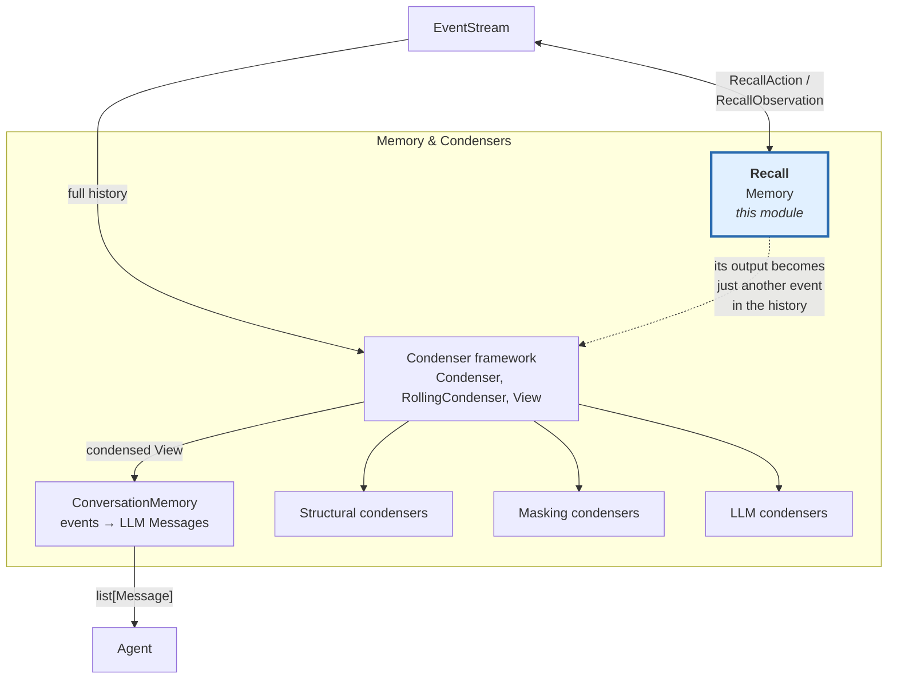

# Memory & Condensers: Recall

## Introduction

The **recall** module is the agent's "look it up for me" service. It is one small class — [`Memory`](#the-memory-class) in `openhands/memory/memory.py` — that sits on the event stream, waits for the agent controller to ask a question, and answers with context the agent could not have known on its own:

- **Where am I?** Repository name, directory, branch, sandbox hosts, working directory, today's date.
- **What are the house rules?** Repository-specific instructions loaded from `repo.md`, `.cursorrules`, `AGENTS.md`, and legacy `.openhands_instructions` files.
- **Does anything in this message ring a bell?** Keyword-triggered *knowledge microagents* that inject just-in-time expertise ("you mentioned `kubernetes`, here is how we deploy").

The design is deliberately narrow. `Memory` does **not** talk to an LLM, does **not** hold conversation history, and does **not** decide what goes into a prompt. It only turns a `RecallAction` into a `RecallObservation` and puts it back on the stream. Everything downstream — turning that observation into actual prompt text — belongs to [ConversationMemory](memory_and_condensers_conversation_memory.md). Everything upstream — deciding *when* to ask — belongs to the [AgentController](agent_controller_core.md).

That separation is why recall is safe to reason about: it is a pure, synchronous lookup with a well-defined request/response pair on the event bus.

---

## Where recall sits in the system

The key structural point: **`Memory` and the controller never call each other directly.** They communicate only through the [EventStream](event_system.md), using `RecallAction` / `RecallObservation` as the contract. `Memory` registers itself as `EventStreamSubscriber.MEMORY` in its own constructor, so wiring is a side effect of construction.

---

## The `Memory` class

### Responsibilities

| Responsibility | Methods |
|---|---|
| Subscribe to the event stream | `__init__` |
| Handle recall requests | `on_event`, `_on_event` |
| Build workspace context answers | `_on_workspace_context_recall` |
| Build knowledge answers | `_on_microagent_recall` |
| Match microagent triggers | `_find_microagent_knowledge` |
| Load microagents | `_load_global_microagents`, `_load_user_microagents`, `load_user_workspace_microagents` |
| Accept ambient context from the bootstrap layer | `set_repository_info`, `set_runtime_info`, `set_conversation_instructions` |
| Expose microagent-declared MCP servers | `get_microagent_mcp_tools` |
| Report failures to the UI | `set_runtime_status`, `_set_runtime_status` |

### State it holds

The two microagent dictionaries are keyed by name, which means **later loads overwrite earlier ones with the same name**. Load order is therefore a precedence rule: global → user home → workspace. A repository can shadow a shipped microagent by using the same name.

The three context dataclasses (`RepositoryInfo`, `RuntimeInfo`, `ConversationInstructions`) live in `openhands/utils/prompt.py` alongside the `PromptManager` that eventually renders them — see [core_schema_and_runtime_support](core_schema_and_runtime_support.md).

---

## The two recall types

`RecallType` (from `openhands/events/event.py`) has exactly two members, and they behave quite differently.

| | `WORKSPACE_CONTEXT` | `KNOWLEDGE` |
|---|---|---|
| When | Once, on the **first** user message of a conversation or delegate | Every **later** user message |
| Handler | `_on_workspace_context_recall` | `_on_microagent_recall` |
| Includes repo/runtime info | Yes | No |
| Includes all repo microagent content | Yes, concatenated | No |
| Includes triggered knowledge microagents | Yes, if the query matches | Yes, if the query matches |
| Returns `None` when | Nothing at all is known | No trigger matched |

Both handlers can return `None`. When that happens, `_on_event` substitutes a `NullObservation(content='')` rather than staying silent — this matters a lot, and the next section explains why.

---

## The blocking contract: why `_cause` and `NullObservation` matter

This is the single most important thing to understand about recall. Recall is **not** fire-and-forget — the agent's whole step loop stops until `Memory` answers.

Two implementation details make this work:

1. **`obs._cause = event.id`** is set *before* the observation is published. The controller matches `_pending_action.id == observation.cause` to know this specific answer belongs to its specific question. Without the cause link, the controller would never clear its pending action.

2. **A `NullObservation` is emitted even when there is nothing to say.** If `Memory` returned nothing when no microagent matched, the controller would wait forever. `AgentController.should_step` special-cases a `NullObservation` with `cause > 0` as steppable precisely to support this. A `cause` of `0` means a plain user message, not a recall answer.

> **Failure mode worth knowing:** the `try/except` in `_on_event` catches any exception, logs it, reports `RuntimeStatus.ERROR_MEMORY`, and **returns without emitting any observation**. The controller's pending action is therefore *not* cleared by that path — recovery depends entirely on the status callback pushing the agent into `AgentState.ERROR`. See [Error reporting](#error-reporting).

---

## Where microagents come from

`Memory` gathers microagents from three places, and only the first two happen automatically in the constructor.

Notes on this pipeline:

- **Workspace discovery runs inside the sandbox**, not on the host. `Runtime.get_microagents_from_selected_repo` issues `CmdRunAction` / `FileReadAction` calls, so the agent's own execution environment is the source of truth. See [runtime_implementations](runtime_implementations.md).
- **Loading and parsing are not this module's job.** Frontmatter parsing, type inference, and validation all live in the [microagents](microagents.md) module. `Memory` only calls `load_microagents_from_dir` and sorts the results into two buckets.
- **Type inference matters here.** A microagent with `inputs` becomes a `TaskMicroagent`; one with `triggers` becomes a `KnowledgeMicroagent`; one with neither becomes a `RepoMicroagent`. Since `TaskMicroagent` subclasses `KnowledgeMicroagent`, both land in `knowledge_microagents`.
- **User-directory loading is best-effort.** `_load_user_microagents` wraps everything in a `try/except` and only logs a warning on failure, so a malformed file in `~/.openhands/microagents/` will not stop a conversation from starting. Global loading has no such guard.
- **`load_user_workspace_microagents` merges rather than replaces.** The CLI takes advantage of this: after a repo-init writes a new `repo.md`, it re-reads the workspace and calls the method again to pick up the new file mid-conversation.

### Trigger matching

`_find_microagent_knowledge` is intentionally simple:

It is case-insensitive substring matching, not regex and not semantic search. Every matching microagent contributes one `MicroagentKnowledge` entry; `match_trigger` reports only the *first* trigger that matched, which is what gets shown to the user as the reason. Repo microagents are never trigger-matched — their content is unconditionally concatenated into `repo_instructions` on workspace-context recall.

---

## What the observation carries

`RecallObservation` is a **flat** dataclass, not a nested one. `Memory` deliberately flattens `RepositoryInfo` / `RuntimeInfo` / `ConversationInstructions` into scalar fields with `''` and `{}` defaults, and [ConversationMemory](memory_and_condensers_conversation_memory.md) reassembles them on the other side.

Why flatten? Because the observation is an event: it is persisted, replayed on session resume, streamed to the frontend, and passed through condensers. A flat, default-filled shape survives serialization round-trips and schema drift far better than optional nested objects. The frontend's `RecallAction` / recall observation types are declared in [frontend_event_types](frontend_event_types.md).

Two consequences of this design that are handled *downstream*, not here:

- **Deduplication.** `Memory` will happily report the same microagent twice across two recalls. `ConversationMemory._filter_agents_in_microagent_obs` drops microagents whose name already appeared in an earlier `RecallObservation`.
- **Disabling.** `agent_config.disabled_microagents` and `enable_prompt_extensions` are enforced by `ConversationMemory`, not by `Memory`. Recall gathers everything; the prompt builder decides what to actually use.

---

## Injected context: the setter methods

`Memory` cannot discover repository or runtime facts by itself — the bootstrap layer pushes them in after the sandbox exists.

| Setter | Called by | Behavior worth noting |
|---|---|---|
| `set_repository_info(repo_name, repo_directory, branch_name)` | `AgentSession._create_memory`, `core/setup.create_memory` | Sets `repository_info` to `None` if both name and directory are falsy. The headless path omits the branch. |
| `set_runtime_info(runtime, custom_secrets_descriptions, working_dir)` | same | **Always** produces a `RuntimeInfo` — the two branches differ only in whether hosts and extra instructions are included. `date` is stamped as UTC "today" at call time, so it is fixed for the life of the conversation. |
| `set_conversation_instructions(text)` | same | Always constructs the object, coercing `None` to `''`. Used for things like "you are answering GitHub issue #1234, open a PR when done." |

The ordering constraint on the MCP step is real and load-bearing: microagent-declared tools have to be known before the agent's system message is built.

### Microagent-declared MCP servers

`get_microagent_mcp_tools` walks **only** `repo_microagents` — repository microagents are always active, so their tool declarations can be trusted for the whole session. Trigger-gated knowledge microagents are excluded, since tools cannot appear and disappear mid-conversation. Only `stdio_servers` are usable today; the caller warns about and drops `sse_servers`. The proxying itself is handled by [runtime_utils](runtime_utils.md).

---

## Error reporting

Points to keep in mind when debugging:

- Only the exception **class name** is logged, not the message. Reproducing a recall failure usually means adding local logging.
- The `status_callback` is optional and starts as `None` in the headless path; `run_agent_until_done` attaches it later. A `Memory` constructed without one will fail silently.
- `self.loop` is captured lazily on first use, because `Memory` is constructed on one loop but `on_event` is invoked from event-stream worker threads.
- `on_event` itself is a synchronous shim that drives `_on_event` with `run_until_complete`, matching the `EventStream`'s synchronous subscriber signature.
- `Memory` has no `close()` and never unsubscribes.

---

## Relationship to the rest of the memory subsystem

Recall is one of four peers under the memory umbrella, and it is the only one that touches the event stream directly.

The dotted edge is the subtle part: once `Memory` publishes a `RecallObservation`, it is an ordinary history event and is subject to condensation like anything else. This is why `ConversationWindowCondenser` explicitly **preserves the first `RecallAction`** when truncating — losing the workspace-context exchange would strip the agent of its repository instructions mid-task. See [memory_and_condensers_condenser_framework](memory_and_condensers_condenser_framework.md) and [memory_and_condensers_structural_condensers](memory_and_condensers_structural_condensers.md).

---

## Integration summary

| Collaborator | Direction | What flows | Module doc |
|---|---|---|---|
| `EventStream` | both ways | subscribes as `MEMORY`; consumes `RecallAction`, publishes `RecallObservation` / `NullObservation` as `ENVIRONMENT` | [event_system](event_system.md) |
| `AgentController` | inbound | the only producer of `RecallAction`; blocks on `_pending_action` until answered | [agent_controller_core](agent_controller_core.md) |
| `ConversationMemory` | outbound | reads the observation and renders prompt messages; owns dedup and disable rules | [memory_and_condensers_conversation_memory](memory_and_condensers_conversation_memory.md) |
| microagent loader & types | inbound | `load_microagents_from_dir`, `RepoMicroagent`, `KnowledgeMicroagent`, `match_trigger` | [microagents](microagents.md) |
| `Runtime` | inbound | `get_microagents_from_selected_repo`, `web_hosts`, `additional_agent_instructions` | [runtime_implementations](runtime_implementations.md) |
| `AgentSession` / `WebSession` | inbound | construction, context injection, `status_callback` | [server_sessions](server_sessions.md) |
| `PromptManager` context dataclasses | shared types | `RepositoryInfo`, `RuntimeInfo`, `ConversationInstructions` | [core_schema_and_runtime_support](core_schema_and_runtime_support.md) |
| MCP tool assembly | outbound | `get_microagent_mcp_tools` → `MCPConfig` stdio servers | [runtime_utils](runtime_utils.md) |
| Conversation API route | outbound | reads `repo_microagents` / `knowledge_microagents` to list them for the UI | [server_api_models](server_api_models.md) |
| Frontend event types | outbound | `RecallAction` and recall observation shapes | [frontend_event_types](frontend_event_types.md) |

---

## Practical notes for maintainers

**Adding a new kind of recall.** You would add a `RecallType` member, a producer branch in `AgentController._handle_message_action`, a handler in `Memory._on_event`, fields on `RecallObservation`, and a consumer branch in `ConversationMemory._process_observation`. All five must land together — the flat observation shape means a missing consumer branch silently drops data rather than raising.

**Always emit something.** Any new handler must publish an observation with `_cause` set on every path, including the "nothing found" path. Returning early without publishing deadlocks the controller.

**Keep it LLM-free.** Recall is the cheap, deterministic half of memory. Anything that needs a model call — summarizing, ranking, semantic retrieval — belongs in a condenser, where the cost, retries, and metrics are already accounted for.

**Precedence is load order.** Because both microagent dictionaries are name-keyed, changing the sequence of load calls silently changes which microagent wins. Treat global → user → workspace as part of the contract.
