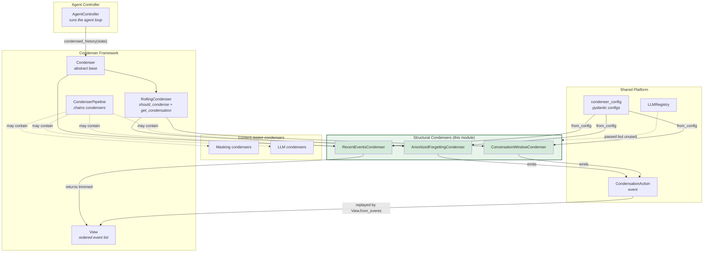
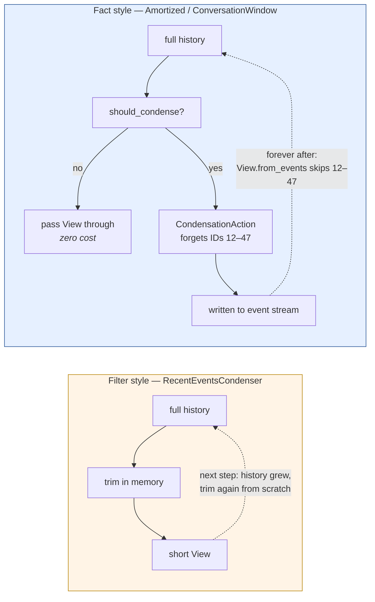
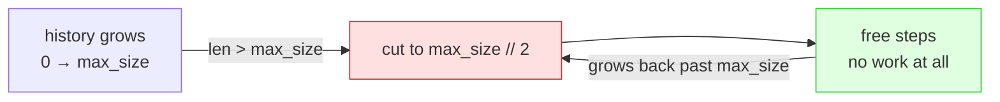
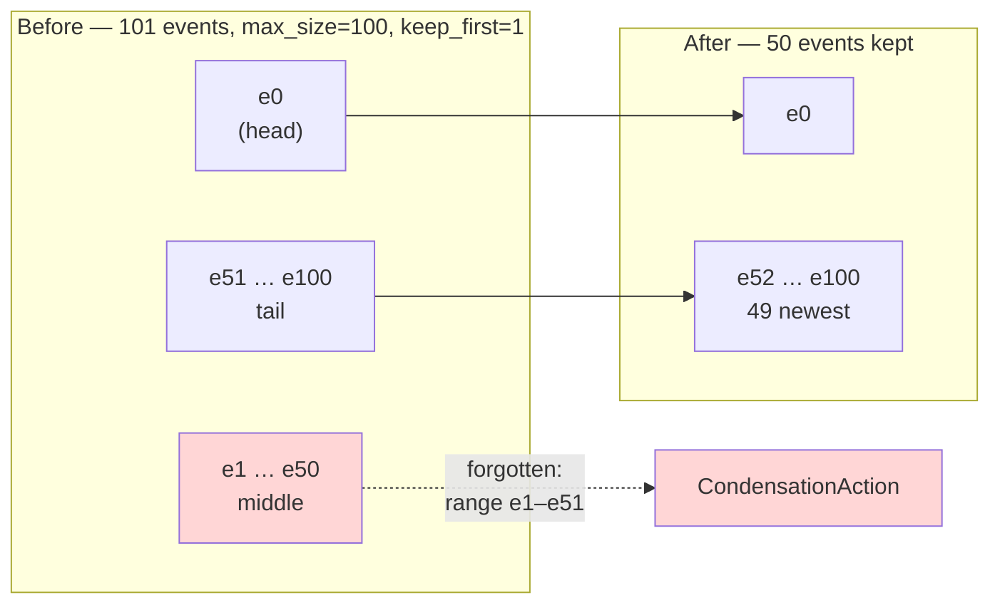
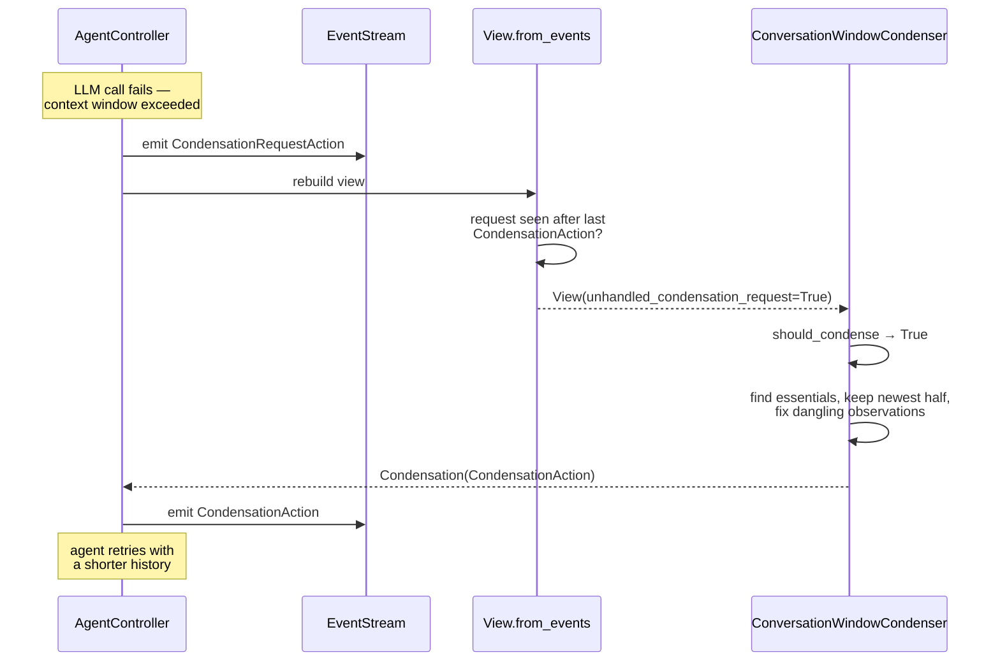
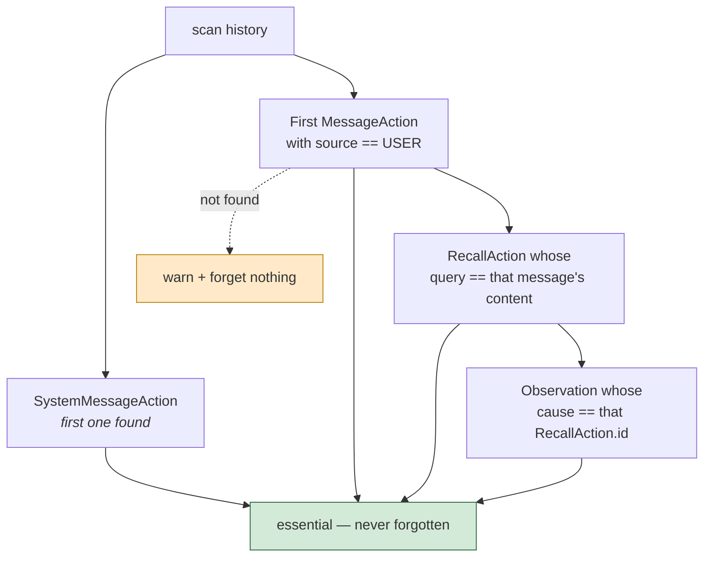
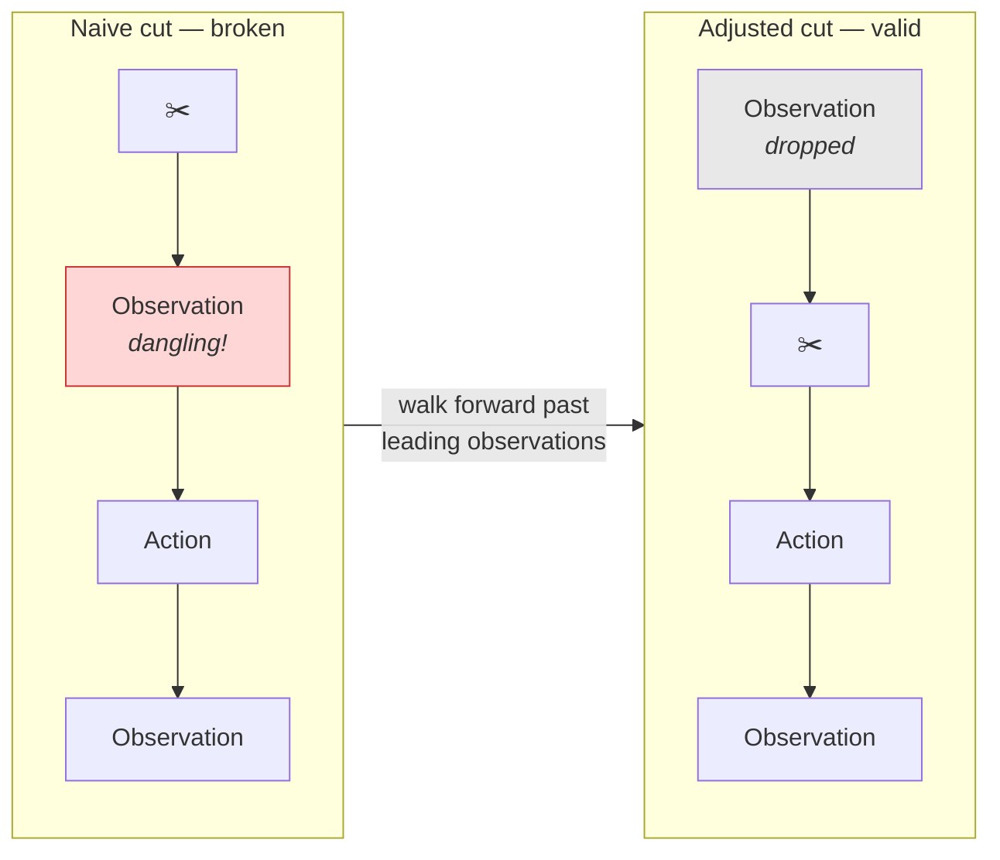
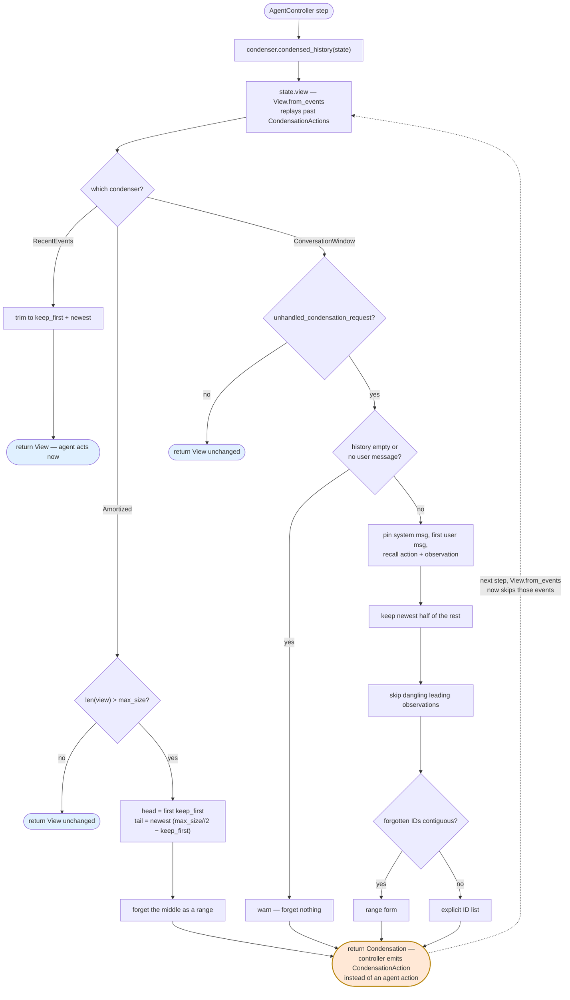
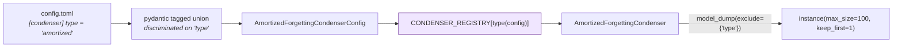

# Structural Condensers

## Introduction

An agent runs in a loop: it acts, it observes, it acts again. Every step adds events to the history. The history grows, and sooner or later it no longer fits in the LLM context window.

**Structural condensers** are the simplest answer to that problem. They shrink history by *position alone* — keep the first few events, keep the most recent ones, drop what is in the middle. They never read the content of an event, never call an LLM, and never cost a token. They are pure, cheap, deterministic bookkeeping.

This module holds three of them:

| Condenser | Base class | Trigger | What survives |
|---|---|---|---|
| `AmortizedForgettingCondenser` | `RollingCondenser` | history longer than `max_size` | first `keep_first` events + newest events, down to `max_size // 2` |
| `RecentEventsCondenser` | `Condenser` | every single step | first `keep_first` events + newest events, up to `max_events` |
| `ConversationWindowCondenser` | `RollingCondenser` | an unhandled condensation request | system message, first user message, its recall pair + newest half |

They sit next to two other families that *do* look at content: the [masking condensers](memory_and_condensers_masking_condensers.md), which blank out noisy observation payloads, and the [LLM condensers](memory_and_condensers_llm_condensers.md), which pay an LLM to write summaries. Structural condensers are the floor everything else builds on — the fallback that always works, even when the LLM is down.

All three plug into the shared machinery described in [the condenser framework](memory_and_condensers_condenser_framework.md). Read that first if the terms `View`, `Condensation`, and `RollingCondenser` are unfamiliar.

---

## Where this module sits



Note the dotted line from `LLMRegistry`: every condenser's `from_config` takes it, because the factory signature is shared across all condensers. Structural condensers ignore it. That is the whole point — no model, no cost, no latency. See [the LLM registry](llm_layer_registry.md) for what the other families do with it.

---

## Two ways to shrink a history

Before the individual condensers, one idea has to be clear, because it is the single biggest difference between them.

A condenser's `condense(view)` can return one of two things:

**A `View`** — "here is a shorter list, use it now." Nothing is written to the event stream. The next step recomputes the full history from scratch and trims it again. The trimming is a *filter*, applied fresh every time.

**A `Condensation`** — "stop, emit this `CondensationAction` event instead of an agent action." The action names event IDs to forget. It goes into the [event stream](event_system.md) permanently. From then on, `View.from_events` replays it and those events stay gone. The trimming is a *fact*, recorded once.



The practical consequences:

- **Cost per step.** The filter style does work on every single step. The fact style does nothing at all until the threshold trips, then does one burst of work.
- **Durability.** A `CondensationAction` survives a restart, because it lives in the event stream. A filter's trimming does not — it is recomputed, which happens to produce the same result, so this is fine in practice but means the trimming is invisible to anyone reading the stored conversation.
- **The agent's turn.** Returning a `Condensation` *consumes* the agent's step. The controller emits the condensation action rather than an agent action, and the agent tries again on the next step with a shorter history. Returning a `View` does not — the agent acts normally in the same step.

---

## AmortizedForgettingCondenser

The workhorse. Keeps a bounded history by periodically throwing away the middle.

### The amortization trick

The name comes from amortized analysis. A naive bounded window would drop one event every step once it is full — steady, constant overhead forever. This condenser instead waits until the history is *over* `max_size`, then cuts it all the way down to `max_size // 2`.

That means one expensive-looking operation, then roughly `max_size // 2` completely free steps before the next one. Averaged out, the cost per step is tiny. And because a `CondensationAction` is a single event naming a whole range of IDs, the "expensive" operation is really just one small event write.



With the default `max_size=100`, history sawtooths between 50 and 100 events, and the condenser is idle for about 50 steps out of every 51.

### What it keeps



The arithmetic:

```python
target_size     = max_size // 2                # where we cut down to
head            = view[:keep_first]            # always-keep prefix
events_from_tail = target_size - len(head)     # fill the rest with newest
tail            = view[-events_from_tail:]
```

Everything not in `head + tail` gets forgotten, expressed as a contiguous range via `forgotten_events_start_id` / `forgotten_events_end_id`.

### The constructor guard

```python
if keep_first >= max_size // 2:
    raise ValueError(...)
```

This is not arbitrary. `events_from_tail = target_size - len(head)`, so if `keep_first` reached `target_size`, `events_from_tail` would be `0`. And in Python, `view[-0:]` is `view[0:]` — the *entire* list, not an empty one. Silently keeping everything would defeat the condenser completely. The guard makes that state unreachable, so `events_from_tail` is always at least 1.

Two more guards reject `keep_first < 0` and `max_size < 1`. (Minor cosmetic bug: the `max_size` error message interpolates `keep_first` instead of `max_size`.)

### Config mismatch worth knowing

The Python default is `keep_first=0`; the [config](core_configuration.md) default in `AmortizedForgettingCondenserConfig` is `keep_first=1`. The config comment explains why: the first event is almost always the user's task, and losing the task is much worse than losing a tool call. Constructing the condenser directly gives you a different default than going through config — always prefer `from_config`.

---

## RecentEventsCondenser

The simplest one in the codebase, and the only structural condenser that is a plain `Condenser` rather than a `RollingCondenser`.

```python
def condense(self, view: View) -> View | Condensation:
    head = view[: self.keep_first]
    tail_length = max(0, self.max_events - len(head))
    tail = view[-tail_length:]
    return View(events=head + tail)
```

No threshold, no `should_condense`, no event emitted. Every step it hands back at most `max_events` events: the first `keep_first`, then the newest ones to fill the budget.

Because it always returns a `View` and never a `Condensation`, it never consumes the agent's turn. That makes it a good citizen inside a `CondenserPipeline` — it can shave a history down and pass it along to the next stage without interrupting anything.

### Two sharp edges

**Duplicate events on short histories.** There is no check that head and tail do not overlap. With `keep_first=1`, `max_events=10`, and a 5-event history: `head = [e0]`, `tail_length = 9`, and `view[-9:]` on a 5-element list is all 5 events. The result is 6 events with `e0` appearing twice. Harmless when the history is long (the normal case), but surprising early in a conversation.

**`keep_first >= max_events` keeps everything.** Then `tail_length` is `0`, and `view[-0:]` is the whole list again — the same negative-zero-slice trap that `AmortizedForgettingCondenser` explicitly guards against. `RecentEventsCondenser` has no such guard, and the config schema (`keep_first >= 0`, `max_events >= 1`) does not enforce a relationship between the two. A config of `keep_first=100, max_events=10` silently disables condensation.

---

## ConversationWindowCondenser

The most careful of the three, and the odd one out in several ways. It is the condenser used when something explicitly asks for a condensation — typically after a context-window overflow.

### Triggered by request, not by size

```python
def should_condense(self, view: View) -> bool:
    return view.unhandled_condensation_request
```

The other two watch a counter. This one watches a flag. `View.from_events` sets `unhandled_condensation_request` when it finds a `CondensationRequestAction` that is *closer to the end of the history than any `CondensationAction`* — that is, a request nobody has answered yet.

So this condenser is reactive. It sits idle indefinitely, no matter how large history grows, and only fires when the system says "we hit the wall, make room now."



### Essential events

Instead of "the first N events," this condenser looks for four specific things by type and pins them:



The reasoning behind each: the system message defines the agent's instructions and tools. The first user message is the task. The recall pair is the microagent and repository context pulled in for that task (see [microagents](microagents.md) and the [recall memory](memory_and_condensers_recall.md)). Lose any of these and the agent forgets who it is or what it was asked to do.

Two safe exits: an empty history, or no user message found, both return `CondensationAction(forgotten_event_ids=[])` — a valid no-op that forgets nothing.

### Keeping action–observation pairs intact

This is the part the other two condensers do not attempt, and it matters more than it might look.

Most LLM APIs reject a message list containing a tool result with no matching tool call. If a cut lands between an action and its observation, the resulting history is not just confusing — it is *malformed*, and the API call fails. The condenser would have made things worse.

So after choosing a cut point at roughly the halfway mark of non-essential events, it walks forward from that point and skips every leading `Observation`:



If *every* event in the recent slice turns out to be an observation, it logs a loud warning — the agent will be left with only the essential events, which should not happen in a healthy conversation.

### Contiguous-range optimization

Because essential events are scattered by type rather than being a clean prefix, the forgotten set is not always contiguous. The condenser checks:

```python
if forgotten_event_ids[-1] - forgotten_event_ids[0] == len(forgotten_event_ids) - 1:
    # contiguous — use compact start/end range form
else:
    # sparse — use the explicit ID list
```

`CondensationAction` supports exactly one of these two forms at a time and validates that you did not supply both (`_validate_field_polymorphism`). The range form keeps the stored event small when a long stretch of history is dropped at once.

---

## Full decision flow



---

## Registration and construction

Every condenser follows the same two-line registration pattern at the bottom of its module:

```python
@classmethod
def from_config(cls, config, llm_registry: LLMRegistry) -> ...:
    return SomeCondenser(**config.model_dump(exclude={'type'}))

SomeCondenser.register_config(SomeCondenserConfig)
```

`register_config` adds an entry to a module-level `CONDENSER_REGISTRY` mapping config class → condenser class, and raises if that config type is already claimed. The base `Condenser.from_config` looks up the concrete class by `type(config)` and delegates. The `type` discriminator field (`'amortized'`, `'recent'`, `'conversation_window'`) is stripped before construction, since it is only there for pydantic's tagged-union parsing of TOML config.

`ConversationWindowCondenser` takes no arguments, so its `from_config` names the parameter `_config` and ignores it. Its config class also notes it is *not* reachable from TOML or environment variables — it is wired up in code, since it is a system recovery mechanism rather than a user preference.



---

## Choosing between them

| Question | Answer |
|---|---|
| Want a hard cap on history size, cheapest option? | `AmortizedForgettingCondenser` |
| Want a stage inside a pipeline that never steals the agent's turn? | `RecentEventsCondenser` |
| Recovering from a context-window overflow? | `ConversationWindowCondenser` |
| Need the dropped content preserved as a summary? | Not here — see [LLM condensers](memory_and_condensers_llm_condensers.md) |
| Need to shrink noisy observations without dropping events? | Not here — see [masking condensers](memory_and_condensers_masking_condensers.md) |

The honest trade-off across this whole module: **structural condensers lose information permanently.** An event dropped by `AmortizedForgettingCondenser` is gone from the agent's view forever, with nothing left behind to say it existed. That is the price of costing nothing. The [LLM condensers](memory_and_condensers_llm_condensers.md) pay tokens and latency to keep a summary instead — better recall, real cost, and a dependency on the model actually being available.

A common production setup combines them in a [`CondenserPipeline`](memory_and_condensers_condenser_framework.md): a masking condenser to strip bulky observation payloads, then an LLM summarizing condenser for the main compaction, with a structural condenser as the last resort that always succeeds.

---

## Related documentation

- [Condenser framework](memory_and_condensers_condenser_framework.md) — `Condenser`, `RollingCondenser`, `View`, `CondenserPipeline`
- [LLM condensers](memory_and_condensers_llm_condensers.md) — summarizing and attention-based strategies
- [Masking condensers](memory_and_condensers_masking_condensers.md) — content redaction without dropping events
- [Conversation memory](memory_and_condensers_conversation_memory.md) — turning a `View` into LLM messages
- [Recall memory](memory_and_condensers_recall.md) — the `RecallAction` / observation pair pinned by `ConversationWindowCondenser`
- [Agent controller](agent_controller_core.md) — the loop that calls `condensed_history` and emits condensation actions
- [Event system](event_system.md) — `EventStream`, `CondensationAction`, `CondensationRequestAction`
- [Core configuration](core_configuration.md) — condenser config schemas and TOML parsing
- [LLM registry](llm_layer_registry.md) — the registry threaded through `from_config`
