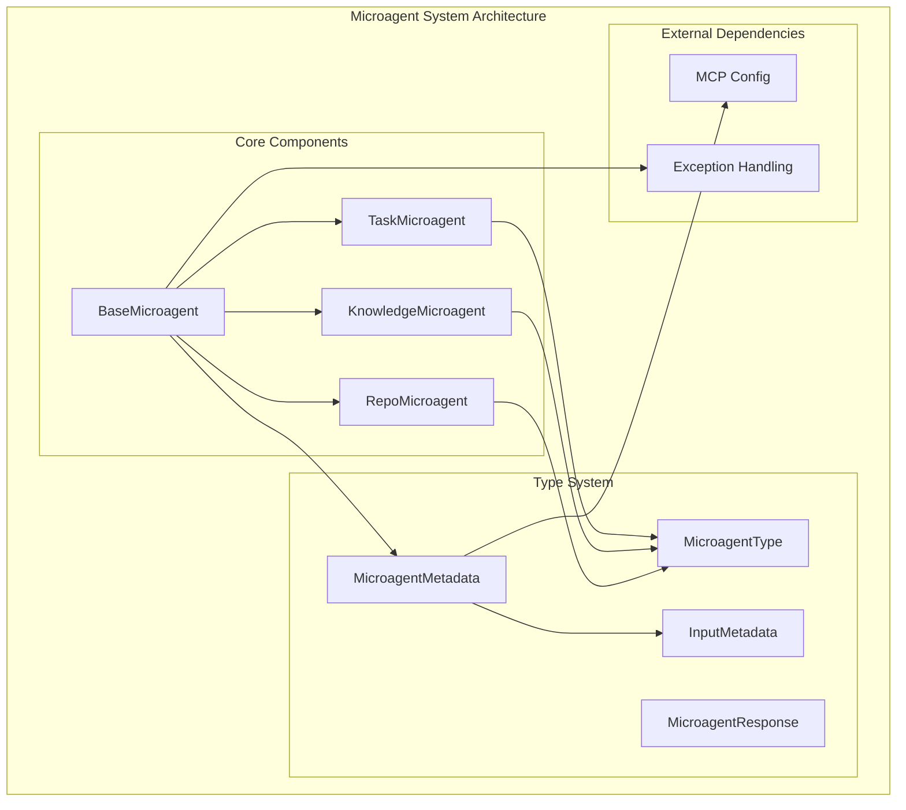
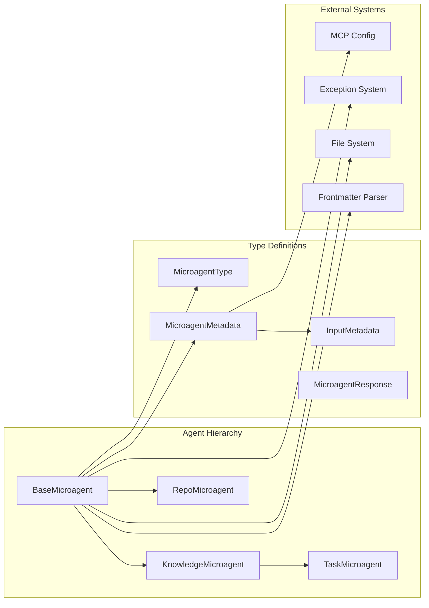
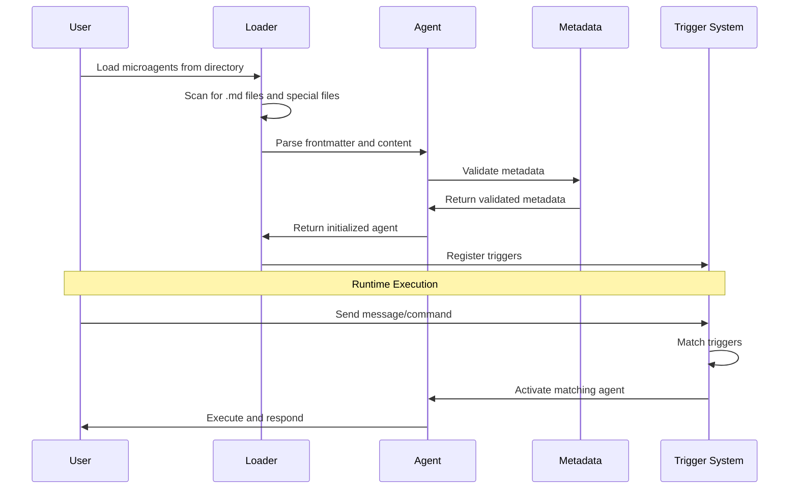

# Microagent System Documentation

## Overview

The Microagent System is a specialized component within the OpenHands platform that provides a flexible framework for creating, managing, and executing lightweight, task-specific agents. These microagents serve as modular extensions that can be dynamically loaded and triggered based on specific conditions, enabling enhanced functionality and specialized knowledge integration.

## Purpose and Core Functionality

The microagent system enables:

- **Dynamic Agent Loading**: Automatic discovery and loading of microagents from repository directories
- **Context-Aware Triggering**: Intelligent activation based on keywords, commands, or repository context
- **Specialized Knowledge Integration**: Repository-specific guidelines, framework expertise, and task automation
- **User Input Management**: Interactive task agents that can collect and process user inputs
- **MCP Tool Integration**: Support for Message Control Protocol (MCP) tools for extended capabilities

## Architecture Overview

The microagent system follows a hierarchical architecture with three main agent types and supporting infrastructure:



## Component Relationships



## Sub-Modules

### Agent Implementations
The core microagent implementations provide the foundation for all agent types in the system. This includes the base agent class and specialized implementations for different use cases.

**Key Components:**
- BaseMicroagent: Foundation class for all microagent types
- TaskMicroagent: Interactive agents with user input capabilities
- KnowledgeMicroagent: Keyword-triggered expertise agents
- RepoMicroagent: Repository-specific knowledge agents

For detailed information, see [Agent Implementations](agent_implementations.md).

### Type System
The type system defines the data structures, enumerations, and response models that govern microagent behavior and metadata.

**Key Components:**
- MicroagentType: Enumeration of agent types
- MicroagentResponse: API response models
- MicroagentMetadata: Agent configuration and metadata
- InputMetadata: User input specifications

For detailed information, see [Type System](type_system.md).

## Agent Types and Functionality

### 1. Repository Microagents (RepoMicroagent)
- **Purpose**: Always-active agents containing repository-specific knowledge
- **Activation**: Automatically loaded when working with a repository
- **Use Cases**: Team practices, project conventions, custom workflows
- **File Sources**: `.openhands_instructions`, `.cursorrules`, `agents.md`

### 2. Knowledge Microagents (KnowledgeMicroagent)
- **Purpose**: Keyword-triggered agents providing specialized expertise
- **Activation**: Triggered by specific keywords in conversations
- **Use Cases**: Language best practices, framework guidelines, tool usage
- **Trigger System**: Configurable keyword matching

### 3. Task Microagents (TaskMicroagent)
- **Purpose**: Interactive agents requiring user input for task execution
- **Activation**: Command-based triggering (e.g., `/{agent_name}`)
- **Use Cases**: Complex workflows, parameterized tasks, interactive automation
- **Input System**: Structured input collection and validation

## Data Flow and Processing



## Integration Points

The microagent system integrates with several other modules in the OpenHands ecosystem:

### Core Agent System Integration
- **Agent Management**: Microagents extend the base agent functionality defined in [core_agent_system](core_agent_system.md)
- **Action Processing**: Leverages action parsing capabilities for command interpretation
- **State Management**: Integrates with traffic control and state management systems

### LLM Integration
- **Language Model Access**: Microagents can utilize LLM capabilities through [llm_integration](llm_integration.md)
- **Response Processing**: Structured response handling and parsing
- **Context Management**: Maintains conversation context across interactions

### Configuration System
- **MCP Configuration**: Integrates with [core_configuration](core_configuration.md) for MCP tool setup
- **Security Configuration**: Respects security policies and constraints
- **Runtime Configuration**: Adapts to different runtime environments

### Storage System
- **File Storage**: Utilizes [storage_system](storage_system.md) for persistent microagent storage
- **Conversation Storage**: Maintains interaction history and context
- **Settings Management**: Stores user preferences and configurations

## Key Features

### Dynamic Loading and Discovery
- Automatic scanning of repository directories
- Support for multiple file formats and naming conventions
- Graceful handling of validation errors and malformed files

### Flexible Triggering System
- Keyword-based activation for knowledge agents
- Command-based activation for task agents
- Always-active repository agents

### Input Management
- Structured input definitions with metadata
- Variable extraction from content templates
- Interactive user input collection

### MCP Tool Integration
- Support for stdio-based MCP servers
- Tool configuration validation
- Runtime tool availability

### Error Handling and Validation
- Comprehensive metadata validation
- Detailed error reporting with context
- Graceful degradation for invalid configurations

## Usage Patterns

### Repository Setup
```markdown
# Example microagent file: .openhands/microagents/python-best-practices.md
---
name: python-best-practices
type: knowledge
triggers: ["python", "pep8", "formatting"]
version: "1.0.0"
---

When working with Python code, follow these best practices:
- Use PEP 8 for code formatting
- Include type hints for better code clarity
- Write comprehensive docstrings
```

### Task Agent Definition
```markdown
# Example task agent: .openhands/microagents/deploy.md
---
name: deploy
type: task
inputs:
  - name: environment
    description: Target deployment environment
  - name: version
    description: Version to deploy
---

Deploy application to ${environment} with version ${version}:
1. Run tests
2. Build artifacts
3. Deploy to ${environment}
```

## Security Considerations

- **Input Validation**: All user inputs are validated against defined schemas
- **File System Access**: Restricted to designated microagent directories
- **MCP Tool Security**: Only stdio servers are currently supported for security
- **Content Sanitization**: Frontmatter and content parsing with safety checks

## Performance Characteristics

- **Lazy Loading**: Microagents are loaded on-demand
- **Efficient Triggering**: Fast keyword matching with minimal overhead
- **Memory Management**: Lightweight agent instances with shared metadata
- **Caching**: Parsed agents are cached for repeated use

## Future Enhancements

- **Enhanced MCP Support**: Expansion to support SSE and HTTP MCP servers
- **Advanced Triggering**: Context-aware and semantic triggering mechanisms
- **Agent Composition**: Ability to chain and compose multiple microagents
- **Performance Optimization**: Improved loading and execution performance
- **Extended File Format Support**: Additional configuration file formats

## Related Documentation

- [Core Agent System](core_agent_system.md) - Base agent functionality and management
- [LLM Integration](llm_integration.md) - Language model integration and capabilities
- [Core Configuration](core_configuration.md) - System configuration including MCP setup
- [Storage System](storage_system.md) - Persistent storage and data management
- [Events and Actions](events_and_actions.md) - Event handling and action processing