# Microagents

## Introduction

The `microagents` module is OpenHands' **prompt extension system**. A microagent is just a Markdown file with a YAML frontmatter header. The file holds extra instructions for the agent: repository conventions, framework tips, tool usage rules, or a reusable task template.

This module does one job, and does it in two small files:

1. **Parse** a Markdown file into a typed Python object (`openhands/microagent/microagent.py`).
2. **Describe** the shape of that object (`openhands/microagent/types.py`).

The module does **not** decide when to use a microagent, does not talk to the LLM, and does not touch the event stream. Those jobs belong to other modules:

- [Memory / Recall](memory_and_condensers_recall.md) loads microagents and matches triggers.
- [ConversationMemory](memory_and_condensers_conversation_memory.md) turns matched microagents into LLM messages.
- [Runtime](runtime_implementations.md) pulls microagent files out of the sandbox.
- [Server API](conversation_service_tier.md) and the [frontend](frontend_api_services.md) expose them to users.

So `microagents` is a **leaf module**: small, dependency-light, and used by almost every other layer.

---

## 1. Where the module sits

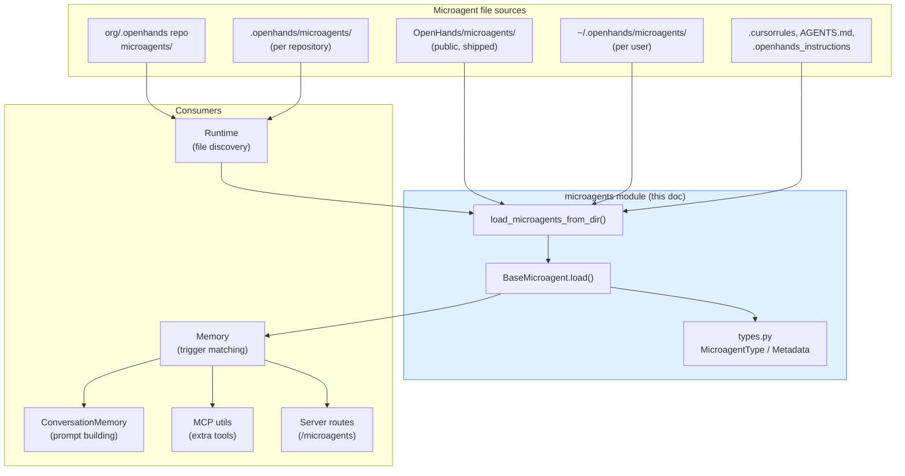

Related modules: [Memory and Condensers](memory_and_condensers.md) · [Sandboxed Execution Layer](sandboxed_execution_layer.md) · [Agent Reasoning Core](agent_reasoning_core.md)

---

## 2. Core components

### 2.1 Class hierarchy

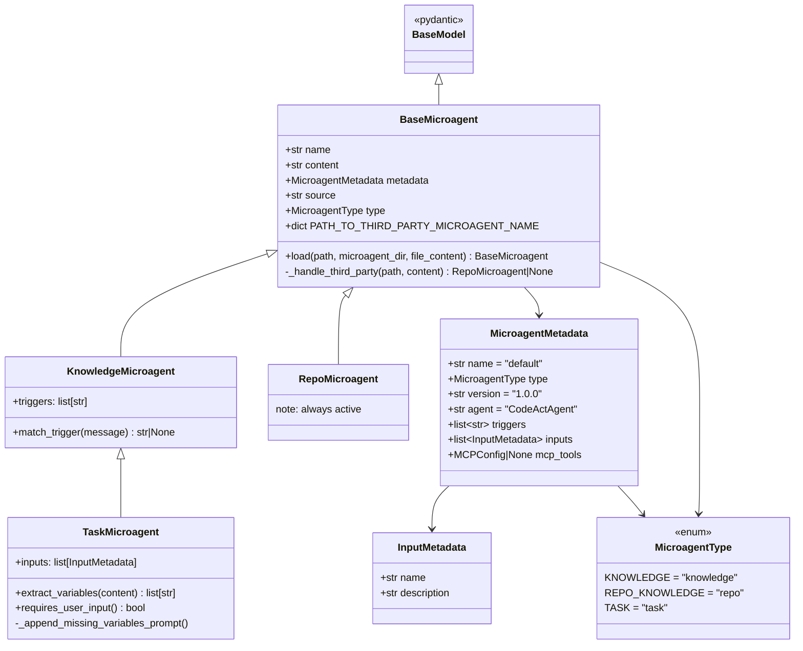

### 2.2 The three microagent types

| Type | Enum value | Class | When it activates | Typical file |
|---|---|---|---|---|
| Repository knowledge | `repo` | `RepoMicroagent` | **Always**, on the first user message | `.openhands/microagents/repo.md`, `.cursorrules`, `AGENTS.md` |
| Knowledge | `knowledge` | `KnowledgeMicroagent` | When a **trigger keyword** appears in a message | `microagents/docker.md`, `microagents/npm.md` |
| Task | `task` | `TaskMicroagent` | When the user types `/<agent_name>` | `microagents/add_agent.md`, `microagents/fix_test.md` |

`TaskMicroagent` is a subclass of `KnowledgeMicroagent`, so a task microagent is also trigger-matched. Its trigger is auto-generated as `/<name>`.

### 2.3 `RepoMicroagent`

Holds private, repo-specific instructions. It has no triggers because it is always injected. The constructor is a guard only: it raises `ValueError` if the type is not `REPO_KNOWLEDGE`.

Its content ends up in the `repo_instructions` field of a workspace-context recall. When several repo microagents exist (for example one from the org repo and one from the selected repo), `Memory` concatenates all of their contents with blank lines between them.

### 2.4 `TaskMicroagent`

Task microagents are templates that need values from the user. Variables use `${variable_name}` syntax inside the body, and are also declared in the `inputs:` frontmatter list.

Three behaviours matter:

- `extract_variables(content)` — regex-scans for `${...}` placeholders using `\$\{([a-zA-Z_][a-zA-Z0-9_]*)\}`.
- `requires_user_input()` — `True` when at least one placeholder exists.
- `_append_missing_variables_prompt()` — runs in the constructor. If the agent has placeholders **or** declared `inputs`, it appends a sentence to `content` telling the LLM to ask the user for any missing values first.

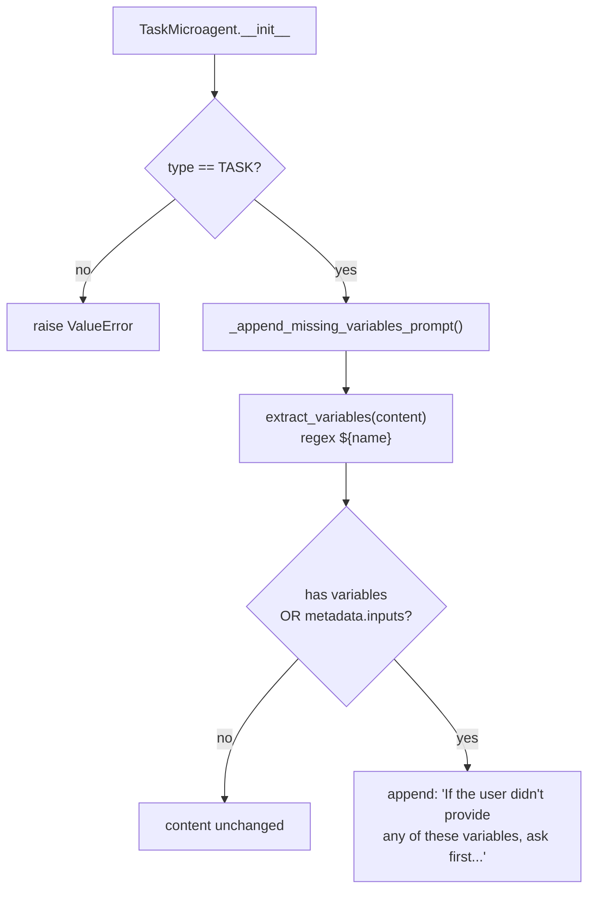

Note the appended prompt is baked into `content` at load time. It travels with the microagent into the LLM message, so the agent itself is responsible for asking the user.

### 2.5 `InputMetadata` and `MicroagentMetadata`

`InputMetadata` is a two-field model (`name`, `description`). It is the contract shared with the UI: the frontend renders a form field per input, and it is mirrored in TypeScript as `InputMetadata` in [frontend event/API types](frontend_api_services.md).

`MicroagentMetadata` is the parsed frontmatter. Every field has a default, so a Markdown file with **no** frontmatter still loads (it becomes a repo microagent named `default`, though the derived path name usually wins — see §3.3).

### 2.6 Response models (API contract)

`types.py` also defines two models used only by the HTTP layer:

- `MicroagentResponse` — `name`, `path`, `created_at`. Deliberately cheap: it lists files **without** parsing content.
- `MicroagentContentResponse` — `content`, `path`, `triggers`, `git_provider`. Used by the "fetch one microagent" endpoint.

This split keeps repository scans fast. See [Git provider integrations](git_provider_integrations.md) and [Server API models](server_api_models.md).

---

## 3. The loading pipeline

### 3.1 `BaseMicroagent.load()` — single file

`load()` is a classmethod factory. It always returns a **subclass** instance, never a raw `BaseMicroagent`.

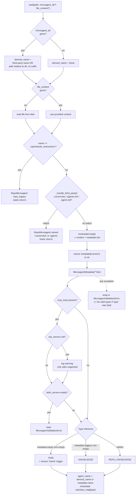

### 3.2 Type inference is by shape, not by declaration

This is the most surprising part of the module, and worth spelling out: the `type:` field in frontmatter is **not** what decides the class. Inference is purely structural, in this order:

1. `inputs` present → `TASK`
2. else `triggers` present → `KNOWLEDGE`
3. else → `REPO_KNOWLEDGE`

`metadata.type` is still parsed and validated (an unknown value produces a helpful error listing the valid ones), but it is ignored for dispatch. This makes files hard to misconfigure: if you add triggers, it becomes a knowledge agent automatically.

For `TASK`, `load()` also **mutates the metadata**: it appends `/{metadata.name}` to `triggers` if not already there (creating the list if needed). This is what makes `/fix_test` work as a slash command.

### 3.3 Naming rules

| Situation | Resulting `name` |
|---|---|
| `microagent_dir` given, normal `.md` file | path relative to the dir, suffix stripped (`tools/docker.md` → `tools/docker`) |
| `microagent_dir` given, third-party file | mapped constant (`cursorrules` or `agents`) |
| No `microagent_dir` | `metadata.name` from frontmatter |
| `.openhands_instructions` | `repo_legacy` |

Because the derived path name wins over `metadata.name`, nested directories give namespaced names for free. This matters: `disabled_microagents` in the [agent config](core_configuration.md) matches on this name, and so does the frontend list.

### 3.4 Third-party and legacy compatibility

`PATH_TO_THIRD_PARTY_MICROAGENT_NAME` is a class-level map that lets OpenHands read instruction files written for other tools:

```
.cursorrules -> "cursorrules"
agents.md    -> "agents"
agent.md     -> "agents"
```

All of these become `RepoMicroagent` (always active), skipping frontmatter parsing entirely — their whole file body is the content. `.openhands_instructions` is handled the same way under the name `repo_legacy`.

### 3.5 `load_microagents_from_dir()` — a whole directory

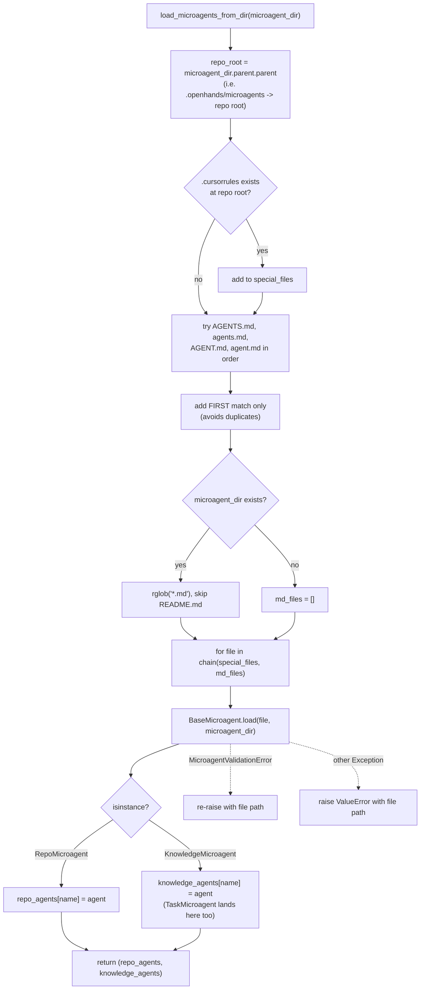

Three behaviours worth remembering:

- **Repo-root files are checked even if `microagents/` is missing.** A repo with only a `.cursorrules` file still yields one microagent.
- **`README.md` is always skipped**, so documentation inside a microagents folder is not loaded as an agent.
- **Loading is fail-fast.** One bad file aborts the whole directory with an error naming that file. Compare this with the *callers*, which are fail-soft (§4.2).

---

## 4. Runtime integration

### 4.1 Discovery: from sandbox to memory

Microagent files usually live inside the sandbox, not on the host. The [Runtime](runtime_implementations.md) base class bridges the gap.

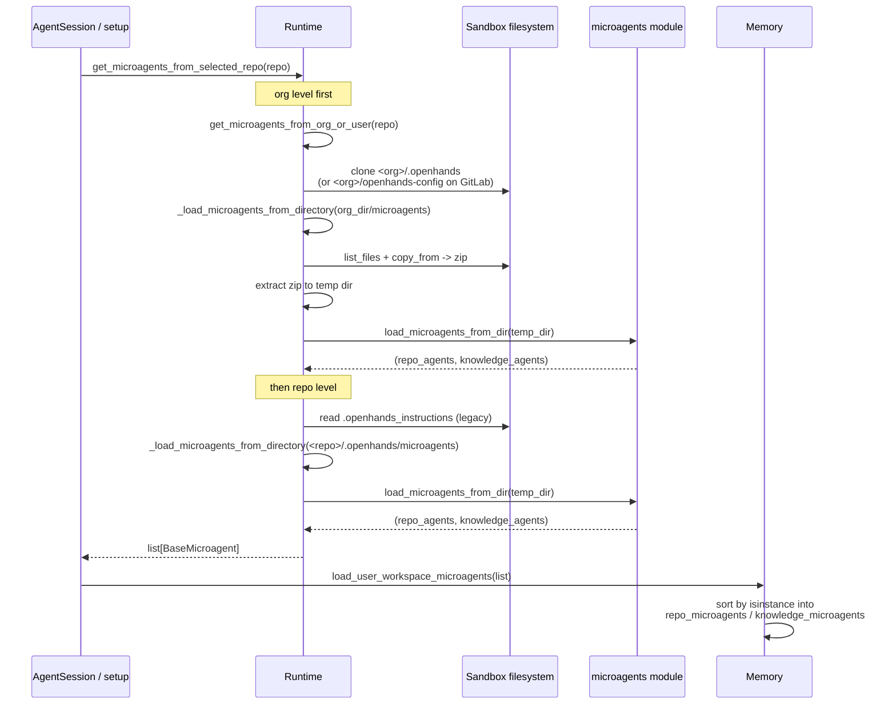

### 4.2 Four source layers, one flat namespace

`Memory` keeps exactly two dictionaries, keyed by name. Later writes overwrite earlier ones, so the effective precedence is:

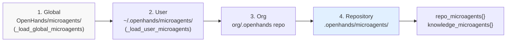

Layers 1 and 2 load in `Memory.__init__`. Layer 2 creates `~/.openhands/microagents/` if missing, and wraps failures in a warning — a broken user file degrades gracefully instead of killing the session. Layers 3 and 4 load later, after the workspace is cloned, via `load_user_workspace_microagents()`. Runtime-side loading also catches and logs exceptions per directory.

### 4.3 Trigger matching and recall

This is the hot path during a conversation. See [Agent Controller](agent_controller_core.md) and [Event system](event_system.md) for the surrounding machinery.

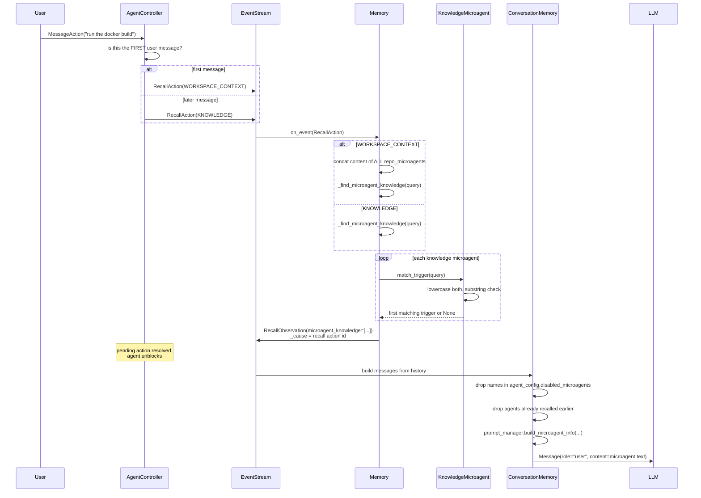

Key details:

- `match_trigger` is a **case-insensitive substring** match, and returns the **first** hit only. Order of `triggers` in frontmatter therefore matters for which trigger name is reported.
- Matching runs on both user **and** agent messages for `KNOWLEDGE` recalls.
- Empty queries short-circuit to an empty list.
- If nothing matches, `Memory` emits a `NullObservation` instead — the agent still unblocks.
- De-duplication (`_filter_agents_in_microagent_obs`) happens in [ConversationMemory](memory_and_condensers_conversation_memory.md), not here, so the same microagent is not injected twice in one conversation.
- `enable_prompt_extensions = false` in the agent config suppresses all of this at message-build time.

### 4.4 Microagents as MCP tool providers

A repo microagent can carry an `mcp_tools:` block in its frontmatter. This lets a repository ship its own tools to the agent.

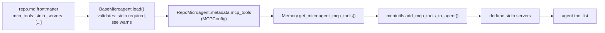

Only **repo** microagents are scanned, because only they are guaranteed to be active. Only `stdio_servers` are supported today: SSE servers log a warning, and an `mcp_tools` block with no stdio servers is a hard validation error at load time.

### 4.5 Server and client surface

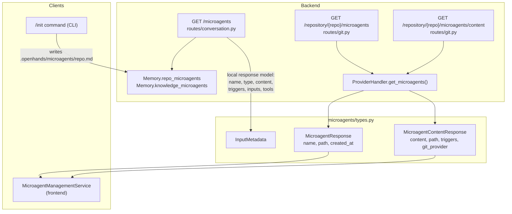

- `GET /microagents` reads the **live** in-memory dictionaries of a running conversation. It reports repo agents with empty triggers, and knowledge agents with their real triggers and inputs.
- The `/repository/.../microagents` endpoints read **files from the git provider** without starting a conversation. They are used by the microagent management UI. See [Git provider integrations](git_provider_integrations.md).
- The CLI `/init` command asks the agent to write `.openhands/microagents/repo.md`, then reloads microagents. See [CLI](cli.md).
- `CreateMicroagent` in `integrations/service_types.py` models a request to create a microagent in a repository.

---

## 5. Data flow summary

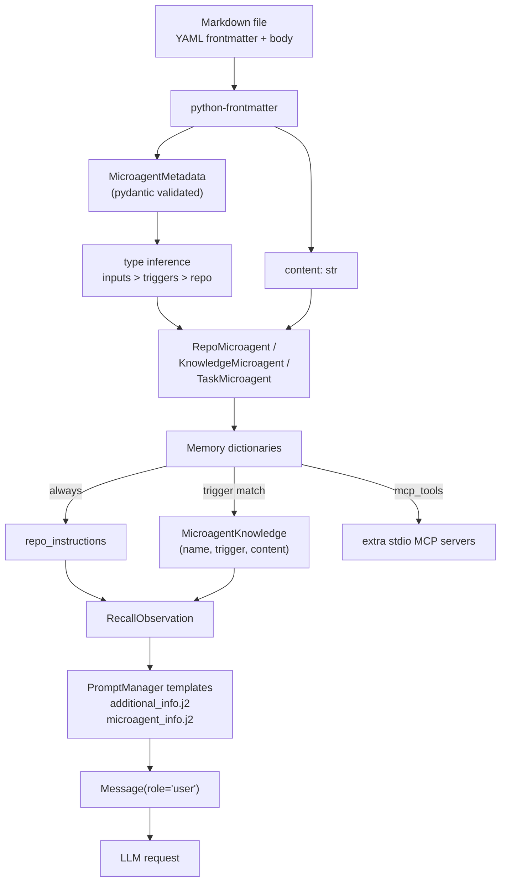

Note that `MicroagentKnowledge` (in `events/observation/agent.py`) is a **flattened copy** — name, trigger, content only. The microagent object itself never crosses into the event stream, which keeps events serializable. See [Event system](event_system.md).

---

## 6. Error handling

| Situation | Behaviour |
|---|---|
| Bad frontmatter / bad field type | `MicroagentValidationError`, message names the file |
| Unknown `type:` value | Same error, plus a list of the valid values |
| `mcp_tools` with only SSE servers | Warning logged, then hard `MicroagentValidationError` (no stdio) |
| `mcp_tools` with SSE **and** stdio | Warning logged, load succeeds, SSE ignored |
| Numeric `version:` (e.g. `version: 1`) | Coerced to `"1"` before validation |
| No frontmatter at all | Loads fine, defaults apply, becomes a repo microagent |
| One bad file in a directory | Whole `load_microagents_from_dir` call raises |
| Bad file in `~/.openhands/microagents/` | Caught by `Memory`, logged as a warning, session continues |
| Bad file in the sandbox workspace | Caught by `Runtime`, logged as an error, session continues |

`MicroagentValidationError` lives in `openhands/core/exceptions.py` — see [Core schema and runtime support](core_schema_and_runtime_support.md).

---

## 7. Writing a microagent

**Repository microagent** (always active):

```markdown
---
name: repo
version: 1.0.0
agent: CodeActAgent
---

Run tests with `poetry run pytest`. Never edit files under `generated/`.
```

**Knowledge microagent** (keyword triggered):

```markdown
---
name: docker
triggers:
  - docker
  - dockerfile
---

When building images, always pin the base image tag.
```

**Task microagent** (slash command with inputs):

```markdown
---
name: fix_test
inputs:
  - name: test_name
    description: The failing test to fix
---

Investigate and fix the failing test ${test_name}.
```

The `fix_test` example gets `/fix_test` added to its triggers automatically, and gets the "ask the user for missing variables" sentence appended to its body.

---

## 8. Extending the module

Adding a fourth microagent type takes four coordinated edits:

1. Add the value to `MicroagentType` in `types.py`.
2. Add the subclass in `microagent.py`, with a type guard in `__init__`.
3. Register it in the `subclass_map` inside `load()`.
4. Add an inference branch — and decide where it sits in the `inputs > triggers > repo` priority chain.

Then update the sorting in `load_microagents_from_dir` (which currently branches on `RepoMicroagent` vs `KnowledgeMicroagent`) and in `Memory.load_user_workspace_microagents`, or the new type will silently be dropped.

---

## 9. File reference

| Path | Contents |
|---|---|
| `openhands/microagent/microagent.py` | `BaseMicroagent`, `KnowledgeMicroagent`, `RepoMicroagent`, `TaskMicroagent`, `load_microagents_from_dir` |
| `openhands/microagent/types.py` | `MicroagentType`, `InputMetadata`, `MicroagentMetadata`, `MicroagentResponse`, `MicroagentContentResponse` |
| `openhands/microagent/__init__.py` | Public re-exports (note: `TaskMicroagent` is not re-exported here; import it from `.microagent`) |
| `openhands/microagent/prompts/generate_remember_prompt.j2` | Prompt template for asking an LLM to update a knowledge file from recent events |
| `microagents/` (repo root) | The shipped public microagents (`docker.md`, `npm.md`, `github.md`, `fix_test.md`, …) |

---

## 10. Related documentation

- [Memory and Condensers](memory_and_condensers.md) — the owner of microagent lifecycle at runtime
- [Memory Recall](memory_and_condensers_recall.md) — `Memory`, trigger matching, MCP tool collection
- [Conversation Memory](memory_and_condensers_conversation_memory.md) — turning recalls into LLM messages
- [Agent Controller Core](agent_controller_core.md) — where `RecallAction` is emitted
- [Event system](event_system.md) — `RecallAction`, `RecallObservation`, `MicroagentKnowledge`
- [Core configuration](core_configuration.md) — `disabled_microagents`, `enable_prompt_extensions`
- [Core schema and runtime support](core_schema_and_runtime_support.md) — `PromptManager`, exceptions
- [Runtime implementations](runtime_implementations.md) — sandbox file discovery
- [Git provider integrations](git_provider_integrations.md) — repository microagent APIs
- [Conversation service tier](conversation_service_tier.md) — HTTP routes and sessions
- [Frontend API services](frontend_api_services.md) — `MicroagentManagementService`
- [CLI](cli.md) — the `/init` command
