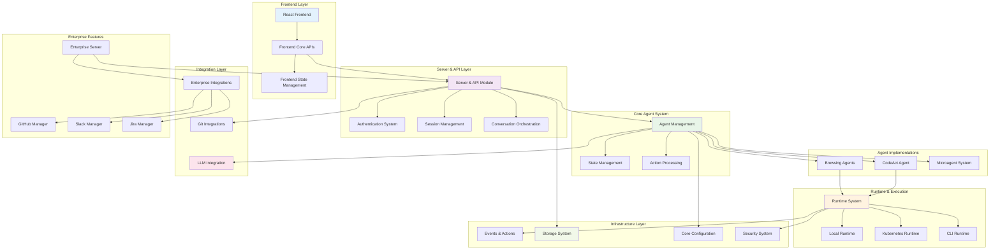
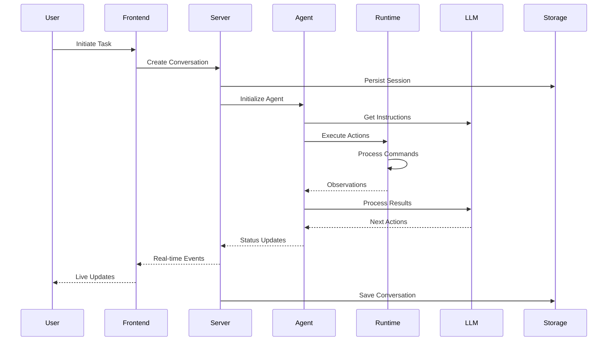

# OpenHands Repository Overview

## Purpose

OpenHands is a comprehensive AI-powered software development platform that enables autonomous agents to perform complex coding tasks, web browsing, and system interactions. The platform provides a unified interface for AI agents to interact with development environments, execute code, manage files, browse the web, and integrate with various external services while maintaining security and user control.

## End-to-End Architecture

The OpenHands system follows a modular, event-driven architecture with clear separation of concerns across multiple layers:

### System Data Flow

## Core Module Documentation

### Frontend Modules
- **[Frontend Core](frontend_core.md)** - Primary API layer providing unified interface for backend services, authentication management, Git operations, and conversation orchestration
- **[Frontend State Management](frontend_state_management.md)** - Redux-based state management handling conversation interactions, code editing, and system metrics tracking

### Core System Modules
- **[Core Agent System](core_agent_system.md)** - Foundational infrastructure for agent lifecycle, state management, action parsing, and control flow mechanisms
- **[Agent Implementations](agent_implementations.md)** - Concrete agent implementations including CodeAct, Browsing, Visual Browsing, and specialized microagents
- **[Events and Actions](events_and_actions.md)** - Event-driven architecture foundation providing action-observation patterns and real-time streaming
- **[LLM Integration](llm_integration.md)** - Unified language model abstraction supporting multiple providers with advanced features like function calling and vision processing

### Runtime and Execution
- **[Runtime System](runtime_system.md)** - Sandboxed execution environments supporting local, containerized, and cloud-based execution with comprehensive security controls
- **[Security System](security_system.md)** - Multi-layered security analysis using rule-based invariant checking and LLM-powered risk assessment

### Integration and Storage
- **[Git Integrations](git_integrations.md)** - Unified interface for GitHub, GitLab, and Bitbucket with microagent discovery and repository management
- **[Storage System](storage_system.md)** - Comprehensive data persistence layer with pluggable backends for conversations, user data, and file operations
- **[Server and API](server_and_api.md)** - FastAPI-based web server infrastructure with WebSocket support, session management, and authentication

### Configuration and Specialized Systems
- **[Core Configuration](core_configuration.md)** - Centralized configuration management for CLI, security, MCP servers, and Kubernetes deployments
- **[Microagent System](microagent_system.md)** - Lightweight, task-specific agents with dynamic loading and context-aware triggering

### Enterprise Features
- **[Enterprise Integrations](enterprise_integrations.md)** - Platform integrations for GitHub, GitLab, Jira, and Slack with workflow automation capabilities
- **[Enterprise Server](enterprise_server.md)** - SaaS-specific server configuration with advanced authentication, user verification, and billing integration

## Key Features

- **Multi-Agent Architecture**: Specialized agents for different tasks (coding, browsing, analysis)
- **Sandboxed Execution**: Secure runtime environments with Docker and Kubernetes support
- **Real-time Collaboration**: WebSocket-based live updates and conversation streaming
- **Multi-Provider LLM Support**: Unified interface for OpenAI, Anthropic, Google, and local models
- **Enterprise Integration**: Native support for GitHub, GitLab, Jira, and Slack workflows
- **Extensible Plugin System**: Microagents and MCP server integration for custom functionality
- **Comprehensive Security**: Multi-layered security analysis and policy enforcement
- **Scalable Architecture**: Kubernetes-native deployment with horizontal scaling support

## Getting Started

1. **Installation**: Follow the setup instructions in the main repository README
2. **Configuration**: Review [Core Configuration](core_configuration.md) for system setup
3. **Agent Selection**: Choose appropriate agents from [Agent Implementations](agent_implementations.md)
4. **Runtime Setup**: Configure execution environment via [Runtime System](runtime_system.md)
5. **Integration**: Connect external services through [Git Integrations](git_integrations.md) and [Enterprise Integrations](enterprise_integrations.md)

This architecture provides a robust, scalable foundation for AI-powered software development with comprehensive security, extensive integration capabilities, and enterprise-grade features.