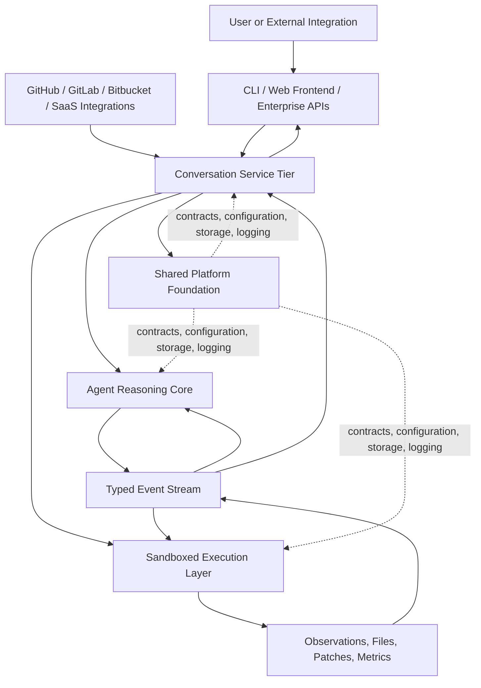
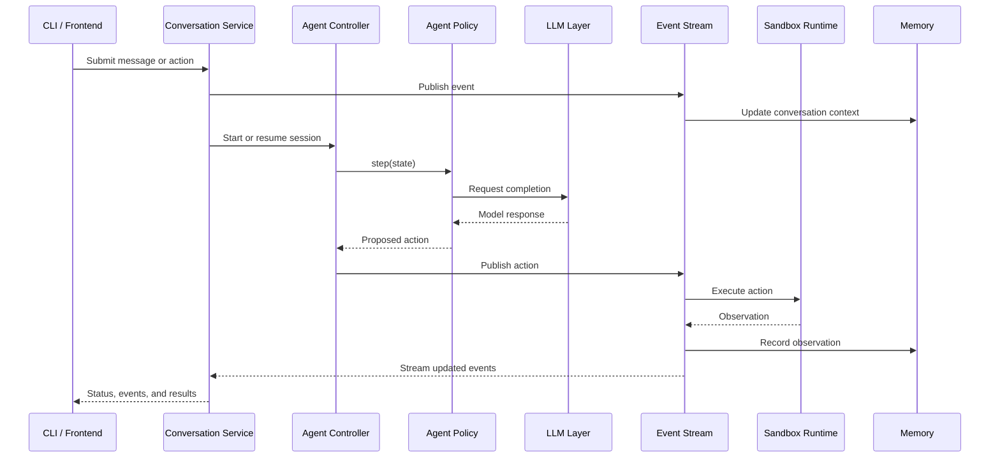

# OpenHands Repository Overview

## Purpose

OpenHands is an agentic software-engineering platform. It enables users and automated integrations to delegate coding, browsing, repository maintenance, and issue-resolution tasks to LLM-powered agents operating inside isolated runtimes.

The repository combines:

- Agent reasoning and orchestration
- LLM provider access, routing, metrics, and memory
- Sandboxed command, file, browser, and tool execution
- Event-driven conversation services
- CLI and web clients
- GitHub, GitLab, and Bitbucket automation
- Enterprise SaaS authentication, billing, integrations, and remote runtime control

## End-to-End Architecture


```mermaid
flowchart TB
    User["User or External Integration"]
    Clients["CLI / Web Frontend / Enterprise APIs"]
    Service["Conversation Service Tier"]
    Foundation["Shared Platform Foundation"]
    Reasoning["Agent Reasoning Core"]
    Events["Typed Event Stream"]
    Runtime["Sandboxed Execution Layer"]
    Results["Observations, Files, Patches, Metrics"]
    Providers["GitHub / GitLab / Bitbucket / SaaS Integrations"]

    User --> Clients
    Providers --> Service
    Clients --> Service

    Service --> Foundation
    Service --> Reasoning
    Service --> Runtime

    Reasoning --> Events
    Events --> Runtime
    Runtime --> Results
    Results --> Events
    Events --> Reasoning
    Events --> Service
    Service --> Clients

    Foundation -. contracts, configuration, storage, logging .-> Service
    Foundation -. contracts, configuration, storage, logging .-> Reasoning
    Foundation -. contracts, configuration, storage, logging .-> Runtime
```

OpenHands uses an event-driven action/observation loop. Agents propose typed actions; runtimes execute them and publish observations; the controller then resumes reasoning with updated state and memory.


```mermaid
sequenceDiagram
    participant Client as CLI / Frontend
    participant Server as Conversation Service
    participant Controller as Agent Controller
    participant Agent as Agent Policy
    participant LLM as LLM Layer
    participant Stream as Event Stream
    participant Runtime as Sandbox Runtime
    participant Memory as Memory

    Client->>Server: Submit message or action
    Server->>Stream: Publish event
    Stream->>Memory: Update conversation context
    Server->>Controller: Start or resume session
    Controller->>Agent: step(state)
    Agent->>LLM: Request completion
    LLM-->>Agent: Model response
    Agent-->>Controller: Proposed action
    Controller->>Stream: Publish action
    Stream->>Runtime: Execute action
    Runtime-->>Stream: Observation
    Stream->>Memory: Record observation
    Stream-->>Server: Stream updated events
    Server-->>Client: Status, events, and results
```

### Agent reasoning and safety


```mermaid
flowchart LR
    State["Agent state and history"]
    Memory["Memory and condensers"]
    Policy["Agent policy"]
    LLM["LLM layer"]
    Action["Candidate action"]
    Security["Security analyzers"]
    Controller["Controller gates"]
    Event["Action event"]

    State --> Memory
    Memory --> Policy
    Policy --> LLM
    LLM --> Action
    Action --> Security
    Security --> Controller
    Controller --> Event
```

The controller enforces turn ordering, iteration and budget limits, stuck detection, replay behavior, confirmation requirements, and safe publication of actions.

## Repository Structure

```text
OpenHands/
├── openhands/
│   ├── controller/          # Agent orchestration and state management
│   ├── agenthub/            # Browsing, CodeAct, testing, and critic agents
│   ├── llm/                 # Provider clients, routing, registry, metrics
│   ├── memory/              # Conversation memory and condensation
│   ├── microagent/          # Markdown-driven supplemental instructions
│   ├── security/            # Action risk analysis
│   ├── runtime/             # Runtime implementations, builders, plugins, utilities
│   ├── core/                # Configuration and shared schemas
│   ├── events/              # Typed event system
│   ├── storage/             # Persistence backends
│   ├── server/              # HTTP APIs and conversation sessions
│   ├── integrations/        # Code-host integrations
│   ├── resolver/            # Issue and pull-request automation
│   └── cli/                 # Terminal client
├── third_party/runtime/     # Daytona, Modal, Runloop, and E2B runtimes
├── frontend/src/             # Web API services, types, and application state
└── enterprise/               # Hosted SaaS overlay and integrations
```

## Core Module Documentation

- [Agent Reasoning Core](</home/anhnh/CodeWiki-journal/results/generation/OpenHands/agent_reasoning_core.md>) — controller, agents, LLM layer, memory, microagents, and security.
- [Sandboxed Execution Layer](</home/anhnh/CodeWiki-journal/results/generation/OpenHands/sandboxed_execution_layer.md>) — local, Docker, Kubernetes, remote, third-party, browser, and plugin runtimes.
- [Shared Platform Foundation](</home/anhnh/CodeWiki-journal/results/generation/OpenHands/shared_platform_foundation.md>) — configuration, schemas, events, storage, and logging.
- [Conversation Service Tier](</home/anhnh/CodeWiki-journal/results/generation/OpenHands/conversation_service_tier.md>) — HTTP APIs, sessions, lifecycle management, and event streaming.
- [Code Host Automation](</home/anhnh/CodeWiki-journal/results/generation/OpenHands/code_host_automation.md>) — provider integrations and automated issue resolution.
- [User-Facing Clients](</home/anhnh/CodeWiki-journal/results/generation/OpenHands/user_facing_clients.md>) — CLI and frontend architecture.
- [Hosted SaaS Overlay](</home/anhnh/CodeWiki-journal/results/generation/OpenHands/hosted_saas_overlay.md>) — enterprise routes, authentication, storage, integrations, and solvability services.