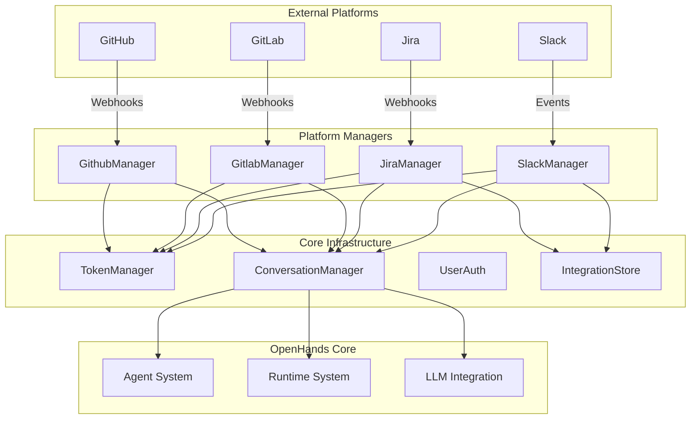
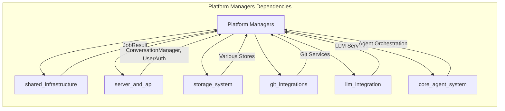
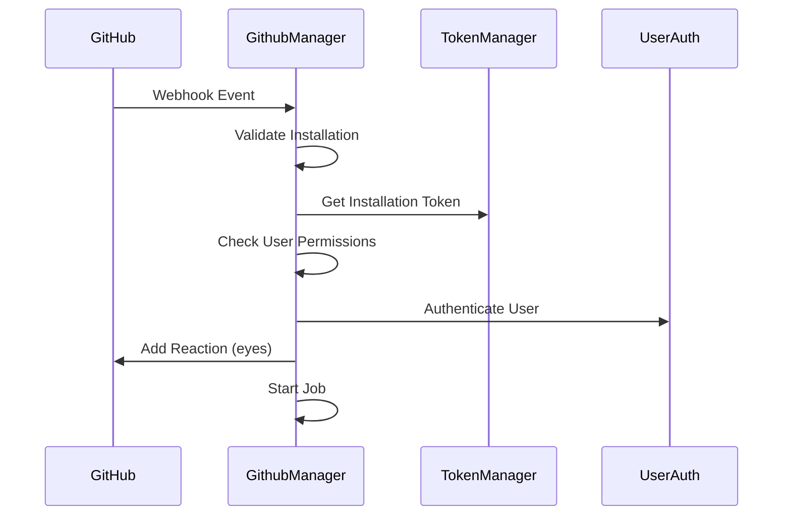
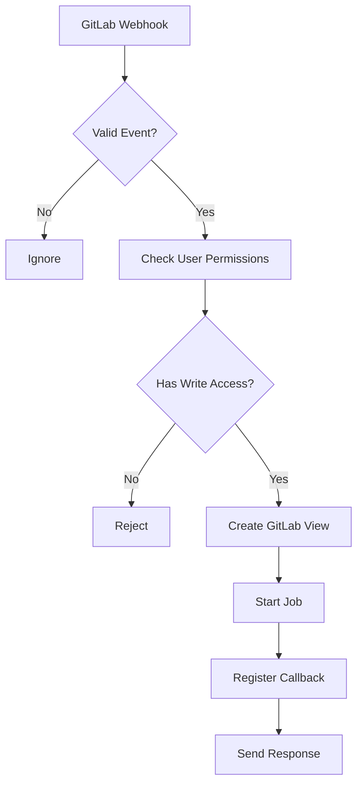
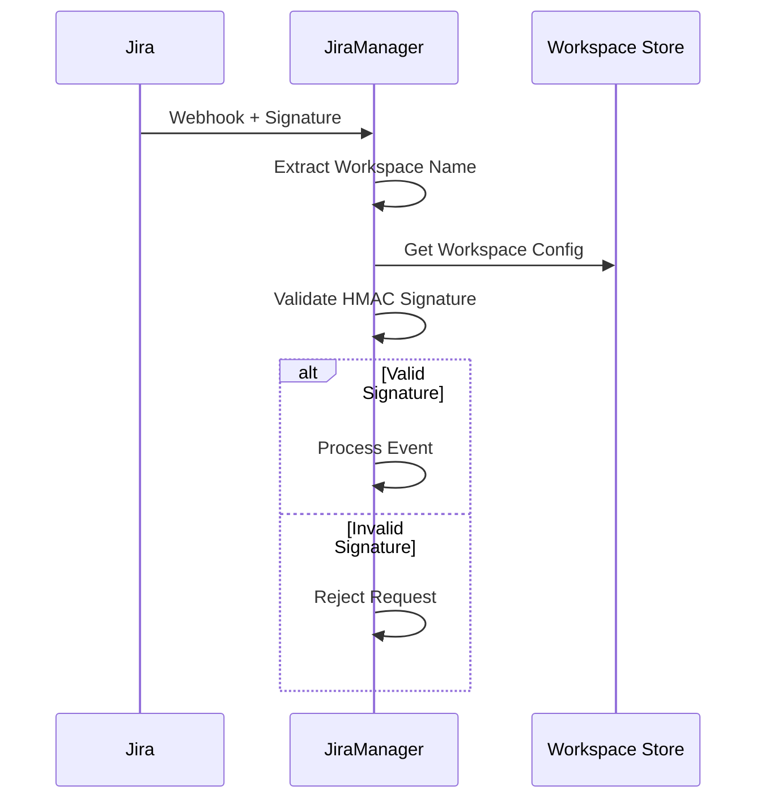
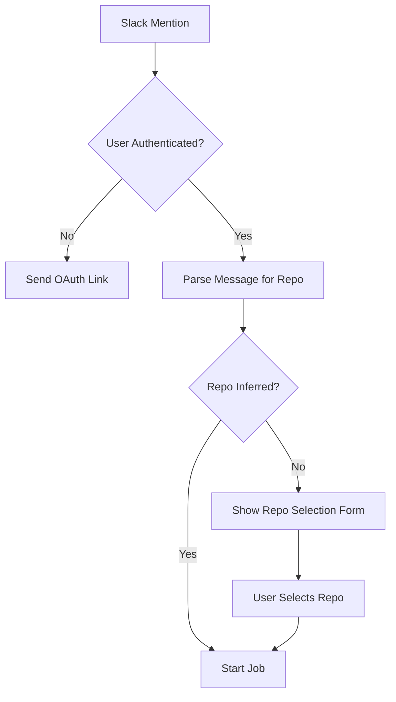
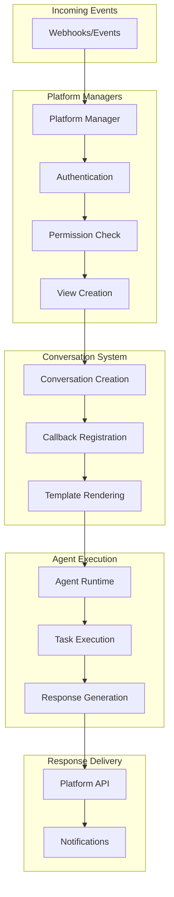
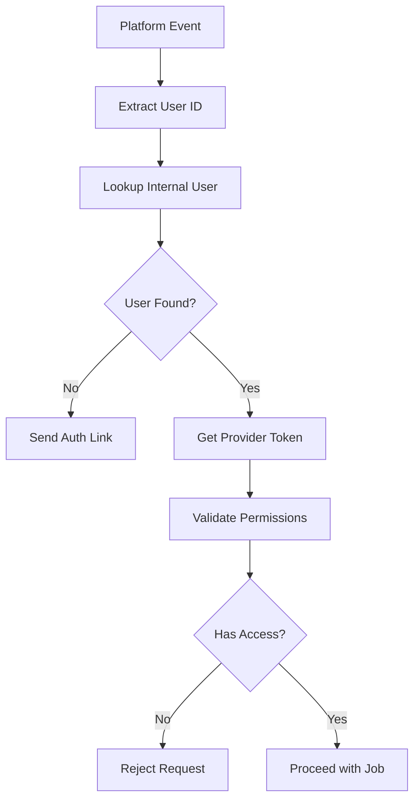

# Platform Managers Module

The platform_managers module provides enterprise-level integration managers that handle communication and workflow orchestration between OpenHands and external platforms including GitHub, GitLab, Jira, and Slack. These managers serve as the primary interface for processing incoming webhooks, managing user authentication, and coordinating automated task resolution across different platforms.

## Architecture Overview



## Component Dependencies



## Core Components

### GithubManager

The GitHub integration manager handles GitHub App webhooks and orchestrates automated issue and pull request resolution.

**Key Responsibilities:**
- Process GitHub webhooks (issues, comments, PR events)
- Validate user permissions and repository access
- Manage GitHub App installation tokens
- Coordinate with GitHub's API for reactions and comments
- Trigger solvability analysis for issues

**Authentication Flow:**


### GitlabManager

The GitLab integration manager processes GitLab webhooks and manages merge request and issue automation.

**Key Responsibilities:**
- Handle GitLab webhook events
- Validate user access permissions
- Manage GitLab API interactions
- Coordinate conversation creation and updates

**Workflow Process:**


### JiraManager

The Jira integration manager handles Jira Cloud webhooks and manages issue-based task automation.

**Key Responsibilities:**
- Process Jira webhook events (comments, label updates)
- Validate webhook signatures for security
- Manage workspace and user authentication
- Handle repository selection for issue context
- Coordinate with Jira Cloud API

**Security Validation:**


### SlackManager

The Slack integration manager processes Slack events and manages conversational AI interactions within Slack workspaces.

**Key Responsibilities:**
- Handle Slack app mentions and interactions
- Manage OAuth authentication flow
- Process repository selection through interactive forms
- Coordinate conversation threading

**Repository Selection Flow:**


## Data Flow Architecture



## Integration Patterns

### Common Manager Interface

All platform managers inherit from a base `Manager` class and implement common patterns:

```python
class Manager:
    async def receive_message(self, message: Message) -> None
    async def send_message(self, message: Message, view: ViewInterface) -> None
    async def is_job_requested(self, message: Message) -> bool
    async def start_job(self, view: ViewInterface) -> None
```

### Authentication Strategy



### Error Handling Strategy

Each manager implements comprehensive error handling:

1. **Authentication Errors**: Redirect to login/setup
2. **Permission Errors**: Inform user of access requirements
3. **Configuration Errors**: Guide user to proper setup
4. **Runtime Errors**: Graceful degradation with user notification

## Security Considerations

### Webhook Validation

- **GitHub**: Installation-based authentication with GitHub App
- **GitLab**: Project-level permission validation
- **Jira**: HMAC signature verification with workspace secrets
- **Slack**: OAuth-based user authentication

### Token Management

All managers integrate with the centralized [server_and_api](server_and_api.md) token management system:

- Secure token storage and retrieval
- Provider-specific token handling
- Automatic token refresh where supported
- Encrypted storage of sensitive credentials

## Configuration Requirements

### Environment Variables

Each platform manager requires specific configuration:

```yaml
# GitHub
GITHUB_APP_CLIENT_ID: "github_app_id"
GITHUB_APP_PRIVATE_KEY: "private_key_pem"

# Slack
SLACK_CLIENT_ID: "slack_app_client_id"
JWT_SECRET: "jwt_signing_secret"

# Jira (per workspace)
JIRA_CLOUD_ID: "workspace_cloud_id"
JIRA_WEBHOOK_SECRET: "webhook_secret"
```

### Database Schema

Platform managers rely on integration-specific storage schemas:

- **SlackUser**: Maps Slack users to OpenHands users
- **JiraWorkspace**: Stores Jira workspace configurations
- **JiraUser**: Links Jira users to internal authentication

## Performance Considerations

### Async Processing

All managers are built with async/await patterns for:
- Non-blocking webhook processing
- Concurrent API calls
- Efficient resource utilization

### Caching Strategy

- Installation tokens cached for GitHub
- User authentication cached across requests
- Repository lists cached per user session

## Integration with Core Systems

### Conversation Management

Platform managers integrate with [server_and_api](server_and_api.md) conversation management:

```python
# Create conversation with platform context
conversation_id = await view.create_new_conversation(
    jinja_env, provider_tokens, metadata
)

# Register platform-specific callback processor
register_callback_processor(conversation_id, processor)
```

### Agent Orchestration

Jobs are coordinated with the [core_agent_system](core_agent_system.md):

- Repository context injection
- Task-specific agent selection
- Runtime environment configuration

### Storage Integration

Platform managers utilize [storage_system](storage_system.md) components:

- Conversation persistence
- User settings and secrets
- Integration-specific data storage

## Monitoring and Observability

### Logging Strategy

Comprehensive logging across all managers:
- Structured logging with context
- User and platform identification
- Error tracking and debugging
- Performance metrics

### Health Checks

Each manager provides health monitoring:
- Webhook endpoint availability
- Authentication service status
- Platform API connectivity
- Database connection health

## Future Extensibility

The platform managers architecture supports:

1. **New Platform Integration**: Following established patterns
2. **Enhanced Security**: Additional validation layers
3. **Advanced Workflows**: Multi-platform coordination
4. **Analytics Integration**: Usage and performance tracking

## Related Documentation

- [shared_infrastructure](shared_infrastructure.md) - Common models and utilities
- [server_and_api](server_and_api.md) - Authentication and conversation management
- [storage_system](storage_system.md) - Data persistence layers
- [git_integrations](git_integrations.md) - Git service abstractions
- [core_agent_system](core_agent_system.md) - Agent orchestration