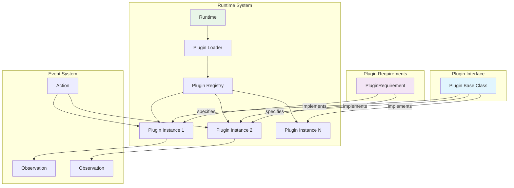
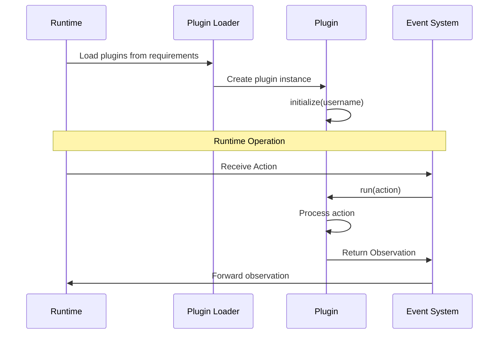
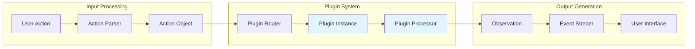
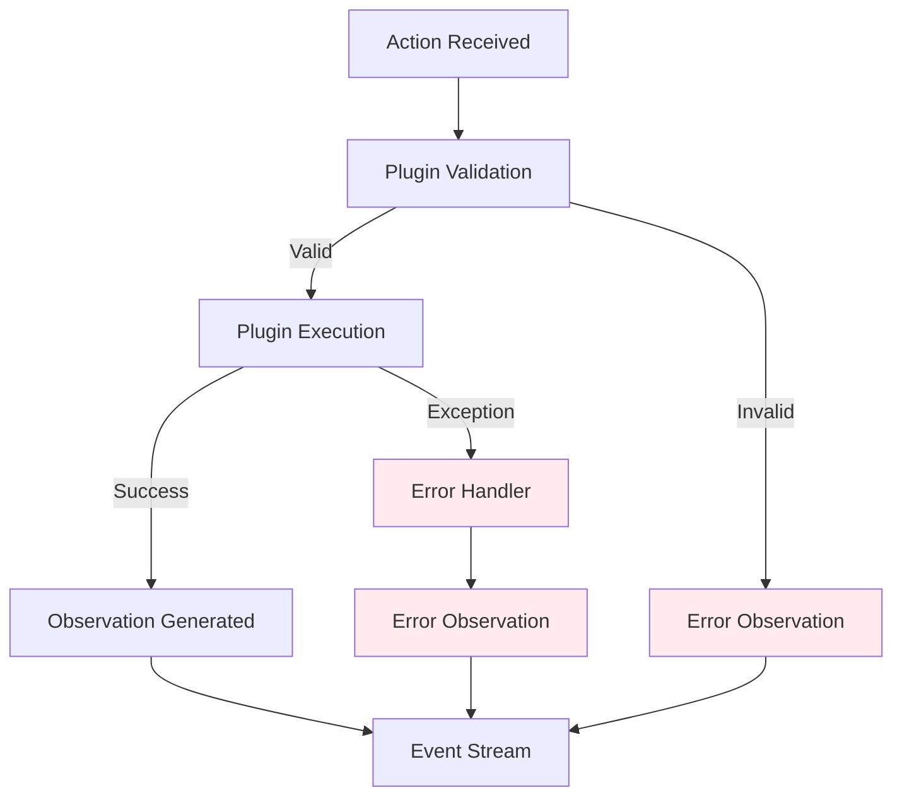

# Plugin System

The plugin system in OpenHands provides a flexible architecture for extending runtime environments with additional functionality. It enables the integration of specialized tools and services that can be dynamically loaded and executed within the runtime context.

## Overview

The plugin system is built around a simple but powerful abstraction that allows external components to be seamlessly integrated into the OpenHands runtime environment. Plugins operate as independent modules that can process actions and generate observations, extending the capabilities of agents beyond the core runtime functionality.

## Architecture



## Core Components

### Plugin Base Class

The `Plugin` class serves as the abstract base class for all plugin implementations:

```python
class Plugin:
    """Base class for a plugin.

    This will be initialized by the runtime client, which will run inside docker.
    """

    name: str

    @abstractmethod
    async def initialize(self, username: str) -> None:
        """Initialize the plugin."""
        pass

    @abstractmethod
    async def run(self, action: Action) -> Observation:
        """Run the plugin for a given action."""
        pass
```

**Key Characteristics:**
- **Abstract Interface**: Defines the contract that all plugins must implement
- **Asynchronous Operations**: Both initialization and execution are async for non-blocking operations
- **Action-Observation Pattern**: Follows the core OpenHands event model
- **Runtime Integration**: Designed to run within the runtime environment (typically Docker)

### PluginRequirement

The `PluginRequirement` dataclass specifies plugin dependencies:

```python
@dataclass
class PluginRequirement:
    """Requirement for a plugin."""

    name: str
```

**Purpose:**
- **Dependency Declaration**: Specifies which plugins are needed by a runtime
- **Plugin Discovery**: Enables the runtime to locate and load required plugins
- **Configuration Management**: Provides a simple way to configure plugin dependencies

## Integration with Runtime System



### Plugin Lifecycle

1. **Loading Phase**
   - Runtime reads plugin requirements from configuration
   - Plugin loader instantiates required plugins
   - Each plugin undergoes initialization with user context

2. **Execution Phase**
   - Actions are routed to appropriate plugins
   - Plugins process actions asynchronously
   - Observations are generated and returned to the event system

3. **Cleanup Phase**
   - Plugins are properly disposed when runtime shuts down
   - Resources are cleaned up and connections closed

## Plugin Types and Examples

### Built-in Plugin Types

The system supports various plugin types, including:

- **VSCode Plugin**: Provides IDE functionality within the runtime
- **Jupyter Plugin**: Enables notebook-style code execution
- **Development Tools**: Various development and debugging utilities

### Plugin Implementation Pattern

```python
class CustomPlugin(Plugin):
    name = "custom_plugin"
    
    async def initialize(self, username: str) -> None:
        # Setup plugin resources
        self.username = username
        self.initialized = True
    
    async def run(self, action: Action) -> Observation:
        # Process the action and return observation
        if isinstance(action, CustomAction):
            result = await self.process_custom_action(action)
            return CustomObservation(content=result)
        
        return ErrorObservation("Unsupported action type")
```

## Data Flow



## Configuration and Management

### Plugin Requirements Configuration

Plugins are specified in the runtime configuration:

```python
plugins = [
    PluginRequirement(name="vscode"),
    PluginRequirement(name="jupyter"),
    PluginRequirement(name="custom_tool")
]

runtime = Runtime(
    config=config,
    plugins=plugins,
    # ... other parameters
)
```

### Dynamic Plugin Loading

The runtime system supports dynamic plugin loading based on:
- **Configuration Settings**: Plugins specified in runtime config
- **Environment Detection**: Automatic plugin loading based on environment
- **User Preferences**: User-specific plugin preferences

## Error Handling and Resilience



### Error Handling Strategies

1. **Graceful Degradation**: Failed plugins don't crash the entire runtime
2. **Error Propagation**: Plugin errors are converted to error observations
3. **Retry Mechanisms**: Transient failures can be retried automatically
4. **Fallback Options**: Alternative plugins can be used if primary plugins fail

## Security Considerations

### Plugin Isolation

- **Sandboxed Execution**: Plugins run within the runtime's security context
- **Resource Limits**: Plugins are subject to runtime resource constraints
- **Permission Model**: Plugins inherit runtime permissions but can be further restricted

### Security Analysis Integration

The plugin system integrates with the [security_system](security_system.md) for:
- **Plugin Validation**: Security analysis of plugin code and behavior
- **Risk Assessment**: Evaluation of plugin security implications
- **Compliance Checking**: Ensuring plugins meet security requirements

## Performance Considerations

### Asynchronous Operations

- **Non-blocking Execution**: Plugin operations don't block the runtime
- **Concurrent Processing**: Multiple plugins can execute simultaneously
- **Resource Management**: Efficient resource utilization across plugins

### Optimization Strategies

1. **Lazy Loading**: Plugins are loaded only when needed
2. **Caching**: Plugin results can be cached for repeated operations
3. **Connection Pooling**: Shared resources across plugin instances
4. **Memory Management**: Proper cleanup of plugin resources

## Integration Points

### Event System Integration

The plugin system is tightly integrated with the [events_and_actions](events_and_actions.md) module:
- **Action Processing**: Plugins consume Action objects
- **Observation Generation**: Plugins produce Observation objects
- **Event Streaming**: Plugin outputs flow through the event stream

### Runtime System Integration

Plugins are managed by the [runtime_system](runtime_system.md):
- **Lifecycle Management**: Runtime controls plugin initialization and cleanup
- **Resource Allocation**: Runtime provides resources to plugins
- **Environment Setup**: Runtime prepares the environment for plugin execution

### LLM Integration

Plugins can leverage the [llm_integration](llm_integration.md) system:
- **AI-Powered Plugins**: Plugins can use LLM capabilities
- **Context Sharing**: Plugins can share context with LLM operations
- **Intelligent Processing**: LLM-enhanced plugin functionality

## Development Guidelines

### Creating Custom Plugins

1. **Inherit from Plugin**: Extend the base Plugin class
2. **Implement Required Methods**: Provide initialize() and run() implementations
3. **Handle Errors Gracefully**: Convert exceptions to appropriate observations
4. **Follow Async Patterns**: Use async/await for non-blocking operations
5. **Document Behavior**: Clearly document plugin capabilities and limitations

### Testing Plugins

- **Unit Testing**: Test plugin logic in isolation
- **Integration Testing**: Test plugin interaction with runtime
- **Performance Testing**: Validate plugin performance characteristics
- **Security Testing**: Ensure plugin security compliance

### Best Practices

1. **Resource Management**: Properly manage plugin resources and connections
2. **Error Handling**: Implement comprehensive error handling
3. **Documentation**: Provide clear documentation for plugin usage
4. **Versioning**: Use semantic versioning for plugin releases
5. **Compatibility**: Ensure backward compatibility when possible

## Future Enhancements

### Planned Features

- **Plugin Marketplace**: Central repository for community plugins
- **Hot Reloading**: Dynamic plugin updates without runtime restart
- **Plugin Composition**: Ability to chain plugins together
- **Advanced Security**: Enhanced security model for plugin execution
- **Performance Monitoring**: Built-in performance monitoring for plugins

### Extension Points

The plugin system is designed to be extensible:
- **Custom Plugin Types**: Support for domain-specific plugin types
- **Plugin Communication**: Inter-plugin communication mechanisms
- **Configuration Management**: Advanced plugin configuration options
- **Monitoring Integration**: Integration with monitoring and observability tools

## Related Documentation

- [runtime_system](runtime_system.md) - Core runtime architecture and plugin management
- [events_and_actions](events_and_actions.md) - Event system that plugins integrate with
- [security_system](security_system.md) - Security analysis and validation for plugins
- [core_agent_system](core_agent_system.md) - Agent system that utilizes plugin capabilities