# Provider Implementations Module

## Overview

The `provider_implementations` module provides concrete implementations of Git service providers within the OpenHands system. This module serves as the foundation for integrating with major Git hosting platforms including GitHub, GitLab, and Bitbucket. Each provider implementation extends the base Git service architecture with platform-specific functionality while maintaining a consistent interface for the broader system.

The module implements the adapter pattern to provide unified access to different Git platforms, handling authentication, API communication, and data transformation specific to each provider's requirements.

## Architecture

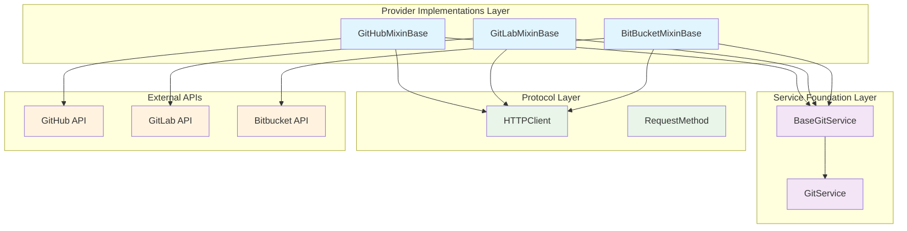

## Core Components

### GitHubMixinBase

The GitHub provider implementation that handles GitHub-specific API interactions and authentication patterns.

**Key Features:**
- OAuth Bearer token authentication
- GitHub REST API v3 integration
- GraphQL API support for complex queries
- Automatic token refresh handling
- GitHub-specific error handling and response parsing

**Authentication Flow:**
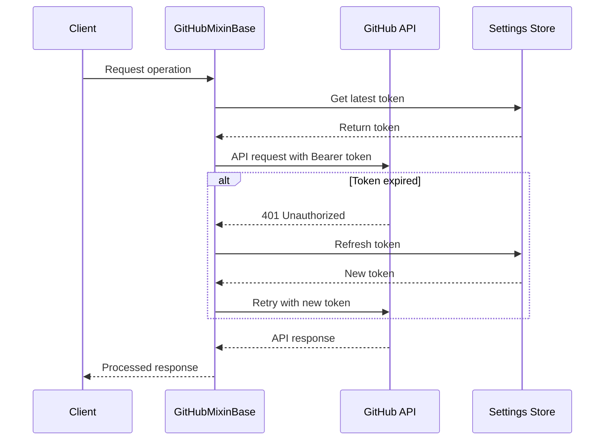

### GitLabMixinBase

The GitLab provider implementation supporting both GitLab.com and self-hosted GitLab instances.

**Key Features:**
- Bearer token authentication
- Support for self-hosted GitLab instances
- GraphQL API integration
- Project ID extraction and URL encoding
- Content-type aware response handling

**Project ID Handling:**
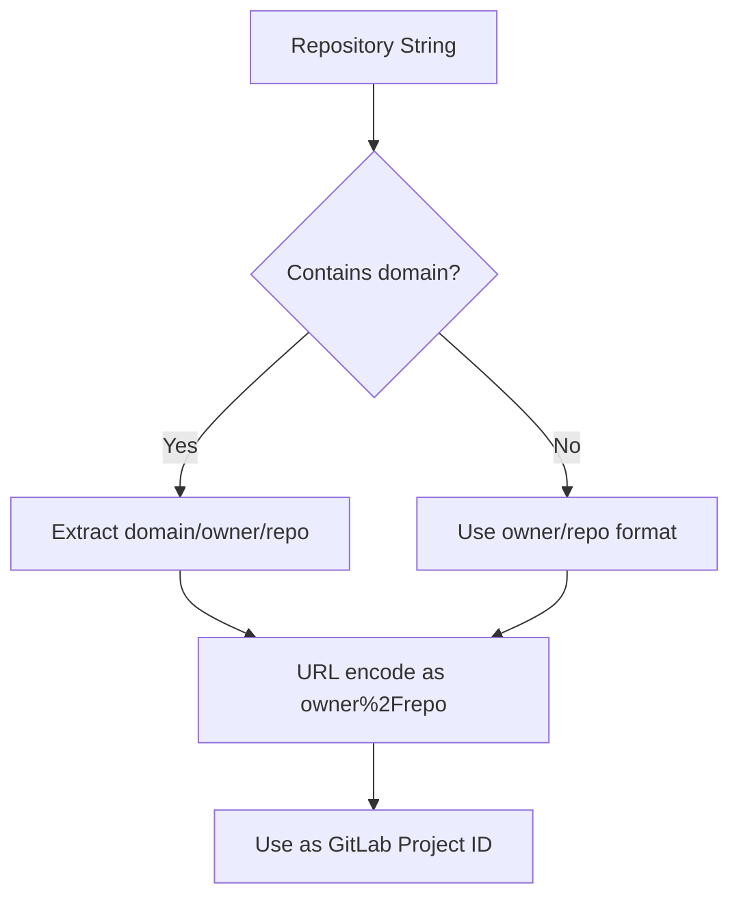

### BitBucketMixinBase

The Bitbucket provider implementation with support for both OAuth and Basic authentication.

**Key Features:**
- Dual authentication support (OAuth Bearer and Basic Auth)
- Pagination handling for large datasets
- Workspace/repository slug parsing
- Repository metadata extraction
- Microagent file discovery

**Authentication Strategy:**
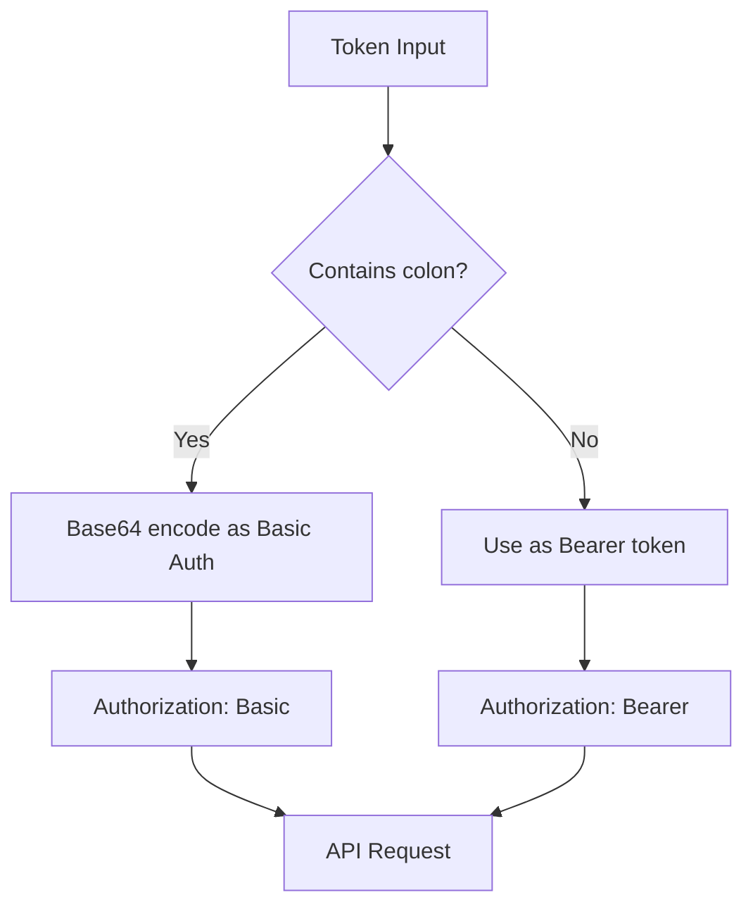

## Data Flow

### Request Processing Flow

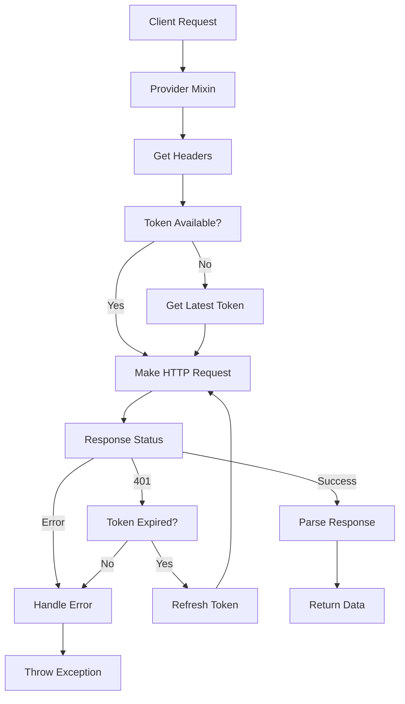

### User Information Retrieval

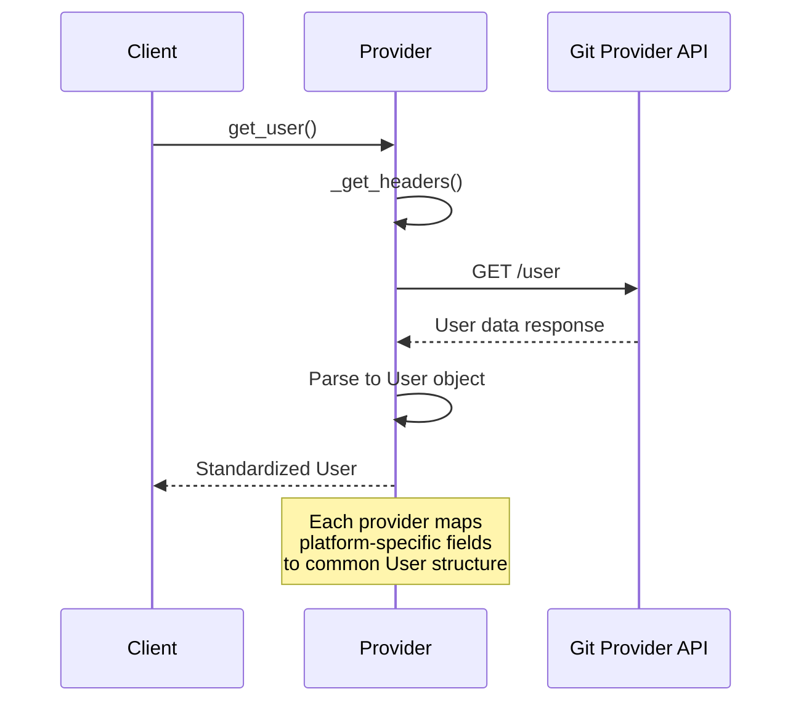

## Component Interactions

### Provider Integration Pattern

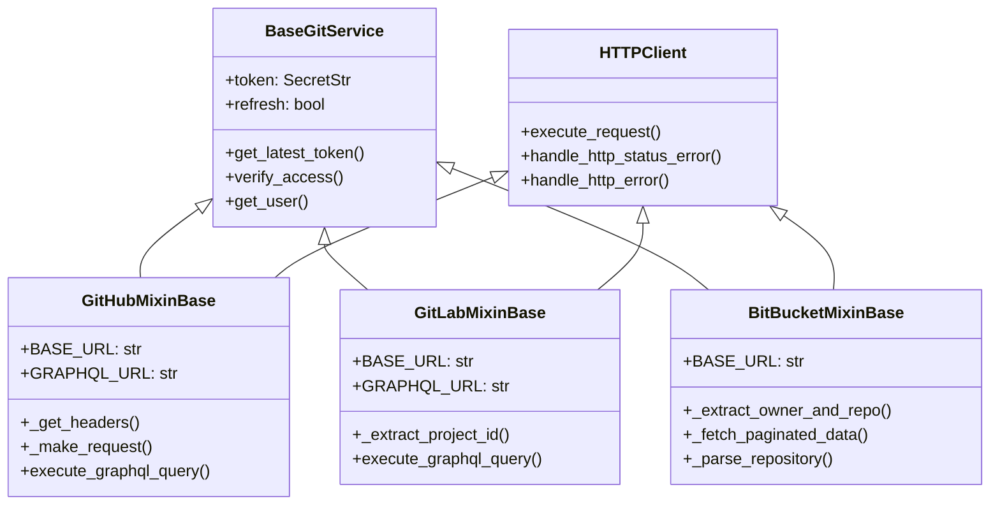

## Error Handling Strategy

### HTTP Error Processing

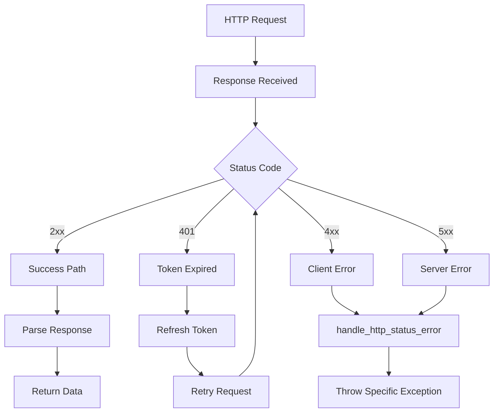

## Integration Points

### Service Foundation Integration

The provider implementations integrate with the [service_foundation](service_foundation.md) module through:

- **BaseGitService**: Provides the common interface and base functionality
- **GitService**: Defines the service contract for Git operations
- **User Model**: Standardized user representation across providers
- **Repository Model**: Common repository metadata structure

### Authentication Flow

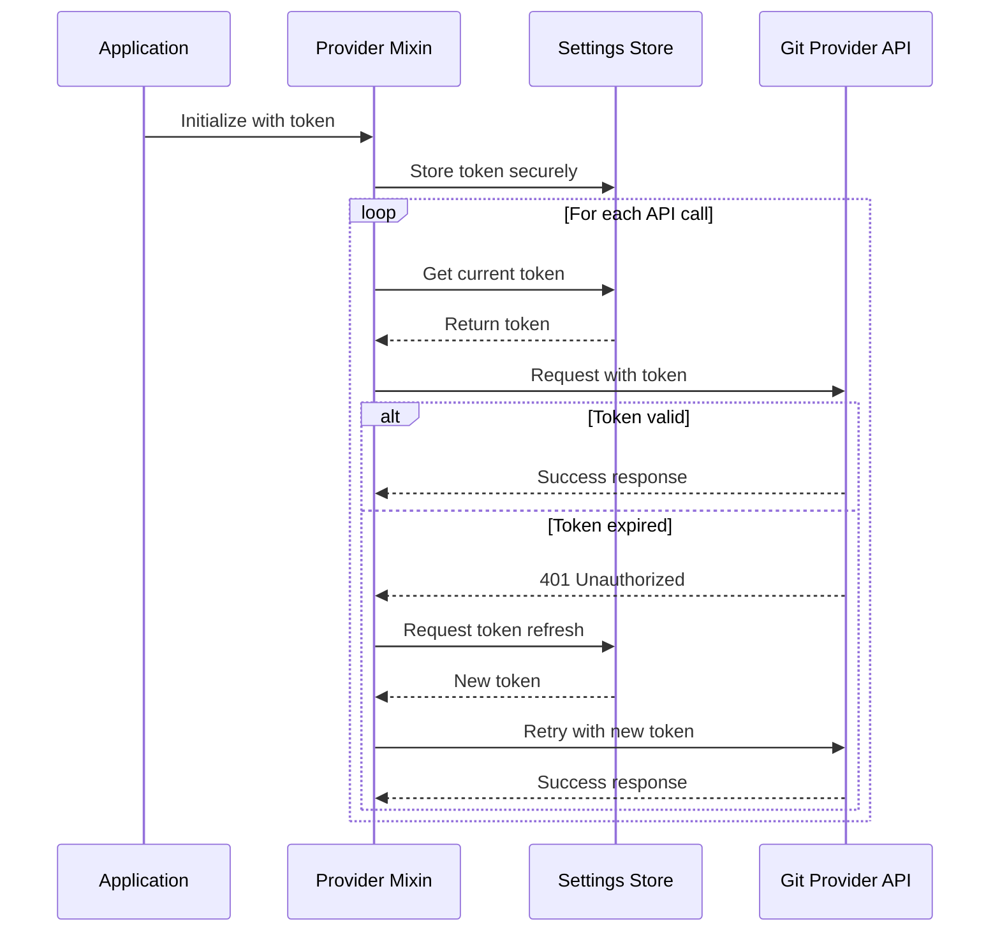

## Configuration and Setup

### Provider-Specific Configuration

Each provider requires specific configuration parameters:

**GitHub:**
- Base URL: `https://api.github.com`
- GraphQL URL: `https://api.github.com/graphql`
- Authentication: OAuth Bearer token
- Headers: GitHub API v3 Accept header

**GitLab:**
- Base URL: Configurable (GitLab.com or self-hosted)
- GraphQL URL: `{base_url}/api/graphql`
- Authentication: OAuth Bearer token
- Project ID: URL-encoded namespace/project format

**Bitbucket:**
- Base URL: `https://api.bitbucket.org/2.0`
- Authentication: OAuth Bearer or Basic Auth
- Pagination: Cursor-based pagination support
- Repository format: workspace/repo_slug

## Performance Considerations

### Request Optimization

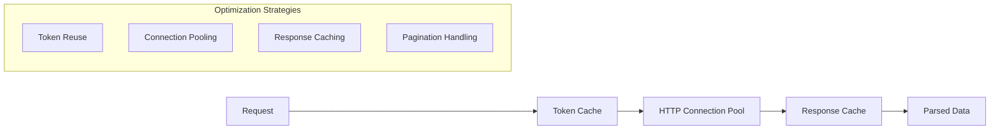

### Pagination Strategies

- **GitHub**: Link header-based pagination
- **GitLab**: Link header with total count
- **Bitbucket**: Cursor-based pagination with next URL

## Security Features

### Token Management

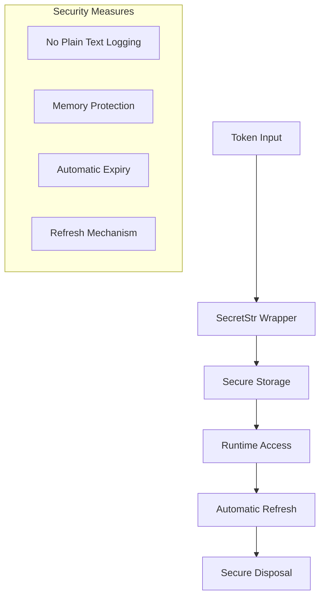

## Extension Points

### Adding New Providers

To add a new Git provider:

1. **Create Provider Mixin**: Extend `BaseGitService` and `HTTPClient`
2. **Implement Required Methods**: `_get_headers()`, `_make_request()`, `get_user()`
3. **Handle Authentication**: Provider-specific token handling
4. **Error Mapping**: Map provider errors to standard exceptions
5. **Data Transformation**: Convert provider responses to standard models

### Custom Authentication

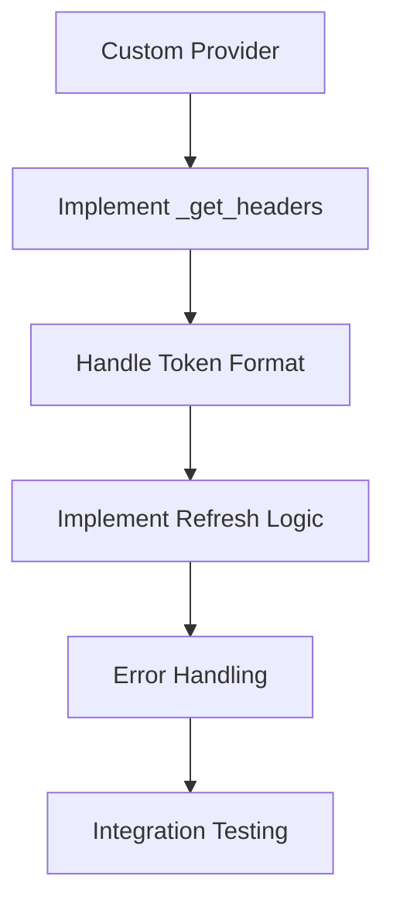

## Dependencies

### Internal Dependencies
- [service_foundation](service_foundation.md): Base service interfaces and models
- [events_and_actions](events_and_actions.md): Event handling for Git operations
- [storage_system](storage_system.md): Token and settings storage

### External Dependencies
- `httpx`: Async HTTP client for API communication
- `pydantic`: Data validation and SecretStr handling
- Provider-specific API libraries and authentication flows

## Testing Strategy

### Provider Testing Pattern

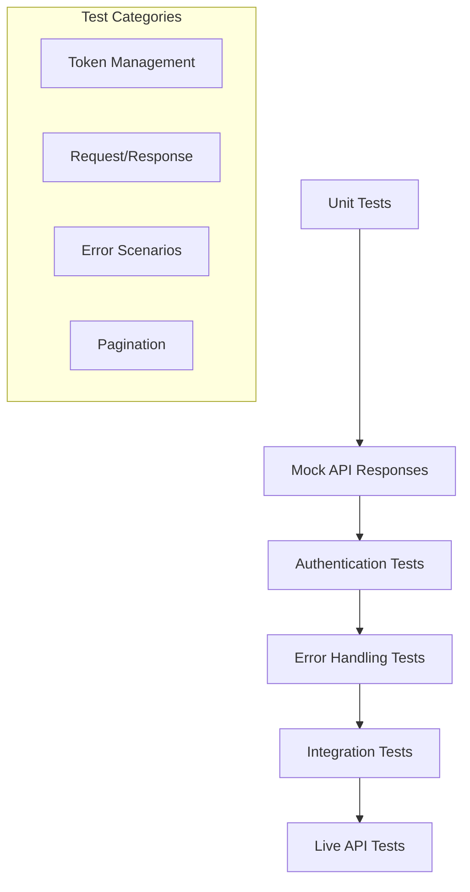

## Future Enhancements

### Planned Improvements

1. **Rate Limiting**: Implement provider-specific rate limiting
2. **Caching Layer**: Add response caching for frequently accessed data
3. **Webhook Support**: Integrate with provider webhook systems
4. **Advanced Authentication**: Support for App installations and JWT tokens
5. **Metrics Collection**: Add performance and usage metrics

### Extensibility Roadmap

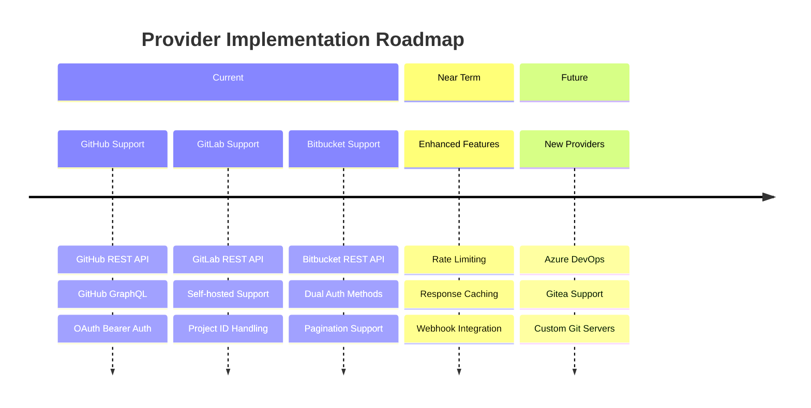

This module serves as the critical bridge between the OpenHands system and external Git hosting platforms, providing a unified interface while handling the complexities of each provider's unique API characteristics and authentication requirements.