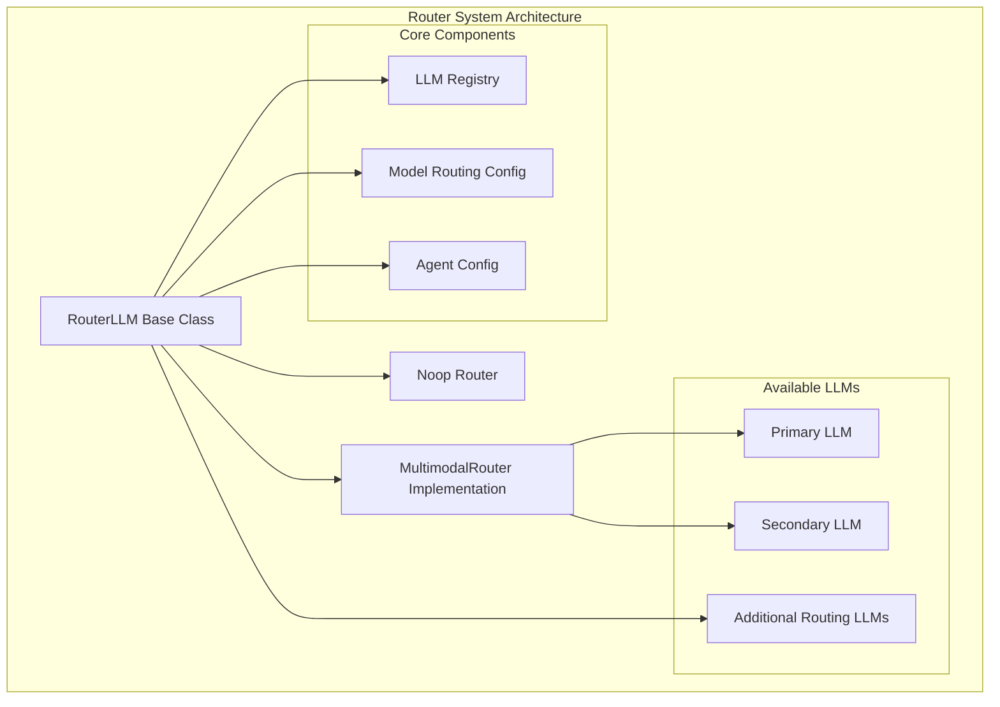
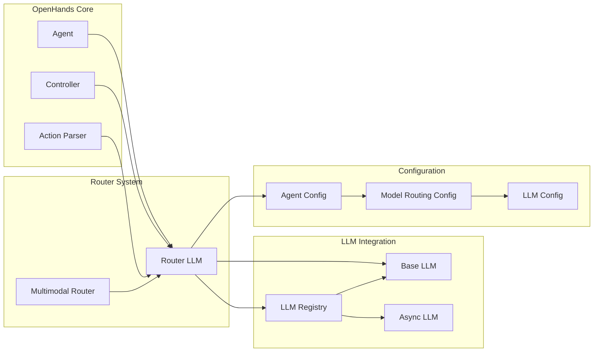
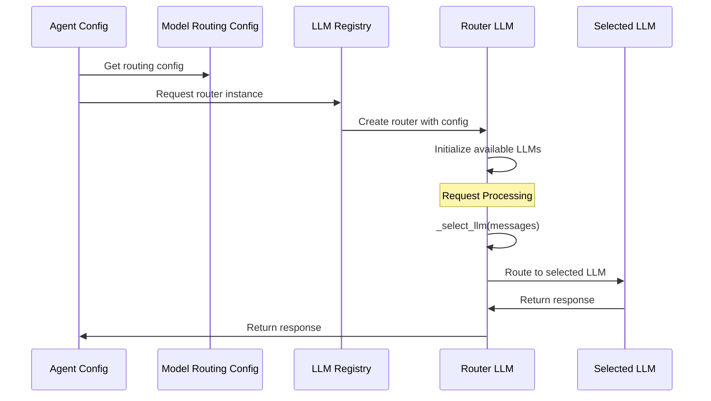
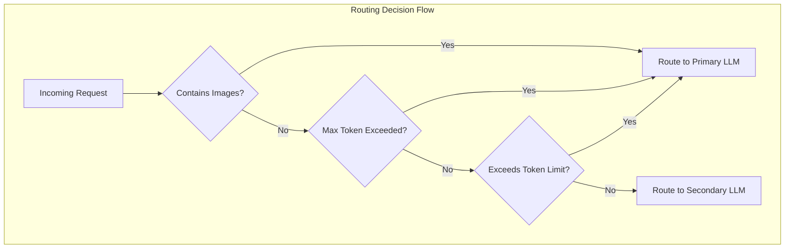

# Router System Documentation

## Overview

The Router System is a sophisticated LLM routing framework within OpenHands that enables intelligent selection and delegation between multiple Language Learning Models (LLMs) based on request characteristics, content type, and resource constraints. This system provides a unified interface while optimizing performance, cost, and capabilities by routing requests to the most appropriate underlying LLM.

## Architecture

The Router System is built around the `RouterLLM` base class, which inherits from the core `LLM` class and provides a foundation for implementing various routing strategies. The system seamlessly integrates with the broader [LLM Integration](llm_integration.md) module while maintaining full compatibility with existing OpenHands components.



## Core Components

### RouterLLM Base Class

The `RouterLLM` class serves as the foundation for all routing implementations:

**Key Features:**
- **Unified Interface**: Inherits from `LLM` class, providing seamless integration
- **Multiple LLM Management**: Manages primary and routing LLMs through configuration
- **Dynamic Routing**: Routes requests based on implemented `_select_llm()` logic
- **State Management**: Tracks current LLM and routing decisions
- **Transparent Delegation**: Delegates all non-routing operations to selected LLM

**Core Methods:**
- `_select_llm(messages)`: Abstract method for routing logic implementation
- `completion`: Intercepts and routes completion requests
- `_get_llm_by_key(llm_key)`: Retrieves LLM instances by configuration key

### MultimodalRouter Implementation

The `MultimodalRouter` provides intelligent routing based on content type and resource constraints:

**Routing Logic:**
1. **Multimodal Content Detection**: Routes to primary LLM when images are detected
2. **Token Limit Management**: Switches to primary LLM when secondary model limits are exceeded
3. **Fallback Strategy**: Maintains state to prevent repeated token limit violations

**Configuration Requirements:**
- Requires `secondary_model` configuration in `llms_for_routing`
- Primary LLM serves as the high-capability fallback model
- Secondary LLM optimized for text-only, cost-effective processing

## System Integration



## Configuration System

### Model Routing Configuration

The routing system is configured through the `ModelRoutingConfig` class:

```python
class ModelRoutingConfig:
    router_name: str = 'noop_router'  # Router implementation to use
    llms_for_routing: dict[str, LLMConfig] = {}  # Additional LLMs for routing
```

**Configuration Options:**
- `noop_router`: No routing, uses primary LLM directly
- `multimodal_router`: Routes based on content type and resource constraints
- Custom router implementations can be registered in `ROUTER_LLM_REGISTRY`

### Integration with Agent Configuration

The router system integrates seamlessly with agent configuration:



## Routing Strategies

### Content-Based Routing

The system supports intelligent routing based on message content:

**Multimodal Detection:**
- Analyzes messages for image content
- Routes multimodal requests to vision-capable models
- Maintains text-only requests on cost-effective models

**Token Management:**
- Monitors token usage against model limits
- Implements fallback strategies for oversized requests
- Tracks state to prevent repeated limit violations

### Performance Optimization



## Metrics and Monitoring

The router system integrates with the OpenHands metrics framework:

**Tracked Metrics:**
- Routing decisions and patterns
- Cost optimization through model selection
- Token usage across different models
- Response latency by routing choice

**Integration Points:**
- Inherits metrics tracking from base `LLM` class
- Delegates metrics collection to selected LLM instances
- Provides routing-specific logging and debugging

## Extension Points

### Custom Router Implementation

Developers can create custom routing strategies by extending `RouterLLM`:

```python
class CustomRouter(RouterLLM):
    def _select_llm(self, messages: list[Message]) -> str:
        # Implement custom routing logic
        # Return key from self.available_llms
        pass
```

**Registration:**
Custom routers must be registered in the `ROUTER_LLM_REGISTRY` for discovery.

### Configuration Extension

The system supports extensible configuration through:
- Custom LLM configurations in `llms_for_routing`
- Flexible router naming and registration
- Integration with existing configuration validation

## Error Handling and Resilience

The router system implements robust error handling:

**Fallback Mechanisms:**
- Automatic fallback to primary LLM on routing failures
- Graceful handling of unavailable routing LLMs
- State recovery for persistent routing decisions

**Validation:**
- Configuration validation at initialization
- Runtime validation of LLM availability
- Clear error messages for misconfiguration

## Performance Considerations

### Optimization Strategies

**Lazy Initialization:**
- LLM instances created on-demand
- Configuration validation deferred until use
- Memory-efficient multi-model management

**Caching and State Management:**
- Routing decisions cached to avoid repeated analysis
- State persistence for token limit tracking
- Efficient message analysis for routing decisions

### Resource Management

The system optimizes resource usage through:
- Selective model loading based on routing needs
- Shared configuration and registry management
- Efficient delegation to underlying LLM instances

## Dependencies

The Router System depends on several core OpenHands modules:

- **[Core LLM Implementation](core_llm_implementation.md)**: Base LLM functionality and interfaces
- **[Core Configuration](core_configuration.md)**: Configuration management and validation
- **[Utility Mixins](utility_mixins.md)**: Retry and debug functionality through inheritance

## Future Enhancements

**Planned Features:**
- Advanced routing algorithms based on request complexity
- Dynamic model selection based on real-time performance metrics
- Integration with cost optimization and budget management
- Support for streaming and async routing decisions

**Extensibility:**
- Plugin architecture for custom routing strategies
- Integration with external model selection services
- Advanced analytics and routing optimization tools

The Router System represents a sophisticated approach to LLM management, providing the flexibility to optimize for different use cases while maintaining a simple, unified interface for the rest of the OpenHands system.