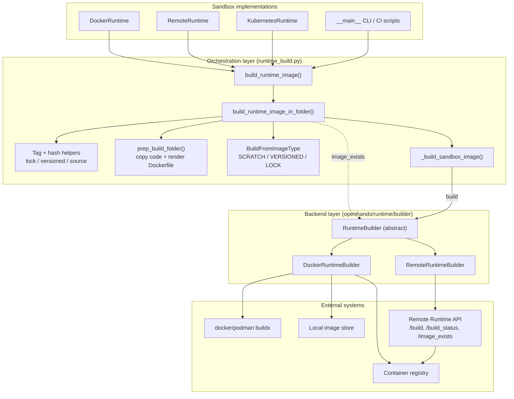
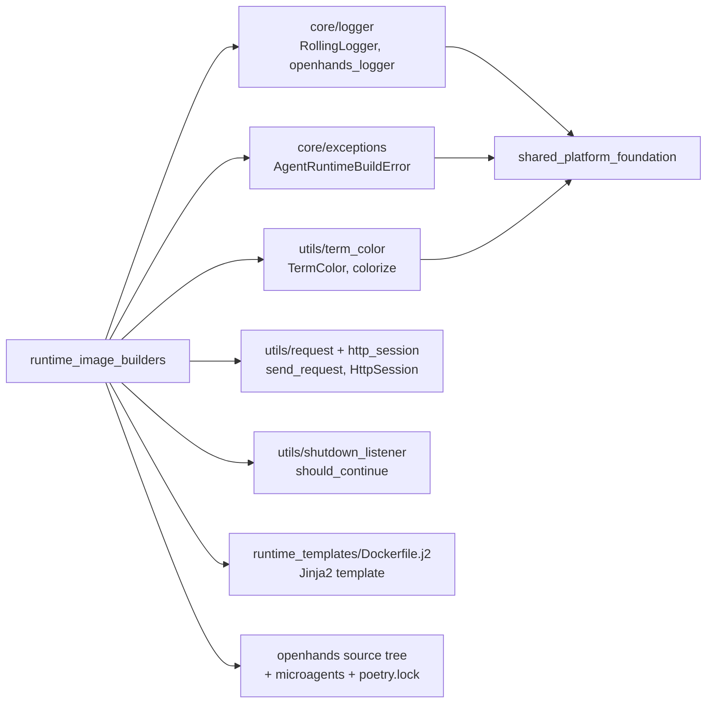
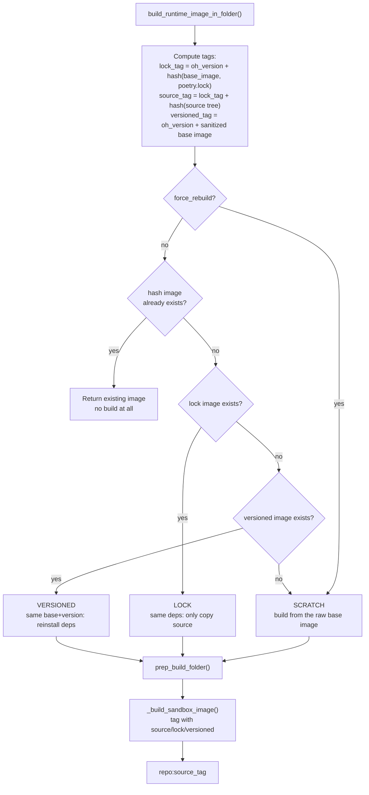
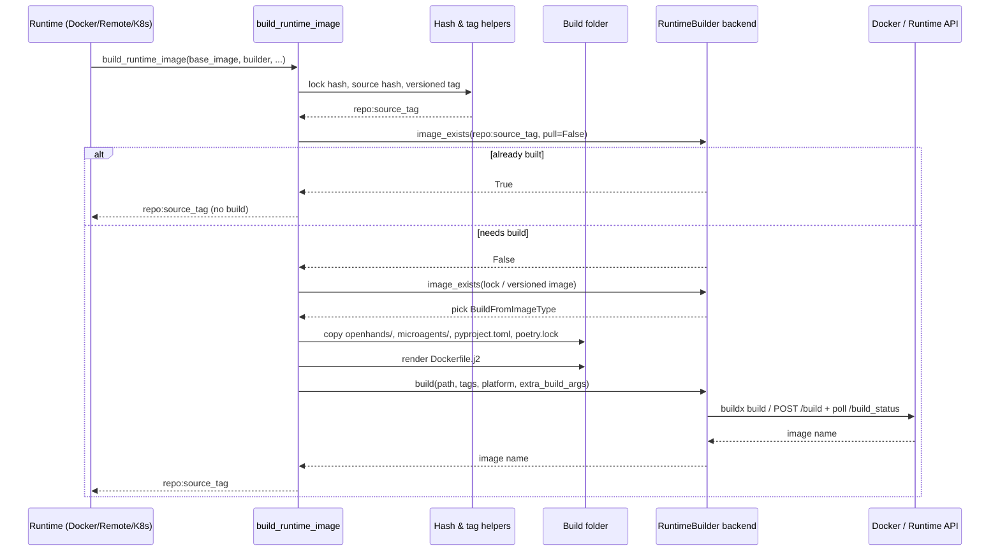
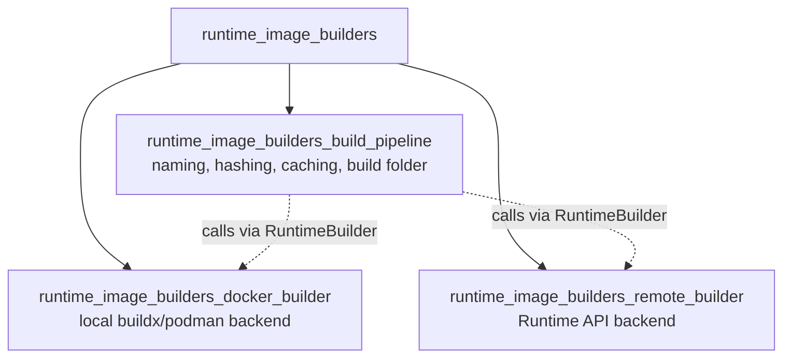
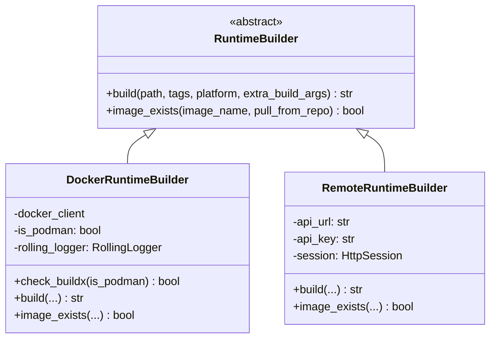
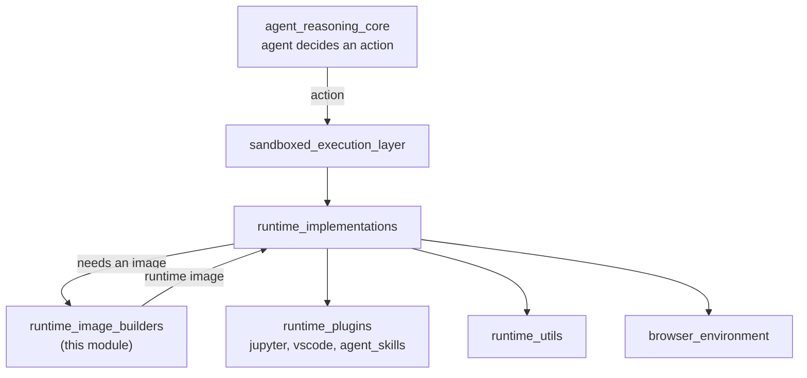

# Runtime Image Builders

## 1. Purpose

Every OpenHands agent runs its commands inside a sandbox. That sandbox needs a
container image that already has the OpenHands runtime code, its Python
dependencies, and (optionally) a browser stack inside it. The
`runtime_image_builders` module is the part of the system that **turns a plain
base image into a ready-to-run OpenHands runtime image**.

It answers three questions:

1. **What image do we need?** — compute a deterministic name and tag from the
   base image, the OpenHands version, the lock files, and the source code.
2. **Do we already have it?** — check the local Docker store or a remote
   registry, so we almost never build twice.
3. **How do we build it?** — prepare a build folder (source code + generated
   `Dockerfile`) and hand it to a *builder backend* (local Docker/Podman, or a
   remote Runtime API).

The module is used by the sandbox implementations described in
[runtime_implementations](runtime_implementations.md) — mainly
[DockerRuntime](runtime_implementations_docker.md),
[RemoteRuntime](runtime_implementations_orchestrated_remote_runtime.md) and
[KubernetesRuntime](runtime_implementations_orchestrated_kubernetes_runtime.md).
It is also runnable as a standalone script (`python -m
openhands.runtime.utils.runtime_build`) for CI image builds.

### Core components

| Component | File | Role |
|---|---|---|
| `BuildFromImageType` | `openhands/runtime/utils/runtime_build.py` | Enum picking the build strategy: `SCRATCH`, `VERSIONED`, or `LOCK` |
| `build_runtime_image` / `build_runtime_image_in_folder` | `openhands/runtime/utils/runtime_build.py` | Orchestration: naming, cache lookup, build folder prep, build |
| `RuntimeBuilder` | `openhands/runtime/builder/base.py` | Abstract backend contract: `build()` + `image_exists()` |
| `DockerRuntimeBuilder` | `openhands/runtime/builder/docker.py` | Builds locally with `docker buildx` / `podman buildx` |
| `RemoteRuntimeBuilder` | `openhands/runtime/builder/remote.py` | Delegates the build to a remote Runtime API |

---

## 2. Architecture Overview

The module has two clean layers: an **orchestration layer** that decides *what*
to build, and a **backend layer** that knows *how* to build it. The two talk
only through the small `RuntimeBuilder` interface.

### Dependencies on the rest of the system

Notice the module pulls the **OpenHands source tree itself** into the build
context. That is why the image tag depends on a hash of the source directory:
change any Python file and you get a new image tag.

---

## 3. The Three Build Strategies

`BuildFromImageType` is the heart of the caching design. All three strategies
produce the same final image contents, but they differ in how much work is
reused.

| Strategy | Base image used | Speed | When chosen |
|---|---|---|---|
| `LOCK` | existing `repo:lock_tag` | fastest | dependencies unchanged, only source changed |
| `VERSIONED` | existing `repo:versioned_tag` | medium | same base image + OpenHands version, deps changed |
| `SCRATCH` | the user-supplied base image | slowest | nothing reusable, or `force_rebuild=True` |

The versioned tag is only applied when building from `SCRATCH`, which keeps
images from being stacked layer-on-layer over and over.

---

## 4. End-to-End Build Flow

`dry_run=True` stops right after the build folder is prepared. That mode is used
by the CLI entrypoint so that `containers/build.sh` can do the real `docker
build` later, with the computed tags written into `config.sh`.

---

## 5. Sub-modules

The module is documented in three parts.

| Sub-module | Documentation | Covers |
|---|---|---|
| Build pipeline | [runtime_image_builders_build_pipeline.md](runtime_image_builders_build_pipeline.md) | `BuildFromImageType`, tag/hash scheme, build folder prep, reuse decision, CLI |
| Docker backend | [runtime_image_builders_docker_builder.md](runtime_image_builders_docker_builder.md) | `DockerRuntimeBuilder`, buildx/podman, local cache, log streaming |
| Remote backend | [runtime_image_builders_remote_builder.md](runtime_image_builders_remote_builder.md) | `RemoteRuntimeBuilder`, Runtime API `/build` + polling |

### 5.1 Build pipeline — [runtime_image_builders_build_pipeline](runtime_image_builders_build_pipeline.md)

The orchestration layer in `openhands/runtime/utils/runtime_build.py`. It owns
`BuildFromImageType`, the deterministic tag/hash scheme
(`get_hash_for_lock_files`, `get_hash_for_source_files`, `truncate_hash`), the
build folder preparation (`prep_build_folder` + the Jinja2 `Dockerfile.j2`
template), the reuse decision tree, and the standalone CLI entrypoint. It is
backend-agnostic: it only ever touches a `RuntimeBuilder`.

### 5.2 Docker backend

`DockerRuntimeBuilder` builds images on the local machine with `docker buildx`
(or `podman buildx`). It checks server versions, can bootstrap a Docker binary
when OpenHands itself runs inside a container, streams build logs through
`RollingLogger`, manages a local BuildKit cache at `/tmp/.buildx-cache` (with
age-based pruning), re-tags the built image, and implements `image_exists()`
against the local store with a registry pull fallback plus per-layer progress
output.

### 5.3 Remote backend

`RemoteRuntimeBuilder` never builds locally. It tars and base64-encodes the
build context, posts it to the Runtime API's `/build` endpoint, then polls
`/build_status` until success, failure, or a 30-minute timeout, honouring the
process shutdown listener while it waits. `image_exists()` is a call to
`/image_exists`. This is the backend used by
[RemoteRuntime](runtime_implementations_orchestrated_remote_runtime.md) and the
[hosted SaaS overlay](hosted_saas_overlay.md).

---

## 6. The `RuntimeBuilder` Contract

Both backends implement the same two-method abstract base class, which is what
keeps the orchestration layer portable.

`build()` returns the *actual* image name to run, which may differ from the
requested tags (a remote backend can add a registry prefix). Failures on either
side surface as `AgentRuntimeBuildError`.

---

## 7. Where This Sits in the System

- Image contents are shaped by config coming from
  [core_configuration](core_configuration.md) — `base_container_image`,
  `runtime_extra_deps`, `platform`, `force_rebuild_runtime`, `enable_browser`.
- Logging and error types come from
  [shared_platform_foundation](shared_platform_foundation.md)
  (see [logging](logging.md)).
- The built image is what [runtime_implementations](runtime_implementations.md)
  starts, and what the
  [action execution server](runtime_implementations_action_execution_server.md)
  runs inside.
- [Third-party runtimes](third_party_runtimes.md) mostly bring their own image
  provisioning and do not use this module.
