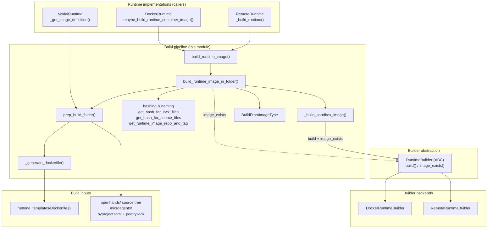
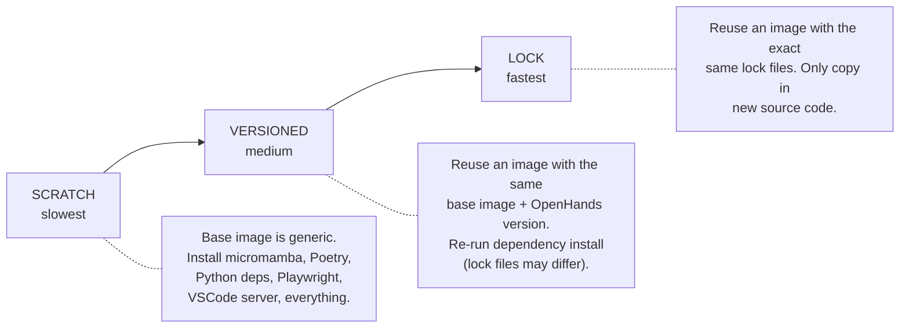
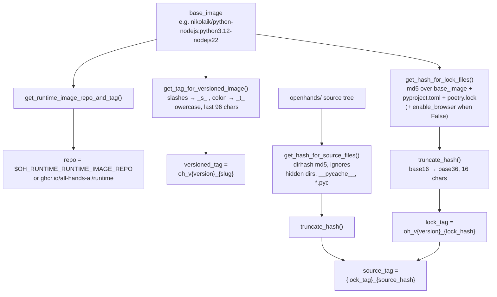
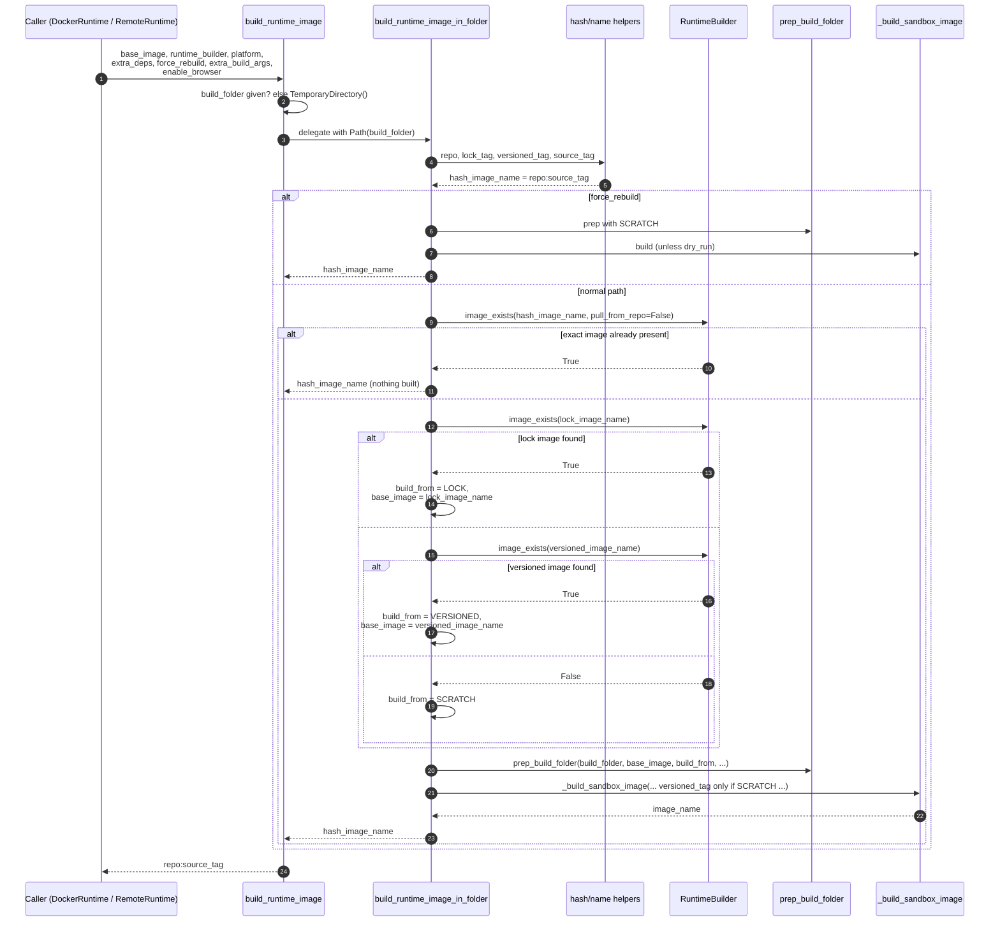
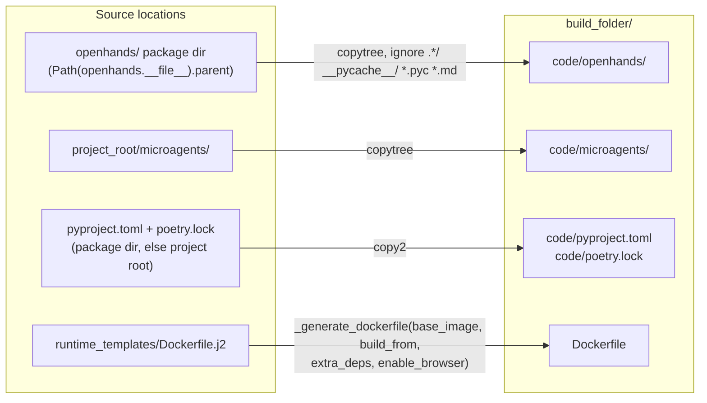
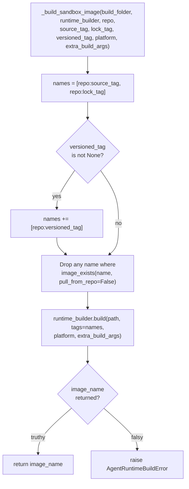
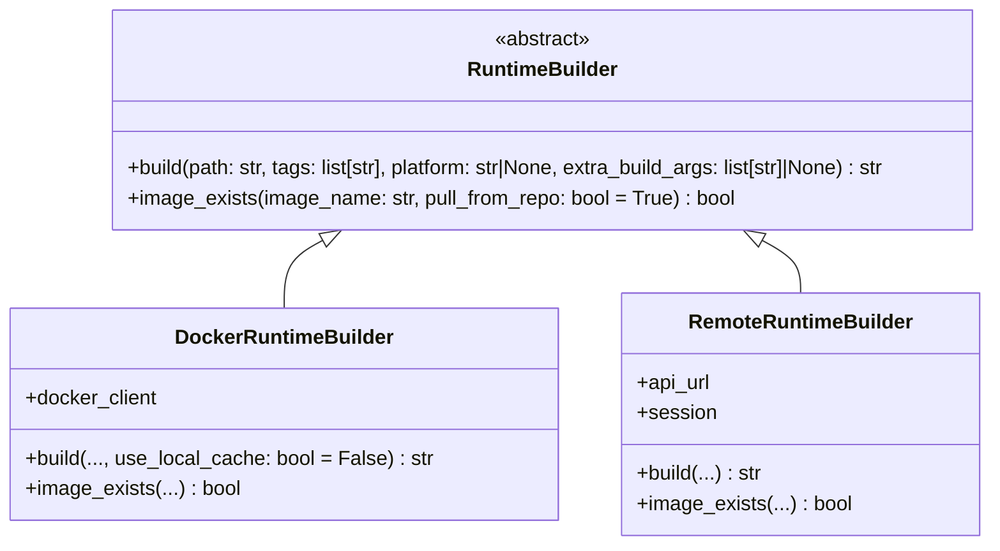
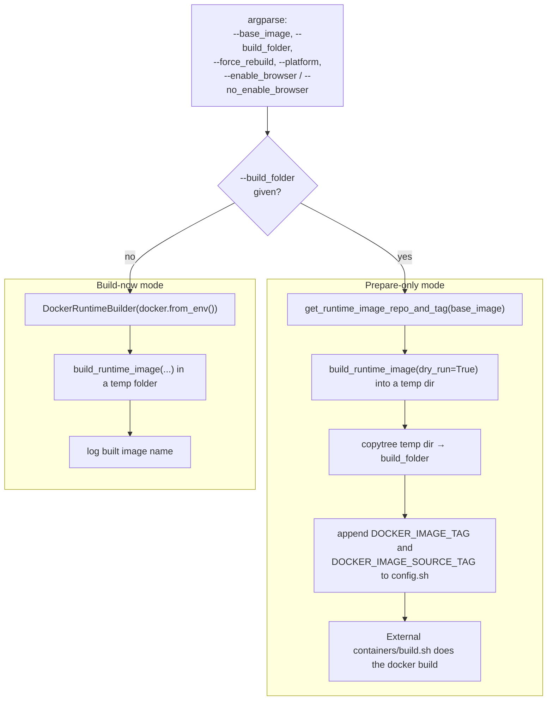

# Runtime Image Builders — Build Pipeline

## Introduction

Every OpenHands agent needs a sandbox to run in. That sandbox is a container, and that container comes from a **runtime image** — a Docker image that already has Python, Poetry, Node, a VSCode server, optional browser support, and the OpenHands source code baked in.

This module is the part that makes those images. It takes a plain **base image** (for example `nikolaik/python-nodejs:python3.12-nodejs22`) and turns it into a ready-to-run runtime image. Two files do the work:

| File | Role |
| --- | --- |
| `openhands/runtime/utils/runtime_build.py` | The pipeline. Decides *what* to build, *how* to build it, and *what to name it*. |
| `openhands/runtime/builder/base.py` | The `RuntimeBuilder` abstract interface. Decides *nothing* — it just says what any builder backend must be able to do. |

The key idea is **cache reuse**. A full build from scratch installs an entire Python toolchain and takes many minutes. Most of the time nothing changed except a few source files, so the pipeline computes content hashes, looks for an already-built image it can stand on top of, and copies in only what is new. That choice is captured by the `BuildFromImageType` enum.

---

## Where this module sits

The build pipeline is a **helper**, not a runtime. Runtimes call into it when they need an image and do not have one yet.

Related documentation:

- [Docker builder backend](runtime_image_builders_docker_builder.md) — the local-daemon implementation of `RuntimeBuilder`.
- [Remote builder backend](runtime_image_builders_remote_builder.md) — the Runtime-API implementation of `RuntimeBuilder`.
- [Runtime image builders (parent)](runtime_image_builders.md) — overview of the builder subsystem.
- [Docker runtime](runtime_implementations_docker.md) and [Remote runtime](runtime_implementations_orchestrated_remote_runtime.md) — the main callers.
- [Modal runtime](third_party_runtimes_managed_sandboxes_modal.md) — a caller that uses only `prep_build_folder`.
- [Sandboxed execution layer](sandboxed_execution_layer.md) — the wider container/runtime story.
- [Core configuration](core_configuration.md) — where `sandbox.*` build options come from.
- [Logging](logging.md) — `openhands_logger` used throughout.

---

## The three build modes

`BuildFromImageType` is a small enum, but it is the heart of the module. It answers: *what am I standing on top of?*

| Mode | Reused from | What still runs | Typical trigger |
| --- | --- | --- | --- |
| `SCRATCH` | Nothing (plain base image) | Full system setup + Poetry install + Playwright + VSCode | First ever build, or `force_rebuild=True` |
| `VERSIONED` | Image tagged `oh_v<version>_<base-image-slug>` | Dependency install (user + root) + VSCode extensions, then source copy | Same base image and OpenHands version, but `poetry.lock` changed |
| `LOCK` | Image tagged `oh_v<version>_<lock-hash>` | Source copy only | Only Python source files changed |

The mode is passed to `_generate_dockerfile`, which forwards it to the Jinja2 template as two booleans (`build_from_scratch`, `build_from_versioned`). `LOCK` is simply "neither flag set" — the template then skips both the scratch block and the versioned dependency block, leaving just the `COPY ./code/openhands` steps.

---

## Naming and hashing

Nothing in the cache strategy works without deterministic names. Four helpers produce them.

Details worth knowing:

- **`get_runtime_image_repo_and_tag`** has two paths. If the incoming image name *already* contains the runtime repo, it is treated as a finished runtime image and split as-is. Otherwise the repo part is mangled into a legal tag: `/` becomes `_s_`, and if the repo string is longer than 32 characters it is compressed to an 8-char MD5 prefix plus the last 24 characters. If the resulting tag still exceeds Docker's 128-character tag limit, the whole thing is replaced by `oh_v{version}_image_{md5[:64]}`.
- **`truncate_hash`** re-encodes a hex MD5 digest into base36 (`0-9a-z`) and keeps 16 characters. This is purely for shorter, tag-safe names — the comment in the code is explicit that uniqueness, not cryptographic strength, is the goal.
- **`get_hash_for_lock_files`** only mixes `enable_browser` into the digest when it is `False`. That is a deliberate backward-compatibility choice so existing browser-enabled images keep their old hashes.
- **`get_hash_for_source_files`** uses `dirhash` over the whole `openhands/` package. Any source change produces a new `source_tag`, which is what makes stale images impossible to accidentally reuse.

Note that hashes are computed from the **installed/checked-out source tree**, not from the base image contents. `pyproject.toml` and `poetry.lock` are looked up next to `openhands/__init__.py` first, then one directory up — this handles both an installed package and a source checkout.

---

## Main flow: `build_runtime_image` → `build_runtime_image_in_folder`

`build_runtime_image` is the public entry point. Its only real job is build-folder management: if the caller gave no `build_folder`, it creates a `TemporaryDirectory` and cleans it up afterwards. Everything else is delegated.

Two subtleties in this flow:

1. **The exact-hit check passes `pull_from_repo=False`.** If the precise image already exists *locally*, we return immediately without a registry round-trip. The lock and versioned lookups use the default `pull_from_repo=True`, so they *may* pull a cached base layer from the registry — worth it, because pulling a lock image is far cheaper than a scratch build.
2. **`versioned_tag` is only applied on a scratch build.** The comment in the code explains why: tagging a versioned image that was itself built on top of another versioned image would stack layers on layers each time, bloating the image. So the versioned tag is only minted by a clean, from-scratch build.

The return value is always `hash_image_name` (`repo:source_tag`) — even when `dry_run=True` and nothing was actually built. That is what lets the CLI mode compute a name for a folder it hands off to an external build script.

---

## Preparing the build context: `prep_build_folder`

`prep_build_folder` assembles a self-contained Docker build context. It never talks to a builder — it only touches the filesystem, so it is safe to use on its own (the Modal runtime does exactly that).

The ignore list matters: hidden directories, bytecode, and Markdown files are excluded so that documentation edits do not invalidate the source hash or bloat the image. (`get_hash_for_source_files` uses a matching ignore list, keeping hash and copy consistent.)

`_generate_dockerfile` renders `Dockerfile.j2` with four variables:

| Template variable | Meaning |
| --- | --- |
| `base_image` | What `FROM` points at — either the user's base image or a previously built lock/versioned image |
| `build_from_scratch` | Include the full system bootstrap block (micromamba, Poetry, Python 3.12, base packages, Docker CLI) |
| `build_from_versioned` | Re-run `poetry install` + root setup + VSCode extension install |
| `extra_deps` | Optional extra `RUN` line, executed as the `openhands` user |
| `enable_browser` | Install Playwright system libraries and the Chromium browser into `/opt/playwright-browsers` |

The template always runs the "ensure openhands user/group exists", VSCode-server setup, and source-copy sections, regardless of mode — those are cheap or must be re-done whenever source changes.

---

## Tagging and handoff: `_build_sandbox_image`

This is the only place in the module that calls `RuntimeBuilder.build`.

One build produces up to **three tags at once**. The `source_tag` identifies this exact source + lock combination. The `lock_tag` becomes the cache anchor for the next `LOCK`-mode build. The `versioned_tag` (scratch only) becomes the fallback anchor when lock files change.

Filtering out already-existing names avoids re-pointing a tag that some other build already owns. Note this filter also uses `pull_from_repo=False` — a purely local check.

Failure is surfaced as `AgentRuntimeBuildError`, so callers see a typed runtime error rather than a generic exception.

---

## The `RuntimeBuilder` contract

`RuntimeBuilder` is a two-method ABC. Keeping it this small is what lets the same pipeline drive a local Docker daemon and a remote build service without changes.

Contract points the pipeline relies on:

- **`build` returns the *canonical* name to use afterwards**, and it is allowed to differ from the input tags — the docstring explicitly permits a builder to add a registry prefix. The pipeline stores that return value but still reports `hash_image_name` upward, since it is the deterministic identity.
- **`build` raises `AgentRuntimeBuildError` on failure.** `_build_sandbox_image` additionally raises it when the return value is empty, so both failure shapes converge.
- **`image_exists(name, pull_from_repo)`** must answer for both the local store and (when `pull_from_repo=True`) the remote registry. The pipeline uses the flag deliberately, as described above.
- `DockerRuntimeBuilder.build` adds an extra `use_local_cache` keyword. Because the pipeline calls `build` with keyword arguments only for the parameters in the base signature, the extra parameter stays a builder-local concern.

See [Docker builder](runtime_image_builders_docker_builder.md) and [Remote builder](runtime_image_builders_remote_builder.md) for how each backend fulfils this contract.

---

## How callers use the pipeline

```mermaid
graph TB
    subgraph d["DockerRuntime"]
        D1["runtime_container_image is None?"]
        D2["set_runtime_status(BUILDING_RUNTIME)"]
        D3["build_runtime_image(base_container_image, DockerRuntimeBuilder,<br/>platform, extra_deps, force_rebuild, extra_build_args, enable_browser)"]
    end

    subgraph r["RemoteRuntime"]
        R1["GET /registry_prefix"]
        R2["set OH_RUNTIME_RUNTIME_IMAGE_REPO<br/>= &lt;prefix&gt;/runtime"]
        R3["build_runtime_image(..., RemoteRuntimeBuilder, ...)"]
        R4["GET /image_exists — verify"]
    end

    subgraph m["ModalRuntime"]
        M1["tempfile.mkdtemp()"]
        M2["prep_build_folder(build_from=SCRATCH)"]
        M3["modal.Image.from_dockerfile(Dockerfile, context_dir)"]
    end

    D1 --> D2 --> D3
    R1 --> R2 --> R3 --> R4
    M1 --> M2 --> M3
```

The `RemoteRuntime` case shows an important side channel: the image repository is read from the `OH_RUNTIME_RUNTIME_IMAGE_REPO` environment variable by `get_runtime_image_repo()`, and `RemoteRuntime` **sets that variable at runtime** from the Runtime API's `registry_prefix` endpoint before calling `build_runtime_image`. So the repo half of every generated name is environment-driven, not hard-coded.

`ModalRuntime` bypasses the caching logic entirely: it only needs the rendered Dockerfile and build context, because Modal does its own image caching.

Build options mostly arrive from `SandboxConfig` (`platform`, `runtime_extra_deps`, `force_rebuild_runtime`, `runtime_extra_build_args`) plus the top-level `enable_browser` flag — see [Core configuration](core_configuration.md).

---

## CLI entry point (`__main__`)

The file is also runnable directly, which is how CI and the `containers/build.sh` script use it.

In prepare-only mode nothing is built here. `dry_run=True` means `_build_sandbox_image` is skipped, but the function still returns `repo:source_tag`, which the CLI splits to obtain `DOCKER_IMAGE_SOURCE_TAG`. Together with `DOCKER_IMAGE_TAG` (from `get_runtime_image_repo_and_tag`) these are appended to `config.sh` so the external shell script tags the image exactly the way the pipeline would have.

---

## Design notes and gotchas

- **Determinism is the whole trick.** Because every name is a pure function of (base image, lock files, source tree, OpenHands version, browser flag), two machines running the same code compute the same tags and can share a registry cache.
- **Truncated hashes are intentional.** The code notes uniqueness — not security — is the requirement, so 16 base36 characters is enough.
- **Docker tag limits shape the naming code.** The 32-character repo compression, the 96-character truncation of the versioned slug, and the 128-character fallback hash all exist to stay inside Docker's tag length rules.
- **`enable_browser=False` produces a distinct lock hash** but leaves browser-enabled hashes untouched, so turning the flag off does not invalidate the whole existing cache.
- **Source copy excludes `*.md`.** Docs changes do not trigger rebuilds.
- **`dry_run` and `force_rebuild` interact.** With `force_rebuild=True` the pipeline goes straight to `SCRATCH` and never consults `image_exists`; with `dry_run=True` the folder is prepared but `_build_sandbox_image` never runs.
- **Building on top of a lock/versioned image mutates `base_image` locally.** Inside `build_runtime_image_in_folder`, the `base_image` variable is reassigned to the cache image before `prep_build_folder` is called — that is what makes the generated Dockerfile's `FROM` line point at the cache instead of the original base.
