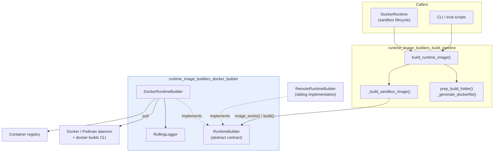
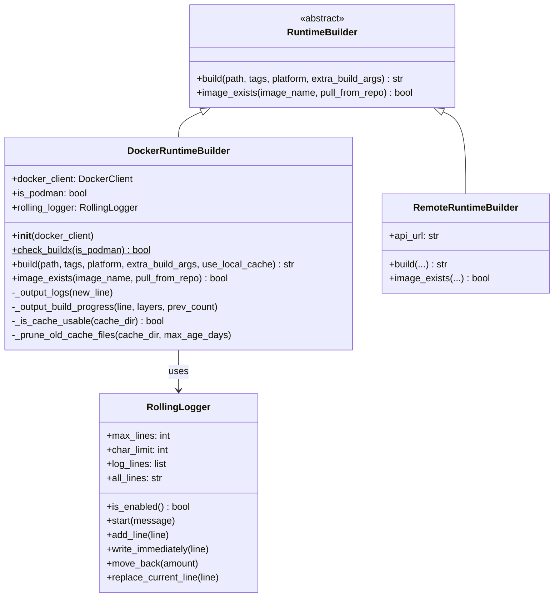
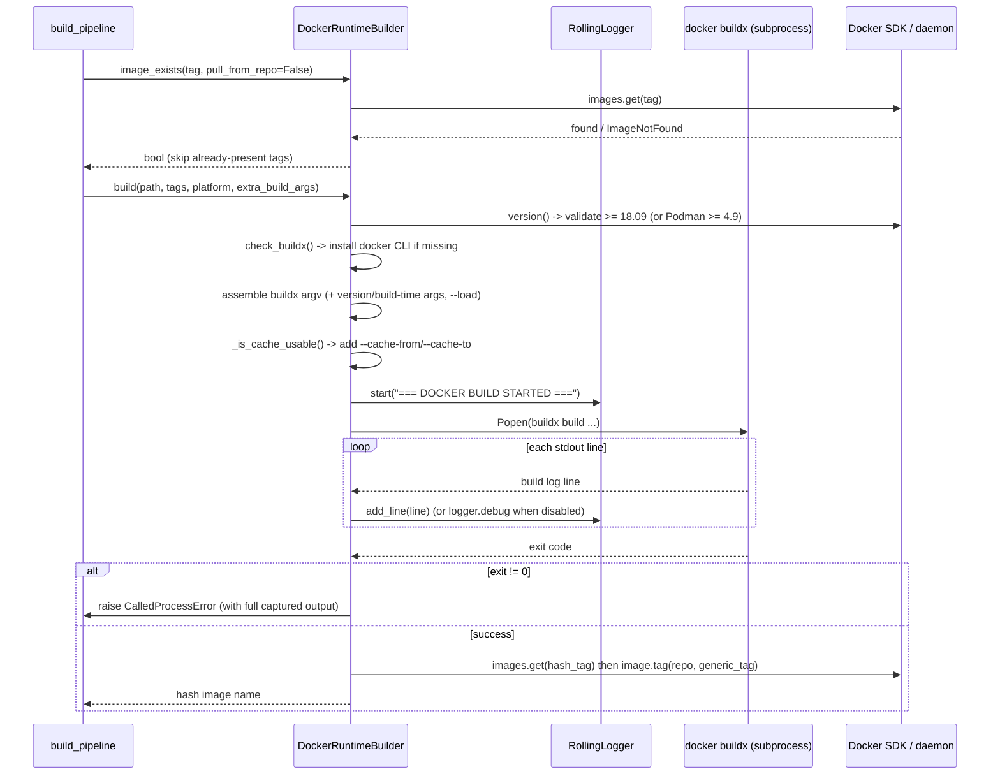
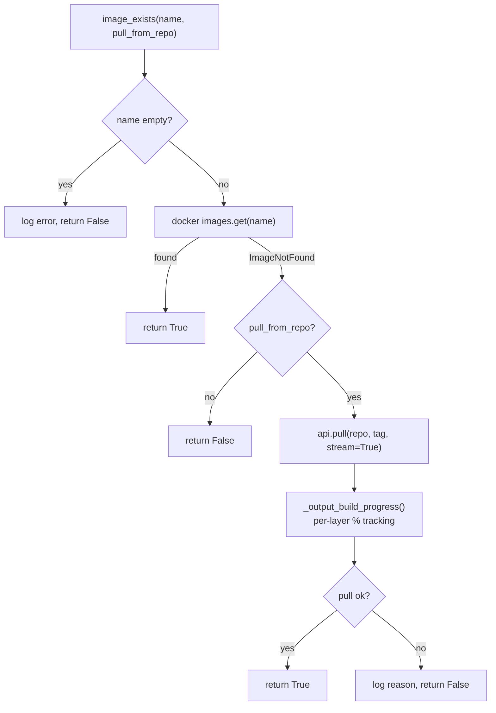
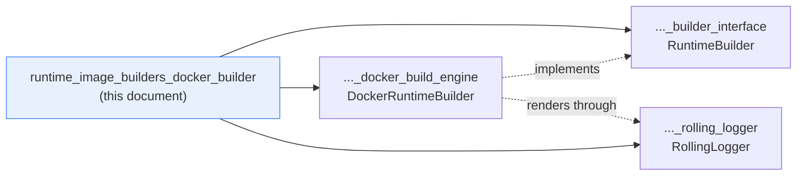

# Docker Runtime Image Builder

## 1. What This Module Does

OpenHands runs agent code inside a sandbox container. Before a sandbox can start, a **runtime image** must exist. This module is the piece that actually turns a prepared build folder into a real Docker image on the local machine.

In plain words, it does three things:

1. **Defines the contract** every image builder must follow (`RuntimeBuilder`): build an image, and check whether an image already exists.
2. **Implements that contract with the local Docker (or Podman) daemon** (`DockerRuntimeBuilder`): it shells out to `docker buildx build`, streams the build output, re-tags the result, and pulls images from a registry when they are missing locally.
3. **Keeps the console readable while long builds run** (`RollingLogger`): instead of flooding the terminal with thousands of build lines, it shows a small window of the most recent lines that keeps updating in place.

This module is deliberately narrow. It does **not** decide *what* to build (no Dockerfile generation, no hashing, no tag naming). That work lives in [runtime_image_builders_build_pipeline](runtime_image_builders_build_pipeline.md), which calls into this module.

### Core Components

| Component | File | Role |
|---|---|---|
| `RuntimeBuilder` | `openhands/runtime/builder/base.py` | Abstract base class: `build()` + `image_exists()` |
| `DockerRuntimeBuilder` | `openhands/runtime/builder/docker.py` | Local Docker/Podman BuildKit implementation |
| `RollingLogger` | `openhands/core/logger.py` | Fixed-height, self-updating console output for build/pull progress |

---

## 2. Where It Sits in the System

The key idea: the build pipeline is written against the **abstract** `RuntimeBuilder`, so the same pipeline can build locally with Docker or remotely through the Runtime API ([runtime_image_builders_remote_builder](runtime_image_builders_remote_builder.md)) without changing a line.

---

## 3. Architecture

### Design Notes

- **Thin abstraction, fat implementation.** `RuntimeBuilder` has only two methods. Everything hard — version checks, buildx bootstrapping, cache handling, progress rendering — is private to `DockerRuntimeBuilder`.
- **`use_local_cache` is an extension, not part of the contract.** `DockerRuntimeBuilder.build()` accepts an extra `use_local_cache` flag that the abstract signature does not have. Callers going through `RuntimeBuilder` never set it, so it stays off by default.
- **Podman is a first-class alternative.** The builder sniffs the daemon's `Components[0].Name` at construction time and swaps the `docker` binary for `podman` everywhere.
- **Logging degrades gracefully.** `RollingLogger` only takes over the terminal when `DEBUG` is on *and* stdout is a TTY. Otherwise every write is a no-op and lines fall back to plain `logger.debug()`.

---

## 4. The Build Flow

### Step-by-Step

1. **Re-validate the environment.** `build()` refreshes the client with `docker.from_env()` and re-checks the server version. Docker must be >= 18.09 (BuildKit); Podman must be >= 4.9. Otherwise `AgentRuntimeBuildError` is raised.
2. **Guarantee a buildx CLI exists.** When OpenHands itself runs inside a container there may be no `docker` binary. `check_buildx()` detects this and the builder installs the Docker CE apt packages on the fly (the app image is Debian-based).
3. **Build the argument list.** Always includes `--progress=plain`, `--build-arg=OPENHANDS_RUNTIME_VERSION`, `--build-arg=OPENHANDS_RUNTIME_BUILD_TIME`, `--tag=<first tag>`, and `--load` (so the image lands in the local image store). `--platform` and any `extra_build_args` are appended; the build context path must be last.
4. **Optionally wire up the local cache.** If `use_local_cache` is set and `/tmp/.buildx-cache` is usable, `--cache-from` / `--cache-to=mode=max` are added. Cache files older than 7 days are pruned first.
5. **Stream and capture.** The subprocess output is read line by line: every line is both stored (for error reporting) and pushed to `_output_logs()`.
6. **Re-tag and verify.** Only `tags[0]` (the content-hash tag) is passed to buildx. If a second tag was supplied, the built image is re-tagged with it afterwards via the SDK. A final `images.get()` confirms the image really exists.

### Tag Convention

The pipeline hands over a list like `["repo:oh_v1.2_<lockhash>_<srchash>", "repo:oh_v1.2_<lockhash>"]`.

| Position | Meaning | How it is applied |
|---|---|---|
| `tags[0]` | Exact content hash — the return value | Passed directly to `--tag` |
| `tags[1]` | More generic tag (lock/versioned) | Applied afterwards with `image.tag()` |
| `tags[2+]` | Ignored by this builder | — |

---

## 5. Image Existence and Pulling

`image_exists()` is intentionally **total** — outside of the daemon-level checks it never raises. Any pull failure (not found, auth error, network error) is logged and converted to `False`, letting the pipeline fall back to building from scratch instead of aborting.

The `_output_build_progress()` helper keeps a `layers` dict keyed by layer id. When `RollingLogger` is active it repaints every layer's line in place each tick; when inactive it emits a debug line only every 10 % of progress, so logs stay small.

---

## 6. Error Handling

| Situation | Behaviour |
|---|---|
| Docker < 18.09 / Podman < 4.9 | `AgentRuntimeBuildError` at construction and again inside `build()` |
| Missing `docker` binary in container | Auto-install attempt; on failure the `CalledProcessError` propagates |
| Non-zero buildx exit | `CalledProcessError` raised with the **full** captured stdout attached |
| Build timeout / permission denied / unexpected | Logged with a specific message, then re-raised |
| Image missing after a "successful" build | `AgentRuntimeBuildError` |
| Cache directory not writable | Warning only; the build continues without cache |
| Registry pull failure | Logged; `image_exists()` returns `False` |

Note the asymmetry: **`build()` fails loudly, `image_exists()` fails quietly.** That is deliberate — an existence check is an optimisation hint, while a failed build is unrecoverable.

---

## 7. Sub-Modules

| Sub-module | Core component | Focus |
|---|---|---|
| [Builder Interface](runtime_image_builders_docker_builder_builder_interface.md) | `RuntimeBuilder` | The abstract contract, its two methods, the return-value rules, and the implementations that satisfy it |
| [Docker Build Engine](runtime_image_builders_docker_builder_docker_build_engine.md) | `DockerRuntimeBuilder` | Daemon/Podman validation, buildx bootstrapping and invocation, local cache management, registry pulls, error paths |
| [Rolling Logger](runtime_image_builders_docker_builder_rolling_logger.md) | `RollingLogger` | ANSI cursor control, the fixed-height rolling window, TTY/DEBUG gating, and how the builder feeds it |

---

## 8. Related Modules

| Module | Relationship |
|---|---|
| [runtime_image_builders_build_pipeline](runtime_image_builders_build_pipeline.md) | The caller. Prepares the build folder, computes hashes and tags, then drives this builder. |
| [runtime_image_builders_remote_builder](runtime_image_builders_remote_builder.md) | The sibling `RuntimeBuilder` implementation that offloads builds to a remote Runtime API. |
| [runtime_implementations_docker](runtime_implementations_docker.md) | `DockerRuntime` — the main consumer, which needs an image before it can start a sandbox container. |
| [logging](logging.md) | Home of `RollingLogger` and the wider OpenHands logging setup (`SensitiveDataFilter`, formatters, handlers). |
| [core_schema_and_runtime_support](core_schema_and_runtime_support.md) | Provides `TermColor` / `colorize`, used to highlight pull warnings and errors. |
