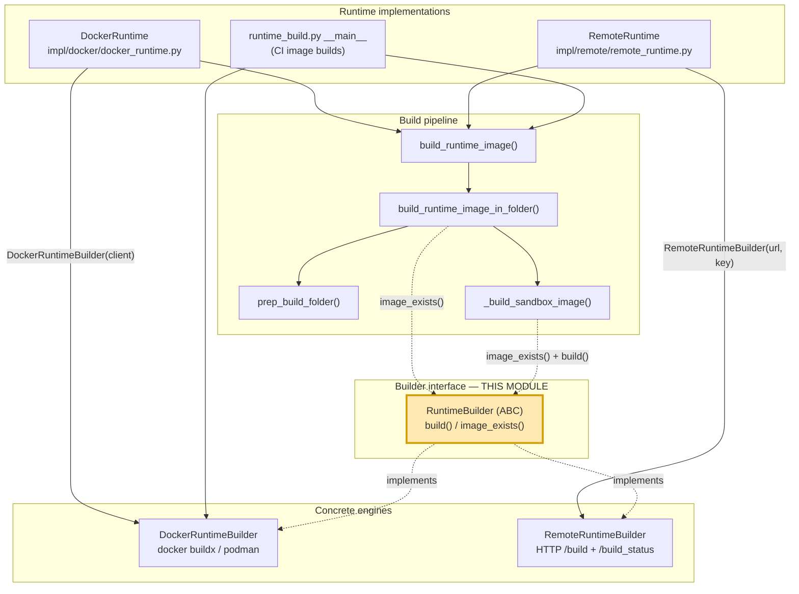
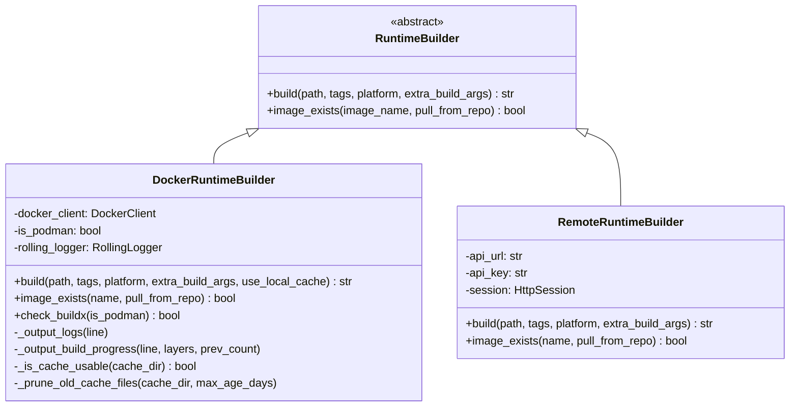
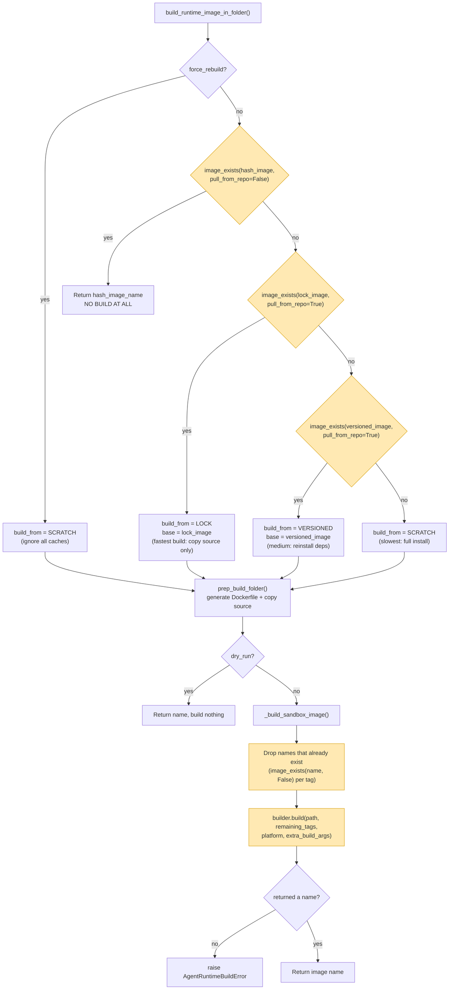
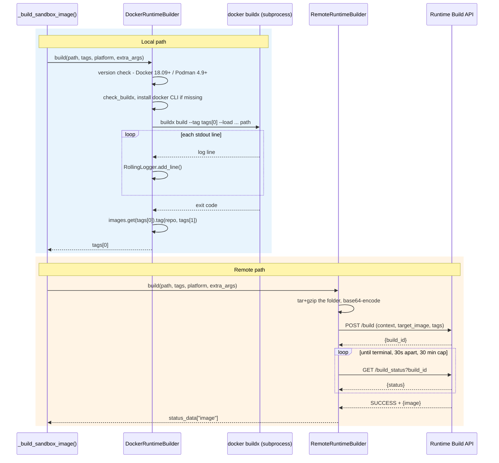
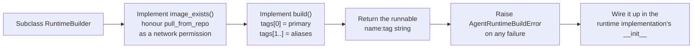

# Runtime Image Builders — Builder Interface

## Introduction

This module is one small file with one small class: `RuntimeBuilder`, the abstract
base class that every OpenHands runtime image builder must implement.

It is the contract between two worlds:

- **The build pipeline** (`openhands/runtime/utils/runtime_build.py`) — the code that
  knows *what* image to build: which base image, which tags, which hashes, which
  Dockerfile.
- **The build engines** (`DockerRuntimeBuilder`, `RemoteRuntimeBuilder`) — the code
  that knows *how* to build: shell out to `docker buildx`, or POST a tarball to a
  remote build service.

Because of this contract, the pipeline never imports Docker, and the Docker engine
never computes tags. You can swap the engine (local Docker, Podman, a remote build
API, a future engine) without touching a single line of build-planning logic.

Related modules:

- [runtime_image_builders_docker_builder](runtime_image_builders_docker_builder.md) — the parent module
- [runtime_image_builders_docker_builder_docker_build_engine](runtime_image_builders_docker_builder_docker_build_engine.md) — the local Docker/Podman implementation
- [runtime_image_builders_remote_builder](runtime_image_builders_remote_builder.md) — the remote API implementation
- [runtime_image_builders_build_pipeline](runtime_image_builders_build_pipeline.md) — the caller that drives this interface
- [runtime_image_builders_docker_builder_rolling_logger](runtime_image_builders_docker_builder_rolling_logger.md) — live build log output

---

## 1. The Contract

File: `openhands/runtime/builder/base.py`

```python
class RuntimeBuilder(abc.ABC):
    @abc.abstractmethod
    def build(self, path, tags, platform=None, extra_build_args=None) -> str: ...

    @abc.abstractmethod
    def image_exists(self, image_name, pull_from_repo=True) -> bool: ...
```

Two methods. That is the whole surface area.

### 1.1 `build(...)`

| Parameter | Type | Meaning |
| --- | --- | --- |
| `path` | `str` | Directory holding the build context — a `Dockerfile` plus the source files copied in by the pipeline. |
| `tags` | `list[str]` | Full `repo:tag` names to apply. **Order matters** (see below). |
| `platform` | `str \| None` | Target platform, e.g. `linux/amd64`, `linux/arm64`. `None` means "whatever the engine defaults to". |
| `extra_build_args` | `list[str] \| None` | Raw extra flags handed straight to the engine. |

**Returns** the `name:tag` of the finished image — the name callers should use for
`docker run`. This is deliberately *not* required to equal `tags[0]`: an engine is
allowed to rewrite the name, for example by prefixing a registry host. Callers must
use the return value, not the input.

**Raises** `AgentRuntimeBuildError` when the build fails.

#### The tag ordering convention

The docstring says `tags` is a list, but the implementations treat the positions as
meaningful. This is an unwritten part of the contract that any new engine must honour:

| Position | Role | How it is used |
| --- | --- | --- |
| `tags[0]` | **primary / hash tag** — identifies the exact source snapshot | The image is built and loaded under this name; it is also the return value. |
| `tags[1]` | **lock tag** — identifies the dependency set | Applied as a second, more general tag after the build succeeds. |
| `tags[2...]` | **versioned tag** and beyond | Extra aliases (remote builder forwards them all; the Docker engine reads only the first two). |

Note the asymmetry: `DockerRuntimeBuilder` looks at `tags[0]` and `tags[1]` and
ignores anything past that, while `RemoteRuntimeBuilder` sends `tags[0]` as
`target_image` and all the rest as additional `tags` form fields. The pipeline
happens to pass at most three names, so the two behave the same in practice — but an
implementer should be aware of the difference.

### 1.2 `image_exists(...)`

| Parameter | Type | Meaning |
| --- | --- | --- |
| `image_name` | `str` | Image to look for, `repo:tag`. |
| `pull_from_repo` | `bool` | If `True`, the engine may reach out to the remote registry (and pull) when the image is not local. If `False`, check locally only. |

**Returns** `bool`. This method is the cache probe that makes the whole incremental
build strategy work — the pipeline calls it several times per build to decide whether
to skip the build entirely, or to pick a cheaper starting point.

The `pull_from_repo=False` variant matters for correctness of speed, not of
behaviour: the pipeline uses `False` when it only wants to know "do I already have
this exact thing right here?" and `True` when a registry round-trip is worth it.

---

## 2. Where the Interface Sits



The dashed arrows are the important part: the pipeline talks only to the abstract
type. The solid arrows on the left show that the *choice* of engine is made by the
runtime implementation, far away from the pipeline, and then injected as a plain
constructor argument.

### 2.1 Class relationships



Two things stand out when comparing the subclasses against the base:

1. `DockerRuntimeBuilder.build()` adds an extra keyword, `use_local_cache`, that is
   not in the interface. Callers going through the abstract type can never set it, so
   it stays at its default (`False`) in normal OpenHands use. It exists for direct,
   engine-aware callers.
2. `RemoteRuntimeBuilder.image_exists()` accepts `pull_from_repo` but ignores it —
   for a remote registry API there is no "local" to distinguish. This is legal under
   the contract: the flag is a *permission* to hit the network, not a requirement.

---

## 3. How the Pipeline Uses the Two Methods

The interface looks trivial, but the pipeline builds a real caching strategy on top
of just these two calls. Understanding that strategy is the best way to understand
why the signatures look the way they do.

The pipeline computes three names for every build:

| Name | Tag shape | Changes when… |
| --- | --- | --- |
| hash image | `oh_v<ver>_<lockhash>_<sourcehash>` | any source file changes |
| lock image | `oh_v<ver>_<lockhash>` | dependencies (lock files) change |
| versioned image | `oh_v<ver>_<baseimage>` | OpenHands version or base image changes |

Then it probes them with `image_exists()`, cheapest outcome first:



Highlighted boxes above are the interface calls. Note the pattern:

- The **first** probe uses `pull_from_repo=False` — an exact-match hit should be free,
  and a registry pull of the exact image would defeat the point of a fast local check.
- The **later** probes use `pull_from_repo=True` — pulling a lock or versioned base is
  worth the network cost because it turns a slow from-scratch build into a fast one.
- Inside `_build_sandbox_image()`, `image_exists(name, False)` filters out tags that
  already point somewhere, so the engine is only asked to apply *new* tags.

This is also why `build()` returns a string instead of `None`: `_build_sandbox_image()`
treats a falsy return as a failure and raises `AgentRuntimeBuildError`.

The `build_from` decision is carried by `BuildFromImageType` (`SCRATCH` / `VERSIONED`
/ `LOCK`) — see [runtime_image_builders_build_pipeline](runtime_image_builders_build_pipeline.md).

---

## 4. Two Very Different Implementations, One Signature

The point of the abstraction is clearest when you put the two engines side by side.
Same call, wildly different mechanics.



Behavioural differences that the contract tolerates:

| Aspect | `DockerRuntimeBuilder` | `RemoteRuntimeBuilder` |
| --- | --- | --- |
| Where the build runs | this machine's Docker/Podman daemon | a remote build service |
| Build context transfer | passed as a filesystem path | tar.gz + base64 in an HTTP form |
| `platform` | forwarded as `--platform` | accepted, not forwarded (only used on a rate-limit retry) |
| `extra_build_args` | appended to the buildx command | accepted, not forwarded |
| Progress feedback | live rolling log of buildx stdout | 30-second status polling |
| Returned name | `tags[0]` | whatever the API reports as `image` |
| Failure signal | `CalledProcessError` / `AgentRuntimeBuildError` | `AgentRuntimeBuildError` |
| Extra prerequisites | may `apt-get install` the Docker CLI when absent | none |

The `platform` and `extra_build_args` gaps in the remote builder are worth flagging:
the parameters are part of the signature, so callers can pass them without error, but
they silently have no effect on a remote build. Anything that must be reproducible
across both engines should not depend on them.

---

## 5. Adding a New Builder

Because the interface is so narrow, a new engine is a small job. The checklist:



Rules to keep:

1. **Never return an empty string on success.** The pipeline reads a falsy return as
   a failed build.
2. **Apply every tag you are given** (or at least `tags[0]` and `tags[1]`), otherwise
   the pipeline's lock-image cache never warms up and every build stays slow.
3. **`image_exists()` must be cheap and side-effect-light when `pull_from_repo=False`.**
   It is called once per candidate tag on every build.
4. **Raise, do not return, on failure.** `AgentRuntimeBuildError` is the expected
   exception type; the runtime layer catches it and surfaces it to the user.
5. **Do not assume the caller reuses your input tag.** Return the canonical name.

---

## 6. Why This Module Exists

It would be easy to look at a 40-line abstract class and see boilerplate. What it
actually buys:

- **Dependency inversion.** `runtime_build.py` — the largest and most logic-heavy
  file in the image-building area — has no Docker import at all. It takes a
  `RuntimeBuilder` and works.
- **Testability.** The unit tests in `tests/unit/runtime/builder/test_runtime_build.py`
  pass a `MagicMock()` where a builder is expected and assert on `build.assert_called_once_with(...)`.
  The whole cache-decision tree is testable with no Docker daemon anywhere.
- **Deployment flexibility.** [DockerRuntime](runtime_implementations_docker.md) picks
  the local engine; [RemoteRuntime](runtime_implementations_orchestrated_remote_runtime.md)
  picks the HTTP engine. Same pipeline, same tags, same hashes, same resulting image
  identity — different place to run the build.
- **A stable seam for third parties.** Third-party sandbox runtimes
  ([third_party_runtimes](third_party_runtimes.md)) that need custom image building
  have one obvious place to plug in.

---

## 7. Quick Reference

| Item | Value |
| --- | --- |
| File | `openhands/runtime/builder/base.py` |
| Class | `RuntimeBuilder` (`abc.ABC`) |
| Abstract methods | `build`, `image_exists` |
| Exported from | `openhands/runtime/builder/__init__.py` (with `DockerRuntimeBuilder`) |
| Known implementations | `DockerRuntimeBuilder`, `RemoteRuntimeBuilder` |
| Primary consumer | `openhands/runtime/utils/runtime_build.py` |
| Error type | `AgentRuntimeBuildError` |
| External dependencies | none (stdlib `abc` only) |

The zero-dependency detail is a feature: this file can be imported from anywhere in
the codebase without dragging in the Docker SDK, HTTP clients, or config.
