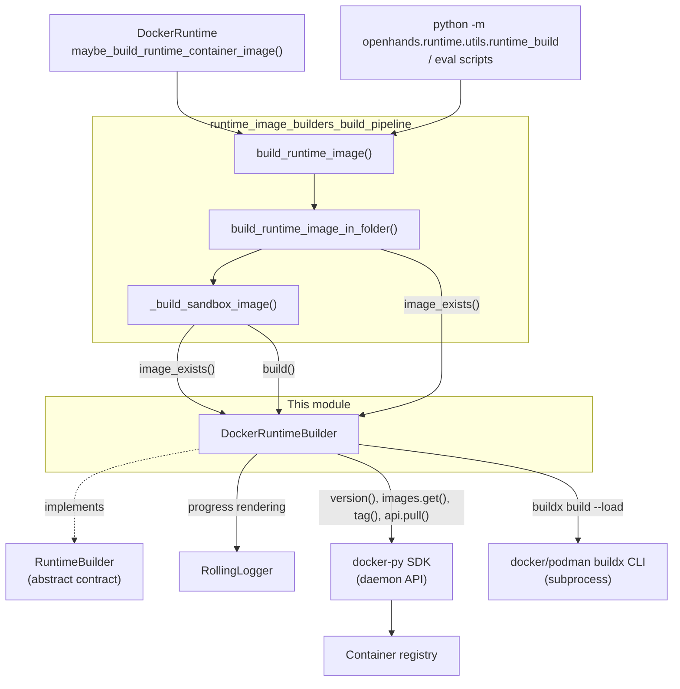
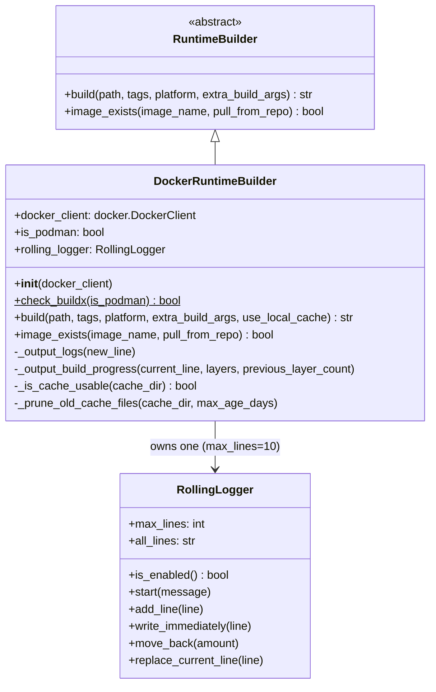
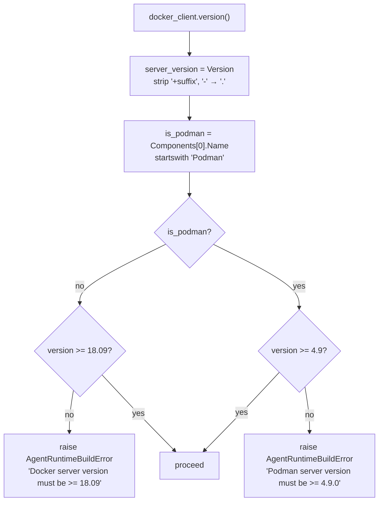
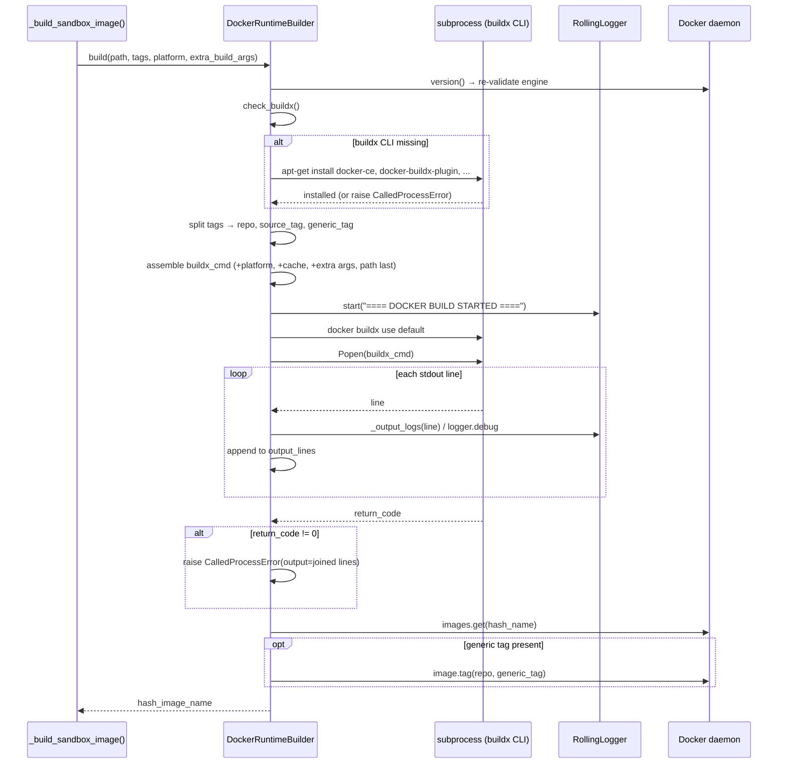
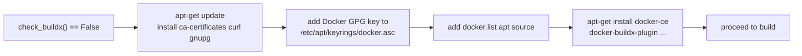
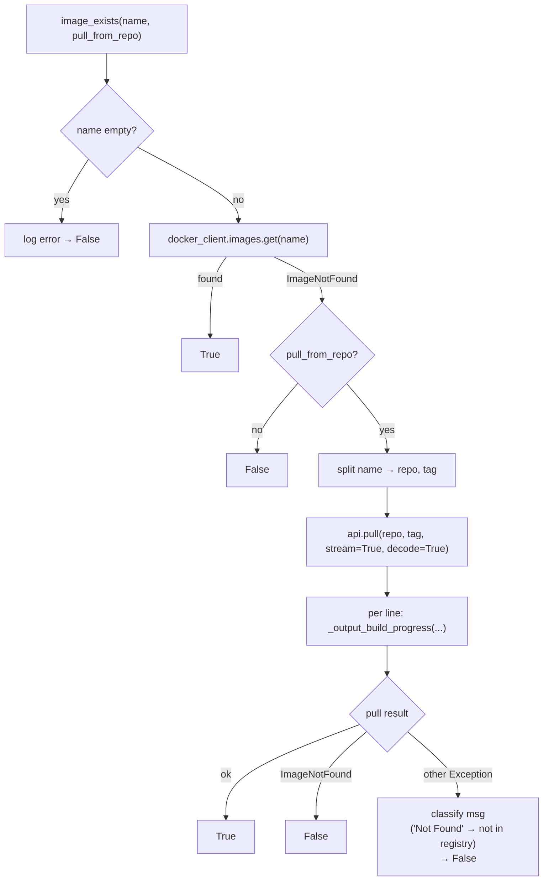
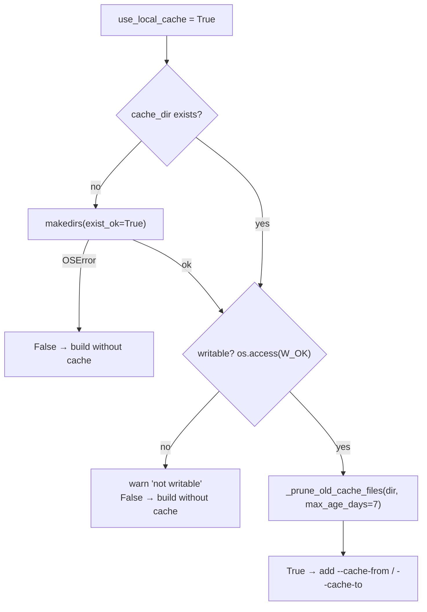
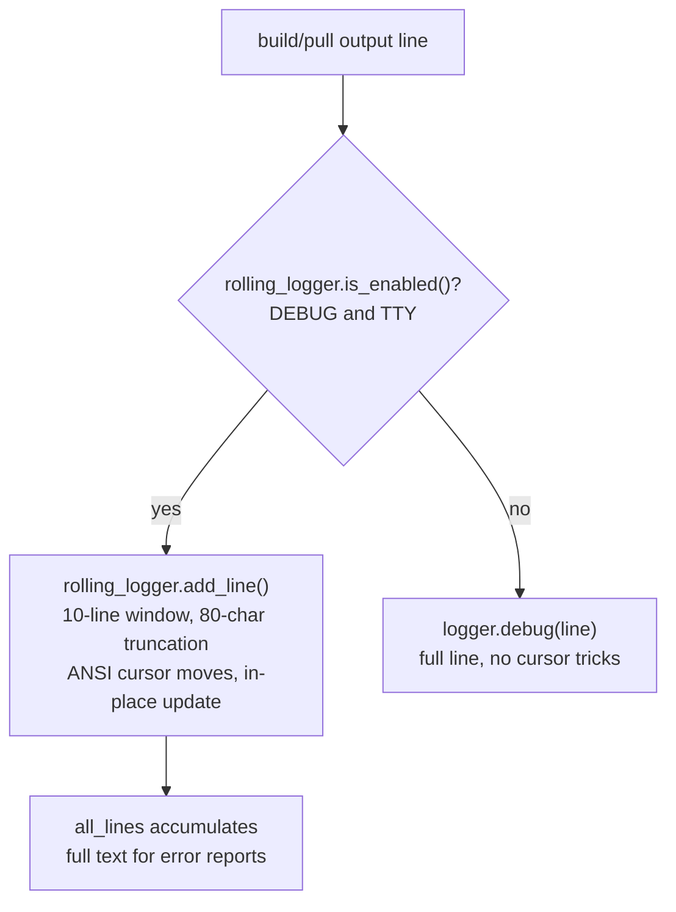
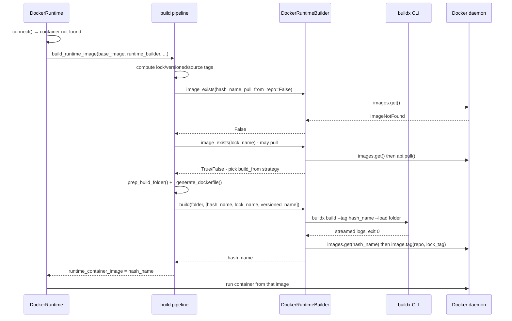

# Docker Build Engine (`DockerRuntimeBuilder`)

## 1. Introduction

`DockerRuntimeBuilder` is the one place in OpenHands where a **prepared build folder becomes a real container image on the local machine**. It is the concrete, local-daemon implementation of the [builder contract](runtime_image_builders_docker_builder_builder_interface.md).

It answers exactly two questions for its callers:

1. **"Does this image already exist?"** — `image_exists()` looks in the local image store, and optionally pulls from a registry.
2. **"Turn this folder into an image with these tags."** — `build()` shells out to `docker buildx build`, streams the output, re-tags the result, and verifies the image landed.

Everything else it does is in service of those two calls: checking that the daemon is new enough, installing a `docker` CLI when one is missing, managing a local BuildKit cache directory, and keeping thousands of build log lines readable in a terminal.

What it deliberately does **not** do:

| Not its job | Where that lives |
|---|---|
| Generating the Dockerfile, hashing sources, choosing tags | [runtime_image_builders_build_pipeline](runtime_image_builders_build_pipeline.md) |
| Talking to a remote build service | [runtime_image_builders_remote_builder](runtime_image_builders.md) |
| Starting/stopping sandbox containers | [runtime_implementations_docker](runtime_implementations_docker.md) |
| Rendering the rolling console window | [rolling logger](runtime_image_builders_docker_builder_rolling_logger.md) |

**Core component:** `openhands/runtime/builder/docker.py::DockerRuntimeBuilder`

---

## 2. Position in the System

The builder sits at the boundary between OpenHands' pure-Python build logic and the outside world (the Docker/Podman daemon, the `docker buildx` CLI, and container registries).



Key point about the two channels: the builder uses the **docker-py SDK** for lookups, pulls, and tagging, but it runs the actual build through the **`buildx` CLI as a subprocess**. That is intentional — BuildKit features such as `--progress=plain`, `--cache-from/--cache-to type=local`, and `--load` are far easier to drive through the CLI than through the legacy daemon build API.

---

## 3. Internal Structure



### Responsibilities by method

| Method | Kind | Responsibility |
|---|---|---|
| `__init__` | public | Store the SDK client, detect Podman, enforce minimum engine version, create the `RollingLogger` |
| `check_buildx` | static | Return whether `docker buildx version` / `podman buildx version` succeeds |
| `build` | public (contract) | Assemble and run the `buildx build` command; stream logs; re-tag; verify |
| `image_exists` | public (contract) | Local lookup, then optional registry pull with layer-progress display |
| `_output_logs` | private | Route one build line either to the rolling window or to `logger.debug` |
| `_output_build_progress` | private | Track per-layer pull state and render it (rolling window or throttled debug logs) |
| `_is_cache_usable` | private | Create/validate the local BuildKit cache dir, then prune it |
| `_prune_old_cache_files` | private | Delete cache files older than N days (default 7) |

---

## 4. Engine Detection and Version Gate

Version checking happens **twice** — once in `__init__` and again at the start of `build()`. The second check re-runs `docker.from_env()`, so a build always validates against the daemon it is about to use, even if the client was created long before.



Why these floors:

- **Docker ≥ 18.09** is the first release that ships BuildKit, which the whole build path depends on.
- **Podman ≥ 4.9** is the first version with a `buildx`-compatible surface good enough for this command line.

The `is_podman` flag is more than a version gate — it decides the **binary name** used for every subprocess call (`docker` vs `podman`), so the same code path drives either engine.

> Note: `__init__` parses only the first two version segments, while `build()` parses all segments of the (suffix-stripped) version string. Both raise `AgentRuntimeBuildError` from `openhands.core.exceptions` on failure.

---

## 5. The Build Flow

`build(path, tags, platform, extra_build_args, use_local_cache)` returns the **hash image name** (`tags[0]`), which callers then use for `docker run`.



### 5.1 Tag handling

The pipeline passes a list of tags that do **not** yet exist. The builder interprets the list positionally:

| Input | Meaning | Used for |
|---|---|---|
| `tags[0]` | `repo:source_tag` — the content-hash name | Passed to `buildx` as `--tag`; returned to the caller |
| `tags[1]` | `repo:lock_tag` (or similar generic tag) | Applied **after** the build via `image.tag()` |
| `tags[2..]` | ignored by this builder | — |

So only one tag goes into BuildKit; the more generic alias is attached afterwards through the SDK. This keeps the build cache keyed on the precise source hash while still leaving a stable, human-friendly tag on the image.

### 5.2 Command assembly

Every build gets these flags:

```
docker|podman buildx build
  --progress=plain
  --build-arg=OPENHANDS_RUNTIME_VERSION=<oh_version>
  --build-arg=OPENHANDS_RUNTIME_BUILD_TIME=<iso timestamp>
  --tag=<tags[0]>
  --load
  [--platform=<platform>]
  [--cache-from=type=local,src=/tmp/.buildx-cache]
  [--cache-to=type=local,dest=/tmp/.buildx-cache,mode=max]
  [<extra_build_args...>]
  <path>            # must be last
```

Two details worth remembering:

- `--load` imports the result into the local image store. Without it, a BuildKit build can finish successfully and still leave nothing for `images.get()` to find.
- `--progress=plain` gives line-oriented output that can be streamed and re-logged, instead of an interactive TTY renderer.
- The build **context path must be the last argument** — extra args are inserted before it.

`docker buildx use default` is fired just before the build to make sure a usable builder instance is selected. It is launched with `Popen` and not waited on.

### 5.3 Bootstrapping the `docker` CLI

The OpenHands app image is itself a container. It can have a mounted Docker socket (so the SDK works) but no `docker` binary inside (so `buildx` does not). When `check_buildx()` fails, the builder installs Docker the Debian way:



Each command runs with `check=True`; a failure is logged and re-raised, so a broken bootstrap surfaces immediately rather than as a confusing build error later. This path assumes a Debian-family base image and network access to `download.docker.com`.

### 5.4 Failure handling

Build output is collected into `output_lines` **as it streams**, so a non-zero exit can be reported with the full log even when the rolling window has already scrolled past the cause.

| Exception caught | Logged as | Behaviour |
|---|---|---|
| `subprocess.CalledProcessError` | exit code + collected output (falls back to `rolling_logger.all_lines`) | re-raised |
| `subprocess.TimeoutExpired` | "Image build timed out" | re-raised |
| `FileNotFoundError` | executable not found | re-raised |
| `PermissionError` | permission denied executing build | re-raised |
| any other `Exception` | unexpected error during build | re-raised |
| image missing after success | — | `AgentRuntimeBuildError` |

Every branch re-raises. The builder never swallows a build failure and never returns a name for an image that is not there — the final `images.get()` acts as a post-condition check.

---

## 6. Image Lookup and Pull

`image_exists(image_name, pull_from_repo=True)` is the cheap check the pipeline uses to skip work. It answers with a plain `bool` and never raises.



The `pull_from_repo=False` variant matters: `_build_sandbox_image()` uses it to filter the tag list to names that truly do not exist yet, and `build_runtime_image_in_folder()` uses it to decide whether a build can be skipped outright. A registry round-trip there would be pure latency.

### Layer progress rendering

`_output_build_progress()` maintains a `layers` dict — `layer_id → {status, progress, last_logged}` — that is threaded through the loop by the caller along with `previous_layer_count`. It has two rendering modes:

| Mode | Condition | Behaviour |
|---|---|---|
| Rolling window | `rolling_logger.is_enabled()` (DEBUG **and** stdout is a TTY) | `move_back(previous_layer_count)`, then rewrite one line per layer in sorted order — an in-place, live table |
| Throttled logs | otherwise | `logger.debug` only when a layer advances ≥ 10 % since its last log, or hits 100 % |

Lines that carry only a `status` (no `id`/`progressDetail`) go straight to `logger.debug`. The 10 % throttle is what keeps a non-TTY log (CI, server logs) from being buried under thousands of progress events.

---

## 7. Local BuildKit Cache

Local caching is **opt-in** via `use_local_cache=True`, and even then it is used only if the directory passes a usability check. The fixed location is `/tmp/.buildx-cache`.



`_prune_old_cache_files()` walks the tree and removes files whose mtime is older than 7 days. Both the walk and each individual delete are wrapped in `try/except` that only **warns** — cache maintenance must never be able to fail a build. Same philosophy for `_is_cache_usable()`: an unusable cache degrades to an uncached build, not an error.

Note that `mode=max` on `--cache-to` exports intermediate layers too, which makes the cache larger but far more reusable — which is exactly why the pruning exists.

---

## 8. Console Output Strategy

The builder produces a lot of text, and its two output modes are chosen by a single predicate: `RollingLogger.is_enabled()` — true only when `DEBUG` is set **and** `sys.stdout.isatty()`.



This split is what makes the same code usable in an interactive terminal (a tidy, self-refreshing 10-line window) and in a headless log (plain, complete, greppable lines). Because `RollingLogger.all_lines` keeps the full text regardless, error reporting is never limited to what was on screen.

For the widget itself, see [runtime_image_builders_docker_builder_rolling_logger](runtime_image_builders_docker_builder_rolling_logger.md).

---

## 9. End-to-End: Starting a Sandbox That Needs an Image



The builder is stateless with respect to this flow: it holds no knowledge of tags, hashes, or strategies between calls. All of that is owned by the pipeline; the builder just executes.

---

## 10. Design Notes and Gotchas

**Why the SDK *and* the CLI?** The SDK is the right tool for cheap, structured operations (version, lookup, tag, streaming pull events as dicts). The CLI is the right tool for BuildKit, where the flag surface is CLI-first. Mixing them is a deliberate trade, not an accident.

**`docker.from_env()` inside `build()`** replaces `self.docker_client` on every build. This picks up environment changes (e.g. `DOCKER_HOST`) and guarantees a live connection for a long-running operation, at the cost of ignoring whatever client was injected at construction time.

**Podman parity is name-level.** The only differences are the binary name and the version floor; the entire command line is shared. The one exception is `docker buildx use default`, which is always issued with the `docker` binary.

**Failure surfaces early and loudly.** Version gate → constructor/build start. Missing CLI → bootstrap or raise. Non-zero exit → `CalledProcessError` with full output. Image absent after a "successful" build → `AgentRuntimeBuildError`. There is no silent degradation anywhere in the build path.

**Best-effort only for the cache.** Directory creation, writability, and pruning all degrade to warnings. The cache is an optimisation and is treated as one.

**Fixed cache path.** `/tmp/.buildx-cache` is hardcoded, as is the 7-day pruning window and the 10-line rolling window height (`RollingLogger(max_lines=10)`). None are configurable through the public API today.

---

## 11. Related Modules

| Module | Relationship |
|---|---|
| [runtime_image_builders_docker_builder_builder_interface](runtime_image_builders_docker_builder_builder_interface.md) | The `RuntimeBuilder` ABC this class implements |
| [runtime_image_builders_docker_builder_rolling_logger](runtime_image_builders_docker_builder_rolling_logger.md) | The console-rendering helper it owns |
| [runtime_image_builders_docker_builder](runtime_image_builders_docker_builder.md) | Parent module overview |
| [runtime_image_builders_build_pipeline](runtime_image_builders_build_pipeline.md) | Sole caller: Dockerfile generation, hashing, tag naming, rebuild strategy |
| [runtime_image_builders](runtime_image_builders.md) | Sibling `RemoteRuntimeBuilder` and the builder family as a whole |
| [runtime_implementations_docker](runtime_implementations_docker.md) | `DockerRuntime`, which constructs this builder and consumes the built image |
