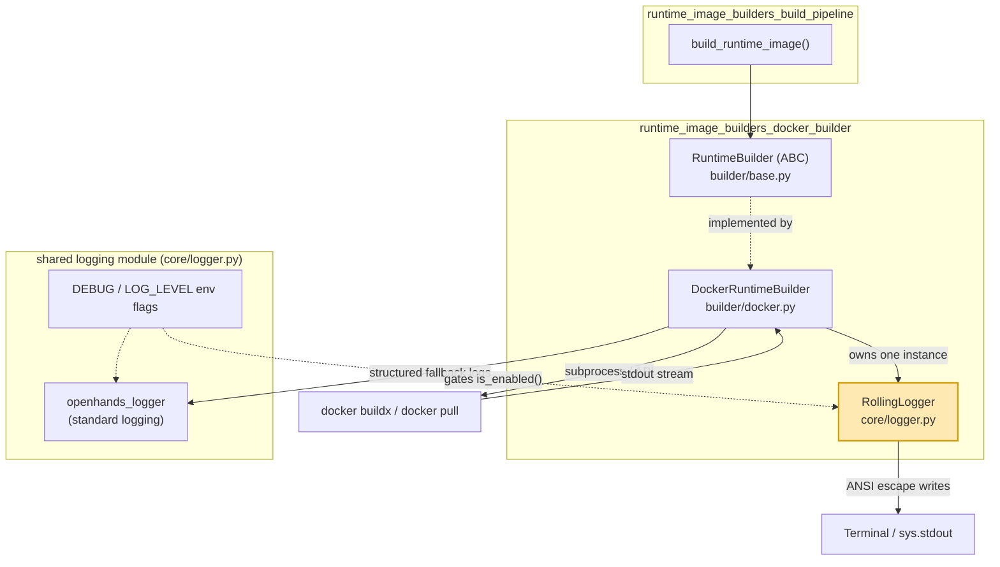
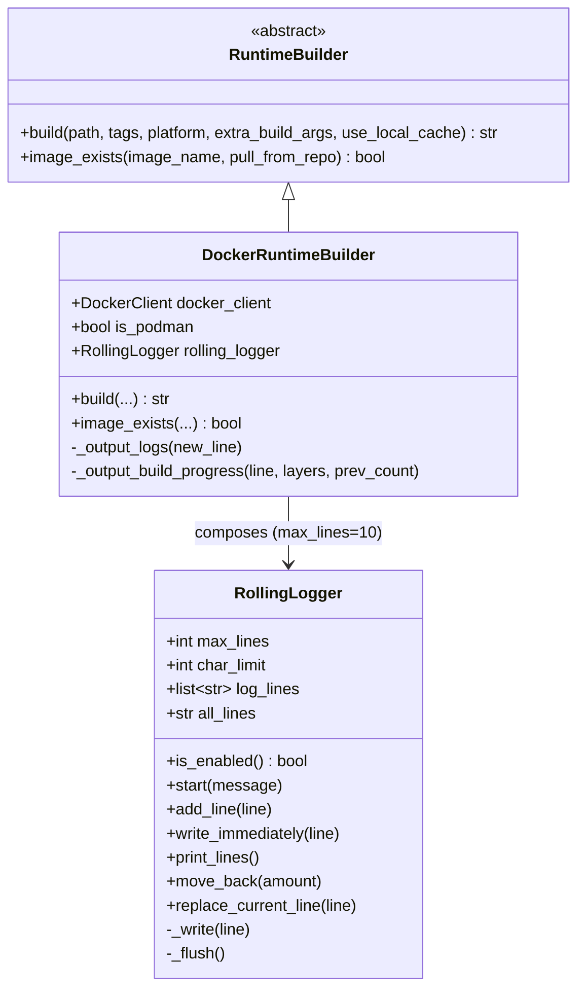
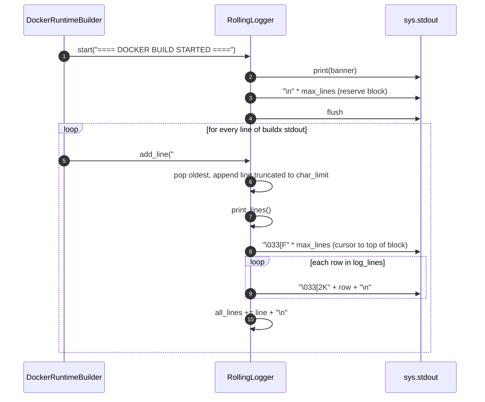
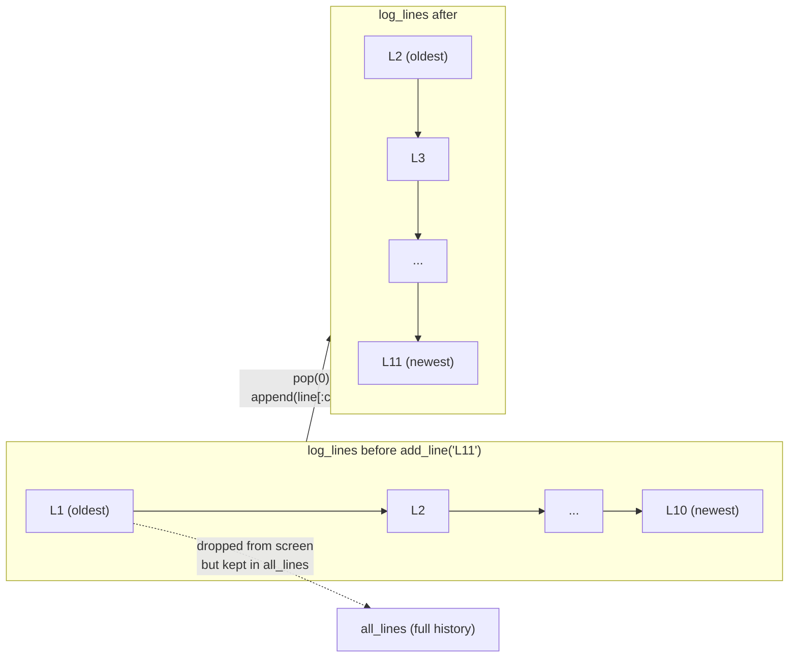
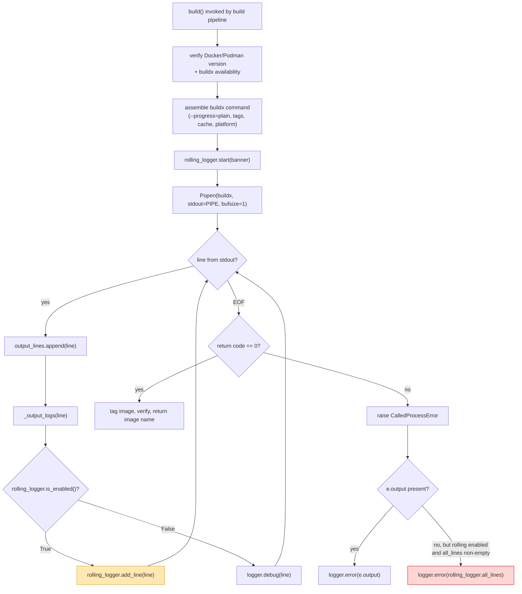
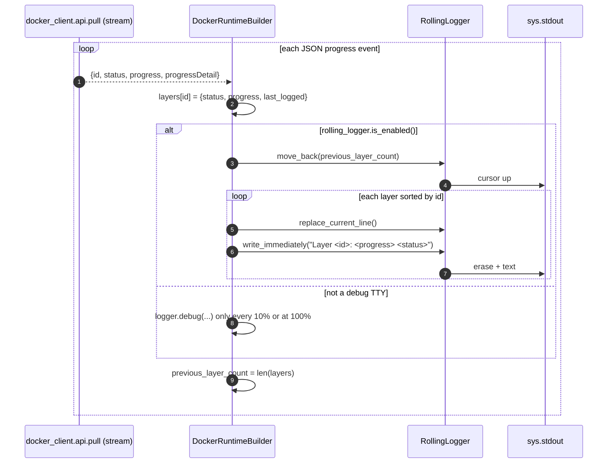
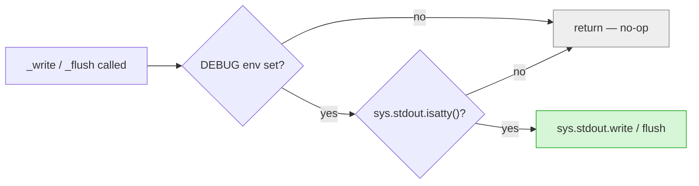

# Rolling Logger (`runtime_image_builders_docker_builder_rolling_logger`)

## Introduction

When OpenHands builds a runtime sandbox image, Docker BuildKit prints thousands of
lines. Dumping all of them into the terminal buries everything else the user cares
about. The **RollingLogger** solves this small but real problem: it shows only the
last *N* build lines in a fixed block of the terminal, rewriting that block in place
so the output looks like a live, scrolling window instead of an endless wall of text.

`RollingLogger` lives in `openhands/core/logger.py` — the shared logging module — but
it is a *terminal display helper*, not a Python `logging` handler. It writes raw ANSI
escape codes straight to `sys.stdout`. Its only production consumer today is
[`DockerRuntimeBuilder`](runtime_image_builders_docker_builder_docker_build_engine.md),
which uses it for both `docker buildx build` output and `docker pull` layer progress.

It also keeps a full copy of everything it was given (`all_lines`), so when a build
fails the builder can dump the complete log even though the screen only ever showed
ten lines.

---

## Core Component

| Component | File | Role |
|---|---|---|
| `RollingLogger` | `openhands/core/logger.py` | Fixed-height, in-place rolling terminal display for long-running build output |

### Public surface

```python
class RollingLogger:
    max_lines: int      # height of the rolling window (default 10)
    char_limit: int     # per-line truncation width (default 80)
    log_lines: list[str]  # the current visible window, always len == max_lines
    all_lines: str        # every line ever added, joined by '\n'

    def __init__(self, max_lines: int = 10, char_limit: int = 80) -> None
    def is_enabled(self) -> bool
    def start(self, message: str = '') -> None
    def add_line(self, line: str) -> None
    def write_immediately(self, line: str) -> None
    def print_lines(self) -> None
    def move_back(self, amount: int = -1) -> None
    def replace_current_line(self, line: str = '') -> None
    def _write(self, line: str) -> None
    def _flush(self) -> None
```

### What each piece does

- **`__init__`** — pre-fills `log_lines` with `max_lines` empty strings. The window is
  therefore always the same height from the very first frame; no reflow as it fills up.
- **`is_enabled()`** — the master gate. Returns `True` only when the module-level
  `DEBUG` flag is on **and** `sys.stdout.isatty()`. This is the single most important
  method to understand: when it is `False`, every write and flush becomes a no-op, so
  the object is safe to construct and call from CI jobs, piped output, servers, and
  tests without polluting anything.
- **`start(message)`** — prints an optional banner (via plain `print`, so the banner
  appears even when the rolling display is disabled), then emits `max_lines` newlines
  to reserve the block of screen the window will live in.
- **`add_line(line)`** — the main entry point. Pops the oldest line, appends the new
  one truncated to `char_limit`, repaints the window, then appends the **untruncated**
  line to `all_lines`.
- **`write_immediately(line)`** — bypasses the window entirely and writes the string
  as-is. Used for progress rows that the caller lays out itself.
- **`print_lines()`** — one repaint: move the cursor back to the top of the block, then
  overwrite each of the `max_lines` rows.
- **`move_back(amount)`** — emits `\033[F` (cursor up one line) repeatedly.
- **`replace_current_line(line)`** — emits `\033[2K` (erase line) + text + newline.

---

## Architecture and Position in the System



Two things stand out in this picture:

1. **`RollingLogger` is a leaf.** It imports nothing from the runtime package, holds no
   reference back to the builder, and depends only on `sys` plus the module-level
   `DEBUG` flag. It can be reused anywhere long streaming output needs a compact view.
2. **It sits *beside* the standard logger, not inside it.** `DockerRuntimeBuilder`
   picks one or the other per line — never both. See
   [logging](logging.md) for the `logging`-based side of `core/logger.py`
   (`SensitiveDataFilter`, `ColoredFormatter`, `LlmFileHandler`, `OpenHandsLoggerAdapter`).

### Class relationship



---

## How the Rolling Display Works

The whole effect comes from two ANSI sequences:

| Sequence | Meaning | Emitted by |
|---|---|---|
| `\033[F` | Move cursor up one line, to column 0 | `move_back()` |
| `\033[2K` | Erase the entire current line | `replace_current_line()` |

`start()` first scrolls `max_lines` blank rows into view, which both reserves the space
and leaves the cursor just below the block. Every subsequent `add_line()` walks the
cursor back up to the top of the block and overwrites all rows top-to-bottom, ending
right back below the block. Because each row is erased before being rewritten, a short
new line never leaves fragments of a longer old line behind.



### Buffer mechanics

`log_lines` is a fixed-length FIFO — `pop(0)` then `append(...)` keeps the length
invariant at exactly `max_lines`, so the window height never changes.



Note the asymmetry, which is deliberate: the **screen** gets a line truncated to
`char_limit` characters, while `all_lines` gets the **full** line. Nothing is lost from
the history just because the terminal is narrow.

---

## Integration with the Docker Build Engine

`DockerRuntimeBuilder` creates exactly one `RollingLogger(max_lines=10)` in its
constructor and uses it on three distinct paths.

### 1. Build output — `_output_logs()`

Every line read from the `docker buildx build` subprocess passes through a one-line
router:

```python
def _output_logs(self, new_line: str) -> None:
    if not self.rolling_logger.is_enabled():
        logger.debug(new_line)          # standard logger, plain lines
    else:
        self.rolling_logger.add_line(new_line)  # rolling window
```

This is the key design pattern of the module: **`is_enabled()` selects the sink.** In
an interactive debug session you get the compact rolling view; everywhere else the same
content flows into the normal `openhands` logger at `DEBUG` level, where the standard
handlers, formatters, and `SensitiveDataFilter` apply.



### 2. Failure diagnostics — `all_lines`

The rolling window shows ten lines, but a failed build needs the whole story. The
builder's `except subprocess.CalledProcessError` branch falls back to
`self.rolling_logger.all_lines` when the exception itself carries no output:

```python
elif self.rolling_logger.is_enabled() and self.rolling_logger.all_lines:
    logger.error(f'Docker build output:\n{self.rolling_logger.all_lines}')
```

So `all_lines` is not bookkeeping — it is the module's second real feature. The
truncated-for-display / full-for-history split exists precisely for this moment.

### 3. Image pull progress — `_output_build_progress()`

Pulling an image in `image_exists()` is a different shape of problem: instead of a
stream of new lines, there is a *set of layers* whose status changes over time. Here
the builder uses the lower-level primitives directly and does its own layout, so the
number of rows can grow as new layers appear:



Notice the non-TTY branch is not merely "print everything instead" — it throttles to
one message per 10 % of progress per layer, because a log file does not benefit from
per-event updates. The rolling path can afford per-event updates because each one
overwrites the previous.

> **Behavioral detail worth knowing:** `move_back()` accepts an `amount` argument, but
> the body always writes `'\033[F' * self.max_lines` — the parameter is not actually
> used to size the cursor movement. The pull-progress path passes
> `previous_layer_count`, so when the layer count differs from `max_lines` the cursor
> lands somewhere other than the top of the drawn rows. The effect is cosmetic (rows
> may drift or repeat during a pull) and only visible under `DEBUG` on a TTY, but it is
> the reason pull output can look less tidy than build output.

---

## The Enablement Gate

Everything about safety in this component reduces to `is_enabled()`:

```python
def is_enabled(self) -> bool:
    return DEBUG and sys.stdout.isatty()
```

`DEBUG` is read once at import time from the `DEBUG` environment variable
(`'true' | '1' | 'yes'`). `sys.stdout.isatty()` is checked live on each call.



Because the gate lives in the private `_write`/`_flush` helpers rather than in the
public methods, **all** paths are protected — including `write_immediately()` and the
raw cursor primitives. Consequences:

| Environment | `is_enabled()` | What happens |
|---|---|---|
| Developer terminal, `DEBUG=1` | `True` | Rolling window renders; `all_lines` accumulates |
| Developer terminal, no `DEBUG` | `False` | Silent; builder falls back to `logger.debug` |
| CI job / piped stdout / `>` redirect | `False` | No escape codes ever reach the log file |
| Server or containerized deployment | `False` | No ANSI garbage in captured stdout |
| Unit tests | `False` | Safe to instantiate and call without mocking stdout |

Two caveats follow from the design:

- **State still advances when disabled.** `add_line()` mutates `log_lines` and grows
  `all_lines` regardless of the gate; only the *writes* are suppressed. That is what
  makes `all_lines` a reliable in-memory buffer — but it also means the buffer grows
  for the lifetime of the builder with no cap, so a very long build holds its entire
  output in memory. In practice `DockerRuntimeBuilder` also keeps its own
  `output_lines` list for the same purpose, so the history is duplicated.
- **`start()`'s banner is not gated.** The `print(message)` call runs unconditionally;
  only the reserved newlines go through `_write`. This is intentional — the
  "BUILD STARTED" banner is useful in every environment.

---

## Design Notes

**Why not a `logging.Handler`?** Rolling output needs to *unwrite* what it already
emitted. The `logging` framework is append-only by design: handlers, formatters, and
filters all assume a record is written once and never revisited. Cursor-relative
repainting does not fit that contract, so `RollingLogger` is a plain class writing
directly to `sys.stdout`, and the builder chooses between the two systems per line.

**Why truncate at 80 characters?** BuildKit's `--progress=plain` lines routinely exceed
terminal width. A wrapped line consumes two screen rows, which breaks the arithmetic in
`move_back()` — the cursor would come to rest in the wrong place and the window would
smear. Truncation keeps the one-line-per-row invariant that the whole repaint scheme
depends on.

**Why keep `all_lines` at all?** So the ten-line window is a display choice rather than
a data-loss choice. Failure diagnostics read the full history back out.

---

## Related Modules

| Module | Relationship |
|---|---|
| [runtime_image_builders_docker_builder_docker_build_engine](runtime_image_builders_docker_builder_docker_build_engine.md) | The only production consumer: owns the `RollingLogger` and routes build/pull output through it |
| [runtime_image_builders_docker_builder_builder_interface](runtime_image_builders_docker_builder_builder_interface.md) | The `RuntimeBuilder` abstraction that `DockerRuntimeBuilder` implements |
| [runtime_image_builders_build_pipeline](runtime_image_builders_build_pipeline.md) | Orchestrates image builds and calls into the builder, indirectly driving this display |
| [runtime_image_builders_remote_builder](runtime_image_builders_remote_builder.md) | Sibling builder; delegates to a remote API and does **not** use `RollingLogger` |
| [logging](logging.md) | The rest of `openhands/core/logger.py` — handlers, formatters, filters, and the `DEBUG`/`LOG_*` flags that gate this component |
| [runtime_implementations_docker](runtime_implementations_docker.md) | `DockerRuntime`, which triggers image builds when a sandbox image is missing |
| [runtime_utils](runtime_utils.md) | `LogStreamer`, the complementary utility that streams logs out of a *running* container |
