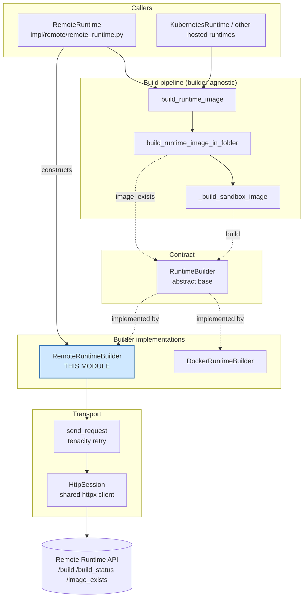
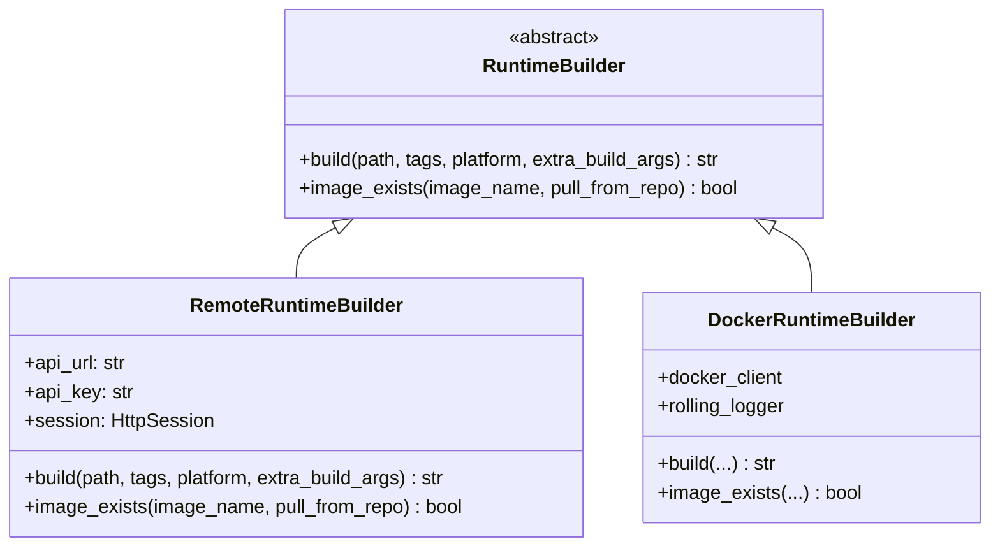
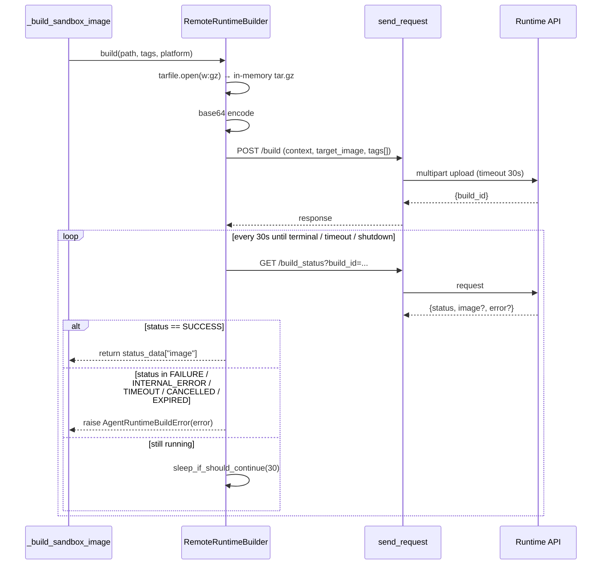
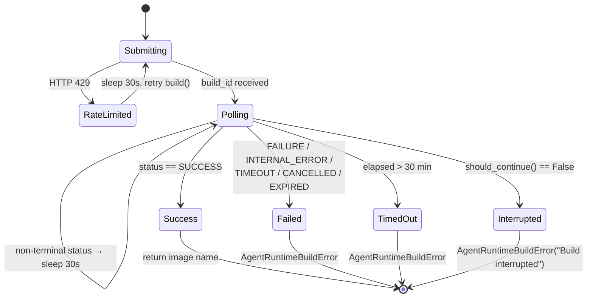
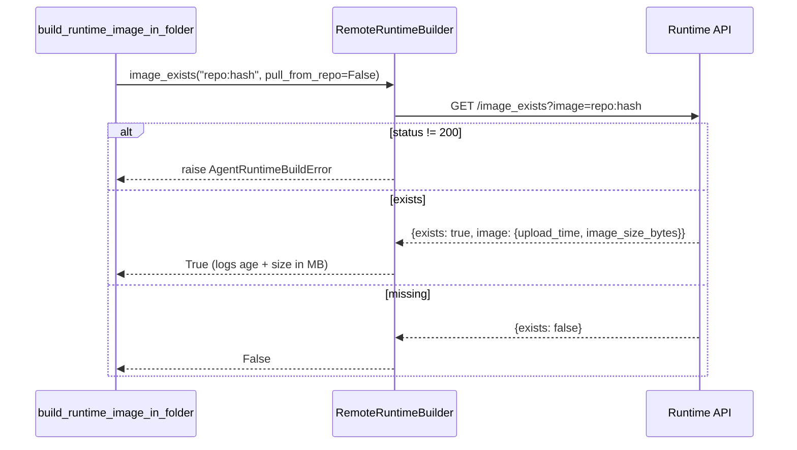
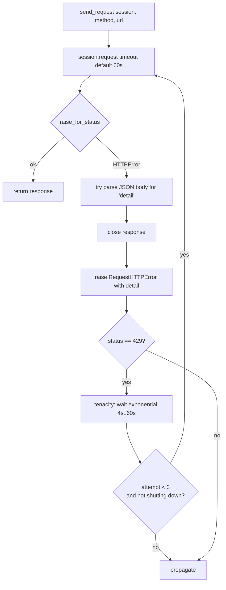
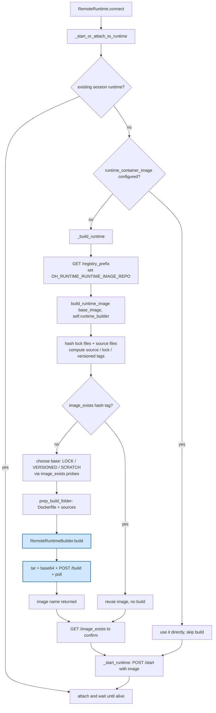

# Runtime Image Builders — Remote Builder

## Introduction

The **remote builder** is the piece of OpenHands that builds sandbox container images *somewhere else*. Instead of talking to a local Docker daemon, it packs the build folder into a tarball, POSTs it to a hosted **Runtime API**, and then waits for that service to finish the build.

It exists for one reason: when OpenHands runs against a hosted runtime (see [runtime_implementations_orchestrated_remote_runtime.md](runtime_implementations_orchestrated_remote_runtime.md)), the machine running the agent usually has **no Docker daemon at all**. The remote builder gives that machine the same two capabilities a local Docker build gives — "build this folder into an image" and "does this image already exist?" — over plain HTTP.

The module has three parts:

| Component | File | Role |
|---|---|---|
| `RemoteRuntimeBuilder` | `openhands/runtime/builder/remote.py` | The remote build engine. Packs context, calls the Runtime API, polls until done. |
| `RuntimeBuilder` | `openhands/runtime/builder/base.py` | The abstract contract shared with the local Docker builder. |
| `send_request` | `openhands/runtime/utils/request.py` | Retrying HTTP helper used for every call to the Runtime API. |

---

## Where this module sits

The build *pipeline* (hashing, Dockerfile generation, tag selection) is completely builder-agnostic — it is documented in [runtime_image_builders_build_pipeline.md](runtime_image_builders_build_pipeline.md). The pipeline only knows the `RuntimeBuilder` interface, so swapping "build locally with Docker" for "build remotely over HTTP" is a one-line change of which object is handed in.



Related docs:
- [runtime_image_builders.md](runtime_image_builders.md) — the parent module overview.
- [runtime_image_builders_docker_builder.md](runtime_image_builders_docker_builder.md) — the local Docker/BuildKit sibling implementation.
- [runtime_image_builders_docker_builder_builder_interface.md](runtime_image_builders_docker_builder_builder_interface.md) — deeper notes on the `RuntimeBuilder` contract.
- [runtime_implementations_orchestrated_remote_runtime.md](runtime_implementations_orchestrated_remote_runtime.md) — the runtime that owns and drives this builder.

---

## The contract: `RuntimeBuilder`

`RuntimeBuilder` is a tiny abstract class with exactly two methods. Everything else in the build system is written against it.



**`build(path, tags, platform=None, extra_build_args=None) -> str`**
Build the folder at `path` and tag it. Returns the final `name:tag` that should actually be used to run the container — a builder is allowed to change the tag (for example by adding a registry prefix), so callers must use the returned string, not the input tags. Raises `AgentRuntimeBuildError` on failure.

**`image_exists(image_name, pull_from_repo=True) -> bool`**
Answer whether that image is available. `pull_from_repo` tells a *local* builder whether it may pull from a registry to answer. For the remote builder the flag is meaningless (the registry is the only source of truth), so it is accepted and ignored.

---

## `RemoteRuntimeBuilder`

### Construction

```python
RemoteRuntimeBuilder(api_url, api_key, session=None)
```

- `api_url` — base URL of the Runtime API (`config.sandbox.remote_runtime_api_url`).
- `api_key` — the sandbox API key (`config.sandbox.api_key`).
- `session` — an optional `HttpSession`. `RemoteRuntime` passes **its own** session so the builder and the runtime share one connection pool and one set of headers.

The constructor stamps `X-API-Key: <api_key>` onto the session headers, so every later call is authenticated without repeating the key.

`HttpSession` (from `openhands/utils/http_session.py`) is a thin wrapper over a shared `httpx` client that merges these default headers into each request and refuses to be silently reused after close — this avoids the file-descriptor leaks that plain reusable sessions cause when combined with tenacity retries.

### `build()` — packaging and remote execution

The method does four things in order:

1. **Tar the context.** The whole build folder is streamed into an in-memory gzip tarball (`tarfile`, `arcname='.'`). Nothing is written to disk.
2. **Base64-encode it.** The tarball bytes are base64-encoded into a UTF-8 string, which becomes the `context` form field.
3. **POST `/build`.** Multipart form with `context`, `target_image` (= `tags[0]`), and one repeated `tags` field for every remaining tag. The response carries a `build_id` — the call returns immediately, the build runs asynchronously on the server.
4. **Poll `/build_status`.** Every 30 seconds, ask for the status of `build_id` until it reaches a terminal state.



### Build status state machine



Three ways the loop can end badly, all surfaced as `AgentRuntimeBuildError` (a subclass of `AgentRuntimeError`):

- **Server-reported failure** — the status is one of the five terminal error states; the server's `error` field is used as the message, falling back to a generated one that includes the `build_id` for support lookups.
- **Client-side timeout** — more than 30 minutes of wall clock elapsed since submission.
- **Shutdown** — `should_continue()` from the shutdown listener returned `False` because the process received a termination signal. Both the loop condition and the sleep (`sleep_if_should_continue`) check this, so a Ctrl-C is honored within about a second instead of hanging for the remaining sleep interval.

A non-200 on `/build_status` itself is also converted into `AgentRuntimeBuildError` with the raw response text.

### `image_exists()` — the cache check



This is the hot path in practice. The pipeline calls `image_exists` up to three times per launch (exact source hash → lock-file hash → versioned tag) to decide whether to skip the build entirely or build from a cheaper base layer. Most agent sessions therefore never reach `build()` at all — they hit the first check and reuse an existing image.

---

## Transport layer: `send_request`

Every HTTP call in this module goes through `send_request`, so the retry and error semantics are uniform.



Key points:

- **`RequestHTTPError`** subclasses `httpx.HTTPStatusError` and appends the server's `detail` field to the message, so API errors are readable in logs instead of being bare status codes.
- **Retries only on 429.** `is_retryable_error` matches nothing else — 4xx/5xx failures fail fast rather than hammering the API.
- **Backoff** is exponential between 4 and 60 seconds, capped at 3 attempts.
- **Shutdown-aware.** The stop condition is `stop_after_attempt(3) | stop_if_should_exit()`, so a shutdown signal cancels pending retries immediately. `stop_if_should_exit` is shared with the rest of the runtime layer (see [runtime_utils.md](runtime_utils.md)).
- **Responses are closed** on the error path, which is what keeps connections from leaking under repeated failures.

The same helper is used by `RemoteRuntime` for its `/start`, `/pause`, `/stop` and session calls — builder and runtime share one transport policy.

---

## End-to-end: how a remote build is triggered



Two details worth noting about this flow:

- Before building, `RemoteRuntime` asks the API for a `registry_prefix` and exports it as `OH_RUNTIME_RUNTIME_IMAGE_REPO`. That makes the pipeline generate tags pointing at the **service's own registry**, so the built image is immediately pullable by the sandbox scheduler.
- After the builder returns, the runtime independently re-checks `/image_exists`. This is a belt-and-braces guard against a build that reported success but did not land in the registry.

---

## Local vs. remote builder — the practical differences

| Aspect | `DockerRuntimeBuilder` | `RemoteRuntimeBuilder` |
|---|---|---|
| Where the build runs | Local Docker/Podman daemon via `docker buildx` | Hosted Runtime API service |
| Context transfer | Path handed to buildx | In-memory `tar.gz`, base64-encoded, uploaded |
| Progress feedback | Live streamed build log via `RollingLogger` | Coarse status string every 30s |
| Multiple tags | First tag built, second tag applied locally after build | All tags sent in the request; server tags them |
| `platform` | Passed as `--platform` | Accepted but **not forwarded** — the service picks the platform |
| `extra_build_args` | Appended to the buildx command | Accepted but **not forwarded** |
| `pull_from_repo` | Meaningful — controls a registry pull attempt | Ignored — the registry is the only source |
| Failure signal | `subprocess.CalledProcessError` / `AgentRuntimeBuildError` | `AgentRuntimeBuildError` |
| Prerequisites | Docker ≥ 18.09 (or Podman ≥ 4.9) + buildx | Only network access + API key |

---

## Behavior notes and gotchas

These are real characteristics of the current code that maintainers should know:

- **Rate-limit handling is doubled up.** `send_request` already retries 429 three times with backoff. On top of that, `build()` catches `httpx.HTTPError`, and if the status is 429 sleeps 30s and calls itself recursively. In the worst case the same build can be re-attempted many times.
- **The recursive retry drops arguments.** The retry call is `self.build(path, tags, platform)` — `extra_build_args` is not passed through. Harmless today because the remote path ignores that argument anyway, but it is a trap if forwarding is ever implemented.
- **The 429 branch assumes `e.response` exists.** A transport-level `httpx.HTTPError` (connection reset, DNS failure) has no `.response`, so the handler itself would raise `AttributeError` instead of a clean error.
- **Timeout comment vs. code.** `timeout = 30 * 60` with the comment `# 20 minutes in seconds`. The code is 30 minutes; the comment is stale.
- **Upload timeout is 30 seconds.** That covers the request to *submit* the build, not the build itself. A very large build context on a slow link can trip it.
- **Base64 inflates the payload ~33%** and the whole tarball is held in memory twice (raw + encoded). Build folders are small (Dockerfile plus source), so this is fine in practice, but it is not a design that scales to huge contexts.
- **Polling every 30 seconds** means the reported build time can overshoot the real one by up to half a minute, and short builds still cost at least one poll interval.

---

## Extending the module

To add a new builder backend (a different build service, a CI-based builder), implement `RuntimeBuilder`'s two methods and hand the instance to `build_runtime_image`. Nothing else changes — the hashing, Dockerfile generation and tag strategy in [runtime_image_builders_build_pipeline.md](runtime_image_builders_build_pipeline.md) are reused unchanged.

Two contract obligations are easy to miss:

1. `build()` must return the image reference that is actually usable afterwards, not an echo of `tags[0]`.
2. `image_exists()` must be **cheap and honest** — the pipeline calls it several times per session and treats a `True` as permission to skip the build entirely.
