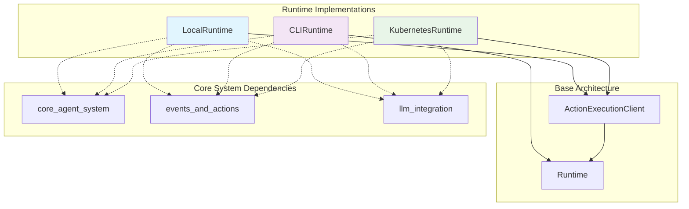
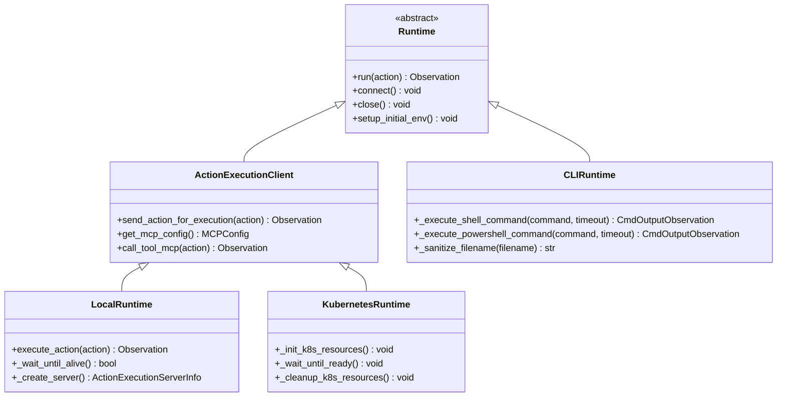
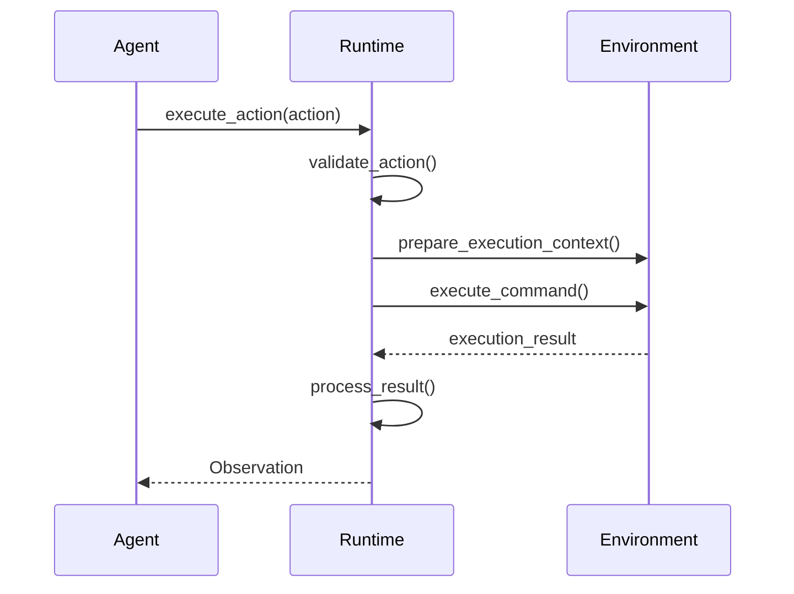

# Runtime Implementations Module

## Overview

The `runtime_implementations` module provides concrete implementations of the OpenHands runtime system, enabling agents to execute actions in different environments. This module contains three primary runtime implementations that extend the base runtime architecture to support various deployment scenarios and execution environments.

## Purpose

Runtime implementations serve as the execution layer between OpenHands agents and the underlying system environment. They provide:

- **Sandboxed Execution**: Safe environments for running agent commands and code
- **Cross-Platform Support**: Different implementations for various deployment needs
- **Resource Management**: Efficient handling of system resources and processes
- **Security Isolation**: Controlled access to system resources and file operations

## Architecture Overview

## Core Components

### LocalRuntime
**File**: `openhands.runtime.impl.local.local_runtime.LocalRuntime`

A development-focused runtime that executes the action execution server directly on the local machine without containerization. Provides direct access to the host system while maintaining some isolation through workspace management.

**Key Features**:
- Direct local execution without Docker overhead
- Warm server management for improved performance
- Cross-platform support (Windows/Unix)
- Temporary workspace creation and management

### CLIRuntime
**File**: `openhands.runtime.impl.cli.cli_runtime.CLIRuntime`

A lightweight runtime implementation that executes commands directly using subprocess and performs file operations using Python's standard library. Designed for environments where containerization is not available or desired.

**Key Features**:
- Direct subprocess execution
- Native file system operations
- Windows PowerShell integration
- No browser functionality (by design)
- Minimal resource overhead

### KubernetesRuntime
**File**: `openhands.runtime.impl.kubernetes.kubernetes_runtime.KubernetesRuntime`

An enterprise-grade runtime implementation that creates and manages pods in a Kubernetes cluster. Provides scalable, isolated execution environments with full resource management and networking capabilities.

**Key Features**:
- Pod-based execution environments
- Persistent volume management
- Ingress and service configuration
- Resource limits and requests
- VSCode server integration

## Implementation Patterns

### Inheritance Hierarchy

### Common Execution Flow

## Sub-Module Documentation

This module contains three distinct runtime implementations, each serving different deployment scenarios:

### [Local Runtime](local_runtime.md)
Development-focused runtime for direct local execution with warm server management and cross-platform support. Features warm server pooling, cross-platform compatibility, and direct host system access with workspace isolation.

### [CLI Runtime](cli_runtime.md)
Lightweight runtime for direct command execution using subprocess, ideal for environments without containerization. Provides minimal overhead execution with native file operations and PowerShell integration on Windows.

### [Kubernetes Runtime](kubernetes_runtime.md)
Enterprise-grade runtime for scalable pod-based execution in Kubernetes clusters with full resource management. Offers pod-based isolation, persistent storage, ingress configuration, and comprehensive resource management.

## Related Runtime Components

The runtime implementations work in conjunction with other components in the runtime system:

### [Runtime System](runtime_system.md)
The parent module that provides the base Runtime class and common runtime infrastructure. Runtime implementations extend this foundation to provide specific execution environments.

### [Builder System](builder_system.md)
Responsible for constructing and configuring runtime instances. The builder system creates appropriate runtime implementations based on configuration and deployment requirements.

### [Plugin System](plugin_system.md)
Provides extensibility through plugins that can be loaded into runtime environments. All runtime implementations support plugin loading for enhanced functionality.

## Integration Points

### With Core Agent System
- Receives actions from [core_agent_system](core_agent_system.md) agents
- Processes action execution requests through the controller layer
- Manages state transitions during action execution

### With Events and Actions
- Implements action execution interfaces from [events_and_actions](events_and_actions.md)
- Converts actions to observations through runtime-specific execution
- Handles event streaming and observation generation

### With LLM Integration
- Utilizes LLM registry from [llm_integration](llm_integration.md) for LLM-based file editing
- Supports MCP (Model Context Protocol) tool execution
- Integrates with LLM-powered development tools

## Configuration and Setup

Each runtime implementation supports different configuration options:

- **LocalRuntime**: Workspace paths, server ports, warm server management
- **CLIRuntime**: Workspace isolation, PowerShell integration settings
- **KubernetesRuntime**: Cluster configuration, resource limits, ingress settings

## Security Considerations

Runtime implementations provide varying levels of security isolation:

- **LocalRuntime**: Limited isolation, runs on host system with workspace restrictions
- **CLIRuntime**: Minimal isolation, direct system access with path sanitization
- **KubernetesRuntime**: Strong isolation through pod boundaries and resource limits

## Performance Characteristics

- **LocalRuntime**: Fast startup with warm server support, moderate resource usage
- **CLIRuntime**: Minimal overhead, fastest for simple operations
- **KubernetesRuntime**: Higher startup cost, excellent scalability and resource management

## Error Handling and Recovery

All runtime implementations provide:
- Graceful error handling with detailed error observations
- Timeout management for long-running operations
- Resource cleanup on failure or shutdown
- Connection recovery mechanisms where applicable