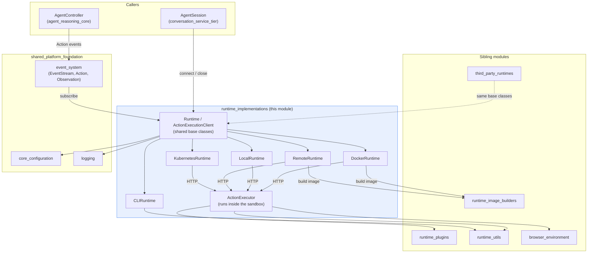
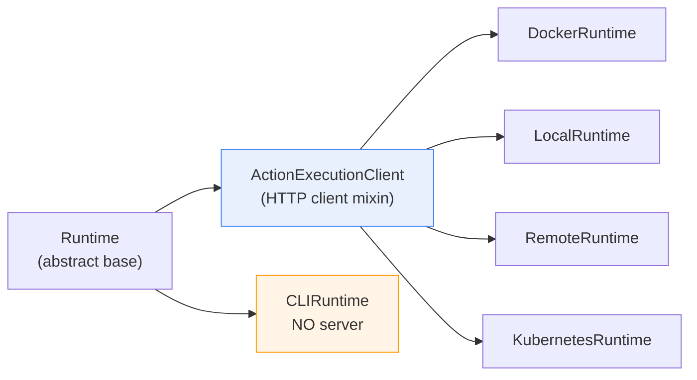
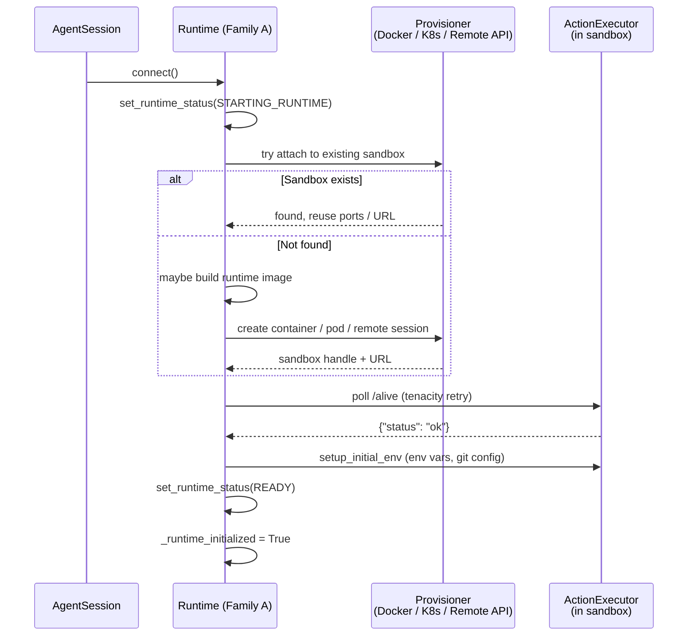
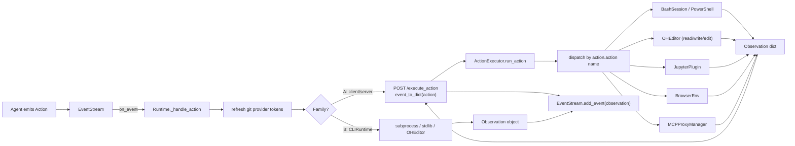
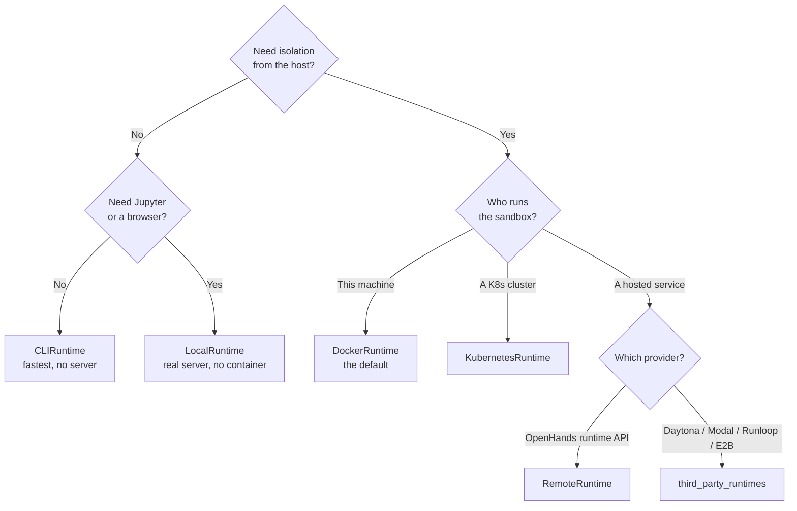
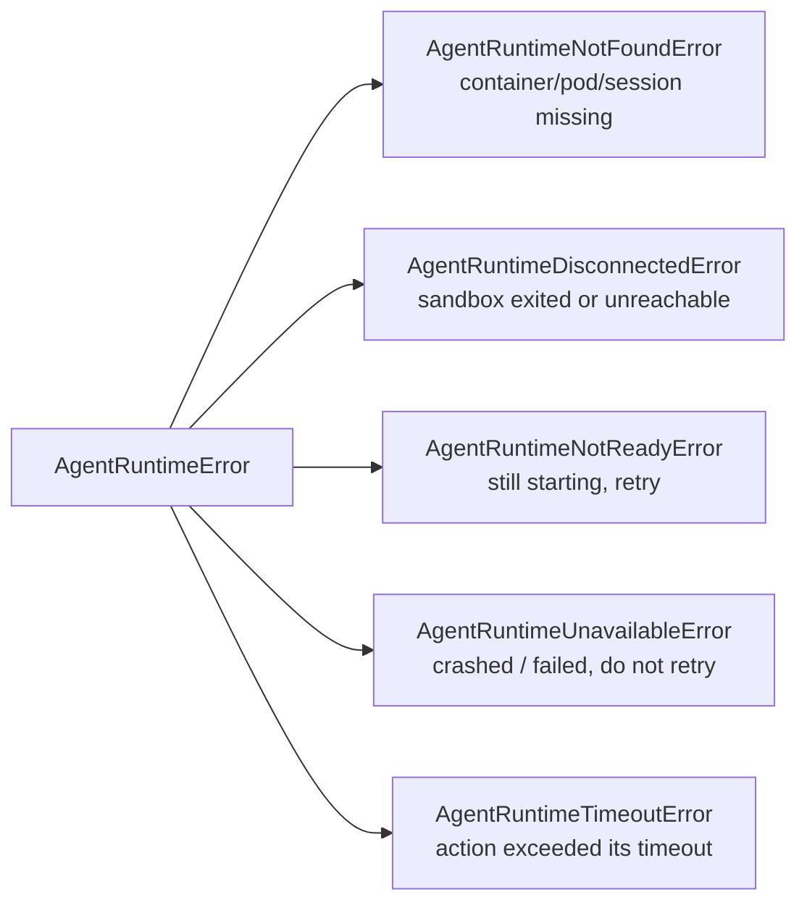

# Runtime Implementations

## 1. Purpose

The `runtime_implementations` module is the part of OpenHands that actually **runs the agent's work**. An agent decides *what* to do (run a command, read a file, edit code, open a browser). This module decides *where* that happens — inside a Docker container, on a remote cluster, in a Kubernetes pod, or straight on the user's own machine.

Every runtime in this module answers the same three questions in its own way:

1. **How do I get a sandbox?** (build an image, start a container, create a pod, call a remote API, or just use the local shell)
2. **How do I reach it?** (an HTTP URL, a local subprocess, or direct Python calls)
3. **How do I tear it down?** (stop containers, delete pods, kill processes, clean temp folders)

The module also contains the **other side of the wire**: the `action_execution_server`, a small FastAPI app that lives *inside* the sandbox, receives actions over HTTP, executes them, and sends observations back.

| Component | File | Role |
|---|---|---|
| `DockerRuntime` | `openhands/runtime/impl/docker/docker_runtime.py` | Local Docker container sandbox |
| `LocalRuntime` | `openhands/runtime/impl/local/local_runtime.py` | Server subprocess on the host, no container |
| `CLIRuntime` | `openhands/runtime/impl/cli/cli_runtime.py` | Direct in-process execution, no server at all |
| `RemoteRuntime` | `openhands/runtime/impl/remote/remote_runtime.py` | Hosted sandbox behind a runtime API |
| `KubernetesRuntime` | `openhands/runtime/impl/kubernetes/kubernetes_runtime.py` | Pod + Service + Ingress + PVC in a K8s cluster |
| `ActionExecutor`, `ActionRequest` | `openhands/runtime/action_execution_server.py` | The in-sandbox HTTP server that executes actions |

---

## 2. Where this module sits

This module is one leaf of the wider [sandboxed execution layer](sandboxed_execution_layer.md). It consumes services from its sibling modules and is driven from above by the agent loop.

```mermaid
graph TB
    subgraph Above["Callers"]
        AC["AgentController<br/>(agent_reasoning_core)"]
        SESS["AgentSession<br/>(conversation_service_tier)"]
    end

    subgraph This["runtime_implementations (this module)"]
        BASE["Runtime / ActionExecutionClient<br/>(shared base classes)"]
        DOCK["DockerRuntime"]
        LOC["LocalRuntime"]
        CLI["CLIRuntime"]
        REM["RemoteRuntime"]
        K8S["KubernetesRuntime"]
        AES["ActionExecutor<br/>(runs inside the sandbox)"]
    end

    subgraph Siblings["Sibling modules"]
        BLD["runtime_image_builders"]
        PLG["runtime_plugins"]
        UTL["runtime_utils"]
        BRW["browser_environment"]
        TP["third_party_runtimes"]
    end

    subgraph Foundation["shared_platform_foundation"]
        EV["event_system<br/>(EventStream, Action, Observation)"]
        CFG["core_configuration"]
        LOG["logging"]
    end

    AC -->|"Action events"| EV
    SESS -->|"connect / close"| BASE
    EV -->|"subscribe"| BASE
    BASE --> DOCK & LOC & CLI & REM & K8S
    DOCK & REM -->|"build image"| BLD
    DOCK & LOC & REM & K8S -->|"HTTP"| AES
    AES --> PLG
    AES --> UTL
    AES --> BRW
    CLI --> UTL
    BASE --> CFG
    BASE --> LOG
    TP -.->|"same base classes"| BASE

    style This fill:#e8f0fe,stroke:#4285f4
```

Key dependencies:

- **[event_system](event_system.md)** — every runtime subscribes to the `EventStream`, turns `Action` events into `Observation` events, and publishes them back.
- **[core_configuration](core_configuration.md)** — `OpenHandsConfig.sandbox`, `KubernetesConfig`, and `CLIConfig` drive nearly every decision (image name, ports, volumes, timeouts, resource limits).
- **[runtime_image_builders](runtime_image_builders.md)** — `DockerRuntime` and `RemoteRuntime` call `build_runtime_image` when only a base image is configured.
- **[runtime_plugins](runtime_plugins.md)** — the plugin list (Jupyter, VSCode, AgentSkills) is passed as CLI flags to the in-sandbox server, which loads them at startup.
- **[runtime_utils](runtime_utils.md)** — `BashSession`, `WindowsPowershellSession`, `PortLock`, `LogStreamer`, `MemoryMonitor`, `GitHandler`, `MCPProxyManager`.
- **[browser_environment](browser_environment.md)** — `BrowserEnv` is created lazily by `ActionExecutor`.
- **[third_party_runtimes](third_party_runtimes.md)** — Daytona, Modal, Runloop, and E2B runtimes follow the same contract and are documented separately.

---

## 3. Architecture: two families of runtime

The single most useful thing to understand about this module is that the five runtimes split into **two families**.

```mermaid
graph LR
    RT["Runtime<br/>(abstract base)"]
    AEC["ActionExecutionClient<br/>(HTTP client mixin)"]

    RT --> AEC
    RT --> CLI["CLIRuntime<br/>NO server"]

    AEC --> DOCK["DockerRuntime"]
    AEC --> LOC["LocalRuntime"]
    AEC --> REM["RemoteRuntime"]
    AEC --> K8S["KubernetesRuntime"]

    style CLI fill:#fff4e5,stroke:#f90
    style AEC fill:#e8f0fe,stroke:#4285f4
```

### Family A — client/server runtimes (`ActionExecutionClient`)

`DockerRuntime`, `LocalRuntime`, `RemoteRuntime`, and `KubernetesRuntime` all do the same thing: they **start a sandbox that runs `action_execution_server.py`**, then POST actions to `/execute_action` over HTTP. `ActionExecutionClient` supplies all of the shared plumbing — the HTTP session, retries, `/alive` health checks, file upload/download, VSCode token fetching, and MCP server sync. Each concrete class only has to implement:

- `connect()` — provision or attach to the sandbox
- `action_execution_server_url` — where to send requests
- `close()` / `delete()` — clean up
- `vscode_url` / `web_hosts` — how to reach exposed ports

### Family B — the direct runtime (`CLIRuntime`)

`CLIRuntime` skips the server entirely. It subclasses `Runtime` directly and implements `run`, `read`, `write`, `edit` with `subprocess` and the Python standard library. There is no container, no HTTP hop, and no browser support. It is the fastest and least isolated option.

---

## 4. The connect lifecycle

All Family A runtimes follow the same shape in `connect()`, even though the provisioning step is completely different in each.

```mermaid
sequenceDiagram
    participant S as AgentSession
    participant R as Runtime (Family A)
    participant P as Provisioner<br/>(Docker / K8s / Remote API)
    participant AES as ActionExecutor<br/>(in sandbox)

    S->>R: connect()
    R->>R: set_runtime_status(STARTING_RUNTIME)
    R->>P: try attach to existing sandbox
    alt Sandbox exists
        P-->>R: found, reuse ports / URL
    else Not found
        R->>R: maybe build runtime image
        R->>P: create container / pod / remote session
        P-->>R: sandbox handle + URL
    end
    R->>AES: poll /alive (tenacity retry)
    AES-->>R: {"status": "ok"}
    R->>AES: setup_initial_env (env vars, git config)
    R->>R: set_runtime_status(READY)
    R->>R: _runtime_initialized = True
```

Two behaviours are shared across the whole family and worth calling out:

- **`attach_to_existing`** — when true, a missing sandbox is a hard error (`AgentRuntimeDisconnectedError`) instead of a trigger to create a new one. This is how a web session reconnects to a conversation that is already running.
- **Retry with early exit** — every wait loop uses `tenacity` combined with `stop_if_should_exit()` from [runtime_utils](runtime_utils.md), so a shutdown signal breaks the loop instead of blocking for the full timeout.

---

## 5. Action / observation data flow

```mermaid
flowchart LR
    A["Agent emits Action"] --> ES["EventStream"]
    ES -->|"on_event"| RT["Runtime._handle_action"]
    RT --> TOK["refresh git provider tokens"]
    TOK --> DEC{"Family?"}

    DEC -->|"A: client/server"| POST["POST /execute_action<br/>event_to_dict(action)"]
    POST --> AEX["ActionExecutor.run_action"]
    AEX --> DISP["dispatch by action.action name"]
    DISP --> BASH["BashSession / PowerShell"]
    DISP --> ED["OHEditor (read/write/edit)"]
    DISP --> JUP["JupyterPlugin"]
    DISP --> BR["BrowserEnv"]
    DISP --> MCP["MCPProxyManager"]
    BASH & ED & JUP & BR & MCP --> OBS1["Observation dict"]
    OBS1 --> POST

    DEC -->|"B: CLIRuntime"| DIRECT["subprocess / stdlib / OHEditor"]
    DIRECT --> OBS2["Observation object"]

    POST --> PUB["EventStream.add_event(observation)"]
    OBS2 --> PUB
```

Notice that both families converge on the same public contract: an `Action` in, an `Observation` back on the event stream. That is what lets the [agent_controller](agent_controller.md) stay completely unaware of which sandbox it is talking to.

---

## 6. Sub-modules

The module is documented in four focused parts. Each page covers the components, configuration knobs, and failure modes of its area.

### 6.1 [Docker Runtime](runtime_implementations_docker.md)

`DockerRuntime` — the default and most-used sandbox. Covers image building via `DockerRuntimeBuilder`, the four port ranges (execution server, VSCode, two app ports), **file-based port locking** with `PortLock` to stop parallel workers from grabbing the same port, bind mounts vs. Docker named volumes vs. **overlay copy-on-write mounts**, GPU device requests, host-network mode, `pause`/`resume`, and process-exit cleanup through a registered shutdown listener.

### 6.2 [Local & CLI Runtimes](runtime_implementations_local_execution.md)

`LocalRuntime` and `CLIRuntime` — the two unsandboxed options, both of which log a loud warning on startup.

- `LocalRuntime` still runs the real action execution server, just as a **host subprocess** instead of in a container. Its distinctive feature is the **warm server pool** (`_WARM_SERVERS`): pre-started servers that make new conversations start almost instantly, tuned by `INITIAL_NUM_WARM_SERVERS` and `DESIRED_NUM_WARM_SERVERS`. It also runs a `check_dependencies` preflight for Jupyter, tmux, and the browser.
- `CLIRuntime` has no server and no browser. Its critical piece is `_sanitize_filename`, which resolves every path with `realpath` and rejects anything that escapes the workspace — the only guard standing between the agent and the user's filesystem.

### 6.3 [Remote & Kubernetes Runtimes](runtime_implementations_orchestrated.md)

`RemoteRuntime` and `KubernetesRuntime` — the two runtimes where something *else* owns the sandbox lifecycle.

- `RemoteRuntime` talks to a runtime API (`/start`, `/resume`, `/pause`, `/stop`, `/sessions/{sid}`), handles session-scoped API keys, maps pod status (`pending`, `ready`, `crashloopbackoff`, …) onto OpenHands errors, and transparently resumes a paused sandbox when a request returns `503`.
- `KubernetesRuntime` builds the full manifest set with the Python K8s client: Pod (with readiness probe, resource limits, node selector, tolerations), two ClusterIP Services (execution server + VSCode), an Ingress with optional TLS for the VSCode URL, and a PVC for a persistent workspace. Its cleanup logic distinguishes closing a tab (keep the PVC) from deleting a conversation (remove the PVC).

### 6.4 [Action Execution Server](runtime_implementations_action_execution_server.md)

`ActionExecutor` and `ActionRequest` — the code that runs *inside* the sandbox. Covers the FastAPI lifespan that boots the executor and mounts the MCP proxy, `X-Session-API-Key` authentication, async bash-then-plugins initialisation with a background browser task, the `run_action` dispatch table, the file editor wrapper, download interception in `browse_interactive`, and the operational endpoints (`/alive`, `/server_info`, `/upload_file`, `/download_files`, `/list_files`, `/vscode/connection_token`, `/update_mcp_server`).

---

## 7. Choosing a runtime

```mermaid
flowchart TD
    Q1{"Need isolation<br/>from the host?"}
    Q1 -->|No| Q2{"Need Jupyter<br/>or a browser?"}
    Q2 -->|No| CLI["CLIRuntime<br/>fastest, no server"]
    Q2 -->|Yes| LOC["LocalRuntime<br/>real server, no container"]
    Q1 -->|Yes| Q3{"Who runs<br/>the sandbox?"}
    Q3 -->|"This machine"| DOCK["DockerRuntime<br/>the default"]
    Q3 -->|"A K8s cluster"| K8S["KubernetesRuntime"]
    Q3 -->|"A hosted service"| Q4{"Which provider?"}
    Q4 -->|"OpenHands runtime API"| REM["RemoteRuntime"]
    Q4 -->|"Daytona / Modal / Runloop / E2B"| TP["third_party_runtimes"]
```

| Runtime | Isolation | Browser | Jupyter | Startup cost | Typical use |
|---|---|---|---|---|---|
| `CLIRuntime` | none | ✗ | ✗ | ~none | Terminal CLI, trusted local work |
| `LocalRuntime` | none | ✓ | ✓ | low (warm pool) | Development, evaluation harnesses |
| `DockerRuntime` | container | ✓ | ✓ | medium (image build) | Default desktop / self-host |
| `RemoteRuntime` | remote container | ✓ | ✓ | network-bound | SaaS, see [hosted_saas_overlay](hosted_saas_overlay.md) |
| `KubernetesRuntime` | pod | ✓ | ✓ | pod scheduling | Cluster deployments |

---

## 8. Cross-cutting concerns

### Runtime status reporting

Every runtime reports progress through `set_runtime_status(RuntimeStatus, msg)`, which forwards to the `status_callback` supplied by the caller. The status values (`BUILDING_RUNTIME`, `STARTING_RUNTIME`, `RUNTIME_STARTED`, `READY`, `ERROR_RUNTIME_DISCONNECTED`, …) are what the [frontend](frontend_state.md) renders as the connection banner.

### Error taxonomy

```mermaid
graph LR
    E["AgentRuntimeError"]
    E --> ND["AgentRuntimeNotFoundError<br/>container/pod/session missing"]
    E --> DC["AgentRuntimeDisconnectedError<br/>sandbox exited or unreachable"]
    E --> NR["AgentRuntimeNotReadyError<br/>still starting, retry"]
    E --> UN["AgentRuntimeUnavailableError<br/>crashed / failed, do not retry"]
    E --> TO["AgentRuntimeTimeoutError<br/>action exceeded its timeout"]
```

The distinction between `NotReady` (retryable) and `Unavailable` (terminal) is what drives the retry loops in `RemoteRuntime._wait_until_alive` and `KubernetesRuntime._wait_until_ready`.

### Windows handling

Windows support is threaded through several places: narrower port ranges in `DockerRuntime`, `WindowsPowershellSession` instead of `BashSession` in both `CLIRuntime` and `ActionExecutor`, and MCP plus browser features disabled outright. Where full functionality is needed on Windows, WSL or `DockerRuntime` is the documented path.

### Ports and URLs

Each runtime exposes the same two properties so that callers never need provider-specific knowledge:

- `vscode_url` — a tokenised VSCode URL (the token comes from `/vscode/connection_token` inside the sandbox)
- `web_hosts` — a map of externally reachable URL → port, used when the agent serves an app for the user to preview

How those are computed differs a lot: `DockerRuntime` uses `localhost:<port>`, `LocalRuntime` and `RemoteRuntime` build subdomain-style or path-style URLs depending on the deployment, and `KubernetesRuntime` uses an Ingress hostname derived from the session ID.

---

## 9. Related documentation

- Parent: [sandboxed_execution_layer](sandboxed_execution_layer.md)
- Siblings: [third_party_runtimes](third_party_runtimes.md) · [runtime_image_builders](runtime_image_builders.md) · [runtime_plugins](runtime_plugins.md) · [runtime_utils](runtime_utils.md) · [browser_environment](browser_environment.md)
- Consumers: [agent_controller](agent_controller.md) · [server_sessions](server_sessions.md)
- Foundations: [event_system](event_system.md) · [core_configuration](core_configuration.md) · [core_schema_and_runtime_support](core_schema_and_runtime_support.md) · [logging](logging.md)

### Sub-module pages

| Page | Covers | Source files |
|---|---|---|
| [runtime_implementations_docker.md](runtime_implementations_docker.md) | `DockerRuntime` | `openhands/runtime/impl/docker/docker_runtime.py` |
| [runtime_implementations_local_execution.md](runtime_implementations_local_execution.md) | `LocalRuntime`, `CLIRuntime` | `openhands/runtime/impl/local/local_runtime.py`, `openhands/runtime/impl/cli/cli_runtime.py` |
| [runtime_implementations_orchestrated.md](runtime_implementations_orchestrated.md) | `RemoteRuntime`, `KubernetesRuntime` | `openhands/runtime/impl/remote/remote_runtime.py`, `openhands/runtime/impl/kubernetes/kubernetes_runtime.py` |
| [runtime_implementations_action_execution_server.md](runtime_implementations_action_execution_server.md) | `ActionExecutor`, `ActionRequest` | `openhands/runtime/action_execution_server.py` |
