# Action Execution Server

## Introduction

The Action Execution Server is the piece of OpenHands that lives **inside** the sandbox. Everything else in OpenHands — the agent, the LLM calls, the web server — runs outside. This server is the only thing that actually touches the sandbox filesystem, runs shell commands, opens the browser, and executes Jupyter code.

It is a small FastAPI application (`openhands/runtime/action_execution_server.py`) started as a normal Python process inside a Docker container, a Kubernetes pod, a remote VM, or a local process. Runtime implementations on the host side (see [runtime_implementations_docker](runtime_implementations_docker.md), [runtime_implementations_local_execution_local_runtime](runtime_implementations_local_execution_local_runtime.md), [runtime_implementations_orchestrated_remote_runtime](runtime_implementations_orchestrated_remote_runtime.md), [runtime_implementations_orchestrated_kubernetes_runtime](runtime_implementations_orchestrated_kubernetes_runtime.md)) do not execute anything themselves. They start this server, then send it HTTP requests.

The module has two core components:

| Component | Role |
| --- | --- |
| `ActionRequest` | A tiny Pydantic model: `{"action": {...}}`. The wire format for one action. |
| `ActionExecutor` | The engine. Holds the shell session, the file editor, the browser, and the loaded plugins; turns an `Action` into an `Observation`. |

Everything else in the file is the FastAPI app that wraps `ActionExecutor` in HTTP endpoints.

---

## Where it sits in the system

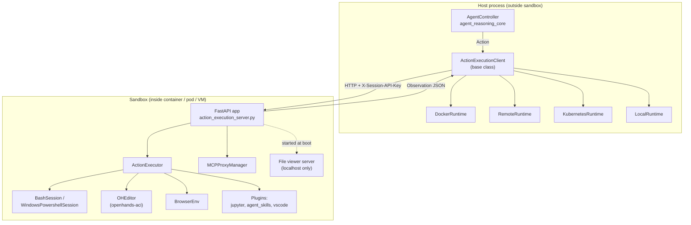

The boundary is important: the host side never has a shell in the sandbox. Every filesystem read, every command, every click goes over HTTP through this server. That is what makes all the different sandbox backends interchangeable.

Related documentation:
- [runtime_implementations](runtime_implementations.md) — the host-side runtimes that own the lifecycle of this server
- [runtime_utils](runtime_utils.md) — `BashSession`, `WindowsPowershellSession`, `MemoryMonitor`, `MCPProxyManager`
- [runtime_plugins](runtime_plugins.md) — `JupyterPlugin`, `AgentSkillsPlugin`, `VSCodePlugin`
- [browser_environment](browser_environment.md) — `BrowserEnv`
- [event_system](event_system.md) — the `Action` / `Observation` types serialized over the wire
- [core_schema_and_runtime_support](core_schema_and_runtime_support.md) — `ActionType`, `ObservationType`

---

## Component structure

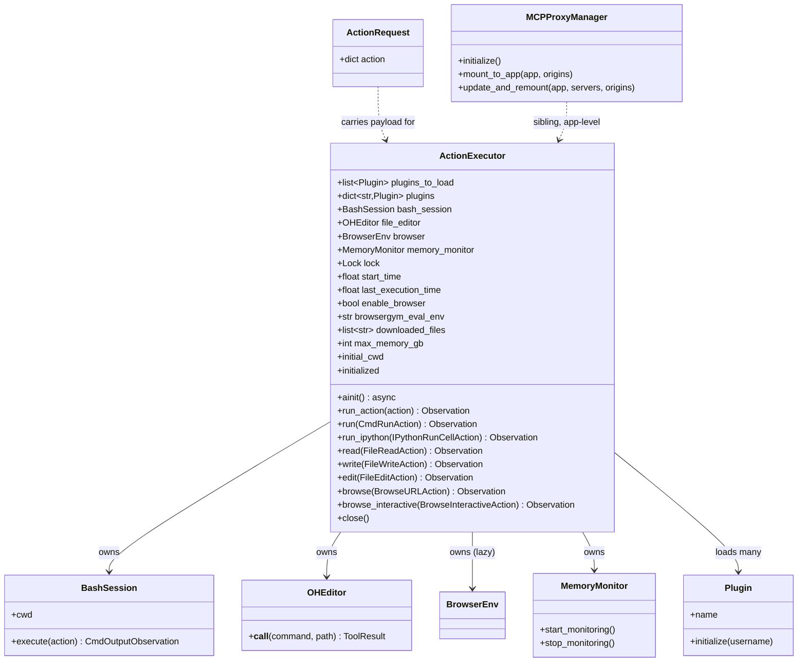

Note that `MCPProxyManager` is **not** owned by `ActionExecutor`. It is a module-level global mounted onto the same FastAPI app, so MCP tool traffic bypasses the action pipeline entirely.

---

## Startup sequence

The server is started from the command line by the host runtime, roughly:

```sh
python -m openhands.runtime.action_execution_server 8000 \
    --working-dir /workspace \
    --plugins agent_skills jupyter vscode \
    --username openhands --user-id 1000 \
    --enable-browser
```

Startup happens in two stages: argument parsing / file viewer at import time, and `ActionExecutor` construction inside the FastAPI `lifespan` context.

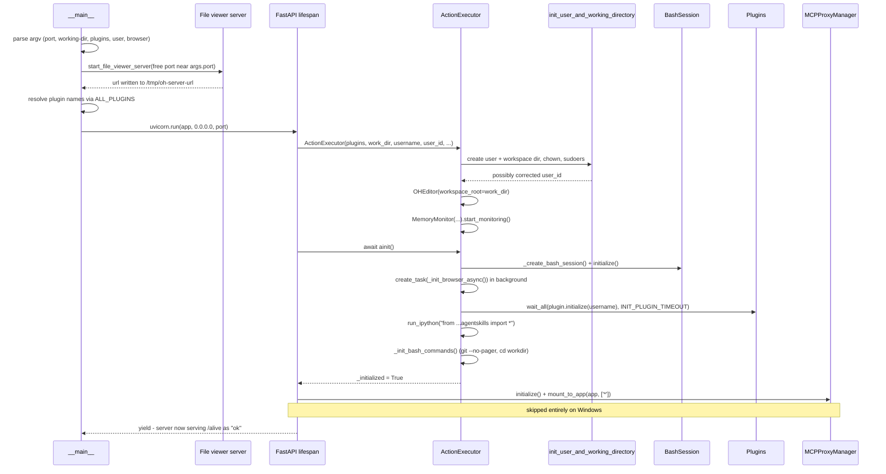

Key details:

- **Browser starts in the background.** `ainit()` fires `_init_browser_async()` as a task and does *not* await it. This keeps startup fast; the first browse action pays the wait via `_ensure_browser_ready()`.
- **Plugins initialize concurrently** with a timeout (`INIT_PLUGIN_TIMEOUT`, default 120s). `VSCodePlugin` additionally receives `RUNTIME_ID` so a gateway can route by path.
- **AgentSkills bootstrap** is a documented workaround: if both `agent_skills` and `jupyter` are loaded, the server runs a star-import so the skills are available in the notebook kernel.
- **`_init_bash_commands` asserts exit code 0.** If the git alias or `cd` fails, startup fails loudly rather than serving a half-broken sandbox.
- **`/alive` reports `not initialized`** until `_initialized` flips true, which is how host runtimes poll for readiness.

### Environment variables read at startup

| Variable | Effect |
| --- | --- |
| `SESSION_API_KEY` | If set, every request except `/alive` and `/server_info` must send a matching `X-Session-API-Key`. Also enables MCP proxy auth. |
| `RUNTIME_MAX_MEMORY_GB` | Caps memory for the shell session (converted to MB). Unset = use all system memory. |
| `RUNTIME_MEMORY_MONITOR` | `true`/`1`/`yes` enables `MemoryMonitor`. |
| `NO_CHANGE_TIMEOUT_SECONDS` | Idle timeout for the shell session (default 10). |
| `INIT_PLUGIN_TIMEOUT` | Plugin initialization budget in seconds (default 120). |
| `RUNTIME_ID` | Passed to `VSCodePlugin` for path-based routing. |

---

## HTTP surface

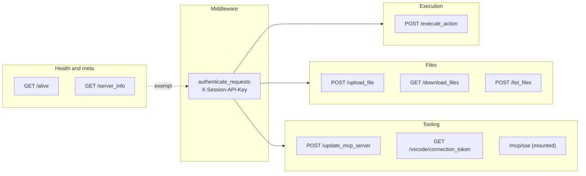

| Endpoint | Method | Purpose | Host-side caller |
| --- | --- | --- | --- |
| `/execute_action` | POST | The main path. Deserialize an action, execute it, return an observation. | `send_action_for_execution()` |
| `/alive` | GET | Readiness probe. Returns `not initialized` until `ainit()` finishes. | `check_if_alive()` |
| `/server_info` | GET | Uptime, idle time, CPU/memory/disk/IO stats. Used to reap idle sandboxes. | remote/K8s orchestration |
| `/upload_file` | POST | Copy a file (or zip, auto-extracted) into the sandbox. | `copy_to()` |
| `/download_files` | GET | Zip a path and stream it back. | `copy_from()` |
| `/list_files` | POST | Directory listing, directories first with trailing `/`. | `list_files()` |
| `/update_mcp_server` | POST | Replace the set of MCP stdio servers and remount the proxy. | `get_mcp_config()` |
| `/vscode/connection_token` | GET | Token for the in-sandbox VSCode server. | `get_vscode_token()` |
| `/mcp/sse` | mounted | MCP proxy transport, mounted by `MCPProxyManager`. | MCP clients |

### Authentication

A single HTTP middleware guards the app. `/alive` and `/server_info` are exempt so that orchestrators can probe a sandbox without holding the session key. Everything else must present `X-Session-API-Key` matching `SESSION_API_KEY`; a mismatch returns 403 as JSON. When `SESSION_API_KEY` is unset (typical for local development) the check is a no-op.

### Error handling

Three app-level exception handlers normalize failures into JSON so the host client never has to parse an HTML traceback:

| Handler | Status | Body |
| --- | --- | --- |
| `Exception` | 500 | generic message, full traceback logged |
| `StarletteHTTPException` | passthrough | `{"detail": ...}` |
| `RequestValidationError` | 422 | `{"detail": "Invalid request parameters", "errors": ...}` |

`/execute_action` is stricter: it wraps failures in a 500 whose `detail` is the **formatted traceback**, so the host can surface a real diagnosis to the agent.

---

## Action execution flow

This is the hot path — one agent step becomes one round trip.

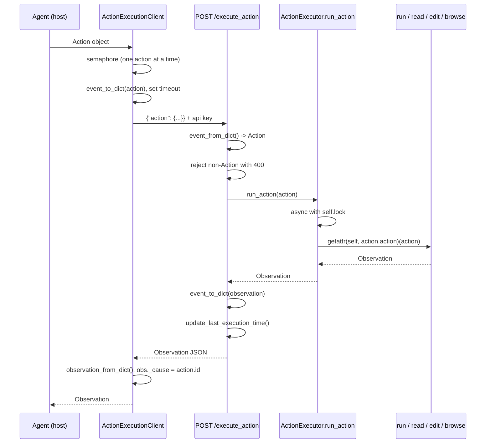

The dispatch is deliberately reflective:

```python
async def run_action(self, action) -> Observation:
    async with self.lock:
        action_type = action.action
        observation = await getattr(self, action_type)(action)
        return observation
```

`action.action` is the `ActionType` string (`run`, `run_ipython`, `read`, `write`, `edit`, `browse`, `browse_interactive`), and it must match a coroutine method name on `ActionExecutor`. Adding a new action type therefore means adding a method with exactly that name — no registry to update. The host client mirrors this with `hasattr(self, action_type)` so an unsupported action fails fast with `AGENT_ERROR$BAD_ACTION` rather than reaching the sandbox.

### Double serialization

Two independent locks guard concurrency:

1. `ActionExecutionClient.action_semaphore` (host side, `Semaphore(1)`)
2. `ActionExecutor.lock` (sandbox side, `asyncio.Lock`)

The sandbox-side lock matters because the shell session and Jupyter kernel are stateful single-threaded resources — two commands interleaving in one tmux pane would corrupt both. The host-side semaphore is a defensive duplicate for callers that bypass the agent loop.

---

## Action handlers in detail

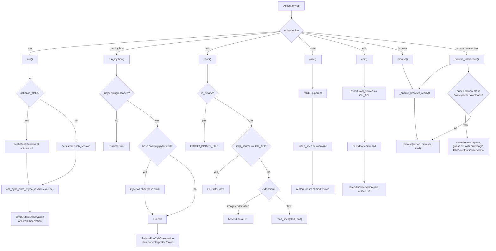

### `run` — shell commands

Delegates to `BashSession.execute` (or `WindowsPowershellSession` on Windows) via `call_sync_from_async`, so the blocking tmux interaction does not stall the event loop. Two modes:

- **Persistent** (default): the long-lived session, preserving `cd`, exported variables, and virtualenv activation across the whole conversation.
- **Static** (`action.is_static`): a throwaway session rooted at `action.cwd`. Used when a command must not disturb agent state.

Any exception becomes an `ErrorObservation` rather than a 500 — a failing command is normal agent feedback, not a server fault.

### `run_ipython` — notebook cells

The subtle part is **working-directory synchronization**. Bash and the Jupyter kernel are separate processes with separate `cwd`s. Before every cell, the handler compares `bash_session.cwd` against a cached `_jupyter_cwd`; on drift it injects an `os.chdir(...)` cell first. Without this, an agent that runs `cd subdir` in bash and then a relative-path cell in Jupyter would silently operate in the wrong directory. Windows paths get their backslashes normalized to forward slashes before interpolation.

With `include_extra`, the observation is annotated with the Jupyter cwd and interpreter path so the agent can see the environment it just ran in.

### `read` — reading files

Two distinct paths depending on `impl_source` (see [event_system](event_system.md) for `FileReadSource`):

- `OH_ACI` → the `OHEditor` `view` command, which returns line-numbered content and honors `view_range`.
- default → direct filesystem read.

Binary files are rejected up front via `binaryornot`. Media files are special-cased into base64 **data URIs** (images, PDF, `.mp4/.webm/.ogg`) with MIME type guessed by `mimetypes` and a sensible fallback — this is what lets multimodal agents and the frontend render sandbox files inline. Text files go through `read_lines()` for windowed reads. `FileNotFoundError`, `UnicodeDecodeError`, and `IsADirectoryError` each map to a distinct, actionable `ErrorObservation` (the not-found message even includes the current working directory).

There is no path-permission check here, and that is intentional: the comment in the code notes the client is already inside the sandbox, so the sandbox boundary *is* the permission model.

### `write` — writing files

Creates missing parent directories, then either overwrites or splices new lines into the existing file with `insert_lines()`. The interesting work is afterwards: **permission preservation**. If the file existed, its original mode/uid/gid are restored via `os.chmod`/`os.chown`; if it is new, it gets `0o664` owned by the sandbox user. This prevents a root-run server from leaving files the sandbox user cannot edit. A `PermissionError` here still reports success-with-warning ("written, but failed to change ownership"), because the content did land.

### `edit` — structured edits

Asserts `impl_source == FileEditSource.OH_ACI` — LLM-based editing is handled entirely on the host side by `ActionExecutionClient.llm_based_edit()` and never reaches this server. Delegates to `OHEditor` and then computes a unified diff from the old/new content that the editor returns, so the observation carries a reviewable diff rather than just a success flag.

`_execute_file_editor` is the shared wrapper for both `read` and `edit`. It coerces a string `insert_line` to `int` (LLMs frequently emit `"5"` instead of `5`), converts `ToolError` into an error string, and catches `TypeError` from bad argument shapes. Every failure comes back as `ERROR:\n...` text — an editor mistake is agent feedback, never a crashed request.

### `browse` / `browse_interactive`

Both check that a browser exists, then call `_ensure_browser_ready()`, then hand off to `browse()` from [browser_environment](browser_environment.md).

`_ensure_browser_ready()` implements a small lazy-init state machine:

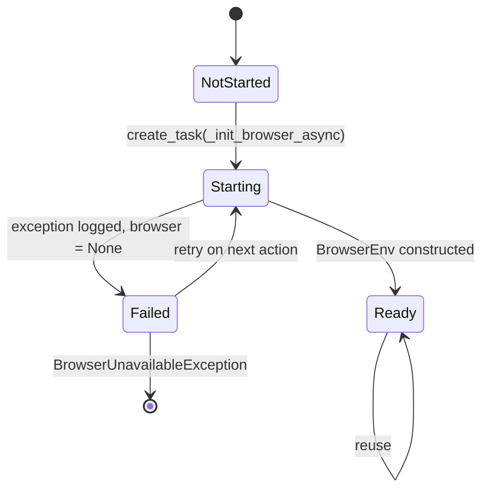

If the init task finished but `browser` is still `None`, initialization is retried on the next action; only after a retry also fails does the caller see `BrowserUnavailableException`. Browsing is disabled outright on Windows, and constructing `ActionExecutor` with `browsergym_eval_env` set while `enable_browser` is false raises immediately — a misconfiguration caught at boot instead of mid-evaluation.

`browse_interactive` additionally implements **download interception**. Browser downloads land in `/workspace/.downloads`, which the agent cannot conveniently reach, and the browser action itself reports an error. So on error the handler diffs the downloads directory against `downloaded_files`; if a new file appeared it is copied to `/workspace/file_N<ext>` — extension guessed with `puremagic` — and returned as a `FileDownloadObservation`. The code notes it assumes a single file per action.

---

## File transfer and workspace inspection

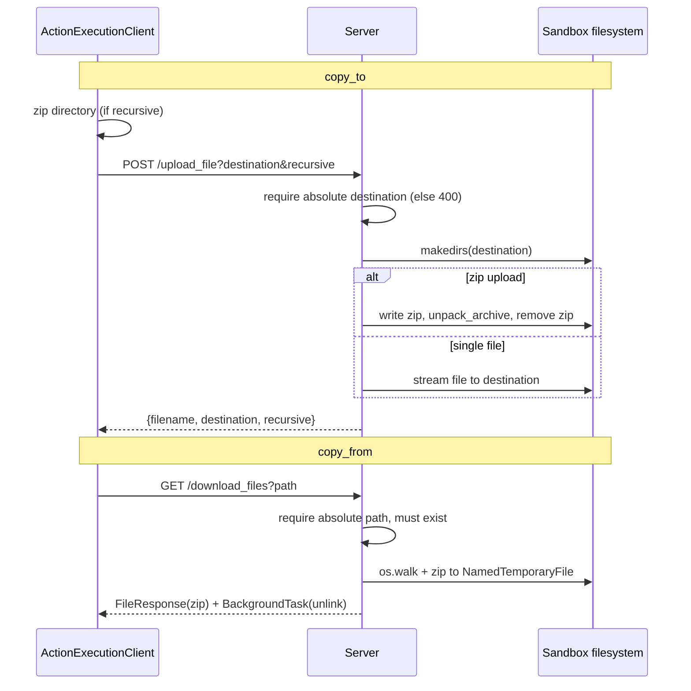

Both transfer endpoints insist on absolute paths. `/download_files` builds the archive with relative arcnames so extraction does not recreate the sandbox's directory prefix, and registers a Starlette `BackgroundTask` to delete the temp zip after the response is flushed.

`/list_files` is shaped for the frontend rather than for agents: it returns directories first (each with a trailing `/` so the UI can distinguish them) then files, each group sorted case-insensitively. A missing path returns an empty list instead of a 500 — a folder the user just deleted should not error the file explorer. Relative paths resolve against `initial_cwd`.

---

## MCP proxy integration

The server doubles as an MCP endpoint so the agent can reach stdio MCP tools that live inside the sandbox.

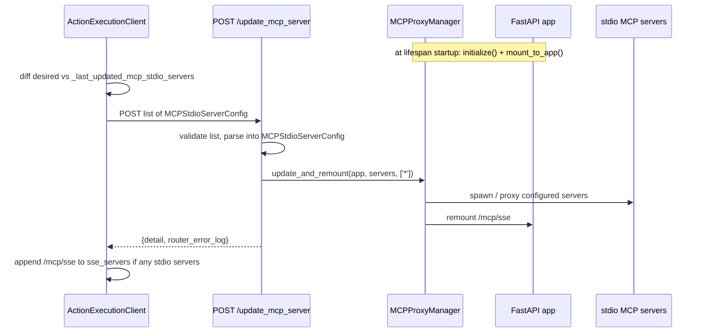

Design points:

- The endpoint **always returns 200**, even when remounting throws. The failure travels back in `router_error_log`, which the host logs as a warning. Rationale: a broken third-party MCP server should degrade tool availability, not kill the sandbox connection.
- Proxy auth mirrors the server: `auth_enabled=bool(SESSION_API_KEY)` with the same key.
- **Windows is a no-op path.** MCP is unsupported there, so the manager is never created and the endpoint returns a friendly 200 explaining it was skipped. The host client short-circuits on Windows too and returns an empty `MCPConfig`.
- The host only issues an update when the desired server set actually contains something new, and sends the *union* of new and previously-known servers so nothing is silently dropped.

See [runtime_utils](runtime_utils.md) for `MCPProxyManager` internals.

---

## Health, resources, and idleness

`/server_info` returns three numbers that matter to whoever owns the sandbox:

| Field | Meaning |
| --- | --- |
| `uptime` | seconds since `ActionExecutor` was constructed |
| `idle_time` | seconds since the last `/execute_action` |
| `resources` | CPU %, memory (rss/vms/%), disk, and IO byte counters |

`idle_time` is the input to sandbox reaping — orchestrated runtimes use it to shut down conversations nobody is driving. It is updated from two places on every action: `client.last_execution_time` (used by this endpoint) and the module-level `update_last_execution_time()` in `system_stats`, which runs in a `finally` block so a failed action still counts as activity.

`MemoryMonitor` (opt-in via `RUNTIME_MEMORY_MONITOR`) runs a background thread logging memory pressure — useful for diagnosing OOM-killed sandboxes, since the container dies before it can report anything itself. `RUNTIME_MAX_MEMORY_GB` is passed down to the shell session as an actual cap.

---

## The auxiliary file viewer server

Started **before** the main app, in a daemon thread on a port scanned from `args.port + 1` upward:

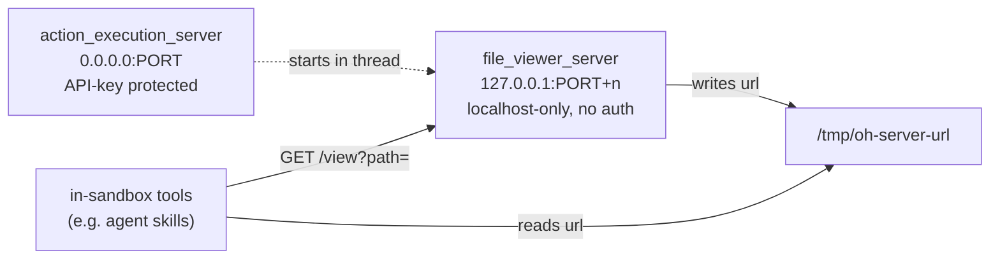

It exposes exactly one useful route, `GET /view?path=...`, which renders an HTML viewer for a file. It has **no authentication**, so it compensates by rejecting any client whose host is not `127.0.0.1`/`localhost`/`::1`, and by requiring an absolute path that exists and is not a directory. Its URL is published to `/tmp/oh-server-url` so other in-sandbox code can find it without knowing the port. Keeping it in a separate localhost-bound server means the unauthenticated HTML rendering path can never be reached from outside the sandbox.

---

## Shutdown

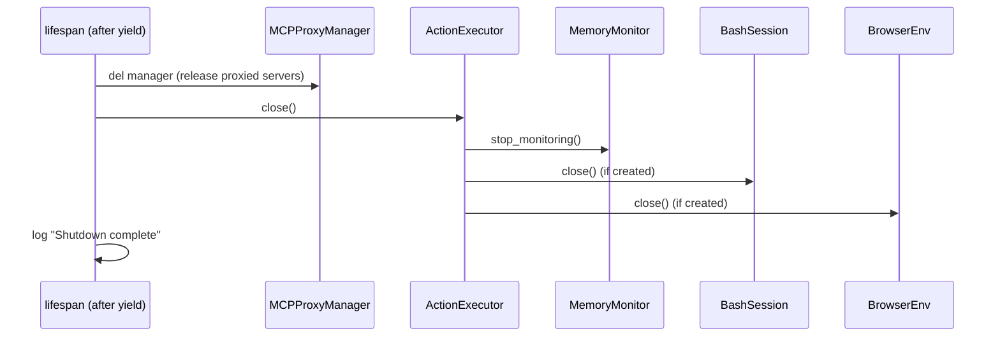

Every step is null-guarded and the `ActionExecutor.close()` call is wrapped in try/except, because shutdown frequently runs after something has already gone wrong. The file viewer thread is a daemon and simply dies with the process.

---

## Platform differences

| Concern | Linux / macOS | Windows |
| --- | --- | --- |
| Shell | `BashSession` (tmux) + explicit `initialize()` | `WindowsPowershellSession`, no separate initialize |
| No-pager git | `alias git="git --no-pager"` | `function git { git.exe --no-pager $args }` |
| Browser | `BrowserEnv` | disabled, warning logged |
| MCP proxy | initialized and mounted | skipped; endpoint returns 200 no-op |
| User setup | useradd + sudoers + chown | just `makedirs(initial_cwd)` |
| Path handling | as-is | backslashes rewritten to `/` before Python interpolation |

The Windows import of `WindowsPowershellSession` is guarded by `sys.platform == 'win32'` at module level so the POSIX-only dependencies are never loaded elsewhere.

---

## Design notes and gotchas

- **Reflective dispatch couples names to schema.** `getattr(self, action.action)` means the method names on `ActionExecutor` are effectively part of the public protocol; renaming `read` would silently break every read action. `ActionType` in [core_schema_and_runtime_support](core_schema_and_runtime_support.md) is the source of truth.
- **Errors are split into two classes.** Expected agent-facing failures (file not found, command failed, editor rejected an edit) become `ErrorObservation` with status 200. Genuine server faults become HTTP 500 with a traceback. Confusing the two either hides real bugs or breaks the agent loop.
- **Statefulness is the constraint.** The persistent shell session, the Jupyter kernel, and the browser are all stateful singletons. That is why there is one global `ActionExecutor`, one lock, and one action at a time — this server is deliberately not horizontally scalable, because a sandbox is a single machine with a single conversation.
- **Init asserts are load-bearing.** `_init_bash_commands` asserts each command exits 0, so a broken image fails at startup rather than producing confusing observations hours later.
- **Global mutable state.** `client` and `mcp_proxy_manager` are module-level globals assigned in `lifespan`. Endpoints `assert client is not None`, which is safe only because uvicorn does not serve before lifespan startup completes.
- **`downloaded_files` grows forever** and file naming uses `file_{len(downloaded_files)}`, so download names are sequential per session and never reused.
