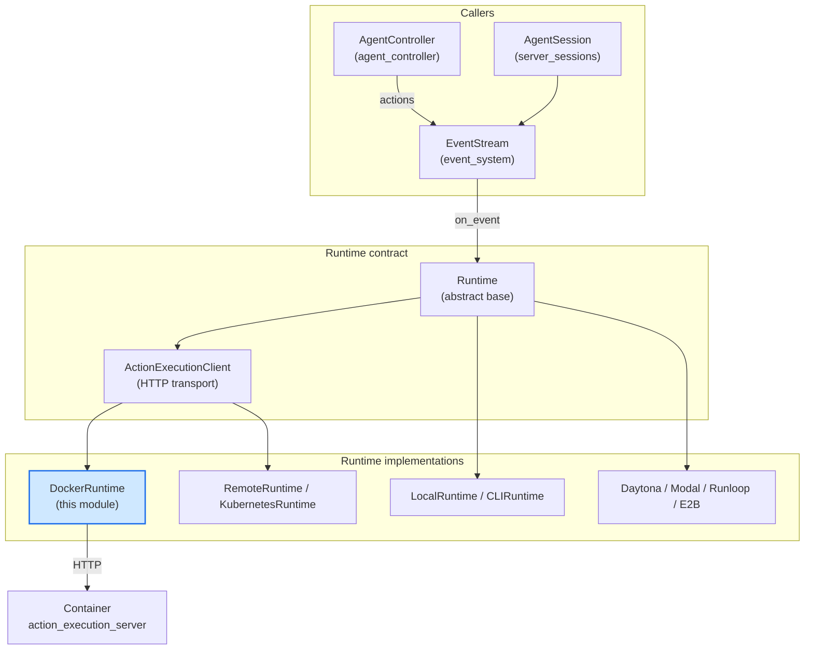
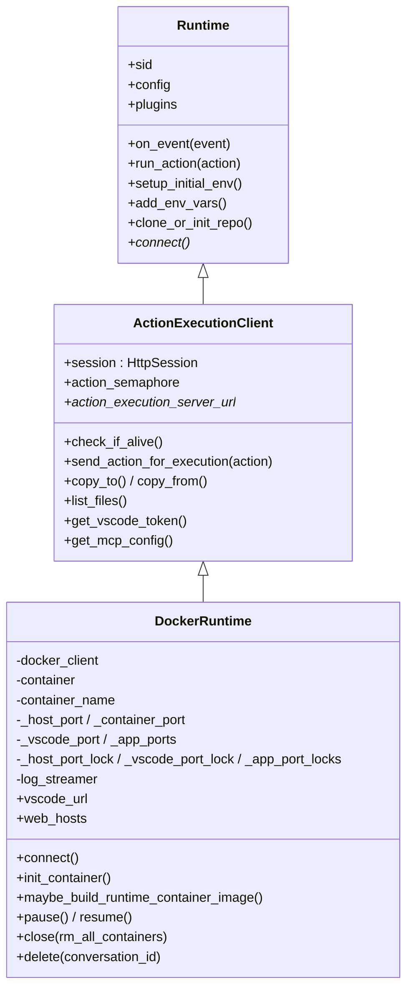
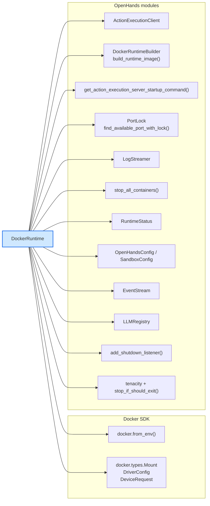
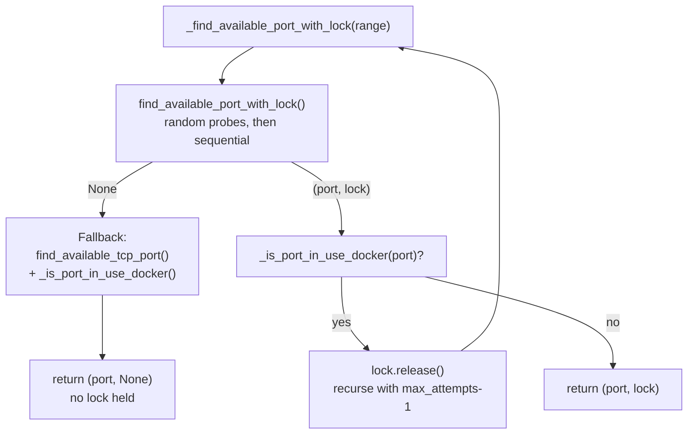
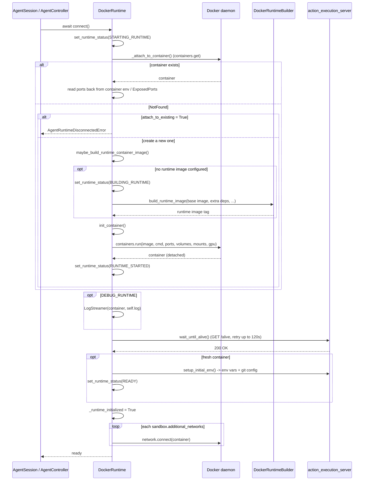
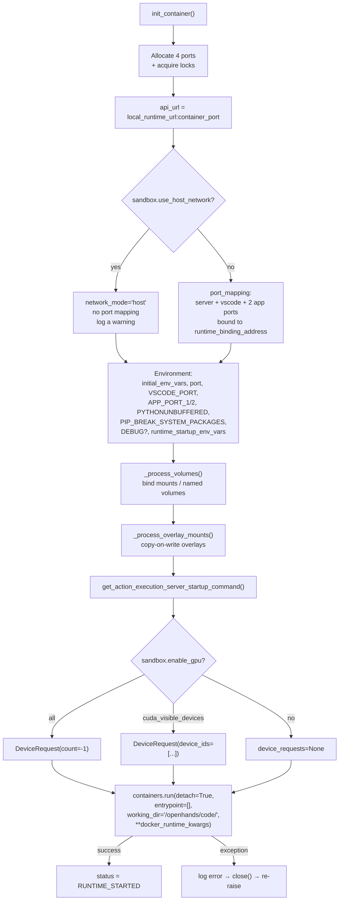
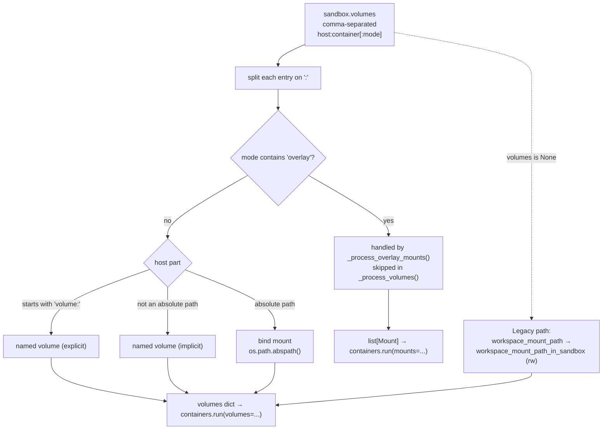
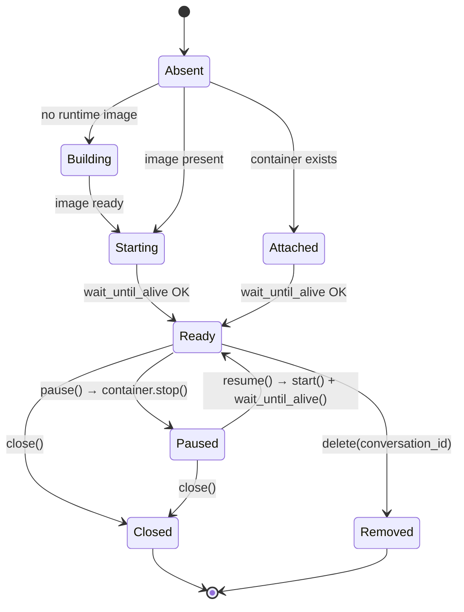
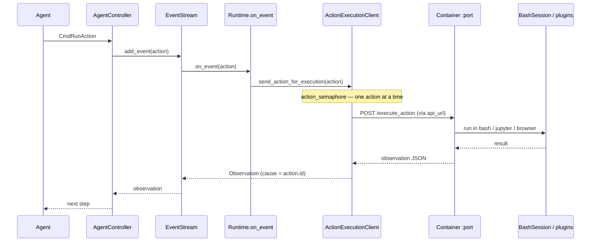

# runtime_implementations_docker

## Introduction

`DockerRuntime` is the default sandbox for OpenHands. It runs the agent's shell, file, Jupyter, browser and MCP work inside a **local Docker container**, so nothing the agent does touches the host machine directly.

The module is small on purpose: one class, one file. All the "what does an action mean" logic lives in the shared parent classes, and all the "how do I talk to the sandbox" logic lives in the HTTP client parent. `DockerRuntime` only answers one question:

> How do I get a container up, reachable, and cleaned up again — on a laptop, on Windows/WSL2, or on a CI box?

So its real job is **container lifecycle plus host resource plumbing**: ports, volumes, networks, GPUs, logs, and teardown.

**Core component**

| Component | File |
| --- | --- |
| `DockerRuntime` | `openhands/runtime/impl/docker/docker_runtime.py` |

Registered under the runtime names `docker` and `eventstream` (legacy alias) in `openhands/runtime/__init__.py`.

---

## Where this module sits

`DockerRuntime` is one of several sibling runtimes. They all implement the same abstract contract, so the rest of OpenHands never needs to know which one is active.



Related documentation:

- [runtime_implementations](runtime_implementations.md) — the family of runtime backends and how one is chosen
- [runtime_implementations_action_execution_server](runtime_implementations_action_execution_server.md) — the server that runs *inside* the container
- [runtime_implementations_local_execution](runtime_implementations_local_execution.md) — no-container alternatives
- [runtime_implementations_orchestrated](runtime_implementations_orchestrated.md) — remote / Kubernetes siblings
- [runtime_image_builders](runtime_image_builders.md) — how the runtime image is built
- [runtime_plugins](runtime_plugins.md) — Jupyter, VSCode, AgentSkills
- [runtime_utils](runtime_utils.md) — `PortLock`, `LogStreamer`, bash session, MCP proxy
- [sandboxed_execution_layer](sandboxed_execution_layer.md) — parent module overview
- [core_configuration](core_configuration.md) — `SandboxConfig` and friends
- [event_system](event_system.md) — the event stream the runtime subscribes to

---

## Class position and inheritance

`DockerRuntime` sits at the bottom of a three-layer stack. Each layer adds one concern.



| Layer | Concern | Owner |
| --- | --- | --- |
| `Runtime` | Event subscription, action dispatch, env setup, git/repo/microagent bootstrap | [runtime_implementations](runtime_implementations.md) |
| `ActionExecutionClient` | HTTP transport to the action execution server, retries, file transfer, MCP config | [runtime_implementations_action_execution_server](runtime_implementations_action_execution_server.md) |
| `DockerRuntime` | Container create/attach/pause/remove, ports, volumes, networks, GPU, log streaming | this module |

Because the parent handles transport, `DockerRuntime` only has to supply one thing for actions to work:

```python
@property
def action_execution_server_url(self) -> str:
    return self.api_url          # http://localhost:<container_port>
```

---

## Dependency map



| Dependency | Why it is used |
| --- | --- |
| `docker.DockerClient` | Create, get, start, stop and remove containers; list networks |
| `DockerRuntimeBuilder` + `build_runtime_image` | Build a runtime image from a base image when no prebuilt image is configured |
| `get_action_execution_server_startup_command` | Build the `python -m ...` argv that becomes the container command |
| `PortLock` / `find_available_port_with_lock` | Stop two workers on the same host from grabbing the same port |
| `LogStreamer` | Stream container stdout into the OpenHands logger when debugging |
| `stop_all_containers` | Bulk teardown by container-name prefix, also on process shutdown |
| `RuntimeStatus` | Report `BUILDING_RUNTIME` / `STARTING_RUNTIME` / `READY` back to the UI |
| `tenacity` + `stop_if_should_exit` | Retry the health check, but give up quickly if the process is shutting down |

---

## Naming and port layout

### Container naming

Every container is named `openhands-runtime-<sid>`, where `sid` is the conversation/session id. This one convention drives three behaviours:

1. **Attach** — a reconnect just does `containers.get(name)`.
2. **Delete** — `DockerRuntime.delete(conversation_id)` can remove a container without ever building the runtime object.
3. **Bulk cleanup** — `stop_all_containers('openhands-runtime-')` sweeps every OpenHands container, including on interpreter shutdown.

### Port ranges

Four ports are needed per container: the action execution server, VSCode, and two "app" ports that the agent can serve user apps on. Ranges are narrowed on Windows and WSL2, where the upper ephemeral range is reserved by the OS.

| Purpose | Linux / macOS | Windows or WSL2 |
| --- | --- | --- |
| Action execution server | 30000–39999 | 30000–34999 |
| VSCode | 40000–49999 | 35000–39999 |
| App port 1 | 50000–54999 | 40000–44999 |
| App port 2 | 55000–59999 | 45000–49151 |

Host port and container port are deliberately set to the **same value** (`self._container_port = self._host_port`). That keeps the URL the agent sees inside the container identical to the URL the host uses, which matters for nested runtimes and for links printed to the user.

### Port allocation with locking



Two independent checks are used because they catch different failures:

- The **file lock** (`/tmp/openhands_port_locks/port_N.lock`) protects against another OpenHands process in the same instant.
- The **Docker check** (`_is_port_in_use_docker`) protects against a container that already published that port but is not holding a socket the lock helper would notice.

Locks are held for the container's whole life and released in `_release_port_locks()` during `close()`. A configured `sandbox.vscode_port` skips locking entirely — the user asked for that exact port.

---

## Lifecycle

### `connect()` — the main entry point



Notes on the flow:

- **Attach first, create second.** `connect()` always tries to reuse an existing container. This makes server restarts and page reloads cheap, and it is also how `attach_to_existing=True` (evaluation, debugging) works — in that mode a missing container is an error rather than a trigger to build.
- **Blocking work is offloaded.** Docker SDK calls are synchronous, so they run through `call_sync_from_async` to keep the event loop free.
- **Network attachment is best-effort.** A failure to join an extra network is logged, not raised — the runtime is still usable.

### `init_container()` — what actually goes into `containers.run`



Two details worth remembering:

- `entrypoint=[]` clears the image's default `bash` entrypoint, because the command produced by `get_action_execution_server_startup_command()` is a full argv, not a shell string.
- `working_dir='/openhands/code/'` is marked *do not change* in the source — the server's module layout assumes it.
- The ports are injected as **environment variables** too (`port`, `VSCODE_PORT`, `APP_PORT_1/2`). This is what lets `_attach_to_container()` recover the port layout later, and it stops a nested runtime from picking its own conflicting ports.

### Volume handling

Three mount styles are supported, chosen by the shape of the `sandbox.volumes` entry.



**Overlay mounts** deserve a note. When a volume's mode contains `overlay` *and* the env var `SANDBOX_VOLUME_OVERLAYS` points at a base directory, the host path is mounted **read-only as the overlay lowerdir**, and per-container `upper/` and `work/` directories are created under `SANDBOX_VOLUME_OVERLAYS/<container_name>/<index>/`. The agent can write freely; the host source is never modified. Each overlay becomes an anonymous Docker volume labelled `app=openhands, role=worker, container=<name>` so cleanup tooling can find it.

If `SANDBOX_VOLUME_OVERLAYS` is unset, overlay processing is skipped silently and those entries simply do not get mounted.

### Health check

```python
@tenacity.retry(
    stop=tenacity.stop_after_delay(120) | stop_if_should_exit(),
    retry=tenacity.retry_if_exception(_is_retryablewait_until_alive_error),
    reraise=True,
    wait=tenacity.wait_fixed(2),
)
def wait_until_alive(self) -> None: ...
```

Each attempt does two things in order:

1. **Is the container still alive?** A container in state `exited` raises `AgentRuntimeDisconnectedError`; a missing container raises `AgentRuntimeNotFoundError`. Neither is retryable — the retry predicate only matches connection-level errors.
2. **Is the server answering?** `check_if_alive()` (inherited) calls `GET /alive`.

`_is_retryablewait_until_alive_error` unwraps a nested `tenacity.RetryError` before deciding, so a retry storm inside the HTTP layer still classifies correctly. Retryable set: `ConnectionError`, `httpx.ConnectTimeout`, `NetworkError`, `RemoteProtocolError`, `HTTPStatusError`, `ReadTimeout`.

### Pause, resume, close, delete



| Method | Behaviour |
| --- | --- |
| `pause()` | `container.stop()`. Safe because env vars were persisted into `.bashrc` by the base class, so state survives the stop. Raises if there is no container. |
| `resume()` | `container.start()` then `wait_until_alive()` — so the caller gets a runtime that is genuinely usable again, not merely started. |
| `close(rm_all_containers=None)` | Closes the HTTP session (super), stops the log streamer, then **returns early** if `keep_runtime_alive` or `attach_to_existing` — the container is not ours to kill. Otherwise stops containers by prefix (this one, or all OpenHands containers if `rm_all_containers`) and releases port locks. |
| `delete(conversation_id)` *(classmethod)* | Force-removes `openhands-runtime-<id>` without instantiating a runtime. Swallows `APIError` and `NotFound`, always closes its client. |
| shutdown listener | Registered **once per class** on first construction; calls `stop_all_containers(prefix)` so an abrupt exit does not leave orphans. |

---

## Data flow for one agent action

Once the container is up, `DockerRuntime` is mostly a URL provider — the parent classes do the talking.



The only Docker-specific piece in this path is `api_url`. Everything else — retries, timeouts, the single-action semaphore, MCP registration, file upload/download — is inherited.

---

## Exposed endpoints for the user

| Property | Value | Notes |
| --- | --- | --- |
| `action_execution_server_url` | `api_url` | `local_runtime_url:container_port` |
| `vscode_url` | `http://localhost:<vscode_port>/?tkn=<token>&folder=<sandbox workspace>` | Returns `None` when no token is available (VSCode plugin not enabled, or runtime not yet initialized) |
| `web_hosts` | `{ "http://<host>:<app_port>": app_port }` | Host is `DOCKER_HOST_ADDR` or `localhost`; lets the agent expose dev servers to the user |

`DOCKER_HOST_ADDR` is also read in `__init__`: when set, it overrides `sandbox.local_runtime_url` to `http://<addr>`. That is the escape hatch for running OpenHands itself inside a container, where `localhost` would point at the wrong network namespace.

---

## Configuration reference

All fields come from `OpenHandsConfig` / `SandboxConfig` — see [core_configuration](core_configuration.md).

### Image

| Field | Effect |
| --- | --- |
| `sandbox.runtime_container_image` | Prebuilt image; skips the build step entirely |
| `sandbox.base_container_image` | Base to build from when no runtime image is set |
| `sandbox.runtime_extra_deps` | Extra packages baked into the built image |
| `sandbox.runtime_extra_build_args` | Extra `docker build` args |
| `sandbox.force_rebuild_runtime` | Ignore the build cache |
| `sandbox.platform` | Target platform (e.g. `linux/amd64`) |
| `enable_browser` | Whether browser deps are installed and `--no-enable-browser` is passed |

If neither image field is set, `maybe_build_runtime_container_image()` raises `ValueError`.

### Networking and ports

| Field | Effect |
| --- | --- |
| `sandbox.use_host_network` | Use `network_mode='host'`; disables port publishing |
| `sandbox.runtime_binding_address` | Host IP the published ports bind to (default `0.0.0.0`) |
| `sandbox.additional_networks` | Extra Docker networks to join after start |
| `sandbox.vscode_port` | Pin the VSCode port instead of allocating one |
| `sandbox.local_runtime_url` | Base URL used to reach the container |
| `DOCKER_HOST_ADDR` (env) | Overrides `local_runtime_url` and `web_hosts` host |

### Storage

| Field | Effect |
| --- | --- |
| `sandbox.volumes` | Preferred mount spec: `host:container[:mode]`, comma-separated, supports `volume:` and `overlay` modes |
| `workspace_mount_path` / `workspace_mount_path_in_sandbox` | Legacy single-workspace mount, used only when `volumes` is unset |
| `SANDBOX_VOLUME_OVERLAYS` (env) | Base directory for overlay upper/work layers; required for overlay mounts |

### Runtime behaviour

| Field | Effect |
| --- | --- |
| `sandbox.enable_gpu`, `sandbox.cuda_visible_devices` | GPU device requests |
| `sandbox.docker_runtime_kwargs` | Raw passthrough into `containers.run` (memory limits, cpus, …) |
| `sandbox.runtime_startup_env_vars` | Extra container env vars |
| `sandbox.keep_runtime_alive` | Do not stop the container on `close()` |
| `sandbox.rm_all_containers` | On close, sweep every `openhands-runtime-*` container |
| `debug` / `DEBUG` | Sets `DEBUG=true` inside the container |
| `DEBUG_RUNTIME` | Enables `LogStreamer` for container stdout |

---

## Error handling

| Situation | Result |
| --- | --- |
| Docker daemon unreachable | `_init_docker_client()` logs a "start docker desktop/daemon" hint and re-raises |
| Container missing, `attach_to_existing=True` | `AgentRuntimeDisconnectedError` |
| Container missing during health check | `AgentRuntimeNotFoundError` |
| Container exited during health check | `AgentRuntimeDisconnectedError` |
| Server not answering yet | Retried every 2s for up to 120s, or until shutdown is requested |
| `containers.run` fails | Error logged, `close()` called to release resources, exception re-raised |
| No image configured at all | `ValueError` from `maybe_build_runtime_container_image()` |
| Failed to join an additional network | Logged as an error; startup continues |
| Port locking unavailable | Warning, then fall back to plain TCP probing plus the Docker port check |

`_init_docker_client()` is a `staticmethod` wrapped in `lru_cache(maxsize=1)`, so every `DockerRuntime` in the process shares one client. That keeps file-descriptor use flat when many conversations run side by side, but it also means the client is process-global — `delete()` deliberately builds and closes its **own** client instead of touching the cached one.

---

## Design notes and gotchas

- **Same port inside and outside.** Container port equals host port. Simple to reason about, and required for URLs that are handed to both the agent and the user.
- **Ports are recoverable from the container.** `_attach_to_container()` re-reads `port=` and `VSCODE_PORT=` from the container's env and infers app ports from `ExposedPorts`. Note the side effect: after attaching, **no port locks are held** — reattachment trusts the container's own reservation.
- **Locks are advisory, not mandatory.** If locking fails the code still proceeds, so a truly adversarial race is possible; the Docker-side check makes it unlikely.
- **Cleanup runs at three levels.** Per-runtime (`close`), per-conversation (`delete`), and per-process (the class-level shutdown listener). The listener is registered once, guarded by `_shutdown_listener_id`.
- **`close()` is prefix-based, not handle-based.** It calls `stop_all_containers(prefix)` rather than `self.container.stop()`, which means a stale container from a previous process with the same `sid` also gets stopped.
- **Windows / WSL2 is a first-class case.** Port ranges shift at import time based on `os.name` and `platform.release()`, so the module never allocates into the Windows reserved range.
- **`pause()` is not `stop()` semantically.** It relies on env vars having been written to `.bashrc` by the base class, which is what makes a later `resume()` produce an equivalent shell.
