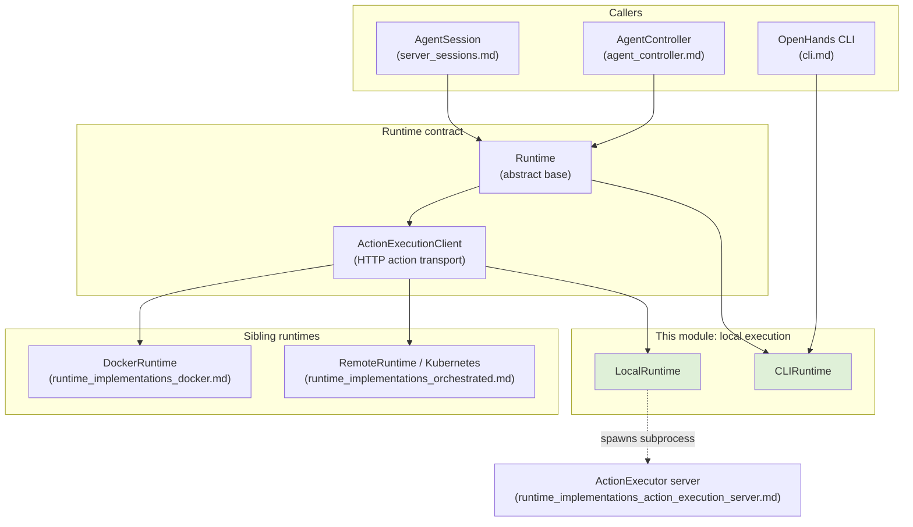
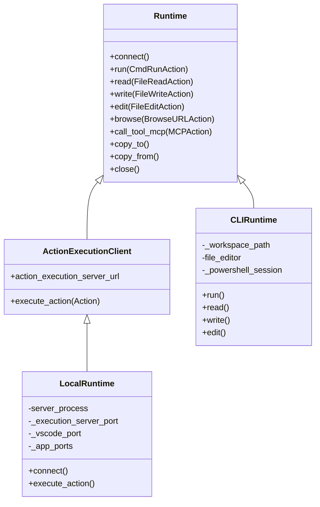
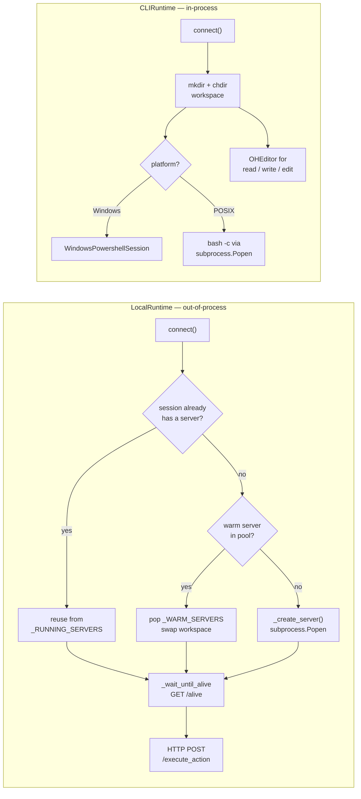
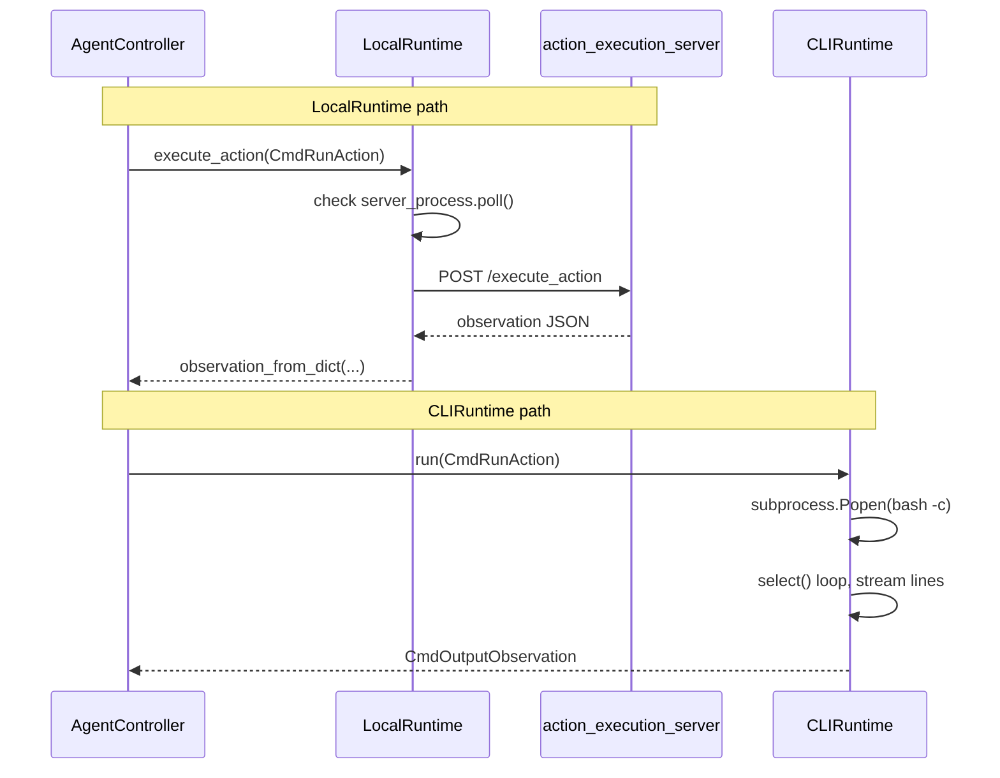
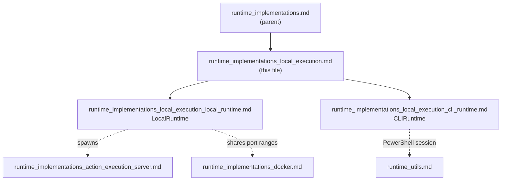

# Runtime Implementations: Local Execution

## Purpose

This module holds the two OpenHands runtimes that run **on the user's own machine, with no container around them**:

| Runtime | File | What it does |
|---|---|---|
| `LocalRuntime` | `openhands/runtime/impl/local/local_runtime.py` | Starts the `action_execution_server` as a **local child process** and talks to it over HTTP — same protocol as Docker, minus the container. |
| `CLIRuntime` | `openhands/runtime/impl/cli/cli_runtime.py` | Runs actions **in-process**, using `subprocess` for shell and plain Python for file I/O. No server, no HTTP. |

Both trade sandbox safety for speed and simplicity. Both print a loud warning at start-up: *"NO SANDBOX IS USED."* They exist for local development, the OpenHands CLI, and CI/benchmark runs where spinning a container per conversation is too slow or not possible.

They sit beside the containerised siblings in [runtime_implementations_docker.md](runtime_implementations_docker.md) and the hosted ones in [runtime_implementations_orchestrated.md](runtime_implementations_orchestrated.md), and all of them are driven through the same `Runtime` contract.

---

## Where this module sits

The important structural point: **`LocalRuntime` and `CLIRuntime` sit at different depths in the class tree.**

`LocalRuntime` reuses the whole HTTP action pipeline, so it gets bash sessions, Jupyter, VSCode and browser support "for free" from the server side. `CLIRuntime` skips that layer entirely, so it must implement every action handler itself — and it deliberately leaves some of them unimplemented (`run_ipython`, `browse`, `browse_interactive`).

---

## Architecture overview

### Shared design decisions

Both runtimes make the same three choices, in slightly different ways:

1. **Workspace resolution.** If `config.workspace_base` is set, the agent works there directly (with a warning that files *will* be edited). Otherwise a `tempfile.mkdtemp(prefix='openhands_workspace_<sid>')` directory is created and torn down on `close()` / `delete()`.
2. **Current user, not a sandbox user.** `run_as_openhands` is ignored; commands run as whoever launched OpenHands. `LocalRuntime.get_user_info()` returns `os.getuid()` on POSIX and a stub `1000` on Windows.
3. **Windows is a second-class but supported path.** `LocalRuntime` warns that tmux-dependent features degrade; `CLIRuntime` swaps `bash -c` for `WindowsPowershellSession` and hard-disables MCP.

### Where they diverge

| Concern | `LocalRuntime` | `CLIRuntime` |
|---|---|---|
| Action transport | HTTP to a child process | direct Python calls |
| Bash | server-side `BashSession` (tmux) | `subprocess.Popen(['bash','-c', …])` with `select`-based streaming |
| File ops | server-side handlers | `OHEditor` + `open()` |
| Jupyter | `JupyterPlugin` on the server | not implemented |
| Browser | `BrowserEnv` on the server | not implemented |
| VSCode / web hosts | exposed via port URLs | none |
| MCP | proxied by the server | fresh clients per call, disabled on Windows |
| Path confinement | server-side | `_sanitize_filename()` blocks traversal outside the workspace |
| Warm-start pooling | yes (`_WARM_SERVERS`) | not needed (no start-up cost) |

---

## Action flow, side by side

---

## Sub-modules

This module splits cleanly along the two implementations, since they share almost no code.

### 1. `LocalRuntime` — sandbox-free server host
Documented in **[runtime_implementations_local_execution_local_runtime.md](runtime_implementations_local_execution_local_runtime.md)**

Launches and supervises the `action_execution_server` as a local subprocess. Covers the `ActionExecutionServerInfo` record, the process-global `_RUNNING_SERVERS` / `_WARM_SERVERS` registries, warm-server pre-warming, port allocation, log-pumping threads, dependency pre-flight checks (`check_dependencies`), and URL derivation for VSCode and app ports.

### 2. `CLIRuntime` — in-process direct execution
Documented in **[runtime_implementations_local_execution_cli_runtime.md](runtime_implementations_local_execution_cli_runtime.md)**

Executes everything inside the OpenHands process. Covers subprocess shell execution with output streaming and process-group termination, the PowerShell path on Windows, `OHEditor`-backed file editing, path-traversal defence via `_sanitize_filename`, `copy_to` / `copy_from` semantics, per-call MCP client creation, and the deliberately unsupported operations.

### Documentation map

| File | Component | Scope |
|---|---|---|
| [runtime_implementations_local_execution_local_runtime.md](runtime_implementations_local_execution_local_runtime.md) | `LocalRuntime` | subprocess server lifecycle, warm pool, ports, URLs |
| [runtime_implementations_local_execution_cli_runtime.md](runtime_implementations_local_execution_cli_runtime.md) | `CLIRuntime` | in-process shell, file ops, path safety, MCP |

---

## Related modules

| Module | Why it matters here |
|---|---|
| [runtime_implementations_action_execution_server.md](runtime_implementations_action_execution_server.md) | The server `LocalRuntime` spawns and talks to. |
| [runtime_implementations_docker.md](runtime_implementations_docker.md) | `LocalRuntime` imports its port ranges; same HTTP protocol, containerised. |
| [runtime_implementations_orchestrated.md](runtime_implementations_orchestrated.md) | Remote / Kubernetes siblings under the same base class. |
| [runtime_utils.md](runtime_utils.md) | `BashSession`, `WindowsPowershellSession`, `PortLock`, `stop_if_should_exit`, `MCPProxyManager`. |
| [runtime_plugins.md](runtime_plugins.md) | `AgentSkillsPlugin`, `JupyterPlugin`, `VSCodePlugin` requirements passed to the server. |
| [browser_environment.md](browser_environment.md) | `BrowserEnv`, probed by `check_dependencies` and unavailable in `CLIRuntime`. |
| [event_system.md](event_system.md) | `EventStream`, actions and observations exchanged with the controller. |
| [core_configuration.md](core_configuration.md) | `OpenHandsConfig`, `CLIConfig`, sandbox settings that shape both runtimes. |
| [llm_layer_registry.md](llm_layer_registry.md) | `LLMRegistry` handed to every runtime constructor. |
| [cli.md](cli.md) | Main consumer of `CLIRuntime`. |
| [server_sessions.md](server_sessions.md) | `AgentSession`, which creates and disposes runtimes per conversation. |
