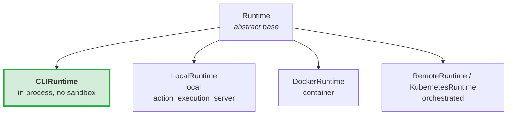
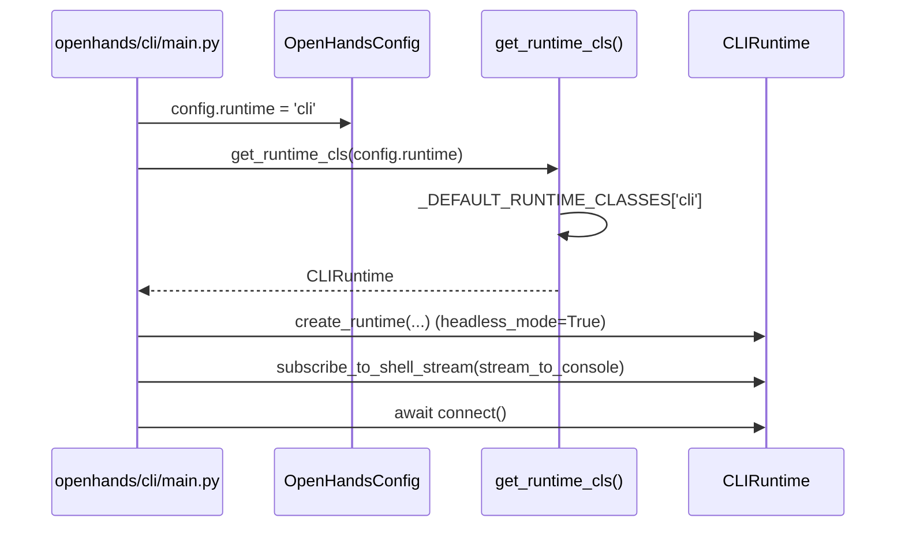
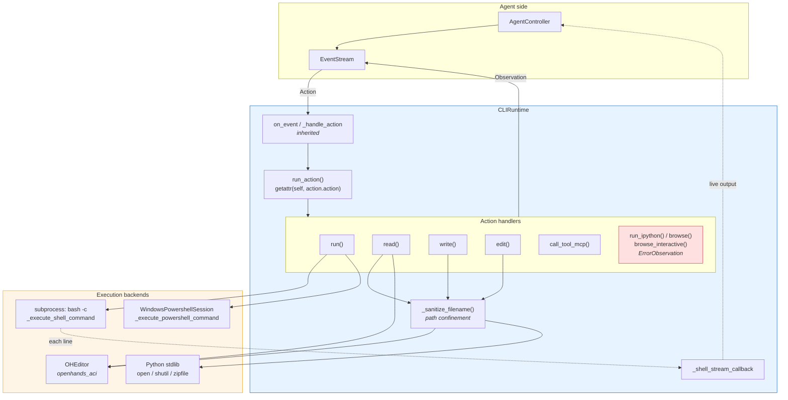
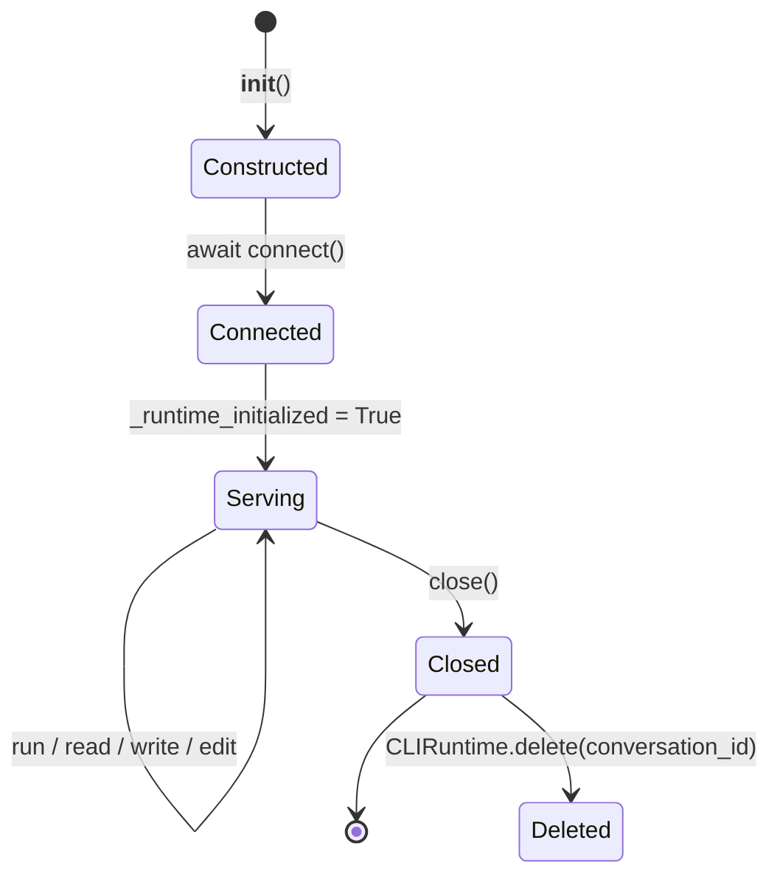
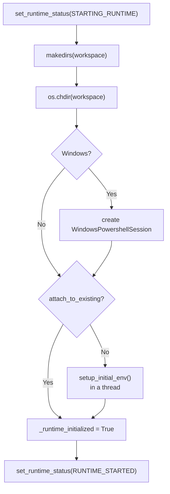
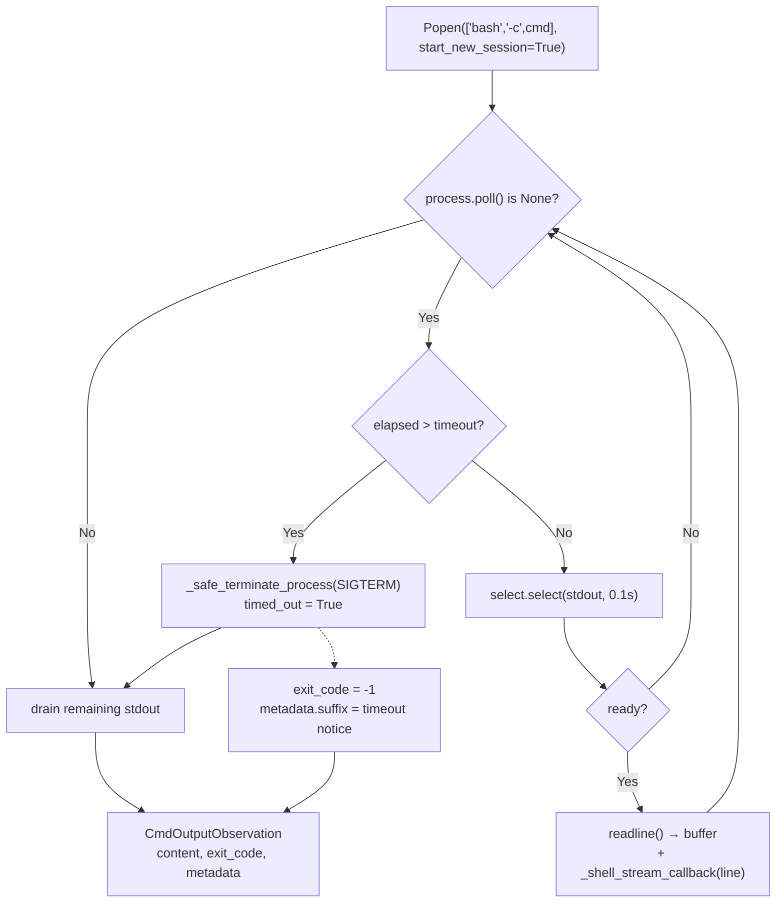
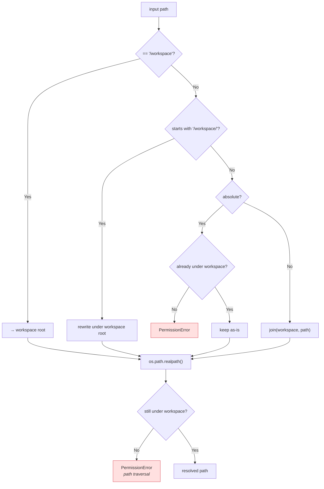
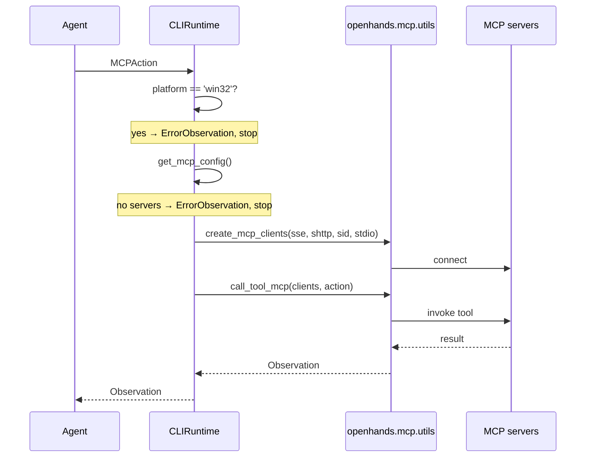
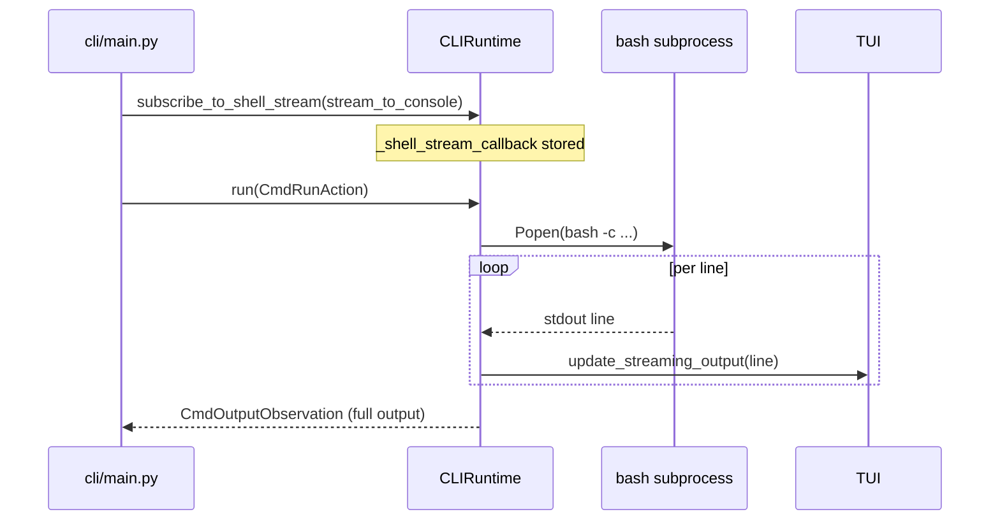

# CLI Runtime

## Introduction

`CLIRuntime` is the simplest runtime in OpenHands. It runs the agent's commands **directly on your own machine**, with no Docker container, no virtual machine, and no helper server process. Shell commands become plain `subprocess` calls; file reads and writes use Python's standard library.

This makes it fast to start and light on resources, but it also means **there is no sandbox**. Anything the agent runs, runs as you, with your permissions. The class itself logs a warning about this the moment it is created.

The trade-off is a smaller feature set. `CLIRuntime` deliberately does not support browsing or Jupyter/IPython cells. It is the runtime that powers the terminal client described in [cli](cli.md).

- **Source:** `openhands/runtime/impl/cli/cli_runtime.py`
- **Core component:** `CLIRuntime`
- **Registered name:** `'cli'` (see `openhands/runtime/__init__.py`)

---

## Where it fits

`CLIRuntime` is one concrete implementation of the abstract `Runtime` contract. It sits beside the container-based and server-based runtimes:

| | [CLIRuntime](#) | [LocalRuntime](runtime_implementations_local_execution_local_runtime.md) | [DockerRuntime](runtime_implementations_docker.md) |
|---|---|---|---|
| Isolation | **None** | None | Container |
| Helper process | None (in-process) | `action_execution_server` subprocess | `action_execution_server` in container |
| Shell | `bash -c` per command / PowerShell | Persistent `BashSession` | Persistent `BashSession` |
| File ops | Python stdlib + `OHEditor` | Via server | Via server |
| Browsing | Not implemented | Supported | Supported |
| Jupyter / IPython | Not implemented | Supported | Supported |
| Windows without WSL | Supported (PowerShell) | Limited | No |
| Startup cost | Lowest | Medium | Highest |

Related modules:

- [runtime_implementations](runtime_implementations.md) — the runtime family overview
- [runtime_implementations_local_execution](runtime_implementations_local_execution.md) — parent module
- [runtime_implementations_action_execution_server](runtime_implementations_action_execution_server.md) — the server `CLIRuntime` avoids
- [runtime_utils](runtime_utils.md) — `WindowsPowershellSession`, `BashSession`, `GitHandler`
- [event_system](event_system.md) — actions and observations
- [core_configuration](core_configuration.md) — `OpenHandsConfig`, `CLIConfig`
- [cli](cli.md) — the terminal client that selects this runtime

---

## How the runtime is chosen

`'cli'` maps to the class through a registry, and the terminal client hard-sets the config field:

`OpenHandsConfig.runtime` defaults to `'docker'`, so a plain server run does not pick this runtime. It is chosen when the terminal client sets it, or when a user sets `runtime = "cli"` in TOML / `RUNTIME=cli` in the environment.

---

## Architecture

### Action dispatch

`CLIRuntime` does not implement its own dispatcher. The base class resolves an action to a method **by name**: `action.action` is a string such as `run`, `read`, `write`, or `edit`, and the base does `getattr(self, action_type)(action)`. This is why the handler methods are named exactly as they are — renaming one would silently make the action unsupported.

Unsupported actions still resolve to a method; those methods return an `ErrorObservation` so the agent gets clear feedback and can adapt instead of crashing.

---

## Lifecycle

### `__init__`

1. Calls `super().__init__(...)`, which subscribes `on_event` to the `EventStream`, prepares plugins and initial env vars, and registers `close()` with `atexit`.
2. Picks the workspace:
   - if `config.workspace_base` is set, uses it and logs a warning that the agent can edit files there;
   - otherwise creates a temp dir named `openhands_workspace_<sid>_*`.
3. Writes the chosen path back to `config.workspace_mount_path_in_sandbox` (runtime tests depend on this).
4. Creates an `OHEditor` rooted at the workspace.
5. Detects Windows and prepares a slot for the PowerShell session.
6. Logs the **no sandbox** warning.

On Windows, the module-level import block requires PowerShell and the .NET SDK. If either is missing it prints a friendly message pointing at the install docs and calls `sys.exit(1)` — a hard failure at import time rather than a confusing error later.

### `connect()`

Note that `connect()` calls `os.chdir()`, changing the working directory of the **whole host process**. That is acceptable for a single-conversation CLI process but is one reason this runtime is not suited to a multi-tenant server.

`setup_initial_env()` runs via `asyncio.to_thread` so the blocking work does not stall the event loop.

### `close()` and `delete()`

`close()` shuts the PowerShell session down (logging but swallowing errors), clears `_runtime_initialized`, and calls `super().close()`. It does **not** remove the temp workspace, so files survive for inspection after a run.

Cleanup is instead a separate classmethod. `CLIRuntime.delete(conversation_id)` scans the system temp dir for directories matching `openhands_workspace_<conversation_id>_` and removes them. Because it matches on prefix, a workspace supplied through `workspace_base` is never touched.

---

## Command execution

### POSIX path

`_execute_shell_command` spawns `bash -c <command>` with `stderr` folded into `stdout`, line buffering, and `start_new_session=True`. That last flag puts the child in a new process group, which is what makes group-wide termination possible.

The `select.select(..., 0.1)` poll is what keeps output flowing incrementally instead of arriving in one lump at the end, and it lets the timeout be checked about ten times a second.

Observations carry `metadata = {'working_dir': self._workspace_path}`. On timeout the exit code becomes `-1` and a human-readable `suffix` is attached.

### Process termination

`_safe_terminate_process` tries hardest to kill the *whole tree*, because a naive `process.terminate()` would only stop `bash` and orphan its children:

1. `os.getpgid(pid)` then `os.killpg(pgid, signal)` — signals the entire group.
2. If the PID is already gone (`ProcessLookupError`) or the OS call fails (`OSError`/`AttributeError`), it falls back to `process.kill()` / `process.terminate()` on the single process.
3. `KeyboardInterrupt` and `SystemExit` are re-raised rather than swallowed.

Timeouts send `SIGTERM`; the outer exception handler escalates to `SIGKILL`.

### Windows path

When a PowerShell session exists, `run()` routes to `_execute_powershell_command`, which wraps the command in a `CmdRunAction`, applies the timeout, and delegates to `WindowsPowershellSession.execute()`.

There is a meaningful behavioural difference between the two backends:

| | POSIX (`bash -c`) | Windows (PowerShell) |
|---|---|---|
| Process model | Fresh process per command | One persistent runspace |
| State between commands | **Not preserved** — `cd`, variables reset | **Preserved** — cwd and variables persist |
| Live streaming | Yes, via `_shell_stream_callback` | Not wired to the callback |
| MCP support | Yes | Disabled |

Because each POSIX command is a new `bash -c`, an agent that runs `cd subdir` and then `ls` will find itself back at the workspace root. Agents are expected to chain with `&&` or use absolute paths.

### Interactive input

`run()` explicitly rejects actions with `is_input=True` (for example a `C-c` interrupt), returning an `ErrorObservation` with id `AGENT_ERROR$BAD_ACTION`. There is no persistent shell on the POSIX path to send keystrokes to, so the limitation is structural rather than an oversight.

---

## File operations

### Path confinement

`_sanitize_filename` is the single security boundary for every file operation. It normalises the many path shapes an agent might produce and then verifies the result:

Two details matter. First, `/workspace` is accepted as a virtual alias even though it does not exist locally — agent prompts across OpenHands use that path heavily, so mapping it keeps those habits working. Second, the `realpath()` call happens **before** the final check, so symlinks and `..` segments are resolved and cannot be used to escape.

The base class turns a raised `PermissionError` into an `ErrorObservation`, so a blocked path is reported to the agent rather than killing the run.

> Note: the containment check uses a string `startswith` on the resolved path. A sibling directory whose name merely begins with the workspace path (for example `/tmp/ws` vs `/tmp/ws-backup`) would satisfy that prefix test.

### Reading, writing, editing

- **`read()`** — for `FileReadSource.OH_ACI` it delegates to `OHEditor`'s `view` command, honouring `view_range`. Otherwise it checks existence, rejects directories, rejects binaries via `binaryornot`, and reads UTF-8 with `errors='replace'` so odd bytes degrade instead of raising.
- **`write()`** — creates parent directories, then writes UTF-8. Returns a `FileWriteObservation` with empty content.
- **`edit()`** — asserts `impl_source == FileEditSource.OH_ACI`, rejects binaries, and routes `create` / `str_replace` / `insert` / `undo_edit` to `OHEditor`. It computes a unified diff with `get_diff()` and attaches it to the `FileEditObservation`, which is what lets the UI show a readable change.

`_execute_file_editor` centralises editor invocation: it catches `ToolError` and converts it into a `ToolResult` carrying an error, so editor failures become `ERROR:`-prefixed observation text rather than exceptions. Linting is passed as `enable_linting=False` from `edit()`.

### Transfer helpers

`copy_to()` handles several destination shapes, since the caller's intent is ambiguous from a string alone:

| Source | Destination | Behaviour |
|---|---|---|
| Directory + `recursive=True` | any | `copytree` into `dest/<basename>`, merging (`dirs_exist_ok=True`) |
| File | existing dir, or trailing separator | copy into that directory |
| File | non-existent, no `.` in name | treat as new directory, create and copy in |
| File | otherwise | treat as a full file path, possibly renaming |

`shutil.SameFileError` and identical source/target are treated as harmless no-ops. `copy_from()` zips a file or directory into a temp `.zip` (using paths relative to the source as archive names) and returns the path — the base class uses this to extract microagents.

---

## MCP integration

`CLIRuntime` handles MCP differently from the container runtimes: it has no proxy manager and builds no separate config. `get_mcp_config()` returns `self.config.mcp` **directly**, meaning mutations such as added stdio servers persist on the shared config object.

`call_tool_mcp()` creates clients per call rather than holding a pool, then delegates to the shared handler:

MCP is disabled entirely on Windows — both `call_tool_mcp()` and `get_mcp_config()` check `sys.platform` and return an error or an empty config. The `openhands.mcp.utils` imports are deliberately done inside the method to avoid a circular import.

---

## Environment variables

`add_env_vars()` is overridden, and the reason is important. The base implementation runs shell commands and appends `export` lines to `~/.bashrc`. For a local CLI run that would be wrong twice over: it is called during `__init__` before the runtime is initialised, and it would permanently modify the user's real shell profile.

The override instead sets `os.environ` in the current process, so every later `subprocess` call inherits the values naturally. `SecretStr` values are unwrapped with `get_secret_value()`. Only **keys** are logged, never values, to keep tokens out of logs.

Relatedly, the base `_setup_git_config()` checks `config.runtime == 'cli'` and returns early — the user's own global git identity is left untouched.

---

## Streaming output to the terminal

This runtime is the only one that meaningfully implements `subscribe_to_shell_stream()`. The base returns `False`; here the callback is stored and invoked per output line.

The user sees output as it happens, while the agent still receives one complete `CmdOutputObservation` at the end. Passing `None` unsubscribes. The callback is only wired into the POSIX path.

---

## Agent-facing guidance

`additional_agent_instructions` is appended to the system prompt and tells the agent two things: that it is confined to the workspace directory, and that it is *working directly on the user's machine* where the environment is usually already set up. The second point discourages the agent from reinstalling tooling as it might inside a fresh container.

---

## Behavioural notes and caveats

Points worth knowing before relying on this runtime:

1. **No isolation.** Commands run with the invoking user's full privileges. Intended for trusted, local, interactive use.
2. **Process-wide `chdir`.** `connect()` changes the host process working directory; unsuitable for multi-tenant servers.
3. **No shell state between commands** on POSIX — each command is a fresh `bash -c`.
4. **Trailing output can be dropped.** In the post-loop drain block, `while line:` reads a variable bound only inside the read loop. If the process exits before the first iteration, `line` is unbound; the resulting `NameError` is caught by the surrounding `except Exception` and logged as a warning, so very short-lived commands may lose their final output rather than fail loudly.
5. **`exit_code` may be `None`.** It is read from `process.returncode` after the poll loop; on the timeout path it is forced to `-1`.
6. **Prefix-based containment.** As noted above, the workspace check is a string prefix comparison rather than a path-component comparison.
7. **Shared MCP config.** `get_mcp_config()` returns and mutates `self.config.mcp` in place, unlike other runtimes which build a fresh config.
8. **Workspace not cleaned on close.** Use the `delete()` classmethod, which only ever removes prefix-matched temp directories.
9. **Jupyter plugin should be disabled.** `run_ipython()` always errors; leaving the plugin enabled in `AgentConfig` wastes turns.

---

## Test coverage

| File | Focus |
|---|---|
| `tests/unit/cli/test_cli_runtime_mcp.py` | MCP config assembly and `call_tool_mcp` behaviour |
| `tests/unit/cli/test_cli_workspace.py` | Workspace selection and path handling |
| `tests/runtime/conftest.py` | Parametrises the shared runtime suite to include `CLIRuntime` |
| `tests/runtime/test_bash.py` | Command execution, timeouts, exit codes |
| `tests/runtime/test_aci_edit.py` | `OHEditor` edit flows |
| `tests/runtime/test_glob_and_grep.py` | File discovery |
| `tests/runtime/test_mcp_action.py` | MCP actions end to end |
| `tests/runtime/test_ipython.py`, `test_browsing.py` | Assert the unsupported paths error as expected |

The shared `tests/runtime/` suite runs against several runtimes, which is why `config.workspace_mount_path_in_sandbox` must be set in `__init__` — those tests read it to locate the workspace.

---

## Summary

`CLIRuntime` trades isolation and features for immediacy. By implementing the `Runtime` contract with nothing more than `subprocess`, the Python standard library, and `OHEditor`, it removes the container, the helper server, and the network hop between the agent and its work. What remains is a careful set of boundaries — `_sanitize_filename` for paths, `_safe_terminate_process` for runaway process trees, explicit `ErrorObservation`s for unsupported actions, and a Windows PowerShell backend for systems without WSL.

It is the right choice for a developer working locally in a terminal, and the wrong choice for running untrusted code or serving multiple users.
