# Local Runtime (`LocalRuntime`)

## Introduction

`LocalRuntime` runs the OpenHands **action execution server as a plain child process on the host machine** — no Docker, no VM, no remote API. The agent's commands, file edits, Jupyter cells and browser actions all run as the *current OS user*, in the *current Python environment*.

It is the fastest runtime to start (no image pull, no container boot) and the least isolated one. There is **no sandbox**: anything the agent does can touch the real filesystem, the real network and the real user account. The class itself logs a loud warning about this on every startup.

Where it sits:

- It is one of the two members of [Local Execution](runtime_implementations_local_execution.md), alongside the in-process [CLI Runtime](runtime_implementations_local_execution_cli_runtime.md).
- It is a subclass of `ActionExecutionClient`, so it speaks the **same HTTP protocol** as [Docker Runtime](runtime_implementations_docker.md) and the [orchestrated runtimes](runtime_implementations_orchestrated.md). The difference is only *where the server lives*.
- The server it talks to is documented in [Action Execution Server](runtime_implementations_action_execution_server.md).

| Property | Value |
| --- | --- |
| File | `openhands/runtime/impl/local/local_runtime.py` |
| Class | `LocalRuntime(ActionExecutionClient)` |
| Isolation | **None** — same host, same user |
| Transport | HTTP to `localhost:<port>` |
| Server lifetime | `subprocess.Popen`, tracked in a process-global dict |
| Special feature | **Warm server pool** for near-zero start latency |
| Windows | Partially supported (no tmux, no MCP) |

---

## 1. Where LocalRuntime fits

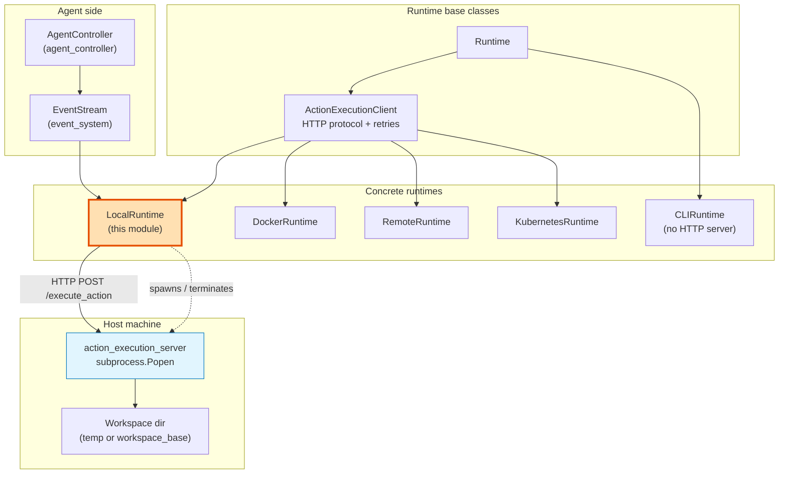

`LocalRuntime` inherits almost all behaviour from `ActionExecutionClient` — `run`, `run_ipython`, `read`, `write`, `edit`, `browse`, `copy_to`, `copy_from`, `list_files`, MCP config, VSCode token. It only overrides the parts that concern **process lifecycle**:

| Overridden | Why |
| --- | --- |
| `connect()` | Start or reuse a local server process |
| `execute_action()` | Add liveness checks on the child process |
| `close()` | Terminate the process and delete the temp workspace |
| `delete()` (classmethod) | Kill a session's server plus the warm pool |
| `setup()` (classmethod) | Dependency checks + warm pool priming |
| `vscode_url`, `web_hosts`, `runtime_url` | Build URLs from local ports |

---

## 2. Key building blocks

### 2.1 `ActionExecutionServerInfo`

A small `@dataclass` that bundles everything needed to own a running server:

```python
process: subprocess.Popen          # the child process
execution_server_port: int         # HTTP port for /execute_action
vscode_port: int                   # VSCode web port
app_ports: list[int]               # two ports the agent can host apps on
log_thread: threading.Thread       # pumps stdout into the OpenHands logger
log_thread_exit_event: threading.Event
temp_workspace: str | None         # temp dir to remove on close
workspace_mount_path: str          # dir the server was told to work in
```

### 2.2 Two process-global registries

```python
_RUNNING_SERVERS: dict[str, ActionExecutionServerInfo] = {}   # keyed by session id (sid)
_WARM_SERVERS: list[ActionExecutionServerInfo] = []           # pre-started, unclaimed
```

Both are **module-level globals**, so they are shared by every `LocalRuntime` inside one Python process. This is what makes `attach_to_existing` work without any external state store, and it is also why LocalRuntime is single-process only — it cannot see servers started by a different Python process.

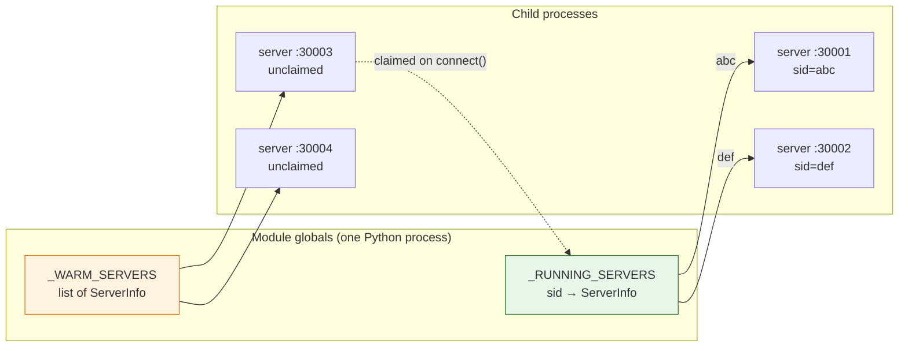

### 2.3 Helper functions

| Function | Role |
| --- | --- |
| `get_user_info()` | Cross-platform `(uid, username)`; returns `1000` on Windows where `os.getuid()` does not exist |
| `check_dependencies(repo_path, check_browser)` | Verifies Jupyter, tmux/libtmux (skipped on Windows) and optionally the browser are installed |
| `_python_bin_path()` | `dirname(sys.executable)` — prepended to the child's `PATH` so the same venv is used |
| `_create_server(...)` | Allocates ports, builds the command line, spawns the process, starts the log thread |
| `_create_warm_server(...)` | Calls `_create_server`, polls `/alive`, appends to `_WARM_SERVERS` |
| `_create_warm_server_in_background(...)` | Same, on a daemon thread so it never blocks the agent |
| `_get_plugins(config)` | Reads `sandbox_plugins` off the configured default agent class |

---

## 3. Environment variables

`LocalRuntime` is unusual in that a lot of its behaviour is driven by env vars rather than `OpenHandsConfig`.

| Variable | Read in | Effect |
| --- | --- | --- |
| `SKIP_DEPENDENCY_CHECK` | `setup()` | `=1` skips the Jupyter/tmux/browser checks |
| `INITIAL_NUM_WARM_SERVERS` | `setup()` | How many warm servers to pre-start at process boot |
| `DESIRED_NUM_WARM_SERVERS` | `connect()`, `execute_action()` | Pool size to keep topped up while running |
| `SESSION_API_KEY` | `__init__` | Sent as `X-Session-API-Key` on every request |
| `VSCODE_PORT` | `_create_server` | Pins the VSCode port instead of picking one |
| `WORK_PORT_1` / `APP_PORT_1`, `WORK_PORT_2` / `APP_PORT_2` | `_create_server` | Pin the two app ports |
| `RUNTIME_URL`, `RUNTIME_URL_PATTERN`, `RUNTIME_ID` | `runtime_url`, `_create_url` | Build externally reachable URLs when LocalRuntime runs *inside* a managed pod |
| `USER` | `get_user_info()` | Username passed to the server |

Port ranges are imported from [Docker Runtime](runtime_implementations_docker.md) so both runtimes stay out of each other's way: `EXECUTION_SERVER_PORT_RANGE`, `VSCODE_PORT_RANGE`, `APP_PORT_RANGE_1`, `APP_PORT_RANGE_2`.

Config fields used from [core configuration](core_configuration.md): `sandbox.local_runtime_url`, `sandbox.runtime_startup_env_vars`, `workspace_base`, `workspace_mount_path_in_sandbox`, `enable_browser`, `default_agent`.

---

## 4. Class setup: `setup()`

`setup()` is a **classmethod called once per process**, before any runtime instance exists. It does the "is this machine even capable" checks and primes the warm pool.

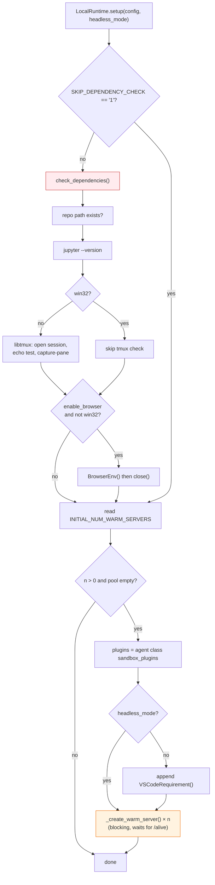

Any failed dependency check raises `ValueError` with a pointer to `Development.md` — LocalRuntime needs the OpenHands source checkout present, because it runs the server module straight out of it.

---

## 5. Connecting: `connect()`

`connect()` is the heart of the module. It resolves **four distinct cases** in priority order.

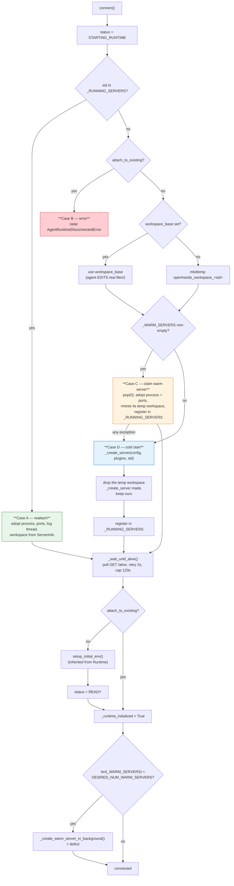

**Workspace rule of thumb:**

- `workspace_base` set → the agent works **directly in that real directory**, nothing is deleted on close.
- `workspace_base` unset → a fresh `tempfile.mkdtemp()` is created and **removed** on `close()`.

Either way the resolved path is written back into `config.workspace_mount_path_in_sandbox`, which is what `_create_server` passes to the server as `--working-dir`.

---

## 6. Starting a server: `_create_server()`

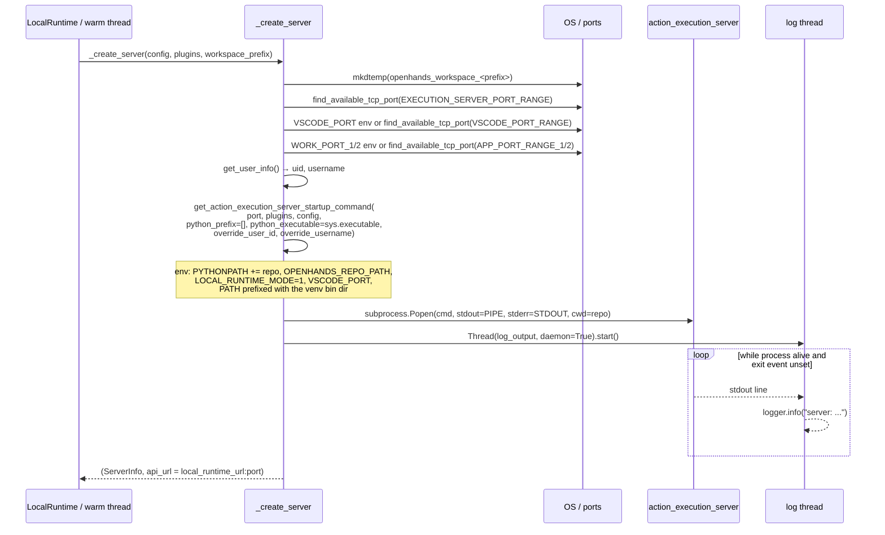

Notice `python_prefix=[]` and `python_executable=sys.executable`: unlike Docker, there is no `poetry run` wrapper — the server is launched with the **very interpreter OpenHands itself is running under**, and `cwd` is set to the OpenHands source checkout. That is why `setup()` insists the repo path exists.

`LOCAL_RUNTIME_MODE=1` is the flag the server side uses to know it is not inside a container.

---

## 7. Warm servers

The warm pool trades idle memory for start latency. Instead of paying the ~seconds of Python + plugin boot at conversation start, servers are started ahead of time and simply *claimed*.

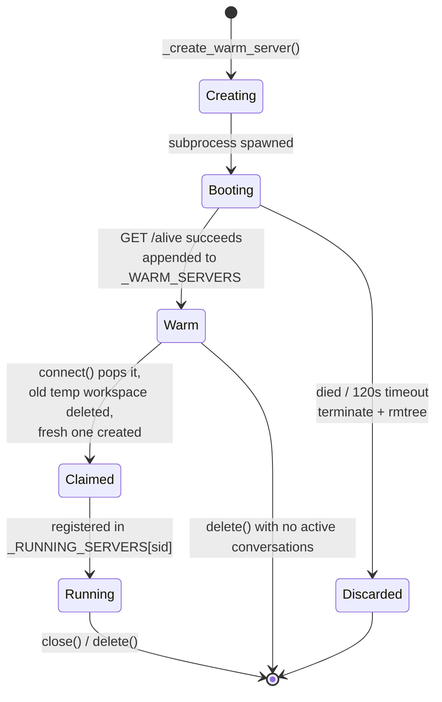

Three separate places top the pool back up:

| Trigger | Mode | Code path |
| --- | --- | --- |
| Process boot | **blocking** | `setup()` → `_create_warm_server()` × `INITIAL_NUM_WARM_SERVERS` |
| After `connect()` | background thread | `_create_warm_server_in_background()` |
| After every `execute_action()` | background thread | `_create_warm_server_in_background()` |

The per-action top-up means a busy conversation keeps the pool full for the *next* conversation without ever blocking the agent loop.

**Caveats to be aware of:**

- A claimed warm server was started with the *warm* temp workspace as its `--working-dir`. `connect()` deletes that directory and points config at a new one, so the server's own notion of its working dir and the config's can diverge — warm servers are best used with a uniform workspace setup.
- Warm servers hold real ports and real memory for as long as the process lives.
- The pool is only drained in `delete()`, and only when `_RUNNING_SERVERS` is empty.

---

## 8. Executing an action

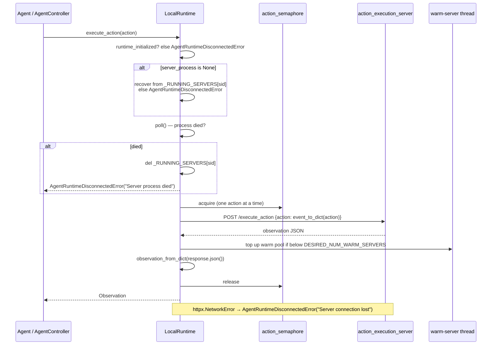

The `threading.Semaphore(1)` guarantees actions are serialised — the local server holds a single bash/tmux session, so concurrent actions would interleave shell state.

Serialisation uses `event_to_dict` / `observation_from_dict` from the [event system](event_system.md), so the wire format is identical to every other action-execution runtime.

> Note: this override sends the request *without* honouring `action.timeout` the way the inherited `send_action_for_execution` does; it is the lower-level path used for direct action dispatch.

---

## 9. Teardown

### `close()` — per instance

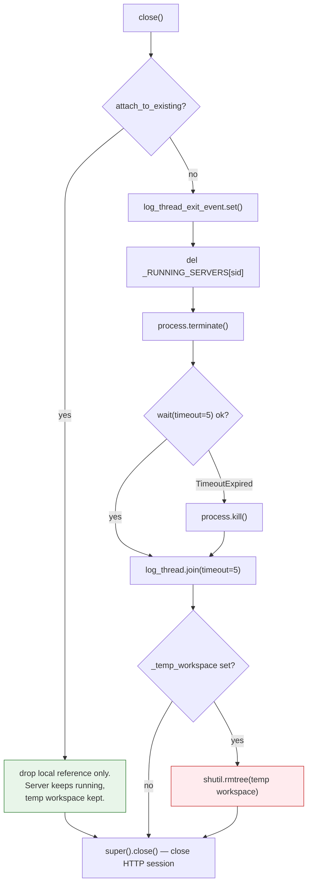

### `delete(conversation_id)` — classmethod

Used by the server layer when a conversation is destroyed (see [server sessions](server_sessions.md)). It does what `close()` does, but from the class rather than an instance, and it additionally **drains the whole warm pool** once `_RUNNING_SERVERS` becomes empty — terminating each warm process, joining its log thread, and removing its temp workspace.

Both paths use the same graceful pattern: `terminate()` → `wait(5s)` → `kill()`.

---

## 10. URL exposure: VSCode and hosted apps

LocalRuntime can run on a plain laptop (`localhost`) *or* inside a managed pod that fronts it with a gateway. `runtime_url` and `_create_url` handle both.

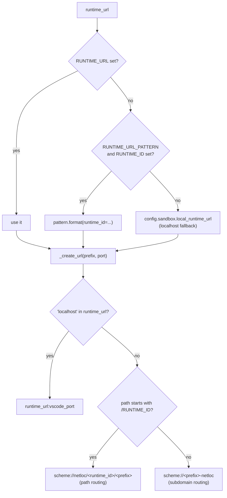

| Property | Produces |
| --- | --- |
| `vscode_url` | `<_create_url('vscode', vscode_port)>/?tkn=<token>&folder=<workspace>`; `None` if `get_vscode_token()` returns nothing |
| `web_hosts` | `{url: port}` for each app port, labelled `work-1`, `work-2` |

The VSCode token comes from `ActionExecutionClient.get_vscode_token()`, which asks the server `GET /vscode/connection_token`. The VSCode plugin itself is described in [runtime plugins](runtime_plugins.md).

> Known wrinkle: in the `localhost` branch `_create_url` always appends `self._vscode_port`, ignoring the `port` argument — so `web_hosts` URLs on localhost point at the VSCode port while the dict values hold the correct app ports.

---

## 11. Platform differences

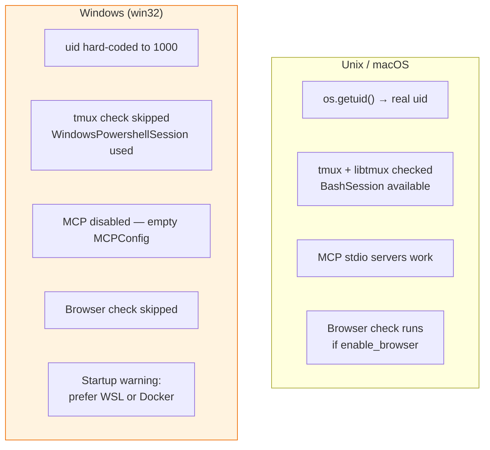

Shell session details live in [runtime utils](runtime_utils.md) (`BashSession`, `WindowsPowershellSession`).

---

## 12. Component interaction summary

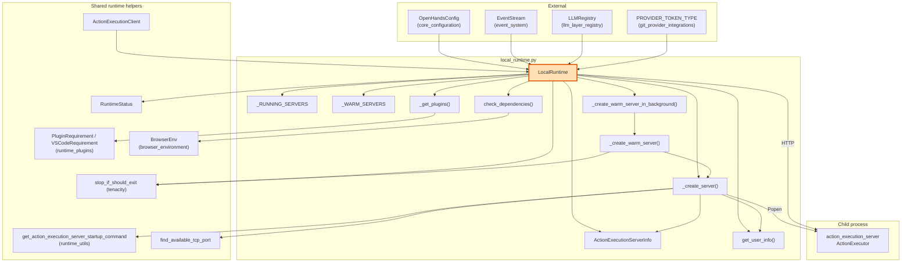

---

## 13. Comparison with sibling runtimes

| | **LocalRuntime** | [CLIRuntime](runtime_implementations_local_execution_cli_runtime.md) | [DockerRuntime](runtime_implementations_docker.md) | [Remote/K8s](runtime_implementations_orchestrated.md) |
| --- | --- | --- | --- | --- |
| Isolation | none | none | container | container + remote host |
| Transport | HTTP → localhost | direct in-process calls | HTTP → container port | HTTP → remote URL |
| Runs the action execution server | yes, as subprocess | no | yes, in container | yes, remotely |
| Jupyter / plugins | yes | limited | yes | yes |
| Startup cost | low (near zero with warm pool) | lowest | image build/pull | provisioning |
| Needs source checkout | **yes** | yes | no | no |
| Best for | dev loops, CI, evaluation harnesses | quick CLI use | normal use | multi-tenant SaaS |

---

## 14. Failure modes and errors

| Situation | Raised / logged |
| --- | --- |
| `attach_to_existing=True`, no server for sid | `AgentRuntimeDisconnectedError` |
| Server process exits before `/alive` | `RuntimeError('Server process died')` inside the retry, ultimately a tenacity failure after 120 s |
| Server process dies mid-conversation | `AgentRuntimeDisconnectedError('Server process died')`, entry removed from `_RUNNING_SERVERS` |
| Network error on `/execute_action` | `AgentRuntimeDisconnectedError('Server connection lost')` |
| Missing repo / Jupyter / tmux | `ValueError` from `check_dependencies` with the Development.md link |
| Warm server creation fails | Logged as error; process terminated, temp workspace removed, agent unaffected |
| `stop_if_should_exit()` fires | Retry loops abort early on shutdown instead of burning the full 120 s |

---

## 15. Security note

`LocalRuntime` deliberately disables the isolation that the rest of the [sandboxed execution layer](sandboxed_execution_layer.md) provides:

- `run_as_openhands` is **ignored** — the server runs as the invoking user.
- The agent gets that user's full filesystem, network and credential access.
- If `workspace_base` is set, the agent edits those real files in place.

Use it only in controlled environments (CI, evaluation, a disposable dev box), and prefer `DockerRuntime` otherwise. Where policy enforcement is needed on top, see the [security analyzers](security_analyzers.md).

---

## Related documentation

- [Local Execution](runtime_implementations_local_execution.md) — parent module
- [CLI Runtime](runtime_implementations_local_execution_cli_runtime.md) — sibling, no HTTP server
- [Docker Runtime](runtime_implementations_docker.md) — source of the port ranges, containerised equivalent
- [Action Execution Server](runtime_implementations_action_execution_server.md) — the process LocalRuntime spawns
- [Runtime Plugins](runtime_plugins.md) — Jupyter, VSCode, AgentSkills
- [Runtime Utils](runtime_utils.md) — bash sessions, port locks, `stop_if_should_exit`
- [Browser Environment](browser_environment.md) — `BrowserEnv` used in the dependency check
- [Event System](event_system.md) — `EventStream`, action/observation serialisation
- [Core Configuration](core_configuration.md) — `OpenHandsConfig`, sandbox settings
- [Server Sessions](server_sessions.md) — who calls `connect()`, `close()` and `delete()`
