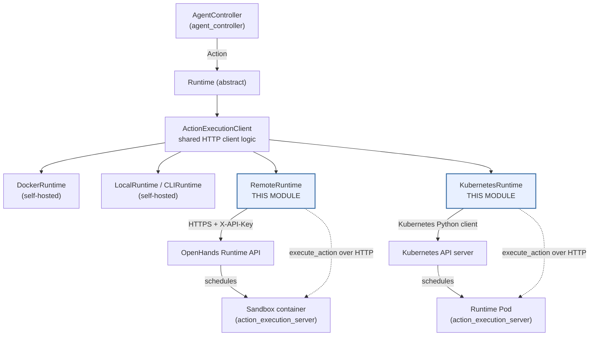
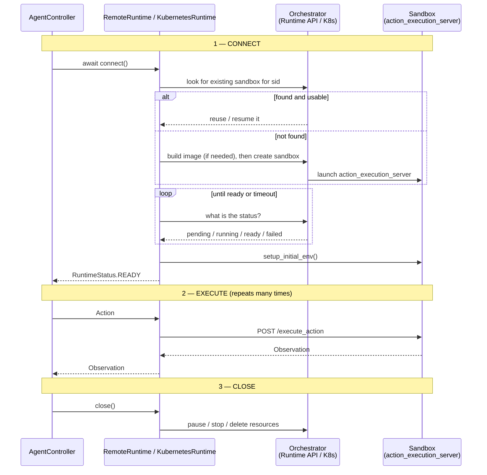
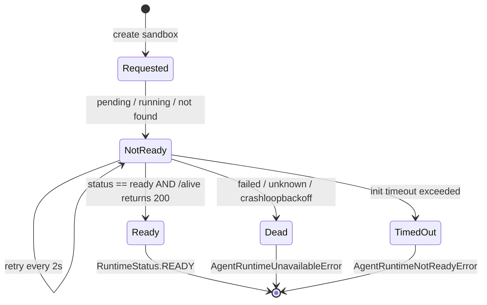
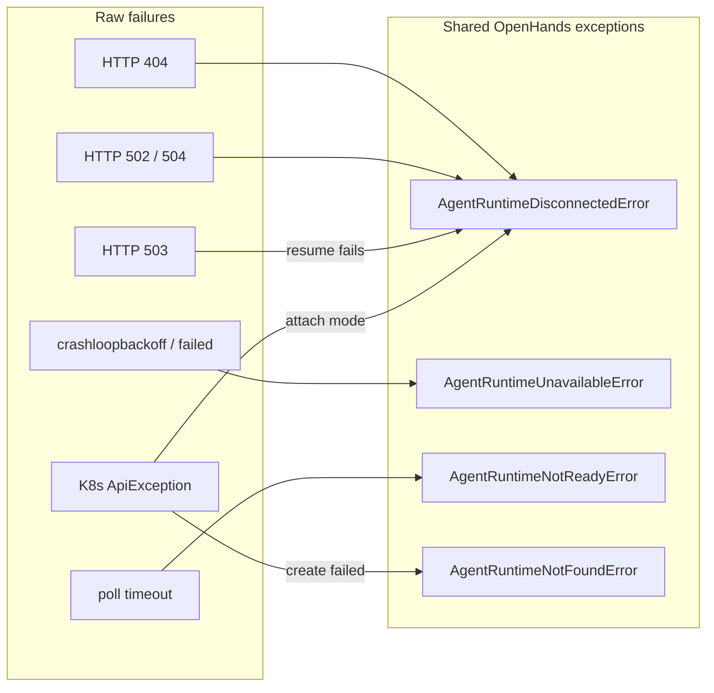

# Orchestrated Runtime Implementations

## Purpose

This module holds the two OpenHands sandbox runtimes that **do not own the machine they run on**. Instead of starting a container locally, they ask an outside orchestrator to create the sandbox for them:

| Runtime | Orchestrator it talks to | How the sandbox is created |
| --- | --- | --- |
| `RemoteRuntime` | The OpenHands **Runtime API** (a hosted HTTP service) | `POST /start` — the service picks a node, pulls the image, and returns a URL |
| `KubernetesRuntime` | A **Kubernetes cluster** API server | Creates a Pod + PVC + two Services + an Ingress via the Kubernetes Python client |

Both are siblings of the self-hosting runtimes described in [runtime_implementations_docker](runtime_implementations_docker.md) and [runtime_implementations_local_execution](runtime_implementations_local_execution.md). The difference is only *who starts the box*. Once the box is up, all of them drive the exact same HTTP server — see [runtime_implementations_action_execution_server](runtime_implementations_action_execution_server.md).

**Why "orchestrated" matters.** Because a third party owns the sandbox, these runtimes have to deal with things a local runtime never sees:

- The sandbox may not exist yet when `/start` returns — so they **poll for readiness** rather than assuming success.
- The sandbox may be **paused, evicted, restarted, or moved** while the agent is mid-task.
- The sandbox lives behind a **network boundary**, so every action is an HTTP call that can fail with a transport error and needs retries.
- Cleanup is **remote** — closing the runtime means telling someone else to delete resources.

## Where this module sits

The important shape here is the **two-channel design**, and it is what separates this module from every other runtime:

1. A **control channel** to the orchestrator — start, resume, pause, stop, check status.
2. A **data channel** to the sandbox itself — run commands, read and write files, browse.

A local runtime collapses these into one (the Docker socket does both). Here they are genuinely separate services, which is why both classes carry their own status polling, their own retry policy, and their own error translation.

## Sub-modules

### RemoteRuntime — the hosted control plane client

→ Full detail: **[runtime_implementations_orchestrated_remote_runtime](runtime_implementations_orchestrated_remote_runtime.md)**

`RemoteRuntime` is a client of a REST API that owns a fleet of sandboxes. It never touches a container directly. Its job is to negotiate a sandbox into existence and then keep the connection to it healthy.

Its distinguishing behaviours:

- **Session reuse.** On connect it first asks `GET /sessions/{sid}`. A `running` sandbox is reused as-is; a `paused` one is resumed; a `stopped` one is abandoned and rebuilt. This is what makes browser-refresh and reconnect work.
- **Remote image building.** If no prebuilt image is configured, it fetches the registry prefix from the API and drives a build through `RemoteRuntimeBuilder` (see [runtime_image_builders](runtime_image_builders.md)) — the build runs on the service, not the user's machine.
- **Pod-status-aware waiting.** `_wait_until_alive` reads the orchestrator's own view (`pod_status`) and only then probes `/alive`. It distinguishes *not ready yet* (keep retrying) from *dead* (fail fast, e.g. `crashloopbackoff`).
- **Auto-resume on 503.** If an action returns 503 mid-task, it treats that as "the sandbox was paused underneath me", resumes it, and replays the request — the agent never notices.
- **Two-key auth.** A long-lived `X-API-Key` for the control plane, plus a per-sandbox `X-Session-API-Key` handed back at start time.

### KubernetesRuntime — the in-cluster orchestrator

→ Full detail: **[runtime_implementations_orchestrated_kubernetes_runtime](runtime_implementations_orchestrated_kubernetes_runtime.md)**

`KubernetesRuntime` skips the middle service and *is* the orchestrator. It builds Kubernetes manifests itself and submits them to the cluster API.

Its distinguishing behaviours:

- **Five resources per conversation**, not one container: a PersistentVolumeClaim for the workspace, the Pod, a ClusterIP Service for the execution server, a second Service for VSCode, and an Ingress for browser access to VSCode.
- **Cluster-internal addressing.** It reaches the sandbox at `http://<pod>-svc.<namespace>.svc.cluster.local:8080` — it must therefore run inside the cluster (it loads in-cluster config).
- **Readiness delegated to Kubernetes.** The Pod declares an HTTP readiness probe against `/alive`; the runtime just waits for the Pod's `Ready` condition instead of probing itself.
- **PVC survives, Pod does not.** Normal `close()` deletes the Pod and Services but keeps the PVC, so a conversation can be resumed with its files intact. Only an explicit `delete()` removes the PVC.
- **Scheduling controls.** Node selectors, tolerations, resource requests/limits, image pull secrets and privileged mode are all read from [core_configuration](core_configuration.md)'s `KubernetesConfig`.

## Shared lifecycle

Both classes implement the same three-phase contract inherited from `Runtime`, but fill it in very differently:

### Readiness state machine

The polling loop is where both runtimes spend their startup time, and both use the same three-way classification. Getting this wrong is the classic bug: treating "not scheduled yet" as a failure, or treating "crashing" as something worth waiting for.

`RemoteRuntime` evaluates this against the Runtime API's `pod_status` field; `KubernetesRuntime` evaluates it against the Pod's `status.phase` plus its `Ready` condition. Both stop early on process shutdown via `stop_if_should_exit` (see [runtime_utils](runtime_utils.md)).

### Error vocabulary

Both runtimes translate orchestrator-specific failures into the shared exception set so that callers upstream never need to know which backend is in use:

`AgentRuntimeDisconnectedError` is the interesting one: it is a *soft* failure meaning "try again, the sandbox may come back", which is why 502/504/503 all funnel into it rather than into a hard error.

## Comparison at a glance

| Aspect | `RemoteRuntime` | `KubernetesRuntime` |
| --- | --- | --- |
| Control channel | REST over HTTPS to Runtime API | Kubernetes Python client |
| Credentials | `SANDBOX_API_KEY` + session key | In-cluster ServiceAccount |
| Sandbox address | URL returned by `/start` | `*.svc.cluster.local` DNS name |
| Default port | `60000` | `8080` (VSCode `8081`, apps `30082/30083`) |
| Image build | Remote, via Runtime API `/build` | Pre-built image required |
| Persistence | Pause/resume the whole sandbox | PVC outlives the Pod |
| Suspend support | Yes — `/pause` and `/resume` | No — Pod is deleted or kept whole |
| VSCode exposure | Sub-domain or path on runtime URL | Ingress with optional TLS |
| Must run inside cluster | No | Yes |
| Typical use | Hosted / SaaS deployments | Self-managed cluster deployments |

## Configuration inputs

Both runtimes are driven entirely by `OpenHandsConfig` from [core_configuration](core_configuration.md).

`RemoteRuntime` reads from `config.sandbox`:

| Setting | Role |
| --- | --- |
| `remote_runtime_api_url` | Control-plane base URL (**required**) |
| `api_key` | Control-plane credential (**required**) |
| `remote_runtime_class` | `None`, `sysbox`, or `gvisor` isolation |
| `remote_runtime_resource_factor` | Requested CPU/memory multiplier |
| `remote_runtime_init_timeout` | Readiness polling budget |
| `remote_runtime_enable_retries` | Whether to retry transport errors |
| `keep_runtime_alive`, `pause_closed_runtimes` | Close-time behaviour |

`KubernetesRuntime` reads from `config.kubernetes` (`KubernetesConfig`): `namespace`, `ingress_domain`, `ingress_tls_secret`, `pvc_storage_size`, `pvc_storage_class`, `resource_cpu_request`, `resource_memory_request`, `resource_memory_limit`, `image_pull_secret`, `node_selector_key`/`node_selector_val`, `tolerations_yaml`, `privileged`.

## Related modules

| Module | Relationship |
| --- | --- |
| [runtime_implementations_orchestrated_remote_runtime](runtime_implementations_orchestrated_remote_runtime.md) | Sub-module — `RemoteRuntime` in full detail |
| [runtime_implementations_orchestrated_kubernetes_runtime](runtime_implementations_orchestrated_kubernetes_runtime.md) | Sub-module — `KubernetesRuntime` in full detail |
| [runtime_implementations_action_execution_server](runtime_implementations_action_execution_server.md) | The server running *inside* the sandbox that both runtimes drive |
| [runtime_implementations_docker](runtime_implementations_docker.md) | Self-hosted sibling — same base class, local Docker daemon |
| [runtime_implementations_local_execution](runtime_implementations_local_execution.md) | Self-hosted siblings with no container at all |
| [third_party_runtimes](third_party_runtimes.md) | Other orchestrated backends (Daytona, Modal, Runloop, E2B) |
| [runtime_image_builders](runtime_image_builders.md) | `RemoteRuntimeBuilder` used for remote image builds |
| [runtime_plugins](runtime_plugins.md) | Plugins (Jupyter, VSCode, AgentSkills) injected into the startup command |
| [runtime_utils](runtime_utils.md) | `stop_if_should_exit`, HTTP request helpers |
| [core_configuration](core_configuration.md) | `KubernetesConfig`, sandbox settings |
| [agent_controller](agent_controller.md) | Upstream consumer that sends actions and receives observations |
| [event_system](event_system.md) | `EventStream` both runtimes publish observations to |
| [server_sessions](server_sessions.md) | Creates and closes runtimes per conversation |
