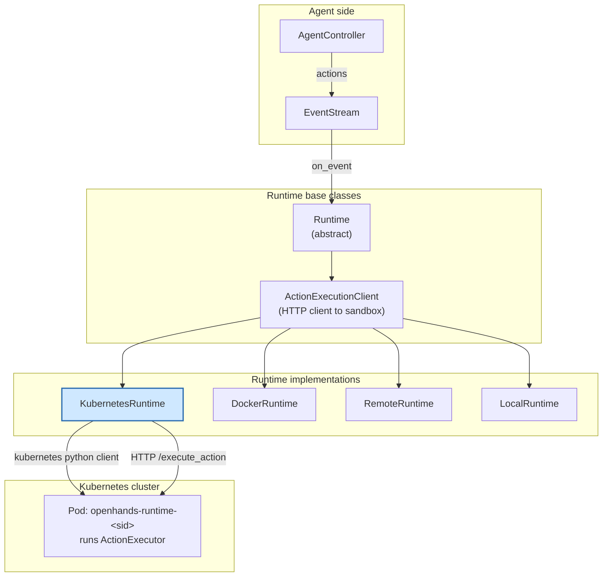
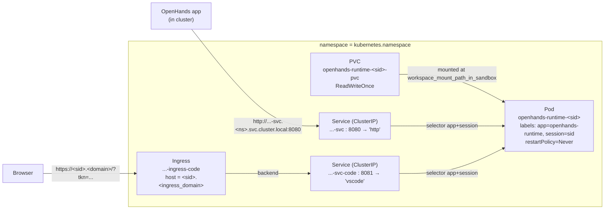
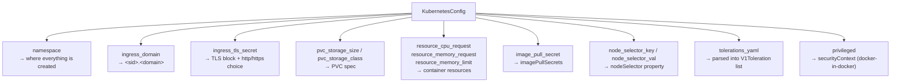
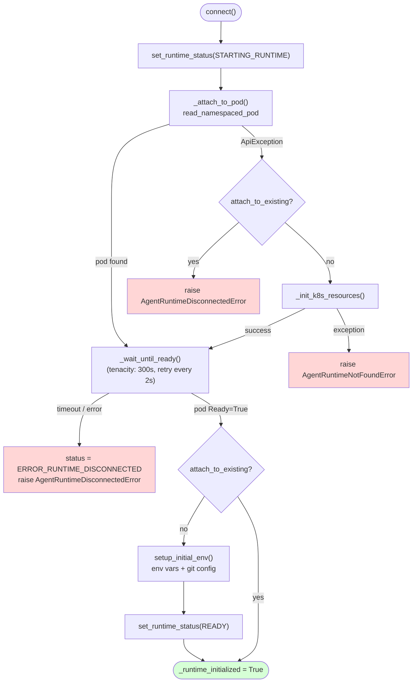
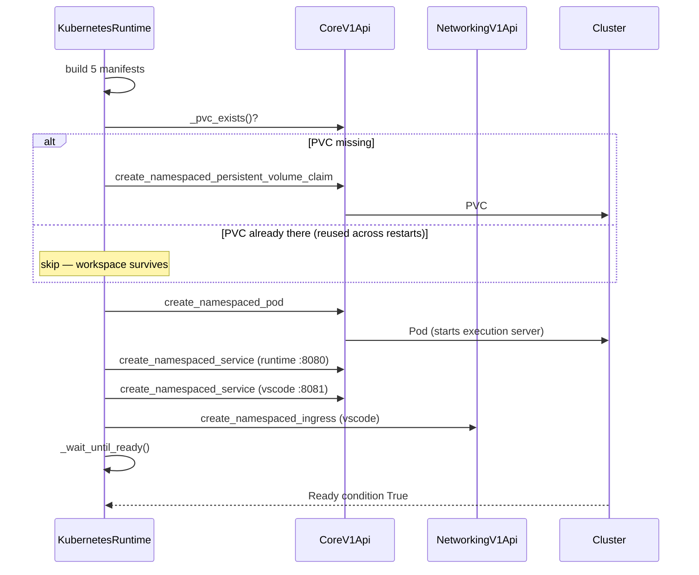
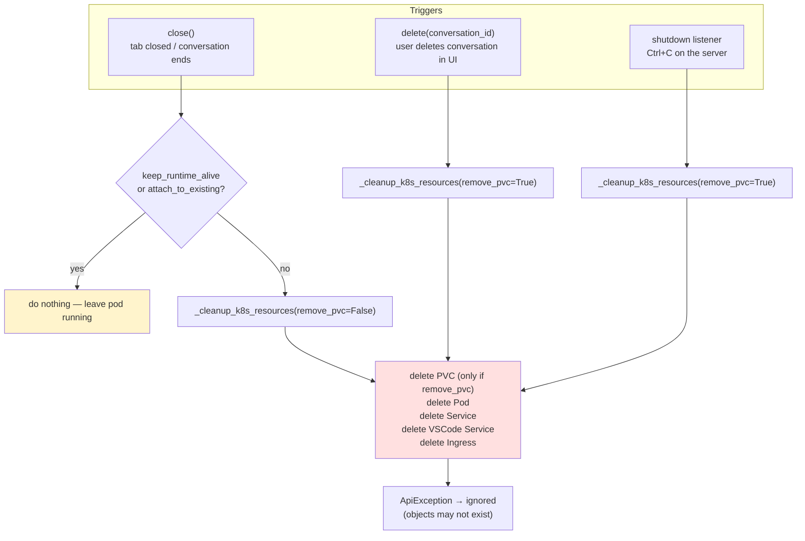
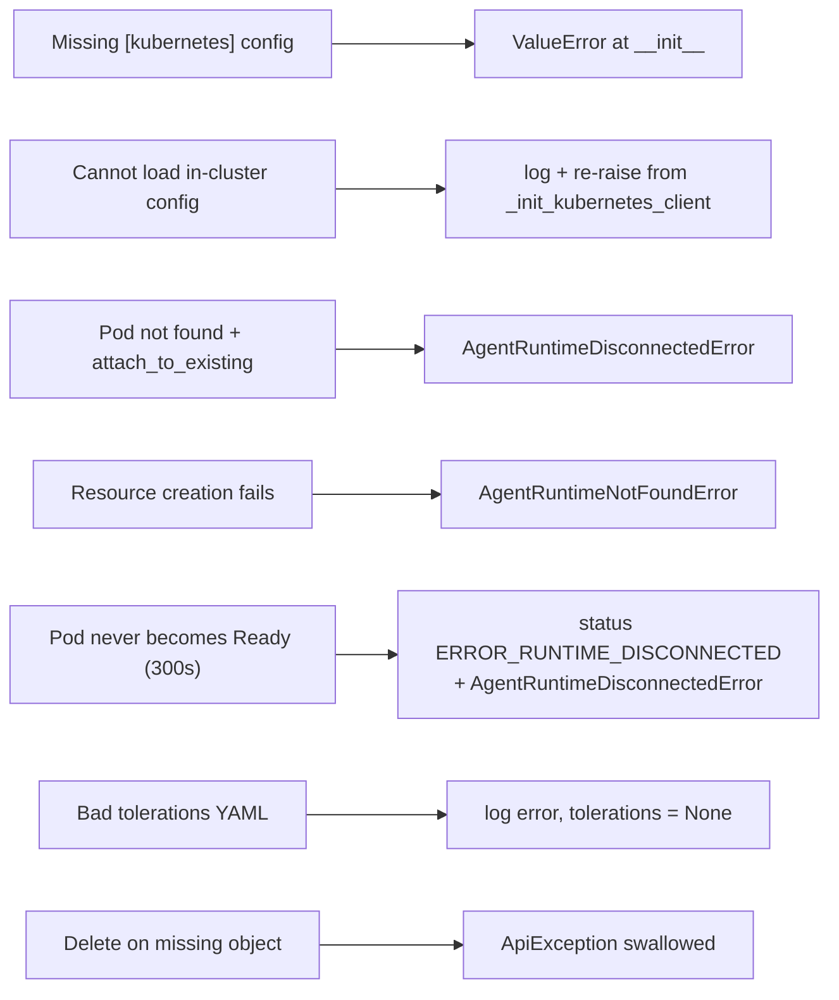
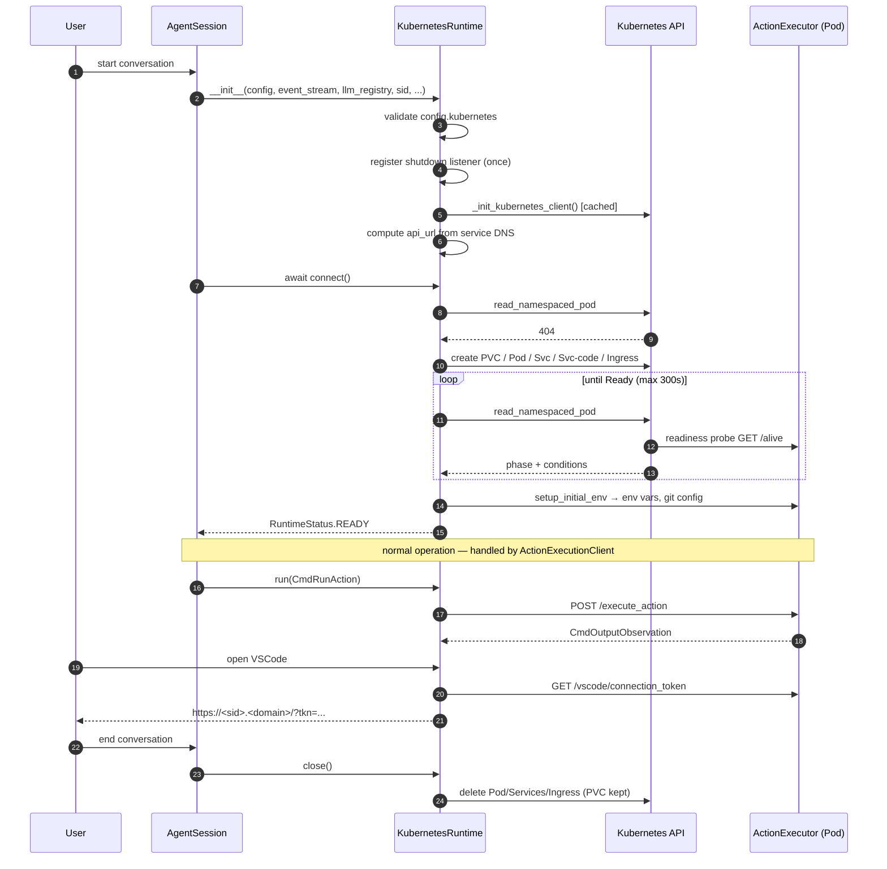

# Kubernetes Runtime

## Introduction

The **Kubernetes Runtime** gives OpenHands a sandbox that lives inside a Kubernetes cluster. Instead of starting a container on the local Docker daemon (see [Docker Runtime](runtime_implementations_docker.md)) or asking a hosted API for a sandbox (see [Remote Runtime](runtime_implementations_orchestrated_remote_runtime.md)), it creates real Kubernetes objects — a **Pod**, two **Services**, a **PersistentVolumeClaim**, and an **Ingress** — and talks to the agent's execution server through in-cluster DNS.

The whole module is one class:

| Component | File |
| --- | --- |
| `KubernetesRuntime` | `openhands/runtime/impl/kubernetes/kubernetes_runtime.py` |

It is a thin orchestration layer. All the "how do I run a command in the sandbox?" logic already lives in its parent class, `ActionExecutionClient`. This module only answers one question: **how do I get a pod running and reachable?**

---

## 1. Where this module sits



- The class hierarchy is `Runtime` → `ActionExecutionClient` → `KubernetesRuntime`.
- Actions arrive from the [agent controller](agent_controller_core.md) through the [event system](event_system.md).
- The pod itself runs the [action execution server](runtime_implementations_action_execution_server.md), which is the process that actually runs bash, Jupyter, and file edits.

### What the parent class already does

`KubernetesRuntime` **does not** implement `run`, `read`, `write`, `edit`, `browse`, or `copy_to`. `ActionExecutionClient` implements all of them by POSTing JSON to `{action_execution_server_url}/execute_action`. The subclass only supplies that URL:

```python
@property
def action_execution_server_url(self):
    return self.api_url   # http://<pod>-svc.<ns>.svc.cluster.local:8080
```

So the division of labour is clean:

| Concern | Owner |
| --- | --- |
| Create/destroy the sandbox | `KubernetesRuntime` |
| Know the sandbox address | `KubernetesRuntime` (`action_execution_server_url`) |
| Send actions, get observations | `ActionExecutionClient` |
| Subscribe to the event stream, env vars, git, microagents | `Runtime` |

---

## 2. The Kubernetes objects it creates

Five objects are created per conversation. Every name is derived from the session id (`sid`), so a conversation always maps to a predictable set of resources.



### Naming helpers

All names come from static helpers, which is what makes cleanup possible without storing state:

| Helper | Result |
| --- | --- |
| `_get_pod_name(sid)` | `openhands-runtime-<sid>` |
| `_get_svc_name(pod)` | `<pod>-svc` |
| `_get_vscode_svc_name(pod)` | `<pod>-svc-code` |
| `_get_vscode_ingress_name(pod)` | `<pod>-ingress-code` |
| `_get_pvc_name(pod)` | `<pod>-pvc` |
| `_get_vscode_tls_secret_name(pod)` | `<pod>-tls-secret` |

### Ports

| Port | Name | Purpose |
| --- | --- | --- |
| `8080` | `http` | Action execution server (fixed default) |
| `8081` | `vscode` | VSCode server, exposed via Ingress |
| `30082`, `30083` | — | "App ports" the agent should prefer when it starts a web app; surfaced through `web_hosts` |

---

## 3. Configuration

Configuration comes from the `[kubernetes]` TOML section, parsed into `KubernetesConfig` (see [core configuration](core_configuration.md)). The constructor **hard-fails** if this section is missing:

```python
if self.config.kubernetes is None:
    raise ValueError('Kubernetes configuration is required when using KubernetesRuntime. ...')
```



Two config values are turned into properties with defensive behaviour:

- **`node_selector`** — returns `None` unless *both* key and value are set.
- **`tolerations`** — parses `tolerations_yaml`. If the YAML is malformed, or is not a list, it logs an error and returns `None` rather than crashing the pod creation.

The container image comes from `sandbox.runtime_container_image`, falling back to `sandbox.base_container_image`. Unlike the [Docker runtime](runtime_implementations_docker.md), this module never *builds* an image — see [runtime image builders](runtime_image_builders.md) for that side.

---

## 4. Connection lifecycle

`connect()` is the entry point. It has two paths: attach to a pod that already exists, or create everything from scratch.



A subtle point: the *first* thing `connect()` does is try to attach, even when `attach_to_existing` is `False`. The flag only decides what happens **when the attach fails** — either give up with a disconnect error, or fall through and build the resources. This makes reconnecting to a still-running pod free.

Every blocking Kubernetes call is wrapped in `call_sync_from_async` so the async event loop is not blocked by the synchronous `kubernetes` client.

### Readiness polling

```python
@tenacity.retry(
    stop=tenacity.stop_after_delay(300) | stop_if_should_exit(),
    retry=tenacity.retry_if_exception_type(TimeoutError),
    reraise=True,
    wait=tenacity.wait_fixed(2),
)
def _wait_until_ready(self): ...
```

Readiness is checked **through the Kubernetes API**, not by hitting the HTTP endpoint directly: the method reads the pod and looks for `phase == 'Running'` plus a `Ready` condition with status `True`. That `Ready` condition is driven by the container's readiness probe, which does `GET /alive` on port 8080 — so indirectly it *is* an app-level health check, just routed through the kubelet.

`stop_if_should_exit()` (from [runtime utils](runtime_utils.md)) means a Ctrl+C during startup breaks the retry loop instead of hanging for the full 5 minutes.

---

## 5. Resource creation order

`_init_k8s_resources()` creates objects in a deliberate order, because the pod cannot bind a volume that does not exist yet, and the Ingress backend should point at an existing Service.



`_pvc_exists()` treats a `404` as "not there" and returns `False`; any other API error is logged. Because the PVC is checked before creation, a pod that is deleted and recreated for the same `sid` keeps its workspace files.

### Pod manifest highlights

`_get_runtime_pod_manifest()` assembles the container:

- **Env vars**: `port`, `PYTHONUNBUFFERED=1`, `VSCODE_PORT`, plus `DEBUG=true` when debugging, plus everything in `sandbox.runtime_startup_env_vars`.
- **Command**: built by `get_action_execution_server_startup_command(...)` with `override_user_id=0` and `override_username='root'`. This override is intentional — running as the `openhands` user breaks file permissions inside the VSCode editor.
- **Volume**: the PVC is mounted at `config.workspace_mount_path_in_sandbox`.
- **Readiness probe**: `GET /alive`, 5s initial delay, 10s period, 3 failures allowed.
- **`restartPolicy: Never`**: a crashed sandbox stays crashed rather than silently restarting with a fresh process tree.
- **`securityContext.privileged`**: driven by config, needed for docker-in-docker workloads.

---

## 6. Networking and access paths

There are two distinct network paths, and they are worth separating clearly.

```mermaid
graph TB
    subgraph InCluster["Path A — control plane traffic (in-cluster only)"]
        APP["OpenHands server / agent"]
        SVC1["Service ...-svc:8080"]
        EXEC["ActionExecutor in pod"]
        APP -->|"http://...svc.cluster.local:8080<br/>/execute_action, /alive,<br/>/list_files, /upload_file, /mcp/sse"| SVC1 --> EXEC
    end

    subgraph External["Path B — human traffic (external)"]
        BROWSER["User browser"]
        INGRESS["Ingress<br/>&lt;sid&gt;.&lt;ingress_domain&gt;"]
        SVC2["Service ...-svc-code:8081"]
        VSCODE["VSCode server in pod"]
        BROWSER -->|"https://&lt;sid&gt;.&lt;domain&gt;/?tkn=&amp;folder="| INGRESS --> SVC2 --> VSCODE
    end
```



**Path A** uses cluster-internal DNS, which is why the runtime builds:

```python
self.k8s_local_url = f'http://{self._get_svc_name(self.pod_name)}.{self._k8s_namespace}.svc.cluster.local'
self.api_url = f'{self.k8s_local_url}:{self._container_port}'
```

This is the key architectural constraint: **the OpenHands server must itself run inside the cluster** (or be tunnelled in, e.g. with `mirrord`). That is also why the client initialiser only calls `config.load_incluster_config()`.

**Path B** is the VSCode URL:

```python
protocol = 'https' if self._k8s_config.ingress_tls_secret else 'http'
vscode_url = f'{protocol}://{self.ingress_domain}/?tkn={token}&folder={...}'
```

The token comes from `ActionExecutionClient.get_vscode_token()`, which fetches and caches it from the execution server. The Ingress also carries an `external-dns.alpha.kubernetes.io/hostname` annotation so external-dns can publish the per-conversation DNS record automatically.

`web_hosts` exposes the app ports back to the agent so it knows which URLs a web server it starts will be reachable at.

---

## 7. Client initialisation

```python
@staticmethod
@lru_cache(maxsize=1)
def _init_kubernetes_client() -> tuple[client.CoreV1Api, client.NetworkingV1Api]:
    config.load_incluster_config()
    return client.CoreV1Api(), client.NetworkingV1Api()
```

Two details matter:

- **`lru_cache(maxsize=1)`** makes this a process-wide singleton. Many conversations share one pair of API clients, and — importantly — the static cleanup path can obtain clients without an instance.
- **Only in-cluster config** is loaded. Even local development with `mirrord` presents an in-cluster service account, so there is no `load_kube_config()` fallback.

---

## 8. Teardown

Cleanup is the trickiest part of the module, because it has to work in three different situations with three different meanings for "the workspace".



| Trigger | `remove_pvc` | Effect on workspace files |
| --- | --- | --- |
| `close()` — session ends | `False` | **Kept.** Reconnecting to the same `sid` restores files. |
| `delete(conversation_id)` — explicit delete | `True` | **Destroyed.** |
| Shutdown listener — Ctrl+C | `True` | **Destroyed.** |

`_cleanup_k8s_resources` is a `@staticmethod` that takes `namespace` and `conversation_id` and rebuilds every resource name from them. It never touches instance state, so `delete()` — a `@classmethod` invoked when no runtime object exists — can still clean up. It leans on the class-level `_namespace`, which is set during construction:

```python
_shutdown_listener_id: UUID | None = None
_namespace: str = ''
```

Both are class attributes shared across instances. `_shutdown_listener_id` guards against registering the shutdown hook more than once. `_namespace` is a pragmatic shortcut so the classmethod `delete()` knows where to look — it means a single process is assumed to use one namespace.

All delete calls sit inside one `try` block that swallows `ApiException`. Deleting a resource that was never created (for example the Ingress when creation failed halfway) is treated as success, so cleanup is idempotent and never blocks shutdown.

---

## 9. Error handling summary



The first four are fatal to the conversation and surface as `RuntimeStatus` values that reach the UI through the `status_callback`. The last two are deliberately tolerant: a config typo should not prevent scheduling, and a missing object should not prevent cleanup.

---

## 10. Comparison with sibling runtimes

| | KubernetesRuntime | [RemoteRuntime](runtime_implementations_orchestrated_remote_runtime.md) | [DockerRuntime](runtime_implementations_docker.md) | [LocalRuntime](runtime_implementations_local_execution_local_runtime.md) |
| --- | --- | --- | --- | --- |
| Sandbox unit | Pod | API-managed sandbox | Container | Local process |
| Provisioning API | Kubernetes API | Remote HTTP API | Docker SDK | subprocess |
| Reachability | in-cluster DNS | public URL | `localhost:<port>` | `localhost:<port>` |
| Persistence | PVC survives pod deletion | provider-managed | bind mount / volume | host filesystem |
| Editor access | Ingress + TLS secret | provider URL | port mapping | direct |
| Where OpenHands must run | inside the cluster | anywhere | Docker host | the machine itself |
| Image building | none (pre-built image) | remote builder | local builder | n/a |

Both members of the *orchestrated* group share the shape "ask an external control plane for a sandbox, then speak HTTP to it". The difference is who the control plane is: a Kubernetes API server here, a hosted service in `RemoteRuntime`.

---

## 11. Full component interaction



---

## Related documentation

- [Remote Runtime](runtime_implementations_orchestrated_remote_runtime.md) — the sibling orchestrated runtime
- [Docker Runtime](runtime_implementations_docker.md) — the local container equivalent
- [Action Execution Server](runtime_implementations_action_execution_server.md) — the process running inside the pod
- [Runtime Plugins](runtime_plugins.md) — VSCode, Jupyter, agent skills mounted into the sandbox
- [Runtime Utils](runtime_utils.md) — `stop_if_should_exit`, bash session, git handler
- [Runtime Image Builders](runtime_image_builders.md) — how the sandbox image is produced
- [Core Configuration](core_configuration.md) — `KubernetesConfig` and friends
- [Event System](event_system.md) — how actions reach the runtime
- [Agent Controller](agent_controller_core.md) — the caller that drives actions
