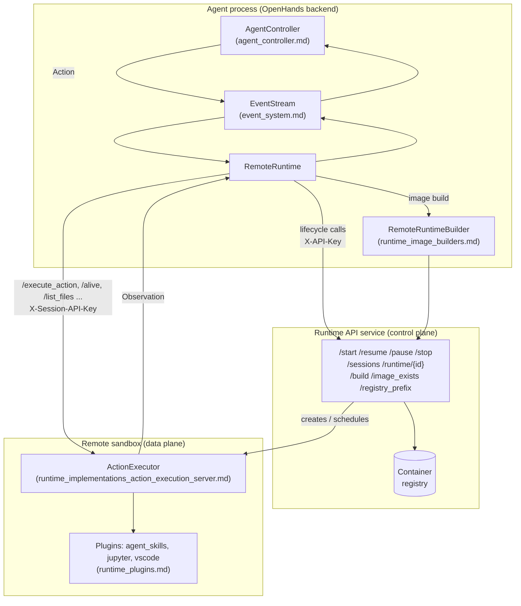
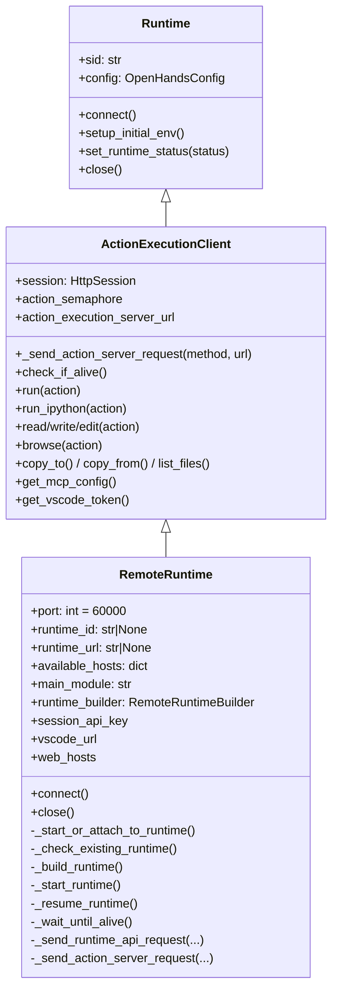
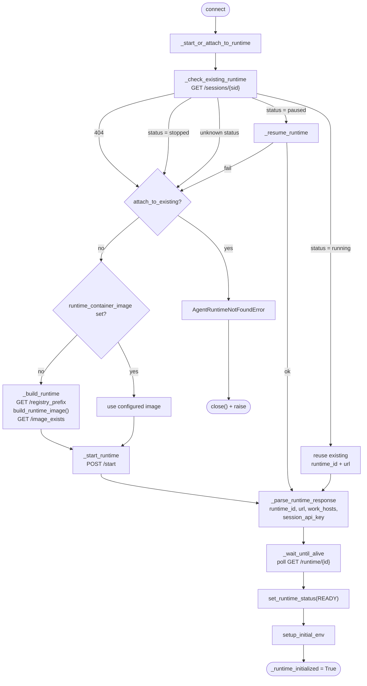
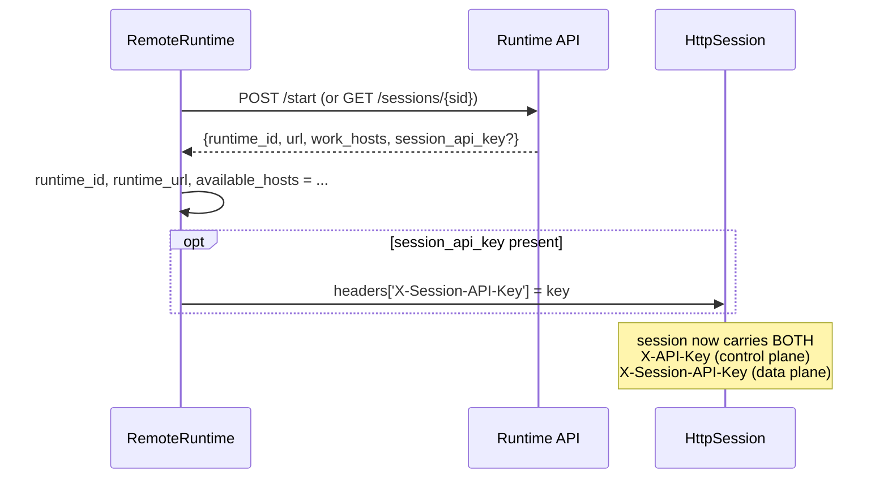
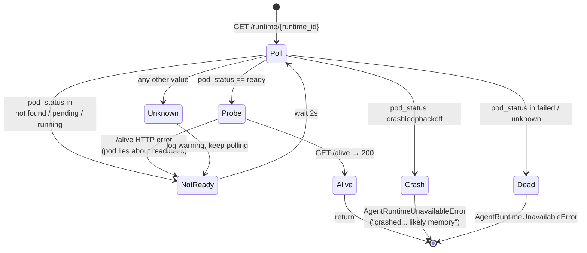
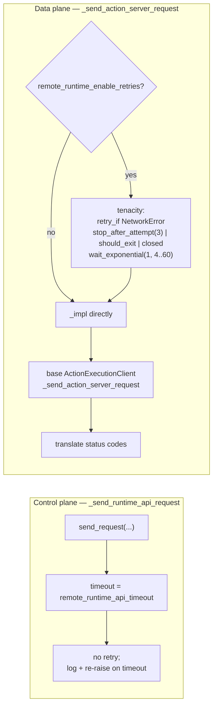
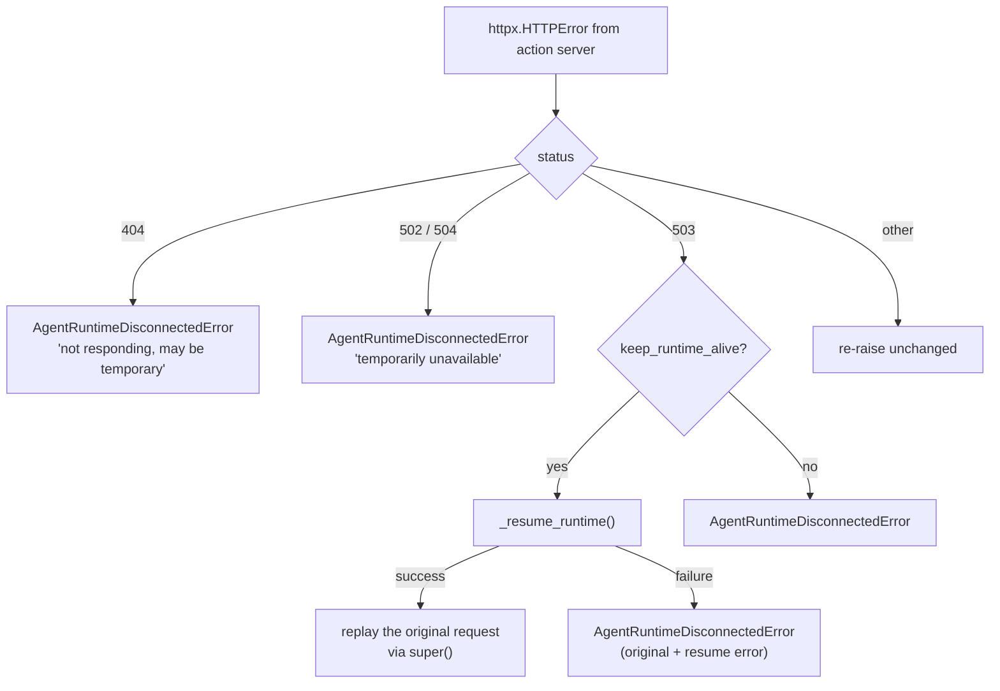
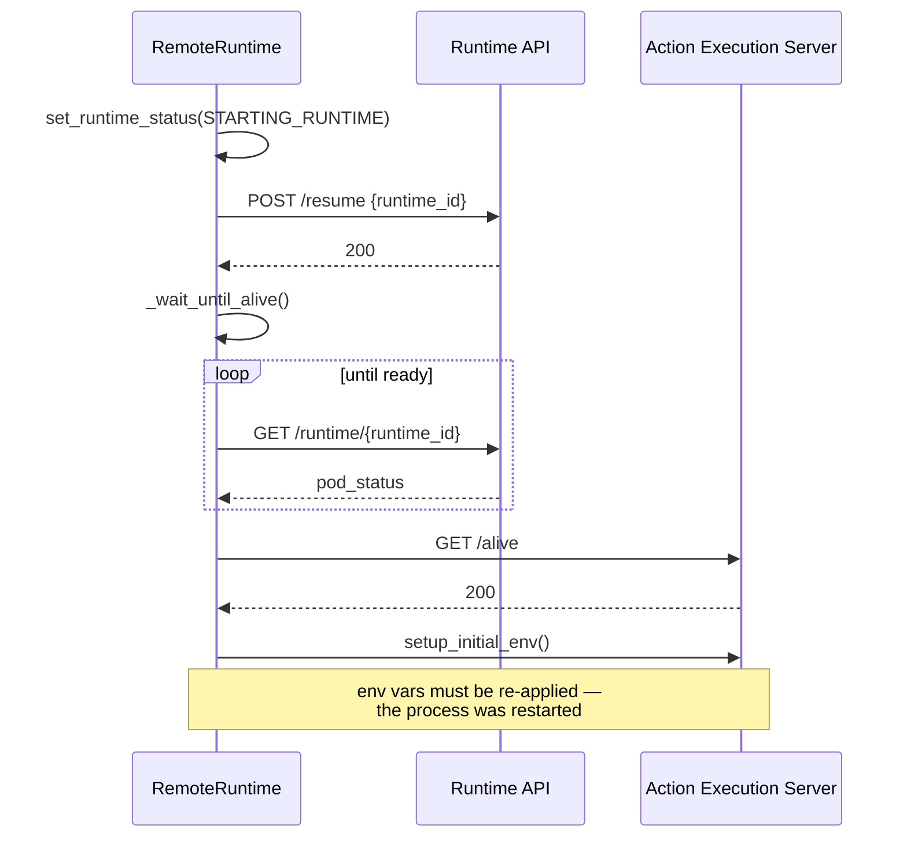
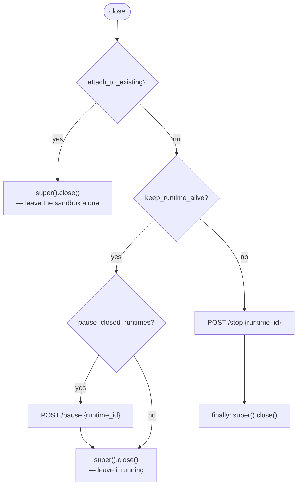
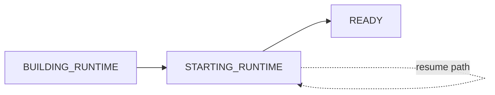

# Remote Runtime

## Introduction

The **Remote Runtime** is the sandbox implementation that OpenHands uses when the agent's
workspace does not live on the same machine as the agent. Instead of starting a container
itself, `RemoteRuntime` talks to an external **Runtime API** service over HTTPS. That
service builds images, starts pods/containers, and hands back a URL. The agent then sends
its actions to that URL.

In short, `RemoteRuntime` is a thin, stateless-looking HTTP client with two conversation
partners:

| Partner | What it does | How it is reached |
| --- | --- | --- |
| **Runtime API** (control plane) | create / resume / pause / stop sandboxes, build images, report pod health | `config.sandbox.remote_runtime_api_url` + `X-API-Key` |
| **Action Execution Server** (data plane) | run bash, run IPython, read/write/edit files, browse, MCP | `runtime_url` returned by the control plane + `X-Session-API-Key` |

This split is the single most important idea in the module. Everything else — retries,
status polling, pause/resume, VSCode URL building — hangs off it.

`RemoteRuntime` is the primary runtime used by the hosted OpenHands service. Its sibling,
[Kubernetes Runtime](runtime_implementations_orchestrated_kubernetes_runtime.md), does the
same job but drives the Kubernetes API directly instead of going through a Runtime API
service. See [Orchestrated Runtimes](runtime_implementations_orchestrated.md) for the
comparison.

---

## Where it sits in the system



The agent never learns anything about pods, nodes, or clusters. It only learns a URL and a
health status. That indirection is what lets the same `AgentController` run against
Docker, local, remote, or Kubernetes sandboxes without change.

---

## Class position

`RemoteRuntime` inherits almost all of its behaviour from `ActionExecutionClient`, the
shared base for every runtime that speaks to an action execution server over HTTP.



What `RemoteRuntime` actually adds on top of the base class is narrow and deliberate:

1. **Lifecycle** — find, build, start, resume, pause, stop a remote sandbox.
2. **Readiness** — poll pod status until the sandbox answers `/alive`.
3. **Addressing** — supply `action_execution_server_url`, `web_hosts`, `vscode_url`.
4. **Error translation** — turn raw HTTP status codes into OpenHands runtime exceptions.

Action semantics (`run`, `read`, `edit`, `browse`, MCP wiring, file upload/download) are
*not* re-implemented here. They come straight from `ActionExecutionClient`, which is why
this file is comparatively small. Compare with
[Docker Runtime](runtime_implementations_docker.md), which shares the same base class but
manages containers through the local Docker socket.

---

## Configuration surface

Everything `RemoteRuntime` needs comes from `config.sandbox` (see
[Core Configuration](core_configuration.md)). Two values are hard requirements and are
validated in `__init__`:

| Setting | Required | Purpose |
| --- | --- | --- |
| `sandbox.api_key` | **yes** — `ValueError` if missing | sent as `X-API-Key` on every control-plane call |
| `sandbox.remote_runtime_api_url` | **yes** — `ValueError` if missing | base URL of the Runtime API |
| `sandbox.remote_runtime_class` | asserted in `(None, 'sysbox', 'gvisor')` | maps to `runtime_class: sysbox-runc` in the start request; `None`/`gvisor` both fall through to the API default |
| `sandbox.runtime_container_image` | no | if set, skip building and start this image directly |
| `sandbox.base_container_image` | needed only when building | base for `build_runtime_image` |
| `sandbox.remote_runtime_resource_factor` | no (default `1`) | CPU/memory multiplier requested from the API |
| `sandbox.remote_runtime_init_timeout` | no (default `180`) | total budget for readiness polling |
| `sandbox.remote_runtime_api_timeout` | no (default `10`) | per-request timeout on control-plane calls |
| `sandbox.remote_runtime_enable_retries` | no (default `True`) | enables the network-error retry wrapper on data-plane calls |
| `sandbox.keep_runtime_alive` | no (default `False`) | on `close()`, do **not** stop the sandbox |
| `sandbox.pause_closed_runtimes` | no (default `True`) | when keeping alive, pause instead of leaving it hot |
| `sandbox.runtime_startup_env_vars` | no | merged into the sandbox process environment |
| `sandbox.force_rebuild_runtime`, `runtime_extra_deps`, `platform` | no | passed to the image build |

`config.workspace_base` is accepted but ignored — there is no host filesystem to mount, so
the runtime logs a debug note and moves on. This is a real behavioural difference from
Docker/Local runtimes and a common source of confusion.

---

## Connection flow

`connect()` is the entry point. It is deliberately small: delegate to a synchronous worker
via `call_sync_from_async`, set up the initial environment, then flip
`_runtime_initialized`. If anything throws, it closes itself first so no orphan sandbox is
left behind.



### Reattach before create

`_check_existing_runtime` is what makes browser refreshes and server restarts cheap. The
Runtime API keys sandboxes by session id, so a `GET /sessions/{sid}` tells the runtime
whether work can continue in a warm sandbox. The four outcomes:

- `running` → adopt it as-is.
- `paused` → call `_resume_runtime`; on failure fall back to "no usable runtime" rather
  than aborting the whole connection.
- `stopped` → treat as absent.
- `404` → treat as absent.

`attach_to_existing=True` turns "absent" into a hard `AgentRuntimeNotFoundError`. That
mode is used by tooling that must not create infrastructure — evaluation harnesses,
inspection scripts, and the nested-conversation manager in the
[SaaS overlay](enterprise_server.md).

### Build only when needed

Building is the slow path and is skipped whenever `runtime_container_image` is configured.
When it does run, `_build_runtime`:

1. asks the API for a `registry_prefix` and exports it as
   `OH_RUNTIME_RUNTIME_IMAGE_REPO` — this is how the shared build code learns *where* to
   push;
2. calls `build_runtime_image(...)` with `RemoteRuntimeBuilder` as the builder, so the
   actual docker build happens *inside the remote service*, not locally (see
   [Runtime Image Builders](runtime_image_builders.md));
3. verifies the result with `GET /image_exists` and raises `AgentRuntimeError` if the tag
   is somehow missing.

Note the environment-variable handoff in step 1: it is process-global mutable state, which
matters if several runtimes with different registries are built in one process.

### Start request

`_start_runtime` builds the sandbox spec and posts it:

```
POST /start
{
  "image":           <container_image>,
  "command":         get_action_execution_server_startup_command(
                        server_port=60000, plugins, app_config, main_module),
  "working_dir":     "/openhands/code/",
  "environment":     {DEBUG?, **sandbox.runtime_startup_env_vars},
  "session_id":      <sid>,
  "resource_factor": <remote_runtime_resource_factor>,
  "runtime_class":   "sysbox-runc"          # only when remote_runtime_class == 'sysbox'
}
```

The `command` is produced by the same shared helper every runtime uses, so a remote
sandbox boots the identical action execution server with the identical plugin flags as a
local container. `main_module` is injectable (`DEFAULT_MAIN_MODULE` by default), which is
how forks and the enterprise deployment swap in a different server entrypoint without
subclassing.

Any HTTP failure here is converted to `AgentRuntimeUnavailableError` — the caller should
not care whether it was a 500, a quota rejection, or a scheduling failure.

### Handshake result

`_parse_runtime_response` is the only place `runtime_id`, `runtime_url`, `available_hosts`,
and the session key are assigned:



One `HttpSession` carries both credentials. `session_api_key` is also exposed as a
property because `ActionExecutionClient.get_mcp_config()` needs it to authenticate the
runtime's own SSE MCP endpoint.

---

## Readiness polling

A `POST /start` that returns 200 does not mean the sandbox can accept work — the pod may
not even exist yet. `_wait_until_alive` closes that gap with a tenacity retry loop around
`_wait_until_alive_impl`.



Design points worth remembering:

- **`running` is not `ready`.** Kubernetes reports a pod as running before its readiness
  probe passes, so `running` is explicitly treated as "keep waiting".
- **`ready` is verified, not trusted.** Even at `ready`, the runtime probes `/alive`
  itself; a failure raises `AgentRuntimeNotReadyError` so the loop continues. The code
  carries a `FIXME` noting this really belongs in the `/start` endpoint.
- **Three ways to stop.** The retry composes
  `stop_after_delay(remote_runtime_init_timeout)` **|** `stop_if_should_exit()` (global
  shutdown signal, see [Runtime Utils](runtime_utils.md)) **|** `_stop_if_closed` (this
  runtime was closed underneath us). Without the latter two, a shutting-down server would
  sit for the full timeout.
- **Only `AgentRuntimeNotReadyError` retries.** `AgentRuntimeUnavailableError` is terminal
  and propagates immediately, with `reraise=True` so the caller sees the real cause rather
  than a tenacity wrapper.
- **Restart counts are logged**, not acted on — useful when diagnosing OOM loops.

---

## Two request paths, two retry policies

This is the part most worth internalising, because the two paths fail for different
reasons and therefore recover differently.



Control-plane calls are short, cheap, and idempotent-ish; they get a tight timeout and no
retry, because a hung Runtime API should surface fast. Data-plane calls carry real agent
work and are worth retrying through transient network blips — but *only* `NetworkError`,
never an HTTP error, since re-sending an action that already executed would be worse than
failing.

Note that the base class also has its own `@retry` on `_send_action_server_request`
(5 attempts, retryable-error predicate). `RemoteRuntime` overrides the method and wraps a
call to `super()`, so both layers are active on the same call — an important detail when
reasoning about worst-case latency of a single action.

### Status-code translation



The 503 branch is the clever one: a 503 from the data plane is the signature of an
auto-paused sandbox, so the runtime **self-heals** — it resumes the sandbox through the
control plane and replays the original request, all transparently to the agent. The agent
sees one slightly slow action instead of an error. This only makes sense when
`keep_runtime_alive` is on; otherwise a paused sandbox is not something we intend to
revive.

`AgentRuntimeDisconnectedError` is the signal that
[AgentController](agent_controller_core.md) uses to surface a disconnected-runtime status
to the user rather than treating it as an agent-level error.

---

## Pause / resume

`_resume_runtime` is reached from two directions: proactively at connect time (a paused
session was found) and reactively from a 503. It always runs the same three steps, and it
logs loudly at every one because resume failures are hard to debug from the outside.



Re-running `setup_initial_env` is not optional. A resumed sandbox is a *new process*, so
the environment the agent set up earlier is gone.

---

## Shutdown

`close()` has three distinct behaviours, and picking the wrong config here is how teams
end up either paying for idle sandboxes or losing warm state between turns.



Two subtleties:

- The pause and stop calls are both guarded by `if not self._runtime_closed`, so a
  double-`close()` (which happens in evaluation harnesses) will not send a second request.
- The `/stop` path uses `try/finally`, so the local HTTP session is always closed even if
  the stop call fails; the `/pause` path re-raises instead. In other words, a failure to
  pause is treated as louder than a failure to stop.

`super().close()` (from `ActionExecutionClient`) sets `_runtime_closed` and closes the
`HttpSession` — which is also what makes `_stop_if_closed` start returning `True` and
short-circuits any in-flight retry loops.

---

## Exposed endpoints for the UI

Three properties exist purely so the server and frontend can link users into the sandbox.

**`web_hosts`** returns `available_hosts`, populated from `work_hosts` in the start
response — the set of dev-server ports the sandbox exposes publicly.

**`vscode_url`** handles two different remote-runtime topologies, which is why it parses
the URL instead of string-concatenating:

| Topology | Detection | Resulting URL |
| --- | --- | --- |
| Path-based | `runtime_url` path starts with `/{runtime_id}` | `{scheme}://{netloc}/{runtime_id}/vscode?tkn=…&folder=…` |
| Subdomain-based | otherwise | `{scheme}://vscode-{netloc}/?tkn=…&folder=…` |

The token comes from `get_vscode_token()` on the base class, which fetches it from the
sandbox itself and caches it; if there is no token (VSCode plugin disabled or runtime not
yet initialised) the property returns `None`.

**`session_api_key`** exposes the per-sandbox key so MCP configuration can authenticate.

---

## Observability

`RemoteRuntime` overrides `log()` to attach `session_id` and `runtime_id` to every record
via the `extra` dict, and sets `stacklevel=2` so the emitted line points at the real call
site instead of the wrapper. Combined with the structured logging in
[Logging](logging.md), this means every remote-runtime log line can be traced back to a
specific sandbox — essential when one server process is juggling many conversations.

Progress is also reported upward as `RuntimeStatus` values through
`set_runtime_status(...)`, which the base `Runtime` forwards to the `status_callback`:



These enum values are localisation keys (`STATUS$…`), consumed by
[Server Sessions](server_sessions.md) and rendered by the
[frontend](frontend_state.md), which is how a user sees "Building runtime…" instead of a
silent wait.

---

## Failure modes at a glance

| Situation | Exception | Retried? |
| --- | --- | --- |
| `sandbox.api_key` / `remote_runtime_api_url` missing | `ValueError` at construction | no |
| `attach_to_existing` but no live sandbox | `AgentRuntimeNotFoundError` | no |
| Built image missing from registry | `AgentRuntimeError` | no |
| `POST /start` fails | `AgentRuntimeUnavailableError` | no |
| Pod pending / running / not found | `AgentRuntimeNotReadyError` | yes, every 2s until init timeout |
| Pod `crashloopbackoff` / `failed` / `unknown` | `AgentRuntimeUnavailableError` | no — terminal |
| Action server 404 / 502 / 504 | `AgentRuntimeDisconnectedError` | no |
| Action server 503 + `keep_runtime_alive` | resumed and replayed | yes, once |
| Action server 503 without `keep_runtime_alive` | `AgentRuntimeDisconnectedError` | no |
| Transient `httpx.NetworkError` on an action | propagated after retries | yes, up to 3× (plus base-class retries) |
| Control-plane timeout | `httpx.TimeoutException` | no |

---

## Related modules

- [Orchestrated Runtimes](runtime_implementations_orchestrated.md) — parent module and the
  remote-vs-Kubernetes comparison
- [Kubernetes Runtime](runtime_implementations_orchestrated_kubernetes_runtime.md) — sibling
  that drives the K8s API directly
- [Docker Runtime](runtime_implementations_docker.md) — same `ActionExecutionClient` base,
  local container lifecycle
- [Local & CLI Runtimes](runtime_implementations_local_execution.md) — no-sandbox variants
- [Action Execution Server](runtime_implementations_action_execution_server.md) — the
  server this runtime talks to
- [Runtime Image Builders](runtime_image_builders.md) — `RemoteRuntimeBuilder`,
  `build_runtime_image`
- [Runtime Plugins](runtime_plugins.md) — what the startup command activates
- [Runtime Utils](runtime_utils.md) — `send_request`, `stop_if_should_exit`
- [Core Configuration](core_configuration.md) — sandbox settings
- [Event System](event_system.md) — the `EventStream` actions and observations flow through
- [Agent Controller](agent_controller_core.md) — consumer of runtime errors and statuses
- [LLM Registry](llm_layer_registry.md) — passed through the constructor
- [Git Provider Integrations](git_provider_integrations.md) — source of
  `git_provider_tokens`
