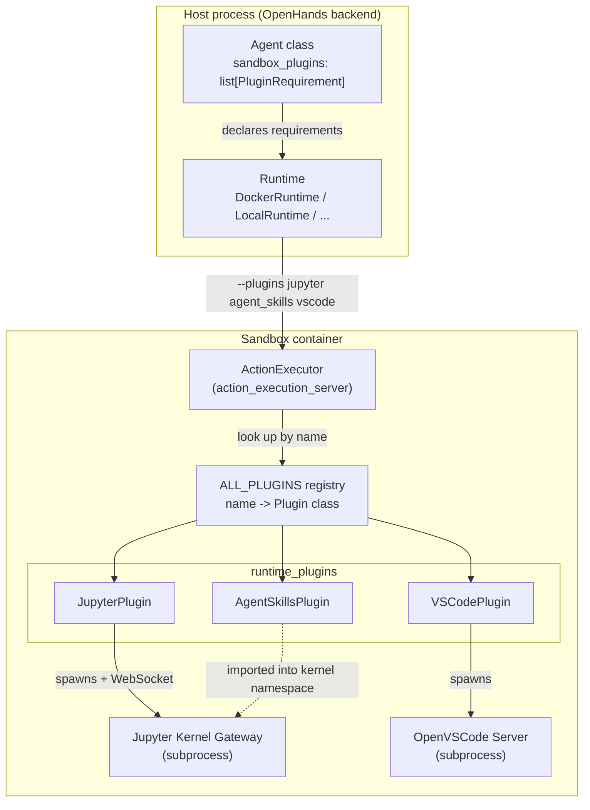
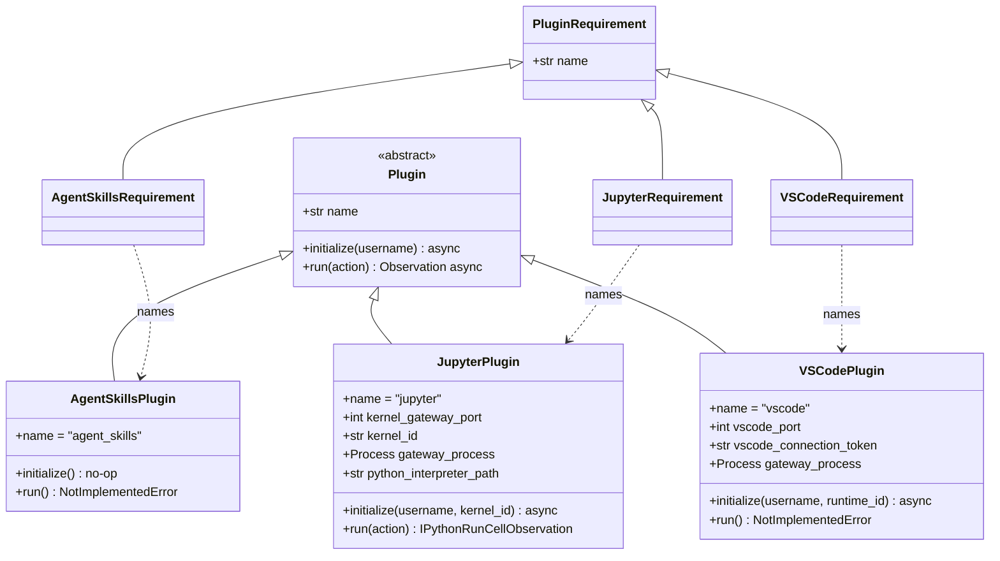
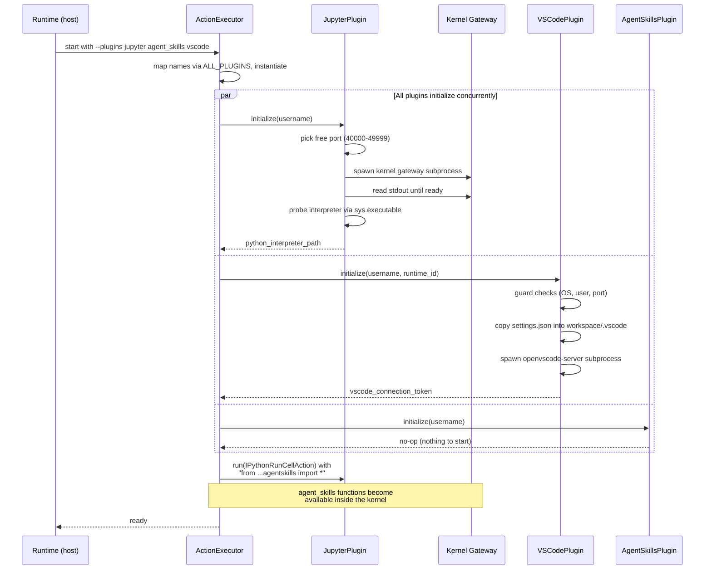
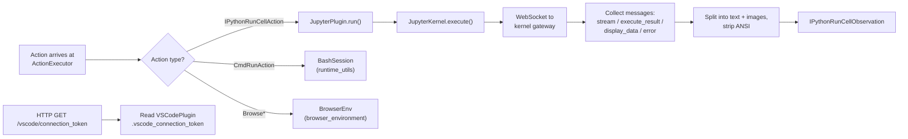

# Runtime Plugins

## Introduction

The `runtime_plugins` module gives the OpenHands sandbox its extra powers. A bare sandbox can only run shell commands. Plugins add more: running Python code in a live notebook kernel, a set of ready-made file and repo helper functions, and a full VSCode editor in the browser.

A plugin is a small, self-contained service that starts up **inside** the sandbox container, not in the main OpenHands process. When a runtime (Docker, Local, Remote, Kubernetes, ...) boots a sandbox, it starts the action execution server, and that server initializes each requested plugin. From then on, the plugin either handles a specific kind of action or just runs quietly in the background as a service.

There are three plugins today:

| Plugin | What it adds | Style |
| --- | --- | --- |
| `agent_skills` | A library of Python helper functions (file read/edit, repo search) plus their generated docs | Passive library |
| `jupyter` | A live IPython kernel so the agent can run stateful Python code | Active action handler |
| `vscode` | An OpenVSCode Server so the user can open the workspace in a browser editor | Background service |

**Related modules:** plugins are started by [runtime_implementations_action_execution_server](runtime_implementations_action_execution_server.md), which itself lives inside the sandboxes created by [runtime_implementations](runtime_implementations.md). The actions and observations plugins consume and produce are defined in [event_system](event_system.md). Which plugins get loaded is decided by the agent class in [agents](agents.md).

## Architecture Overview

### Where plugins sit



The key idea: the **host** only names the plugins it wants (as `PluginRequirement` objects). The **sandbox** owns the actual `Plugin` objects and their processes. Nothing heavy crosses the boundary.

### The plugin contract

Every plugin implements the same tiny interface from `openhands/runtime/plugins/requirement.py`:



Two methods, both async:

- `initialize(username)` — start whatever the plugin needs. Runs once at sandbox boot.
- `run(action)` — handle one action and return an observation. Plugins that are not action handlers raise `NotImplementedError` here.

The pairing is deliberate: `PluginRequirement` is a **declaration** (safe to pass around the host, just a name), while `Plugin` is the **implementation** (only ever built inside the sandbox). `ALL_PLUGINS` in `openhands/runtime/plugins/__init__.py` is the lookup table that turns a name string back into a class:

```python
ALL_PLUGINS = {
    'jupyter': JupyterPlugin,
    'agent_skills': AgentSkillsPlugin,
    'vscode': VSCodePlugin,
}
```

### Startup sequence



Notice the last step: `agent_skills` has no process of its own. It becomes useful only when the action execution server injects its functions into the Jupyter kernel's namespace. That is why the two plugins are almost always requested together.

### Action routing at runtime



Only `JupyterPlugin` is on the action path. `VSCodePlugin` is reached over a plain HTTP endpoint that hands out its connection token, and `AgentSkillsPlugin` is reached indirectly through Python code the agent writes.

## Sub-modules

The module splits into four parts: the shared contract, and one part per plugin.

### Plugin Framework

**Documentation:** [runtime_plugins_framework](runtime_plugins_framework.md)

The base `Plugin` and `PluginRequirement` classes plus the `ALL_PLUGINS` registry. This is the contract every plugin follows and the mechanism that lets the host request plugins by name without importing sandbox-only code. Small in size, but it defines the shape of everything else in the module.

### Agent Skills Plugin

**Documentation:** [runtime_plugins_agent_skills](runtime_plugins_agent_skills.md)

`AgentSkillsPlugin` exposes a curated library of Python helper functions — file reading with line numbers, file editing, multi-format document readers, and repository search helpers. Its most interesting piece is `DOCUMENTATION`: at import time it walks every exported function, reads its signature and docstring, and builds one formatted string. That string is carried by `AgentSkillsRequirement.documentation` and ends up in the agent's system prompt, so the LLM learns the API without anyone writing the docs twice.

The plugin itself is deliberately inert — `initialize` does nothing and `run` raises `NotImplementedError`. It is a library dressed as a plugin so it can ride the same requirement-declaration machinery.

### Jupyter Plugin

**Documentation:** [runtime_plugins_jupyter](runtime_plugins_jupyter.md)

The only plugin that handles actions. It has two layers:

- `JupyterPlugin` — lifecycle. Picks a free port, builds a platform-specific launch command (micromamba/poetry on a normal sandbox, plain `cd` on LocalRuntime, a `cmd`-style line on Windows), spawns the kernel gateway, waits for it to report ready, then probes the interpreter path.
- `JupyterKernel` — protocol. Opens a WebSocket to the gateway, sends `execute_request` messages, filters replies by `parent_header.msg_id`, sorts them into text and base64 PNG images, keeps the socket alive with a 10-second heartbeat, and interrupts the kernel on timeout.
- `ExecuteHandler` — a small Tornado HTTP endpoint (`POST /execute`) for driving the same kernel outside the normal action flow.

Because the kernel is long-lived, state persists between cells — variables, imports, and loaded data all survive, which is what makes the `agent_skills` injection trick work.

### VSCode Plugin

**Documentation:** [runtime_plugins_vscode](runtime_plugins_vscode.md)

`VSCodePlugin` starts an OpenVSCode Server so a human can open the sandbox workspace in a browser tab. It is heavily guarded: it disables itself on Windows, for non-`root`/`openhands` users, when `VSCODE_PORT` is unset, and when that port is already taken — in every case by logging a warning and returning, never by raising. It also generates a random UUID connection token and, when the runtime sits behind a path-based router, computes a `--server-base-path` flag so the editor's URLs resolve correctly.

## Design Notes

**Fail-soft vs. fail-hard.** The two plugins differ on purpose. `VSCodePlugin` is a convenience, so every problem degrades to a disabled plugin. `JupyterPlugin` is core capability, so a missing `OPENHANDS_REPO_PATH` under LocalRuntime raises immediately — an agent without working Python execution is worse than no agent.

**Environment as configuration.** Plugins read their settings from environment variables set by the runtime rather than from a config object: `LOCAL_RUNTIME_MODE`, `OPENHANDS_REPO_PATH`, `VSCODE_PORT`, `WORKSPACE_BASE`, `WORKSPACE_MOUNT_PATH_IN_SANDBOX`, `RUNTIME_URL`, `OPENVSCODE_SERVER_BASE_PATH`. This keeps the sandbox side dependency-free and lets any runtime implementation configure plugins the same way. See [core_configuration](core_configuration.md) for the host-side config these values come from.

**Cooperative shutdown.** Both process-spawning plugins poll `should_continue()` while waiting for their subprocess to report readiness, so a shutdown signal breaks the wait loop instead of hanging the container.

**Dynamic ports.** Jupyter picks a random free port in 40000–49999 at boot. Nothing is hard-coded, so several sandboxes can share a host without colliding. Related port-safety helpers live in [runtime_utils](runtime_utils.md).

## Related Documentation

- [runtime_implementations_action_execution_server](runtime_implementations_action_execution_server.md) — the in-sandbox server that owns and drives plugin instances
- [runtime_implementations](runtime_implementations.md) — the runtimes that create sandboxes and pass the `--plugins` flag
- [runtime_utils](runtime_utils.md) — bash sessions, port locking, and other in-sandbox helpers
- [browser_environment](browser_environment.md) — the browser capability, a sibling of the plugins
- [event_system](event_system.md) — `Action` / `Observation` definitions used by plugin `run()` methods
- [agents](agents.md) — agent classes that declare `sandbox_plugins`
- [sandboxed_execution_layer](sandboxed_execution_layer.md) — the parent module overview
