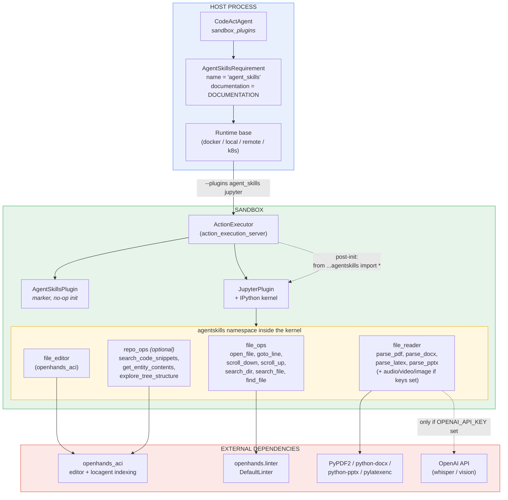
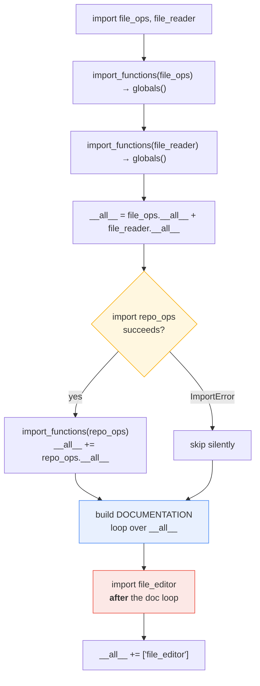
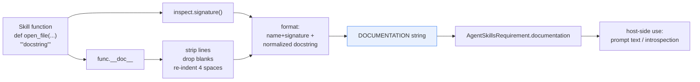
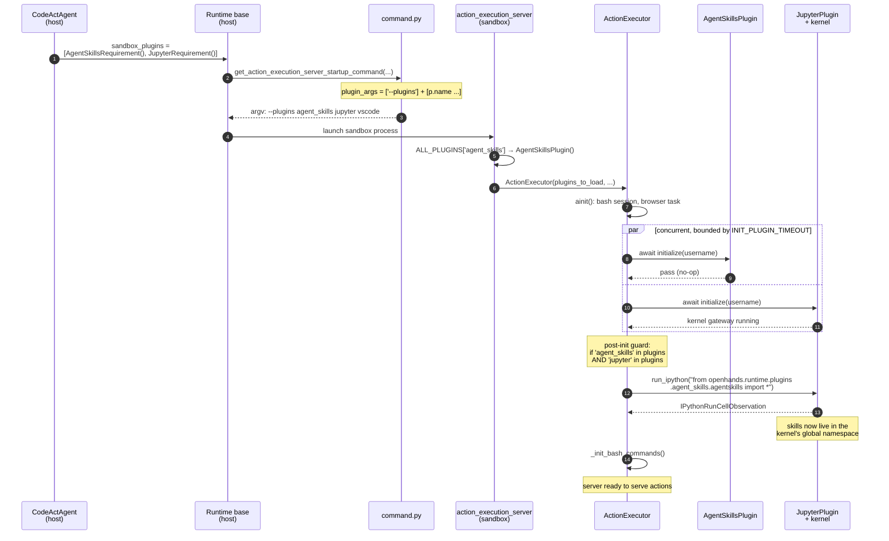
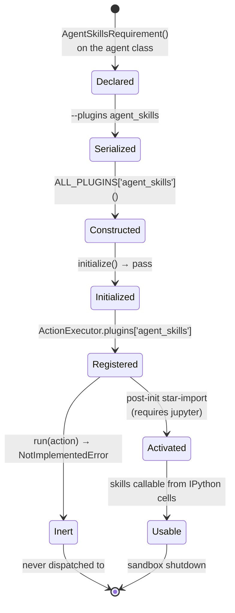
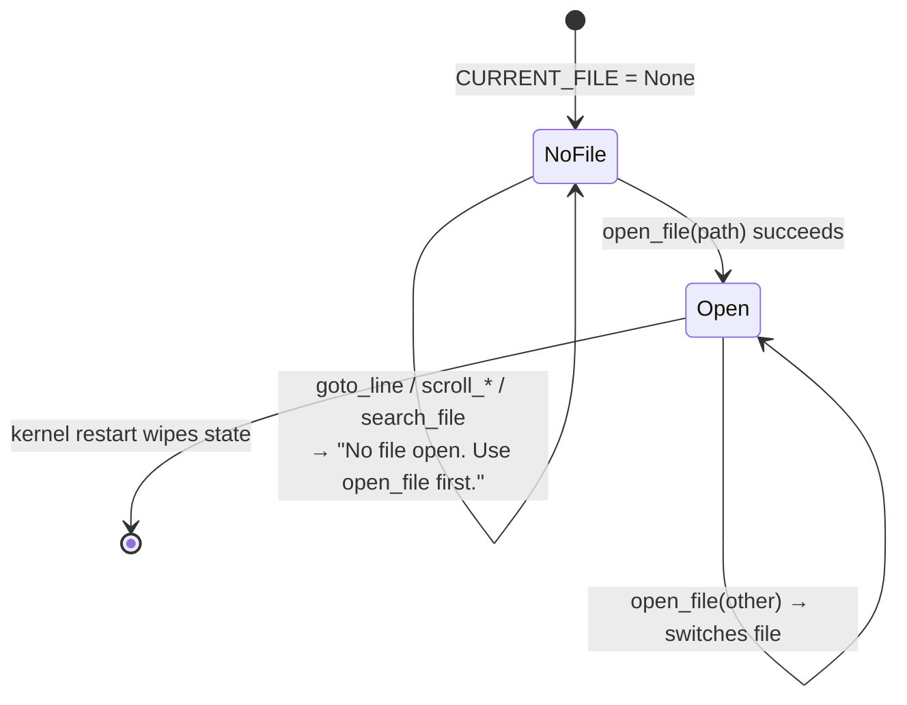
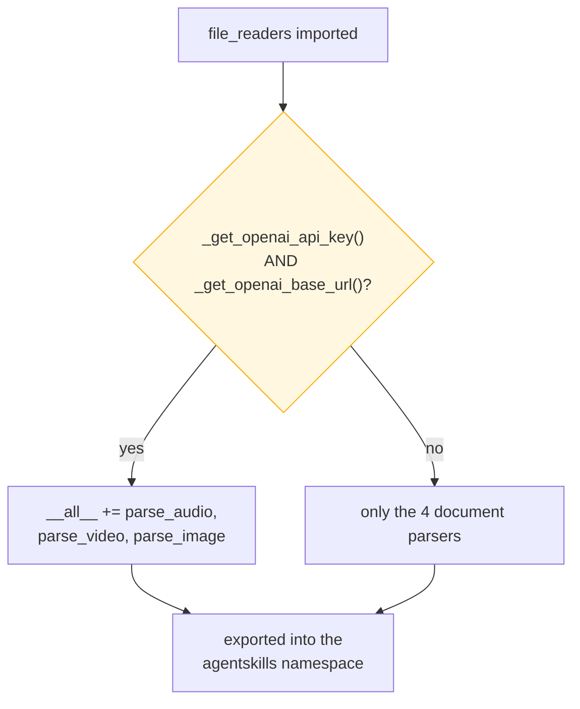
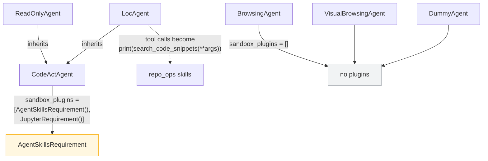
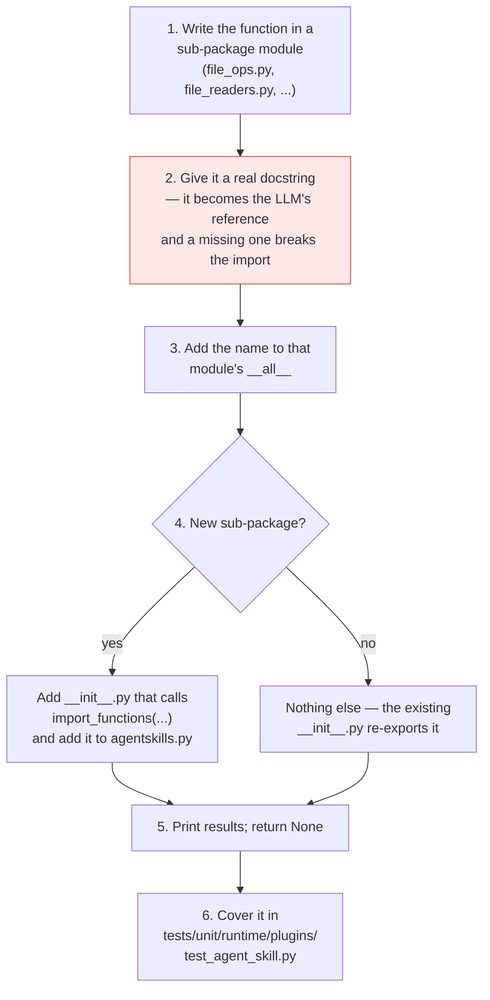

# Runtime Plugin: Agent Skills

## Introduction

The **agent skills plugin** gives the agent a library of ready-made Python functions inside the sandbox. Instead of asking the model to write file-paging or PDF-parsing code from scratch every time, OpenHands pre-loads a small set of well-tested helpers — `open_file`, `scroll_down`, `search_dir`, `parse_pdf`, `file_editor`, and a few more — straight into the sandbox's Python namespace. The agent can then call them like built-ins.

The plugin class itself is tiny and, at first glance, strange:

```python
class AgentSkillsPlugin(Plugin):
    name: str = 'agent_skills'

    async def initialize(self, username: str) -> None:
        pass                                  # does nothing

    async def run(self, action: Action) -> Observation:
        raise NotImplementedError(...)        # never called
```

Both methods of the [plugin contract](runtime_plugins_framework.md) are empty. That is not a bug. `AgentSkillsPlugin` is a **marker plugin**: its real job is done by two things around it.

1. Its **name** (`'agent_skills'`) travels to the sandbox and switches on a post-init step in the [action execution server](runtime_implementations_action_execution_server.md), which star-imports the skill library into the [Jupyter](runtime_plugins_jupyter.md) kernel.
2. Its **requirement** (`AgentSkillsRequirement`) carries a generated `documentation` string built from every skill's docstring, so the host can describe the skills to the LLM.

So the module is really three things stacked together: a plugin marker, a function library, and a documentation generator. This document covers all three. The parent overview is in [runtime_plugins](runtime_plugins.md).

---

## Table of Contents

1. [Core Components](#core-components)
2. [Package Layout](#package-layout)
3. [Architecture](#architecture)
4. [The Aggregation Module: `agentskills.py`](#the-aggregation-module-agentskillspy)
5. [Documentation Generation](#documentation-generation)
6. [The Four Skill Families](#the-four-skill-families)
7. [Activation Flow: How Skills Reach the Agent](#activation-flow-how-skills-reach-the-agent)
8. [Calling a Skill: End-to-End Data Flow](#calling-a-skill-end-to-end-data-flow)
9. [Editor State and the Sliding Window](#editor-state-and-the-sliding-window)
10. [Environment-Gated Skills](#environment-gated-skills)
11. [Who Uses This Plugin](#who-uses-this-plugin)
12. [Design Notes and Sharp Edges](#design-notes-and-sharp-edges)
13. [Adding a New Skill](#adding-a-new-skill)
14. [Related Modules](#related-modules)

---

## Core Components

`openhands/runtime/plugins/agent_skills/__init__.py` holds the whole public surface — 26 lines:

| Component | Kind | Runs on | Role |
|---|---|---|---|
| `AgentSkillsPlugin` | `Plugin` subclass | Sandbox | Marker. Presence of the name `'agent_skills'` in `ActionExecutor.plugins` triggers the star-import step. |
| `AgentSkillsRequirement` | `PluginRequirement` dataclass | Host | Declaration attached to an agent class. Also carries `documentation`, the generated skill reference text. |
| `agentskills` (module) | Aggregation module | Both | Collects every skill function into one flat namespace and builds `DOCUMENTATION`. |

```python
@dataclass
class AgentSkillsRequirement(PluginRequirement):
    name: str = 'agent_skills'
    documentation: str = agentskills.DOCUMENTATION


class AgentSkillsPlugin(Plugin):
    name: str = 'agent_skills'
```

The two `name` values must be the same string. Nothing in the type system enforces that — it is the naming convention described in [runtime_plugins_framework](runtime_plugins_framework.md).

Note the import side effect: the `@dataclass` field default `agentskills.DOCUMENTATION` is evaluated at **class definition time**. Simply importing `openhands.runtime.plugins` runs the whole skill library import chain — PDF, DOCX, PowerPoint, LaTeX, and `openhands_aci` libraries all get pulled in. See [Design Notes](#design-notes-and-sharp-edges).

---

## Package Layout

```
openhands/runtime/plugins/agent_skills/
├── __init__.py           # AgentSkillsPlugin + AgentSkillsRequirement  (the core components)
├── agentskills.py        # aggregation: flat namespace + DOCUMENTATION
├── README.md             # inclusion criteria for new skills
├── utils/
│   ├── dependency.py     # import_functions() — the re-export helper
│   └── config.py         # lazy OpenAI credential/env readers
├── file_ops/             # open / navigate / search files   (7 skills)
│   ├── __init__.py
│   └── file_ops.py
├── file_reader/          # parse PDF / DOCX / LaTeX / PPTX / media  (4–7 skills)
│   ├── __init__.py
│   └── file_readers.py
├── repo_ops/             # code-graph search, optional         (3 skills)
│   ├── __init__.py
│   └── repo_ops.py
└── file_editor/          # thin re-export of openhands_aci's editor (1 skill)
    ├── __init__.py
    └── README.md
```

Every sub-package uses the same two-file shape: an implementation module, plus an `__init__.py` that re-exports its `__all__` through `import_functions`. That helper is four lines and does one thing — copy named attributes from a module into a target namespace, raising if one is missing:

```python
def import_functions(module, function_names, target_globals) -> None:
    for name in function_names:
        if hasattr(module, name):
            target_globals[name] = getattr(module, name)
        else:
            raise ValueError(f'Function {name} not found in {module.__name__}')
```

The strictness matters. A typo in an `__all__` list fails loudly at import time, not silently at agent runtime.

---

## Architecture



Two arrows carry the whole design:

- The **solid** arrow from `Runtime` to the sandbox carries only the plugin *name*. That is all the [framework](runtime_plugins_framework.md) serializes.
- The **dotted** arrow inside the sandbox is the real activation: the executor runs one IPython cell that star-imports the library. The plugin object itself does nothing.

---

## The Aggregation Module: `agentskills.py`

This file flattens three sub-packages into a single importable namespace, then builds the documentation string. It runs top to bottom in a specific order, and the order has consequences.



Three ordering facts worth remembering:

1. **`repo_ops` is optional.** It is wrapped in `try / except ImportError` because it depends on `openhands_aci.indexing.locagent`, which brings heavy indexing dependencies. If those are missing, the other skills still load. This makes the exact skill list environment-dependent.
2. **`file_editor` is imported after the documentation loop.** So `file_editor` is in `__all__` and callable, but its docstring is **not** in `DOCUMENTATION`. The agent learns about it from tool schemas and prompts instead — see [agents_codeact_variants](agents_codeact_variants.md).
3. **`__all__` is built by concatenation, not mutation.** `file_ops.__all__ + file_reader.__all__` makes a new list, so the later `+=` calls never corrupt the sub-packages' own `__all__`.

---

## Documentation Generation

`DOCUMENTATION` is a plain string built by walking `__all__`, reading each function's `__doc__`, and normalizing the indentation:

```python
DOCUMENTATION = ''
for func_name in __all__:
    func = globals()[func_name]
    cur_doc = func.__doc__
    # strip each line, drop empty lines, then re-indent by 4 spaces
    cur_doc = '\n'.join(filter(None, map(lambda x: x.strip(), cur_doc.split('\n'))))
    cur_doc = '\n'.join(map(lambda x: ' ' * 4 + x, cur_doc.split('\n')))
    fn_signature = f'{func.__name__}' + str(signature(func))
    DOCUMENTATION += f'{fn_signature}:\n{cur_doc}\n\n'
```

The result is a signature-plus-docstring reference block, one entry per skill:

```
open_file(path: str, line_number: int | None = 1, context_lines: int | None = 100):
    Opens a file in the editor and optionally positions at a specific line.
    ...
```



**This string never crosses into the sandbox.** Only the plugin `name` is serialized into the startup argv. `documentation` is host-side metadata, available to prompt construction ([`PromptManager`](core_schema_and_runtime_support.md)) and to anything else that wants a human-readable skill list.

**The generator has no fallback for a missing docstring.** If a function listed in `__all__` has `__doc__ == None`, `cur_doc.split('\n')` raises `AttributeError` at import time — which means the whole `openhands.runtime.plugins` package fails to import. In practice this is a useful guardrail: a skill without documentation is a skill the LLM cannot use.

---

## The Four Skill Families

### 1. `file_ops` — stateful file navigation

Seven functions that emulate a simple pager. They print to stdout (the agent reads the printed text) and return `None`.

| Skill | What it does |
|---|---|
| `open_file(path, line_number=1, context_lines=100)` | Opens a file, prints a window centered on a line, sets it as the current file |
| `goto_line(line_number)` | Moves the window in the current file |
| `scroll_down()` / `scroll_up()` | Moves the window by `WINDOW` (100) lines |
| `search_dir(search_term, dir_path='./')` | Recursive plain-substring grep; refuses if more than 100 files match |
| `search_file(search_term, file_path=None)` | Searches one file, or the current file |
| `find_file(file_name, dir_path='./')` | Recursive filename substring search |

Output is deliberately shaped for an LLM reader: line-numbered content, plus markers like `(42 more lines above)`, `(this is the end of the file)`, and a hint `[Use `scroll_down` to view the next 100 lines of the file!]`.

The module also imports `DefaultLinter` from `openhands.linter` and defines `MSG_FILE_UPDATED` / `LINTER_ERROR_MSG`, the messages used when an edit introduces a syntax error.

### 2. `file_reader` — document and media parsing

| Skill | Backing library | Always available? |
|---|---|---|
| `parse_pdf` | `PyPDF2` | Yes |
| `parse_docx` | `python-docx` | Yes |
| `parse_latex` | `pylatexenc` | Yes |
| `parse_pptx` | `python-pptx` | Yes |
| `parse_audio` | OpenAI Whisper | Only if credentials are set |
| `parse_image` | OpenAI vision model | Only if credentials are set |
| `parse_video` | OpenAI vision model, frame sampling | Only if credentials are set |

All of them print their extracted text rather than returning it, keeping the interface uniform with `file_ops`. See [Environment-Gated Skills](#environment-gated-skills) for the conditional three.

### 3. `repo_ops` — code-graph search (optional)

A pure re-export of three tools from `openhands_aci.indexing.locagent`:

```python
from openhands_aci.indexing.locagent.tools import (
    explore_tree_structure, get_entity_contents, search_code_snippets,
)
```

These power [`LocAgent`](agents_codeact_variants.md), which turns LLM tool calls into `IPythonRunCellAction`s of the form `print(search_code_snippets(**{...}))` rather than dispatching them as native actions. In other words, the agent-skills namespace *is* LocAgent's tool implementation layer.

### 4. `file_editor` — the ACI editor

A one-line re-export of `openhands_aci.editor.file_editor`. This is the same editing engine the [action execution server](runtime_implementations_action_execution_server.md) uses natively through `OHEditor` for `FileEditAction` / `FileReadAction`. Exposing it here as a callable lets it also be reached from an IPython cell.

There is a legacy trace of that path in `openhands/events/serialization/action.py`: deprecated events whose `translated_ipython_code` starts with `print(file_editor(**` are parsed back into structured edit actions. New code uses the native action path.

---

## Activation Flow: How Skills Reach the Agent



The key block, in `ActionExecutor.ainit()`:

```python
# This is a temporary workaround
# TODO: refactor AgentSkills to be part of JupyterPlugin
# AFTER ServerRuntime is deprecated
if 'agent_skills' in self.plugins and 'jupyter' in self.plugins:
    obs = await self.run_ipython(
        IPythonRunCellAction(
            code='from openhands.runtime.plugins.agent_skills.agentskills import *\n'
        )
    )
```

Three implications:

- **Agent skills without Jupyter is a silent no-op.** The `and` guard means declaring only `AgentSkillsRequirement()` loads nothing anywhere the agent can reach. The two requirements are a package deal.
- **Activation happens after the concurrent plugin init barrier**, not during it. `CodeActAgent` lists `AgentSkillsRequirement()` before `JupyterRequirement()` with a comment about ordering, but plugin `initialize()` calls actually run concurrently. The real ordering guarantee comes from this post-init step, which runs once both plugins are up.
- **The import runs inside the kernel process**, so it re-executes the whole `agentskills.py` chain in that interpreter — including the environment checks described below.

### Why the plugin is a marker, not a service



`AgentSkillsPlugin.run()` raising `NotImplementedError` is safe because nothing dispatches to it. Actions reach [`JupyterPlugin.run()`](runtime_plugins_jupyter.md) as `IPythonRunCellAction`s; the skills are just names already present in that kernel. The plugin object is a flag, and the flag's only reader is the `if` above.

---

## Calling a Skill: End-to-End Data Flow

```mermaid
flowchart LR
    LLM["LLM emits<br/>execute_ipython_cell<br/>code = open_file('/workspace/a.py', 120)"]
    ACT["IPythonRunCellAction<br/>(event system)"]
    STREAM["EventStream"]
    RTC["Runtime client<br/>POST /execute_action"]
    EXEC["ActionExecutor.run_ipython()"]
    SYNC["cwd sync:<br/>os.chdir(bash cwd)<br/>if kernel cwd differs"]
    JUP["JupyterPlugin.run()<br/>→ kernel gateway"]
    SKILL["open_file() executes<br/>mutates CURRENT_FILE / CURRENT_LINE<br/>prints numbered window"]
    OBS["IPythonRunCellObservation<br/>content = printed stdout"]
    BACK["back through EventStream<br/>into the agent's history"]

    LLM --> ACT --> STREAM --> RTC --> EXEC --> SYNC --> JUP --> SKILL --> OBS --> BACK

    style SKILL fill:#fff7e0,stroke:#f9ab00
    style SYNC fill:#e8f0fe,stroke:#4285f4
```



The `cwd sync` step is easy to miss but important. Bash and IPython are separate worlds; if the agent `cd`s in bash, the kernel would not follow. So before every IPython action the executor compares the bash session's cwd with the kernel's last known cwd and issues an `os.chdir` cell when they differ:

```python
if self.bash_session.cwd != jupyter_cwd:
    reset_jupyter_cwd_code = f'import os; os.chdir("{cwd}")'
    ...
    self._jupyter_cwd = self.bash_session.cwd
```

This is what makes relative paths like `search_dir('TODO')` behave the way the agent expects.

---

## Editor State and the Sliding Window

`file_ops` keeps three module-level globals in the kernel process:

```python
CURRENT_FILE: str | None = None   # absolute path of the open file
CURRENT_LINE = 1                  # center of the view window
WINDOW = 100                      # lines shown per view
```



Design points:

- **State lives in the kernel, not in the event stream.** Restarting the kernel resets the editor to "no file open". Nothing in the conversation history restores it.
- **Every guard prints instead of raising.** `_output_error` prints `ERROR: ...` and returns `False`. The agent sees a readable message and can recover, rather than getting a traceback observation.
- **`context_lines` is clamped to 100** by `_clamp(context_lines, 1, 100)`. Asking `open_file(path, 1, 5000)` still shows 100 lines. This is a deliberate context-budget guard.
- **Search is plain substring matching**, not regex, and `search_dir` walks the tree in Python while skipping dotfiles. It bails out with "Please narrow your search" past 100 matching files — again to protect the context window.

---

## Environment-Gated Skills

The media skills need an OpenAI-compatible endpoint, so they are added to `__all__` conditionally, at module import time:

```python
__all__ = ['parse_pdf', 'parse_docx', 'parse_latex', 'parse_pptx']

if _get_openai_api_key() and _get_openai_base_url():
    __all__ += ['parse_audio', 'parse_video', 'parse_image']
```

`utils/config.py` reads the environment **lazily, inside functions** — a deliberate choice explained by its own comment: in a Docker runtime the variables are injected into the IPython session *after* `agentskills` is first imported.

| Reader | Env vars | Default |
|---|---|---|
| `_get_openai_api_key()` | `OPENAI_API_KEY`, then `SANDBOX_ENV_OPENAI_API_KEY` | `''` |
| `_get_openai_base_url()` | `OPENAI_BASE_URL` | `https://api.openai.com/v1` |
| `_get_openai_model()` | `OPENAI_MODEL` | `gpt-4o` |
| `_get_max_token()` | `MAX_TOKEN` | `500` |



A consequence worth spelling out: **the host and the sandbox can disagree about the skill list.** `DOCUMENTATION` is computed when the host imports the plugins package, usually without `OPENAI_API_KEY` set — so the media skills are absent from the generated reference. Inside the sandbox, where `SANDBOX_ENV_OPENAI_API_KEY` may be injected, the same import can export three extra functions. They work, but the generated documentation does not mention them.

The same split applies to `repo_ops`: present or absent depending on whether `openhands_aci`'s indexing extras import cleanly in that interpreter.

---

## Who Uses This Plugin



| Consumer | Relationship |
|---|---|
| [`CodeActAgent`](agents.md) | The only direct declarer. Pairs the requirement with `JupyterRequirement()`. |
| [`ReadOnlyAgent`, `LocAgent`](agents_codeact_variants.md) | Inherit `sandbox_plugins` from `CodeActAgent`. LocAgent additionally *depends* on `repo_ops` for its three tools. |
| [Browsing agents](agents_browsing.md), [`DummyAgent`](agents_testing_and_critics.md) | Declare no plugins; they never touch the skill library. |
| [`ActionExecutor`](runtime_implementations_action_execution_server.md) | Reads the `'agent_skills'` key to decide whether to run the star-import. |
| Test harness (`tests/runtime/conftest.py`) | Builds runtimes with `[AgentSkillsRequirement(), JupyterRequirement()]`, with the same ordering note. |

Because the requirement is declared on an *agent class*, every [runtime implementation](runtime_implementations.md) — Docker, Local, Remote, Kubernetes, and the [third-party sandboxes](third_party_runtimes.md) — carries it the same way: through the `--plugins` argv built by `command.py`. No runtime has agent-skills-specific code.

---

## Design Notes and Sharp Edges

**1. The empty plugin is load-bearing by name only.** Deleting `AgentSkillsPlugin` from `ALL_PLUGINS` would not break any `run()` dispatch, but it would break the `'agent_skills' in self.plugins` check and silently disable every skill. The class must exist even though it does nothing.

**2. The star-import is acknowledged tech debt.** The source comment says so directly: *"This is a temporary workaround. TODO: refactor AgentSkills to be part of JupyterPlugin AFTER ServerRuntime is deprecated."* Treat the current shape as transitional.

**3. `import *` pollutes the agent's namespace.** Every skill name — plus whatever those modules re-export — lands as a kernel global. If agent-written code defines its own `open_file`, it shadows the skill for the rest of the session with no warning.

**4. Importing the plugins package is expensive on the host.** `AgentSkillsRequirement.documentation` defaults to `agentskills.DOCUMENTATION`, evaluated at class-definition time. So `from openhands.runtime.plugins import ...` transitively imports PyPDF2, python-docx, python-pptx, pylatexenc, the `openai` client, `openhands_aci`, and `openhands.linter` — even in a host process that will never parse a PDF.

**5. A docstring-less skill breaks the import.** The `DOCUMENTATION` loop calls `cur_doc.split('\n')` with no `None` check. Adding a function to `__all__` without a docstring turns into an `AttributeError` during package import.

**6. `file_editor` is exported but undocumented.** It is appended to `__all__` *after* the documentation loop, so it never appears in the generated reference.

**7. The declared ordering is not the enforced ordering.** `CodeActAgent`'s comment says skills must initialize before Jupyter. In reality `_init_plugin` calls are gathered with `wait_all(...)` and run concurrently; correctness comes from the post-init star-import, not from list order.

**8. The skill list is not deterministic across environments.** `repo_ops` availability and the OpenAI gate both change `__all__` — and therefore change the documentation the LLM sees. Two deployments of the same version can expose different skill sets.

**9. Skills print; they do not return.** Output travels as captured stdout inside an `IPythonRunCellObservation`. Anything not printed is invisible to the agent.

---

## Adding a New Skill

The package README sets a deliberately high bar. Do **not** wrap a library the LLM already knows (it can call `pandas` itself). Add a skill only when:

- the behavior is hard for an LLM to write correctly inline (stateful paging, precise line edits), or
- it needs an external model (speech-to-text, vision).

The mechanical steps:



Conventions to follow: print rather than return; report user errors with `_output_error` instead of raising; keep output bounded so it does not blow the context window; and if the skill depends on credentials, gate it in `__all__` the way `file_readers` does.

---

## Related Modules

| Module | Why it matters here |
|---|---|
| [runtime_plugins](runtime_plugins.md) | Parent overview of the plugin system |
| [runtime_plugins_framework](runtime_plugins_framework.md) | The `Plugin` / `PluginRequirement` contract and `ALL_PLUGINS` registry |
| [runtime_plugins_jupyter](runtime_plugins_jupyter.md) | The kernel that actually hosts and executes the skills |
| [runtime_plugins_vscode](runtime_plugins_vscode.md) | The other marker-style plugin, for comparison |
| [runtime_implementations_action_execution_server](runtime_implementations_action_execution_server.md) | Runs the star-import, syncs cwd, dispatches IPython actions |
| [runtime_implementations](runtime_implementations.md) | Host-side runtimes that pass `--plugins` to the sandbox |
| [runtime_image_builders](runtime_image_builders.md) | Bakes the skill code and its Python dependencies into the sandbox image |
| [agents](agents.md) / [agents_codeact_variants](agents_codeact_variants.md) | `CodeActAgent` declares the requirement; `LocAgent` depends on `repo_ops` |
| [event_system](event_system.md) | `Action` / `Observation` types in the plugin signature; `IPythonRunCellAction` transport |
| [core_schema_and_runtime_support](core_schema_and_runtime_support.md) | `PromptManager` and the prompt-side consumers of `documentation` |
