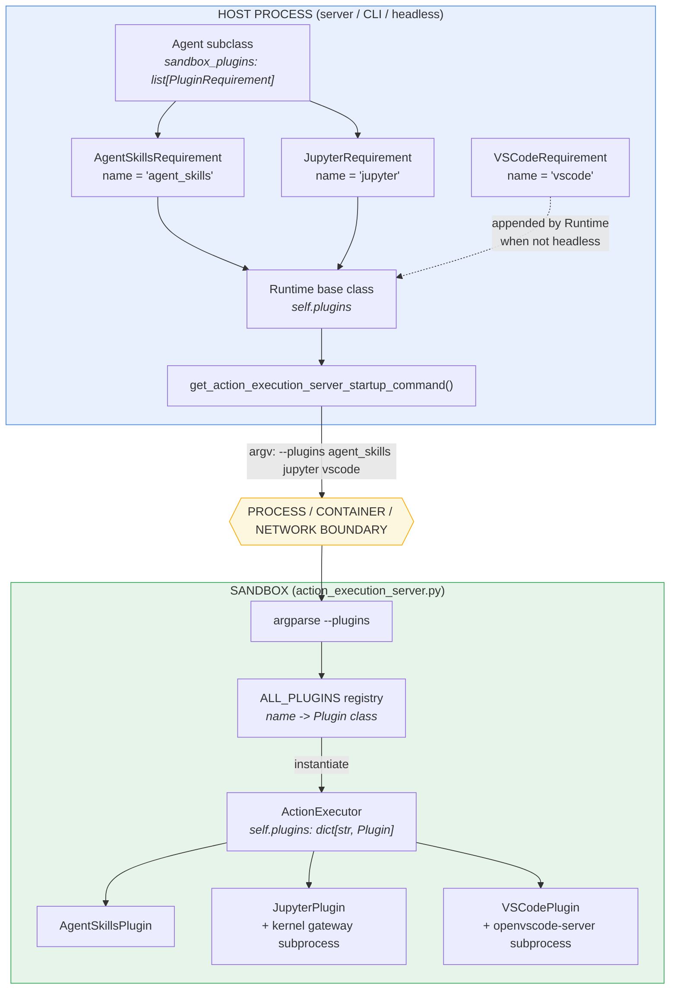
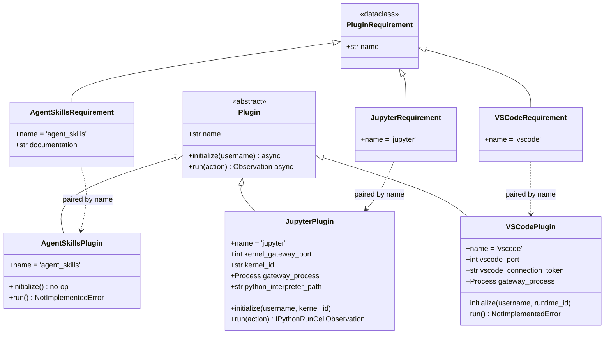
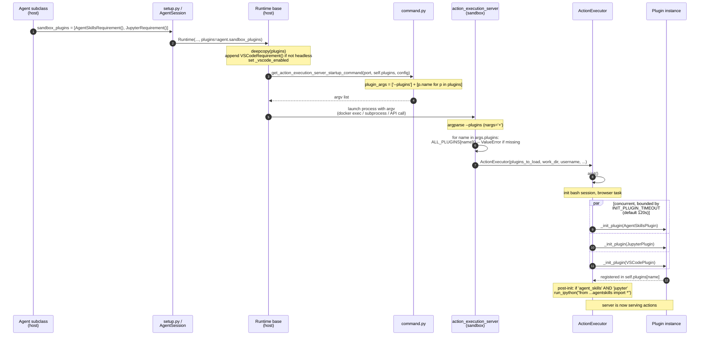
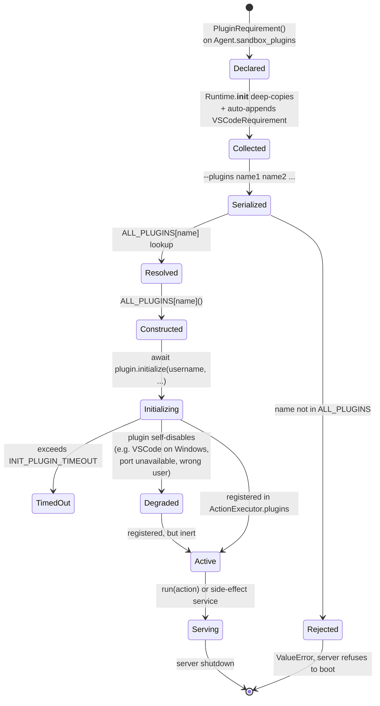
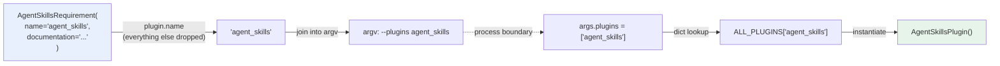
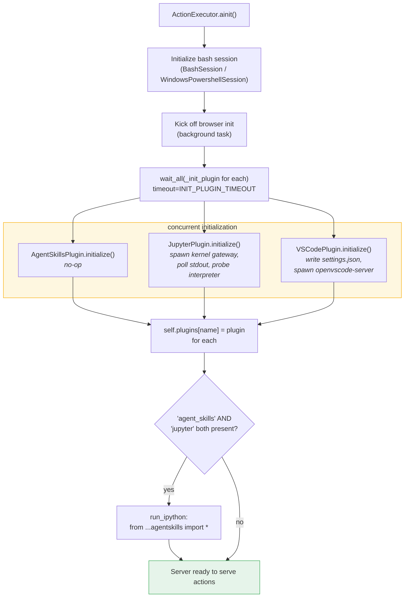
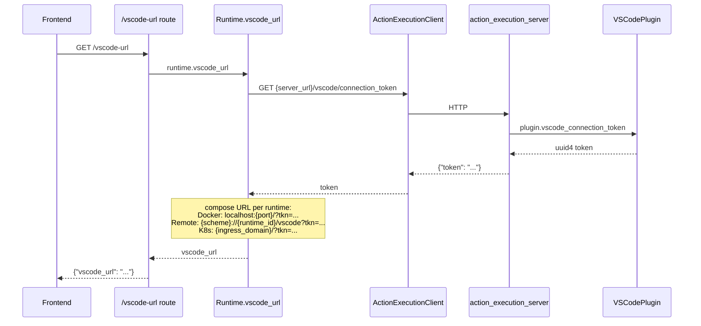
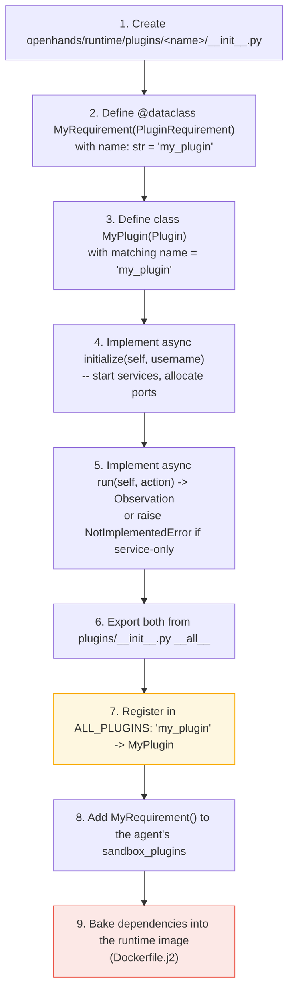

# Runtime Plugins Framework

## Introduction

The **runtime plugins framework** is the smallest module in the OpenHands runtime layer — a single file, two classes, and roughly thirty lines of code — yet it defines the contract that every sandbox capability is built on. It answers one question: *how does an agent running on the host tell a sandbox running somewhere else which extra services to start up?*

The answer is deliberately minimal. The framework splits a plugin into two halves that never share memory:

- **`PluginRequirement`** — a plain declaration that lives on the **host**, attached to an agent class. It says *"I need this."*
- **`Plugin`** — an abstract base class whose subclasses live **inside the sandbox**. It says *"here is how to start it and how to use it."*

The only thing that crosses the boundary between them is a short string: the plugin's `name`. That string travels from an agent class definition, through a runtime's startup command, across a process (and often a container or network) boundary, into a registry lookup on the other side. Everything else about a plugin — its ports, its subprocesses, its state — stays where it runs.

This document covers the framework itself (`openhands/runtime/plugins/requirement.py`) and the machinery that turns a declaration into a live service. The three concrete plugins that implement the contract are documented separately: [Agent Skills](runtime_plugins_agent_skills.md), [Jupyter](runtime_plugins_jupyter.md), and [VSCode](runtime_plugins_vscode.md). The parent module overview is in [runtime_plugins](runtime_plugins.md).

---

## Table of Contents

1. [Core Components](#core-components)
2. [The Two-Sided Architecture](#the-two-sided-architecture)
3. [The Plugin Registry](#the-plugin-registry)
4. [End-to-End Lifecycle](#end-to-end-lifecycle)
5. [Declaration: Agents and Requirements](#declaration-agents-and-requirements)
6. [Transport: Crossing the Sandbox Boundary](#transport-crossing-the-sandbox-boundary)
7. [Activation: Loading and Initializing](#activation-loading-and-initializing)
8. [Dispatch: Running Actions Through Plugins](#dispatch-running-actions-through-plugins)
9. [Design Notes and Sharp Edges](#design-notes-and-sharp-edges)
10. [Adding a New Plugin](#adding-a-new-plugin)
11. [Related Modules](#related-modules)

---

## Core Components

The whole framework is this:

```python
# openhands/runtime/plugins/requirement.py

class Plugin:
    """Base class for a plugin.

    This will be initialized by the runtime client, which will run inside docker.
    """
    name: str

    @abstractmethod
    async def initialize(self, username: str) -> None:
        """Initialize the plugin."""

    @abstractmethod
    async def run(self, action: Action) -> Observation:
        """Run the plugin for a given action."""


@dataclass
class PluginRequirement:
    """Requirement for a plugin."""
    name: str
```

| Component | Where it runs | What it holds | Role |
|---|---|---|---|
| `PluginRequirement` | Host process (agent / server / CLI) | Just a `name` string | Declarative marker. Serializable, cheap, safe to deep-copy. |
| `Plugin` | Inside the sandbox (action execution server) | Ports, subprocesses, kernels, tokens | Live service. Owns real OS resources. |

Two details are worth pausing on:

- **`PluginRequirement` is a `@dataclass`; `Plugin` is not.** The requirement is data — it gets constructed, copied, compared, and listed. The plugin is behavior — it gets constructed once by a registry and then holds mutable state.
- **`Plugin` does not inherit from `ABC`.** It uses `@abstractmethod` decorators without an abstract metaclass, so Python will *not* stop you from instantiating a subclass that leaves a method unimplemented. This is intentional in practice: two of the three shipped plugins deliberately do not implement `run()`.

The `Action` and `Observation` types in the `run()` signature come from the [event system](event_system.md), which is what makes plugins interchangeable with any other action handler in the sandbox.

---

## The Two-Sided Architecture

The single most important idea in this module is the split between the declaring side and the executing side. They are separated by a process boundary that may also be a container, a VM, or an HTTPS connection to another datacenter.



**Why this split exists.** The host cannot import a `Plugin` subclass and hand it to the sandbox — the sandbox is a different Python interpreter, often a different filesystem, sometimes a different machine. Any shared object would have to be serialized. So the framework serializes the *minimum possible thing*: a name. The sandbox already has all the plugin code baked into its image (see [runtime image builders](runtime_image_builders.md)), so it only needs to be told which classes to instantiate.

This is why `PluginRequirement` has exactly one field. Adding rich configuration to a requirement would mean building a serialization protocol for it; the framework sidesteps that entirely.

---

## The Plugin Registry

`openhands/runtime/plugins/__init__.py` is the module's public surface and its registry:

```python
ALL_PLUGINS = {
    'jupyter':      JupyterPlugin,
    'agent_skills': AgentSkillsPlugin,
    'vscode':       VSCodePlugin,
}
```

`ALL_PLUGINS` maps the wire name to the class. It is consulted exactly once, inside the sandbox, at server startup:

```python
plugins_to_load: list[Plugin] = []
if args.plugins:
    for plugin in args.plugins:
        if plugin not in ALL_PLUGINS:
            raise ValueError(f'Plugin {plugin} not found')
        plugins_to_load.append(ALL_PLUGINS[plugin]())
```

An unknown name is a **hard failure at boot**, not a warning. This is the right call: a requested plugin that silently does not load would produce confusing downstream errors (an agent trying to run IPython against a runtime with no kernel), so the framework fails loudly and early.

Note the registry is keyed on the *plugin's* `name`, and the requirement's `name` must match it exactly. Nothing in the type system enforces that pairing — it is a convention held together by the two classes using the same literal string. See [Design Notes](#design-notes-and-sharp-edges).



Notice the asymmetry in the concrete classes. `AgentSkillsPlugin` and `VSCodePlugin` both raise `NotImplementedError` from `run()`; only `JupyterPlugin` is a real action handler. The other two are **service plugins** — they exist for the side effects of `initialize()` (starting a server, making Python functions importable), not to answer actions. The base class does not distinguish between the two kinds; see [Design Notes](#design-notes-and-sharp-edges).

---

## End-to-End Lifecycle

Here is the full journey of a plugin, from a class attribute on an agent to a running subprocess serving actions.



### The activation state machine



The `Degraded` path matters. `VSCodePlugin.initialize()` returns early — without raising — on Windows, for non-`root`/`openhands` users, when `VSCODE_PORT` is unset, or when the port is taken. It still lands in `ActionExecutor.plugins`, just with `vscode_port = None`. Callers must therefore treat "plugin present" and "plugin working" as different facts.

---

## Declaration: Agents and Requirements

Every agent declares its sandbox needs through one class attribute, defined on the `Agent` base in [`openhands/controller/agent.py`](agent_controller.md):

```python
class Agent(ABC):
    sandbox_plugins: list[PluginRequirement] = []
```

The default is empty, so plugins are strictly opt-in. What the shipped agents ask for:

| Agent | `sandbox_plugins` | Why |
|---|---|---|
| `CodeActAgent` | `[AgentSkillsRequirement(), JupyterRequirement()]` | Needs IPython execution plus the skill function library |
| `ReadOnlyAgent`, `LocAgent` | inherited from `CodeActAgent` | CodeAct variants — see [agents_codeact_variants](agents_codeact_variants.md) |
| `BrowsingAgent` | `[]` | Uses the [browser environment](browser_environment.md), not the sandbox toolchain |
| `VisualBrowsingAgent` | `[]` | Same |
| `DummyAgent` | `[]` | Test harness — see [agents_testing_and_critics](agents_testing_and_critics.md) |

`CodeActAgent` carries an explicit ordering comment:

```python
sandbox_plugins: list[PluginRequirement] = [
    # NOTE: AgentSkillsRequirement need to go before JupyterRequirement, since
    # AgentSkillsRequirement provides a lot of Python functions,
    # and it needs to be initialized before Jupyter for Jupyter to use those functions.
    AgentSkillsRequirement(),
    JupyterRequirement(),
]
```

List order is preserved all the way to the sandbox's `--plugins` argv. But — see [Design Notes](#design-notes-and-sharp-edges) — initialization is actually concurrent, and the real ordering guarantee comes from a separate post-init step.

### Requirement subclassing

`PluginRequirement` is subclassed mainly to fix the `name` default. `AgentSkillsRequirement` goes one step further and attaches documentation:

```python
@dataclass
class AgentSkillsRequirement(PluginRequirement):
    name: str = 'agent_skills'
    documentation: str = agentskills.DOCUMENTATION
```

This shows the extension point: requirements may carry host-side metadata beyond the name. That metadata never crosses to the sandbox — only `name` is serialized — so it is purely for host-side consumption (prompt building, introspection, logging).

---

## Transport: Crossing the Sandbox Boundary

### Host-side collection

`Runtime.__init__` in `openhands/runtime/base.py` is where requirements are gathered and one is silently added:

```python
self.plugins = (
    copy.deepcopy(plugins) if plugins is not None and len(plugins) > 0 else []
)
# add VSCode plugin if not in headless mode
if not headless_mode:
    self.plugins.append(VSCodeRequirement())

self._vscode_enabled = any(
    isinstance(plugin, VSCodeRequirement) for plugin in self.plugins
)
```

Three behaviors to note:

1. **Deep copy.** The runtime never mutates the agent class's shared list. Because `sandbox_plugins` is a *class* attribute, appending to it in place would leak across every instance of that agent — the deep copy prevents exactly that bug.
2. **VSCode is injected, not declared.** No agent asks for VSCode. It is a UI affordance for interactive sessions, so the runtime adds it whenever the session is not headless. This is the framework's one piece of policy.
3. **`isinstance` checks, not name checks.** The runtime tests plugin identity by class (`isinstance(plugin, JupyterRequirement)`), while the sandbox tests by string. Two different identity schemes for the same concept, on either side of the boundary.

The runtime also uses requirement presence to gate unrelated behavior. In `add_env_vars`, environment variables are injected into the IPython shell only when Jupyter was requested:

```python
if any(isinstance(plugin, JupyterRequirement) for plugin in self.plugins):
    code = 'import os\n'
    ...
```

So a requirement is not only a startup instruction — it is also a **capability flag** the host reads to decide what the sandbox can be asked to do.

### Serialization

`openhands/runtime/utils/command.py` performs the actual flattening. The entire transport encoding is two lines:

```python
plugin_args = []
if plugins is not None and len(plugins) > 0:
    plugin_args = ['--plugins'] + [plugin.name for plugin in plugins]
```

These become part of the argv that starts the action execution server:

```
python -u -m openhands.runtime.action_execution_server 8000 \
    --working-dir /workspace \
    --plugins agent_skills jupyter vscode \
    --username openhands --user-id 1000
```



The lossiness is the point. Whatever a requirement carries, only its name survives — which keeps the boundary trivial to implement across every transport the runtimes use.

### Every runtime speaks the same protocol

All runtime implementations accept `plugins: list[PluginRequirement] | None` and pass it up to `Runtime.__init__`. What differs is how they deliver the argv:

| Runtime | Delivery mechanism | Plugin support |
|---|---|---|
| [`DockerRuntime`](runtime_implementations_docker.md) | Container command | Full |
| [`LocalRuntime`](runtime_implementations_local_execution_local_runtime.md) | Local subprocess | Full; also has `_get_plugins()` to pre-warm a server from the default agent's requirements |
| [`RemoteRuntime`](runtime_implementations_orchestrated_remote_runtime.md) | Remote API session spec | Full |
| [`KubernetesRuntime`](runtime_implementations_orchestrated_kubernetes_runtime.md) | Pod container args | Full |
| [`CLIRuntime`](runtime_implementations_local_execution_cli_runtime.md) | *No action execution server* | **Accepts but ignores.** Runs actions in-process; `run_ipython` is unimplemented and advises disabling the Jupyter plugin via `AgentConfig` |
| [Third-party runtimes](third_party_runtimes.md) (Daytona, Modal, Runloop, E2B) | Provider-specific sandbox APIs | Follow the same signature |

`CLIRuntime` is the informative exception: it proves plugins are a property of the *action execution server*, not of the `Runtime` abstraction. A runtime that does not boot that server has nowhere to put plugins, and the framework has no way to signal that back — the requirements just quietly go nowhere.

`LocalRuntime` also demonstrates reading requirements without an agent instance, for its warm-server optimization:

```python
def _get_plugins(config: OpenHandsConfig) -> list[PluginRequirement]:
    from openhands.controller.agent import Agent
    plugins = Agent.get_cls(config.default_agent).sandbox_plugins
    return plugins
```

Because `sandbox_plugins` is a class attribute, the plugin set is knowable from the agent *class* alone — no instance, no LLM, no config resolution. That is what makes pre-warming possible.

---

## Activation: Loading and Initializing

Inside the sandbox, [`ActionExecutor`](runtime_implementations_action_execution_server.md) owns the plugin lifecycle. It receives the constructed-but-uninitialized plugin list and keeps a name-indexed dict:

```python
self.plugins_to_load = plugins_to_load     # list[Plugin], not yet initialized
self.plugins: dict[str, Plugin] = {}       # name -> initialized plugin
```

### Concurrent initialization with a timeout

```python
await wait_all(
    (self._init_plugin(plugin) for plugin in self.plugins_to_load),
    timeout=int(os.environ.get('INIT_PLUGIN_TIMEOUT', '120')),
)
logger.debug('All plugins initialized')
```

All plugins initialize **concurrently**, under a single 120-second budget (tunable via `INIT_PLUGIN_TIMEOUT`). This matters because plugin startup is slow and I/O-bound — `JupyterPlugin` spawns a kernel gateway and polls its stdout until ready; `VSCodePlugin` spawns openvscode-server and does the same. Running them in sequence would add their startup times together.

### Per-plugin initialization

```python
async def _init_plugin(self, plugin: Plugin):
    assert self.bash_session is not None
    # VSCode plugin needs runtime_id for path-based routing when using Gateway API
    if isinstance(plugin, VSCodePlugin):
        runtime_id = os.environ.get('RUNTIME_ID')
        await plugin.initialize(self.username, runtime_id=runtime_id)
    else:
        await plugin.initialize(self.username)
    self.plugins[plugin.name] = plugin
    logger.debug(f'Initializing plugin: {plugin.name}')

    if isinstance(plugin, JupyterPlugin):
        cwd = self.bash_session.cwd.replace('\\', '/')
        await self.run_ipython(
            IPythonRunCellAction(code=f'import os; os.chdir(r"{cwd}")')
        )
```

The two `isinstance` branches are the framework's most visible compromise. The abstract signature is `initialize(self, username: str)`, but:

- `JupyterPlugin.initialize(self, username, kernel_id='openhands-default')` adds an optional argument (defaulted, so the base signature still works).
- `VSCodePlugin.initialize(self, username, runtime_id=None)` adds one that the executor must actually supply — hence the special case.

Because the base class offers no way to pass per-plugin context, the executor hard-codes knowledge of concrete plugin types. Adding a fourth plugin with its own init parameter would mean editing `ActionExecutor`, not just registering a class.

The bash-session dependency is also implicit: `_init_plugin` asserts a bash session exists, and the Jupyter branch reads `bash_session.cwd` to align the kernel's working directory with the shell's. Plugins are initialized *after* the shell, and the framework encodes that ordering in the executor rather than in the plugin contract.

### The cross-plugin post-init step

```python
# This is a temporary workaround
# TODO: refactor AgentSkills to be part of JupyterPlugin
# AFTER ServerRuntime is deprecated
if 'agent_skills' in self.plugins and 'jupyter' in self.plugins:
    obs = await self.run_ipython(
        IPythonRunCellAction(
            code='from openhands.runtime.plugins.agent_skills.agentskills import *\n'
        )
    )
```

This runs **after** `wait_all`, and it is the real answer to `CodeActAgent`'s "AgentSkills must come before Jupyter" comment. Since init is concurrent, list order cannot sequence them. What actually happens:

- `AgentSkillsPlugin.initialize()` is a no-op — the skills are just importable Python modules baked into the image.
- `JupyterPlugin.initialize()` brings up a live kernel.
- Once both are registered, the executor injects the skills into that kernel's namespace.

So the dependency is resolved by an explicit conditional in the executor, not by the plugin framework. The framework has **no dependency graph, no ordering primitive, and no way for one plugin to declare it needs another.** Cross-plugin wiring is the executor's job.



---

## Dispatch: Running Actions Through Plugins

Once registered, plugins are reached by **name lookup**, not by polymorphic dispatch. There is no "ask every plugin if it handles this action" loop. `ActionExecutor.run_ipython` hard-codes the key:

```python
async def run_ipython(self, action: IPythonRunCellAction) -> Observation:
    if 'jupyter' in self.plugins:
        _jupyter_plugin: JupyterPlugin = self.plugins['jupyter']
        # keep the kernel's cwd in sync with the bash session's cwd
        jupyter_cwd = getattr(self, '_jupyter_cwd', None)
        if self.bash_session.cwd != jupyter_cwd:
            cwd = self.bash_session.cwd.replace('\\', '/')
            _aux_action = IPythonRunCellAction(code=f'import os; os.chdir("{cwd}")')
            _reset_obs = await _jupyter_plugin.run(_aux_action)
            self._jupyter_cwd = self.bash_session.cwd

        obs = await _jupyter_plugin.run(action)
        obs.content = obs.content.rstrip()
        if action.include_extra:
            obs.content += f'\n[Jupyter current working directory: {self.bash_session.cwd}]'
            obs.content += f'\n[Jupyter Python interpreter: {_jupyter_plugin.python_interpreter_path}]'
        return obs
    else:
        raise RuntimeError('JupyterRequirement not found. Unable to run IPython action.')
```

Three observations about how the abstraction is actually used:

1. **The `run()` contract holds.** `Action` in, `Observation` out — a `JupyterPlugin` is interchangeable with any other action handler as far as the [event system](event_system.md) is concerned.
2. **But the caller reaches past it.** `python_interpreter_path` is a `JupyterPlugin`-specific attribute, read directly. The generic interface is not sufficient for the real integration.
3. **Missing plugin means a runtime error, not a fallback.** If an agent emits an `IPythonRunCellAction` without having declared `JupyterRequirement`, the sandbox raises. The error message names the *requirement* class even though the check tested a plugin name — a small reminder that these are two views of the same thing.

### Plugin state surfaced back to the host

`VSCodePlugin` shows the other direction of the framework: state generated inside the sandbox that the host needs. The plugin mints a connection token at init, and the server exposes it over HTTP:

```python
@app.get('/vscode/connection_token')
async def get_vscode_connection_token():
    ...
    return {'token': plugin.vscode_connection_token}
```

The host's `ActionExecutionClient` fetches it and each runtime composes its own URL:



Note this readback path is **not part of the `Plugin` interface**. There is no `get_state()` or `describe()` method. Each plugin that needs to publish state does it by adding a bespoke HTTP endpoint to the action execution server. See the [VSCode plugin doc](runtime_plugins_vscode.md) and [server routes](conversation_service_tier.md) for the full path.

---

## Design Notes and Sharp Edges

The framework is intentionally tiny, and the cost of that is that several responsibilities live outside it. Worth knowing before you extend it:

### 1. The name pairing is unenforced

`AgentSkillsRequirement.name` and `AgentSkillsPlugin.name` are both the literal `'agent_skills'`, defined independently in the same file. Nothing checks they match. A typo in either produces a `ValueError: Plugin ... not found` at sandbox boot — loud, but only at runtime, and only in the sandbox's logs.

### 2. `run()` is not really abstract

`Plugin` uses `@abstractmethod` without inheriting `ABC`, so the decorators are documentation rather than enforcement. Two of three plugins raise `NotImplementedError` from `run()`. The interface conflates:

- **Service plugins** (`AgentSkillsPlugin`, `VSCodePlugin`) — value is entirely in `initialize()`'s side effects.
- **Handler plugins** (`JupyterPlugin`) — genuinely translate actions to observations.

A future split into `Plugin` / `ActionHandlerPlugin` would let the type system express which plugins can be dispatched to.

### 3. `initialize()` signatures diverge

The base declares `initialize(self, username: str)`. Concrete plugins add parameters, and `ActionExecutor._init_plugin` `isinstance`-checks to supply them. **Adding a plugin that needs init context means editing the executor.** A context object (`initialize(self, ctx: PluginContext)`) would remove that coupling.

### 4. No dependency declaration

AgentSkills-before-Jupyter is expressed as a comment on `CodeActAgent.sandbox_plugins` and enforced by a hard-coded conditional in `ActionExecutor` — because concurrent init means list order is not an ordering guarantee. The framework has no `depends_on` and no topological sort. The source itself flags this as a workaround pending an AgentSkills-into-Jupyter refactor.

### 5. Silent degradation

Plugins may self-disable inside `initialize()` without raising (VSCode on Windows, non-privileged user, missing/taken port). They still register. There is no `is_healthy` on the interface, so callers cannot distinguish "loaded" from "working" without reaching for plugin-specific attributes.

### 6. Requirement metadata is host-only

`AgentSkillsRequirement.documentation` never reaches the sandbox — only `name` is serialized. Any field you add to a requirement is host-side metadata by construction.

### 7. Availability depends on the image, not the framework

The registry maps names to classes, but the *capability* has to already exist in the sandbox image — openvscode-server binaries, micromamba environments, the Jupyter kernel gateway. A registered plugin whose dependencies were not baked in fails at `initialize()`. See [runtime image builders](runtime_image_builders.md) and the runtime Dockerfile template.

### 8. Not all runtimes honor plugins

`CLIRuntime` accepts a plugin list and ignores it, because it never starts an action execution server. Nothing in the type signature communicates this.

---

## Adding a New Plugin

The mechanical path is short:



Checklist of the non-obvious parts:

- **Names must match exactly** between requirement and plugin, and must equal the `ALL_PLUGINS` key.
- **Keep the base `initialize` signature** if you can. If you need extra context, you will have to add an `isinstance` branch in `ActionExecutor._init_plugin` — try to avoid it.
- **Initialization is concurrent.** Do not assume another plugin is ready. If you truly need one, add an explicit post-init step in `ActionExecutor`, following the AgentSkills/Jupyter pattern.
- **Stay inside `INIT_PLUGIN_TIMEOUT`** (120s default, shared across *all* plugins).
- **Degrade, don't crash.** If the environment cannot support your plugin (wrong OS, missing port, unprivileged user), log a warning and return — a raise inside the timeout window can take down the whole init.
- **Publishing state to the host** needs its own HTTP endpoint on the action execution server; the `Plugin` interface will not do it for you.
- **Runtime image support is a separate deliverable.** Registering a class does not install a binary.

---

## Related Modules

| Module | Relationship |
|---|---|
| [runtime_plugins](runtime_plugins.md) | Parent module — overview of all plugins |
| [runtime_plugins_agent_skills](runtime_plugins_agent_skills.md) | Service plugin: file ops, readers, repo ops injected into IPython |
| [runtime_plugins_jupyter](runtime_plugins_jupyter.md) | Handler plugin: kernel gateway, `JupyterKernel`, `ExecuteHandler` |
| [runtime_plugins_vscode](runtime_plugins_vscode.md) | Service plugin: openvscode-server, connection tokens, path routing |
| [runtime_implementations_action_execution_server](runtime_implementations_action_execution_server.md) | Sandbox host of the plugin lifecycle — `ActionExecutor` owns load, init, and dispatch |
| [runtime_implementations](runtime_implementations.md) | Runtime implementations that carry requirements across the boundary |
| [runtime_implementations_local_execution_cli_runtime](runtime_implementations_local_execution_cli_runtime.md) | The runtime that accepts but ignores plugins |
| [third_party_runtimes](third_party_runtimes.md) | External sandbox providers following the same protocol |
| [runtime_image_builders](runtime_image_builders.md) | Bakes plugin dependencies into sandbox images |
| [runtime_utils](runtime_utils.md) | `BashSession` (initialized before plugins), port helpers, `command.py` serialization |
| [agent_controller](agent_controller.md) | `Agent` base class defining `sandbox_plugins` |
| [agents](agents.md) / [agents_codeact_variants](agents_codeact_variants.md) | Agents that declare requirements |
| [event_system](event_system.md) | `Action` / `Observation` types in the `run()` contract |
| [core_configuration](core_configuration.md) | `AgentConfig.enable_jupyter`, sandbox config affecting startup |
| [server_sessions](server_sessions.md) | `AgentSession` wiring `agent.sandbox_plugins` into runtime creation |
| [sandboxed_execution_layer](sandboxed_execution_layer.md) | Top-level layer this module belongs to |
