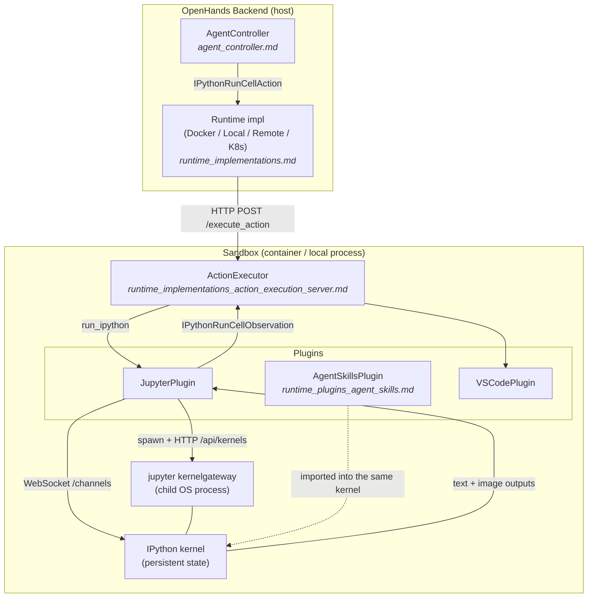
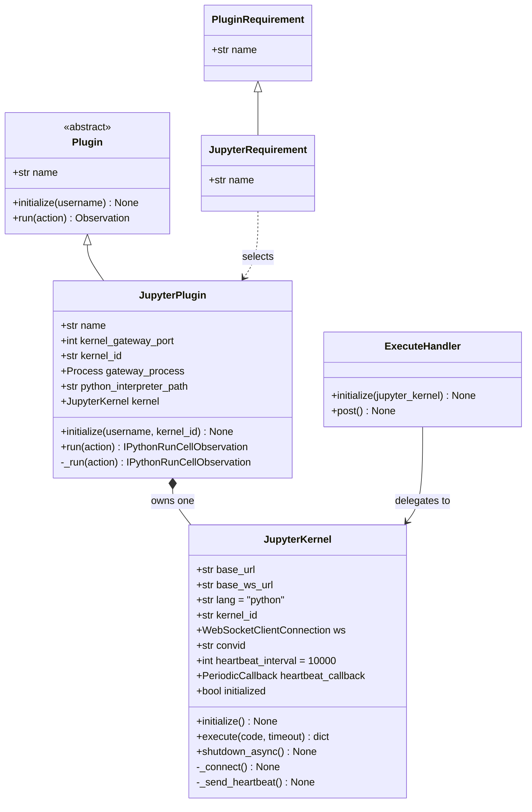
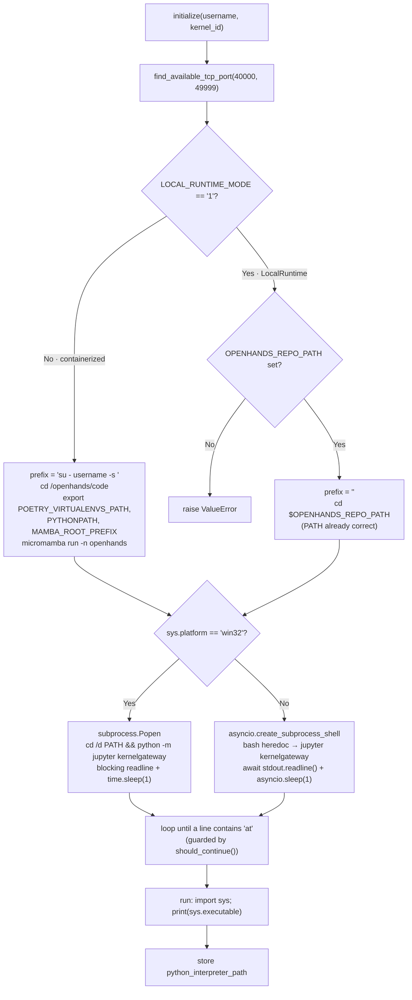
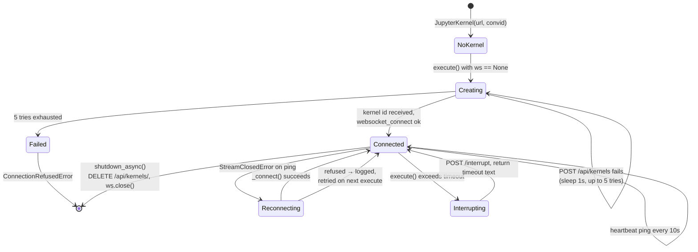
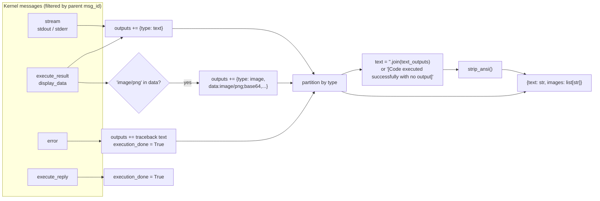
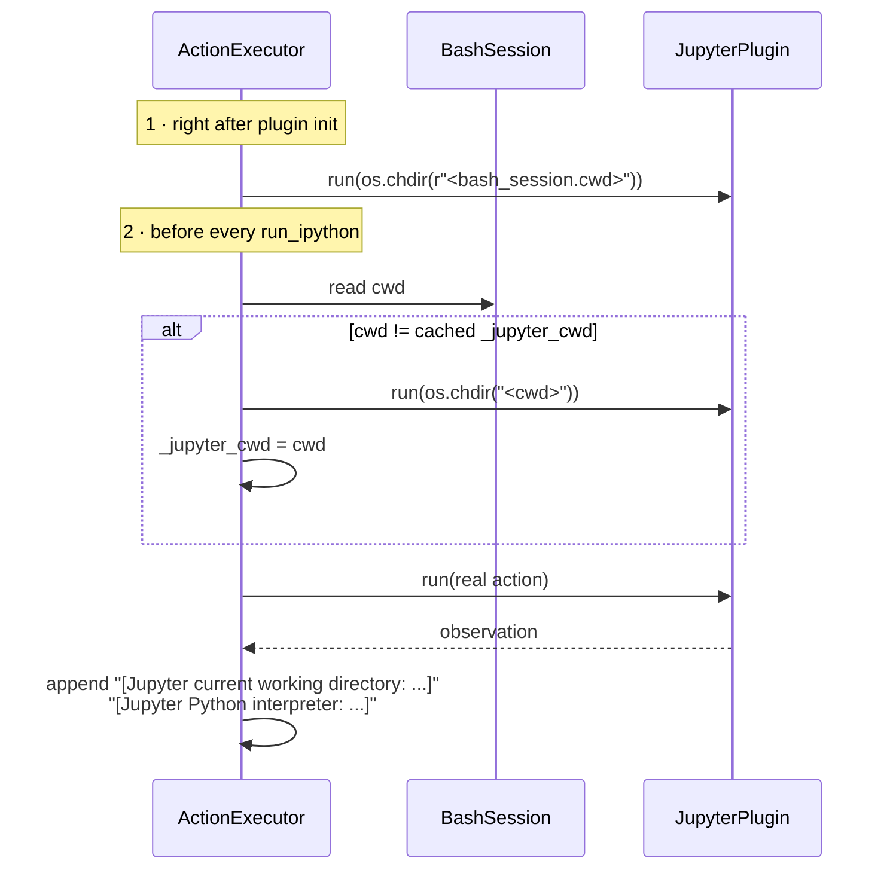

# Jupyter Runtime Plugin (`runtime_plugins_jupyter`)

## Introduction

The Jupyter plugin gives an OpenHands agent a **live Python interpreter** inside the sandbox.

A normal bash command runs, prints, and dies. Its variables are gone. The Jupyter plugin is different: it starts a real IPython kernel that **stays alive** for the whole conversation. The agent can define a variable in one step and use it ten steps later. It can load a big CSV once and then ask many questions about it. It can draw a plot and get the picture back as an image.

The plugin is the sandbox-side handler for one action type: `IPythonRunCellAction`. It turns that action into `IPythonRunCellObservation`, carrying back both text and images.

It lives inside the plugin framework described in [runtime_plugins_framework.md](runtime_plugins_framework.md), next to its sibling plugins [runtime_plugins_agent_skills.md](runtime_plugins_agent_skills.md) and [runtime_plugins_vscode.md](runtime_plugins_vscode.md). See [runtime_plugins.md](runtime_plugins.md) for the family overview.

---

## Core Components

| Component | File | Role |
|---|---|---|
| `JupyterRequirement` | `plugins/jupyter/__init__.py` | Tiny marker dataclass (`name='jupyter'`). An agent lists it in its sandbox plugin requirements to ask for the plugin. |
| `JupyterPlugin` | `plugins/jupyter/__init__.py` | The plugin proper. Boots a Jupyter **Kernel Gateway** process, then routes `IPythonRunCellAction` to a kernel client. |
| `JupyterKernel` | `plugins/jupyter/execute_server.py` | WebSocket client that speaks the **Jupyter messaging protocol** to one kernel. Handles connect, execute, heartbeat, timeout/interrupt, shutdown. |
| `ExecuteHandler` | `plugins/jupyter/execute_server.py` | Optional Tornado HTTP endpoint (`POST /execute`) that exposes the same kernel over plain HTTP. Used by the standalone-server entry point, not by the in-process plugin path. |
| `strip_ansi` | `plugins/jupyter/execute_server.py` | Helper that removes ANSI color codes from output text. |
| `make_app` | `plugins/jupyter/execute_server.py` | Builds the standalone Tornado app when the file is run as `__main__`. |

---

## Where the Module Sits



Key point: **the plugin runs inside the sandbox, never on the host.** The host only sees actions in and observations out. Any runtime implementation that runs an `ActionExecutor` gets the Jupyter plugin for free.

---

## Class Structure



`JupyterPlugin` satisfies the two-method contract of `Plugin` (`initialize`, `run`). Everything else is internal machinery.

---

## Startup: `JupyterPlugin.initialize()`

Startup has three jobs: pick a port, launch the gateway, and confirm the interpreter.



### Notes on the startup logic

- **Port range 40000–49999.** A random free high port avoids clashing with the action-execution server, VSCode, or the browser env inside the same sandbox.
- **Gateway binds `0.0.0.0`.** Inside a container this is what allows the connection; the plugin itself always dials `localhost:<port>`.
- **Two environment shapes.** In a container the command hops to the sandbox user with `su`, then activates the pinned micromamba/Poetry environment so the kernel uses the same Python as OpenHands. Under `LocalRuntime` there is no user hop and no micromamba — `PATH` is already right, so only a `cd` is needed. Failing to set `OPENHANDS_REPO_PATH` is a hard error, not a silent fallback.
- **Windows uses the sync path.** `asyncio.create_subprocess_shell` is unreliable on Windows, so the code falls back to `subprocess.Popen` plus blocking `readline`/`time.sleep`. The `ASYNC101` lint suppressions mark this deliberate exception. Note that on Windows the command interpolates `code_repo_path`, which is only bound in the `LocalRuntime` branch — Windows is effectively a local-runtime-only path.
- **Readiness is detected by output sniffing.** The loop reads gateway stdout until a line contains `'at'` (matching the gateway's "…is available at http://…" banner). It is a heuristic, and the loop is bounded by `should_continue()` so a shutdown signal breaks it rather than hanging forever.
- **The first cell is a self-check.** Running `import sys; print(sys.executable)` both warms the kernel and captures `python_interpreter_path`, which `ActionExecutor` later appends to observations so the agent knows exactly which interpreter it is talking to.
- The whole `initialize` call is run by `ActionExecutor.ainit()` under a shared timeout (`INIT_PLUGIN_TIMEOUT`, default 120s), alongside the other plugins.

---

## Execution Flow: one `IPythonRunCellAction`

```mermaid
sequenceDiagram
    participant AES as ActionExecutor
    participant JP as JupyterPlugin
    participant JK as JupyterKernel
    participant GW as Kernel Gateway (HTTP)
    participant WS as Kernel WebSocket

    AES->>AES: bash cwd != _jupyter_cwd?
    opt cwd drifted
        AES->>JP: run(os.chdir("<bash cwd>"))
        JP-->>AES: ok
    end

    AES->>JP: run(IPythonRunCellAction)
    JP->>JP: _run(): assert action type

    alt no self.kernel yet
        JP->>JK: JupyterKernel("localhost:<port>", kernel_id)
    end
    alt not kernel.initialized
        JP->>JK: initialize()
        JK->>JK: execute("%colors nocolor") + tools_to_run
    end

    JP->>JK: execute(code, timeout)

    alt ws missing or closed
        JK->>GW: POST /api/kernels {name: "python"}  (retry x5)
        GW-->>JK: {id: kernel_id}
        JK->>WS: websocket_connect /api/kernels/<id>/channels
        JK->>JK: start 10s PeriodicCallback heartbeat
    end

    JK->>WS: execute_request (msg_id = uuid4)

    loop until execute_reply / error
        WS-->>JK: iopub message
        JK->>JK: drop if parent_header.msg_id != msg_id
        Note over JK: stream → text<br/>execute_result / display_data → text (+ image/png)<br/>error → traceback text, done<br/>execute_reply → done
    end

    alt asyncio.TimeoutError
        JK->>GW: POST /api/kernels/<id>/interrupt
        JK-->>JP: {text: "[Execution timed out (Ns).]", images: []}
    else normal
        JK->>JK: split text/image, strip_ansi, join
        JK-->>JP: {text: ..., images: [...]}
    end

    JP-->>AES: IPythonRunCellObservation(content, code, image_urls)
    AES->>AES: rstrip; if include_extra append cwd + interpreter path
```

### Lazy construction

`JupyterKernel` is created on first use inside `_run`, not in `initialize`. The gateway is started eagerly; the kernel client attaches lazily. `initialized` guards the one-time kernel setup (`%colors nocolor` plus any pre-defined tools in `tools_to_run`, currently an empty extension point).

---

## Connection Management



Resilience is layered:

| Layer | Mechanism | Covers |
|---|---|---|
| Kernel creation | 5 attempts, 1s apart, inside `_connect` | Gateway not accepting requests yet |
| `execute()` | `@retry` on `ConnectionRefusedError`, 3 attempts, 2s fixed wait | Kernel died between calls |
| Liveness | `PeriodicCallback` ping every 10s | Idle WebSockets dropped by proxies/NAT |
| Per-call | `asyncio.wait_for(..., timeout)` then `POST /interrupt` | Infinite loop or long-running cell |
| Every call | `if not self.ws or self.ws.stream.closed(): await self._connect()` | Any silent disconnect |

`kernel_id` is cached, so a reconnect **reattaches to the same kernel** and the agent's variables survive. Only `shutdown_async()` clears it.

---

## Output Handling

The kernel emits several message types on iopub. `execute()` normalizes them into one structured dict.



Details worth knowing:

- **`msg_id` correlation.** Every reply whose `parent_header.msg_id` differs from the request is dropped. This is what makes it safe to reuse one WebSocket across many cells.
- **Errors are not exceptions.** A Python traceback comes back as ordinary text content. `IPythonRunCellObservation.error` is hard-coded `False` and `success` is `True` — the agent is expected to read the traceback and react, exactly like a human in a notebook.
- **Images are data URIs.** PNG output becomes `data:image/png;base64,...` and travels in `image_urls`. This is how a matplotlib chart reaches a multimodal LLM without touching the filesystem. See [agent_reasoning_core.md](agent_reasoning_core.md) for how multimodal content is consumed.
- **Silence is explicit.** An empty but successful run yields `[Code executed successfully with no output]` instead of an empty string, so the agent never sees a blank observation.
- **ANSI stripped last.** `strip_ansi` removes SGR codes (`\x1b[…m`) that survive despite `%colors nocolor`, keeping tracebacks readable in logs and prompts.

---

## Working Directory Coherence

Bash and the Jupyter kernel are two separate processes with two separate current directories. Without help they drift, and a relative path that works in bash fails in Python.

`ActionExecutor` keeps them in sync at two moments:



The trailing annotations use `python_interpreter_path` captured at startup, and are added only when `action.include_extra` is true. Backslashes in Windows paths are normalized to forward slashes before interpolation.

---

## Relationship with the AgentSkills Plugin

The two plugins are deliberately coupled. After all plugins initialize, `ActionExecutor.ainit()` checks whether **both** `agent_skills` and `jupyter` are loaded and, if so, runs:

```python
from openhands.runtime.plugins.agent_skills.agentskills import *
```

through the Jupyter plugin. The agent skills therefore become plain functions in the kernel namespace — the agent calls them like any other Python. Jupyter is the *execution surface*; AgentSkills is the *library* loaded onto it. The source marks this wiring as a temporary workaround pending a refactor. Details in [runtime_plugins_agent_skills.md](runtime_plugins_agent_skills.md).

---

## The Standalone Server Path

`execute_server.py` is also runnable on its own (`python execute_server.py`). `make_app()` builds a Tornado application with a single route:

```
POST /execute   body: {"code": "..."}   →   200 {"text": "...", "images": [...]}
                                            400 "Missing code"
```

```mermaid
graph LR
    CL["HTTP client"] -->|POST /execute| EH["ExecuteHandler.post"]
    EH -->|json_decode, read 'code'| CK{"code present?"}
    CK -->|no| B4["400 'Missing code'"]
    CK -->|yes| JK["JupyterKernel.execute(code)"]
    JK -->|{text, images}| OK["200 application/json"]

    subgraph ENV["Environment variables"]
        E1["JUPYTER_GATEWAY_PORT (default 8888)"]
        E2["JUPYTER_GATEWAY_KERNEL_ID (default 'default')"]
        E3["JUPYTER_EXEC_SERVER_PORT"]
    end
    ENV -.-> JK
    ENV -.-> EH
```

This path shares one process-wide `JupyterKernel` across all requests and uses `execute()`'s default 120s timeout (no per-request override). It is useful for debugging and for legacy/standalone deployments; the mainline flow reaches `JupyterKernel` directly through `JupyterPlugin`, bypassing HTTP entirely.

---

## Configuration Reference

| Variable | Read by | Meaning |
|---|---|---|
| `LOCAL_RUNTIME_MODE` | `JupyterPlugin.initialize` | `'1'` selects the LocalRuntime launch path (no `su`, no micromamba). |
| `OPENHANDS_REPO_PATH` | `JupyterPlugin.initialize` | Repo root to `cd` into under LocalRuntime. **Required** in that mode. |
| `DEBUG` | `JupyterKernel.execute` | When set, logs every kernel message type and content. |
| `JUPYTER_GATEWAY_PORT` | `make_app` | Gateway port for the standalone server (default `8888`). |
| `JUPYTER_GATEWAY_KERNEL_ID` | `make_app` | Kernel/conversation id for the standalone server (default `default`). |
| `JUPYTER_EXEC_SERVER_PORT` | `__main__` | Listen port for the standalone Tornado app. |
| `INIT_PLUGIN_TIMEOUT` | `ActionExecutor.ainit` | Shared budget for all plugin `initialize()` calls (default `120`s). |

Fixed constants: kernel gateway port range `40000–49999`; default `kernel_id` `'openhands-default'`; heartbeat `10000` ms; kernel-create retries `5 × 1s`; `execute` retries `3 × 2s`; default execute timeout `120`s; kernel language `'python'`.

---

## Runtime Support Matrix

The plugin's launch command adapts to how the sandbox is built. Runtime details live in the linked pages.

| Runtime | Path taken | Notes |
|---|---|---|
| [Docker](runtime_implementations_docker.md) | `su` + micromamba | The standard case the container image is built for. |
| [Local](runtime_implementations_local_execution_local_runtime.md) | `LOCAL_RUNTIME_MODE=1` | Needs `OPENHANDS_REPO_PATH`; inherits the host `PATH`. |
| [Remote](runtime_implementations_orchestrated_remote_runtime.md) / [Kubernetes](runtime_implementations_orchestrated_kubernetes_runtime.md) | container path | Same image, same `ActionExecutor`, just scheduled elsewhere. |
| [CLI](runtime_implementations_local_execution_cli_runtime.md) | n/a | Does not host the plugin pipeline. |
| [Third-party sandboxes](third_party_runtimes.md) | container path | Work as long as they run the standard `ActionExecutor` image. |
| Windows | `subprocess.Popen` branch | Local-runtime shaped; the container branch does not bind `code_repo_path`. |

---

## Operational Notes and Failure Modes

| Symptom | Likely cause | Where to look |
|---|---|---|
| Init hangs until `INIT_PLUGIN_TIMEOUT` | Gateway banner never printed a line containing `'at'`; environment activation failed | Gateway stdout captured in the `initialize` debug log |
| `ValueError: OPENHANDS_REPO_PATH ...` | LocalRuntime started without the repo path | Runtime env setup |
| `ConnectionRefusedError: Failed to connect to kernel` | Gateway up but kernel spawn failing 5× | Kernel spec / Python env inside the sandbox |
| `[Execution timed out (N seconds).]` | Cell exceeded `action.timeout`; kernel was interrupted, not killed | Agent code; kernel state survives |
| Relative paths resolve wrongly | cwd sync skipped | `_jupyter_cwd` logic in `ActionExecutor.run_ipython` |
| Plot never reaches the model | `image/png` absent from `display_data`, or the LLM is text-only | Matplotlib backend; [llm_layer_clients_model_features.md](llm_layer_clients_model_features.md) |

Other things to keep in mind:

- **State is a feature and a risk.** A persistent kernel is what makes iterative work possible, but a cell that leaks memory keeps leaking. `MemoryMonitor` (see [runtime_utils](runtime_plugins.md)) watches sandbox memory; `RUNTIME_MAX_MEMORY_GB` bounds the container.
- **No sandboxing beyond the sandbox.** Code in the kernel has the same rights as the sandbox user. Pre-execution risk checks belong to [security_analyzers.md](security_analyzers.md), not here.
- **`shutdown_async()` is defined but not called on the plugin path.** Kernel teardown happens implicitly when the sandbox process/container goes away; the gateway process is a child of the action-execution server.
- **`tools_to_run` is an empty extension point.** Anything appended there runs once per kernel, right after `%colors nocolor` — the natural place to preload helpers.

---

## Related Documentation

- [runtime_plugins.md](runtime_plugins.md) — plugin family overview
- [runtime_plugins_framework.md](runtime_plugins_framework.md) — `Plugin` / `PluginRequirement` contract
- [runtime_plugins_agent_skills.md](runtime_plugins_agent_skills.md) — the library loaded into this kernel
- [runtime_implementations_action_execution_server.md](runtime_implementations_action_execution_server.md) — the caller, cwd sync, and observation decoration
- [runtime_implementations.md](runtime_implementations.md) — sandbox implementations that host the plugin
- [agent_reasoning_core.md](agent_reasoning_core.md) — how actions are produced and observations consumed
- [agents_codeact_variants.md](agents_codeact_variants.md) — agents that emit `IPythonRunCellAction`
