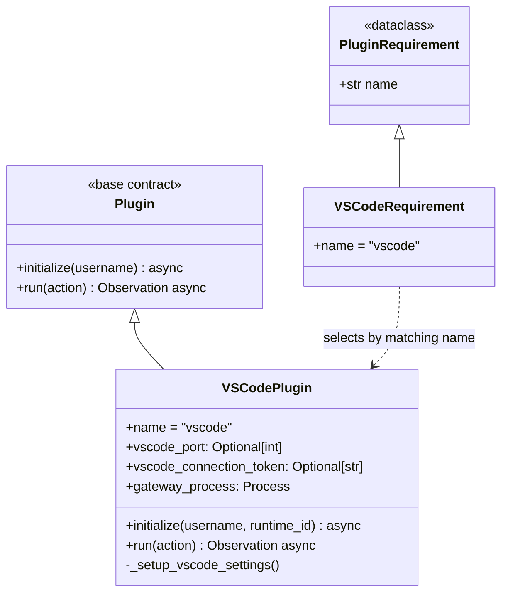
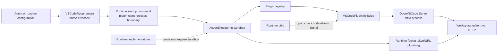
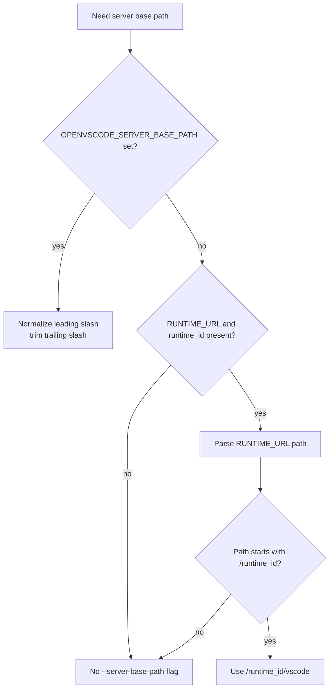
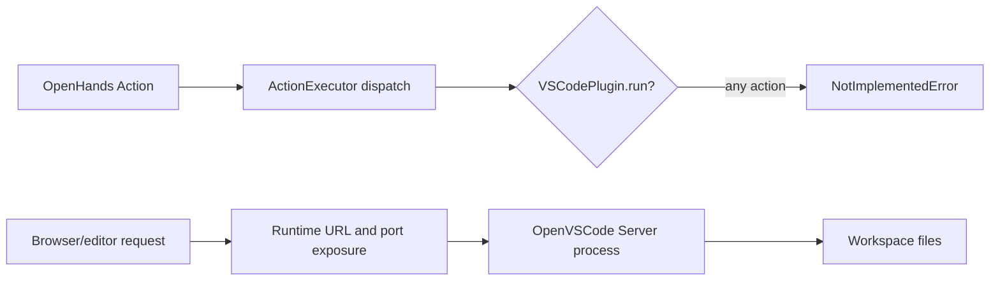

# VSCode Runtime Plugin (`runtime_plugins_vscode`)

## Introduction

The `runtime_plugins_vscode` module adds a browser-accessible VS Code-compatible editor to an OpenHands runtime workspace. Its single component, `VSCodePlugin`, prepares workspace settings and starts an OpenVSCode Server subprocess inside the sandbox.

The plugin is a **background service plugin**: initialization creates the editor service, while `run()` is intentionally unsupported. Runtime clients expose the resulting port and connection token through the surrounding runtime infrastructure. For the common plugin lifecycle and host/sandbox boundary, see [runtime_plugins](runtime_plugins.md) and [runtime_plugins_framework](runtime_plugins_framework.md).

## Scope and responsibilities

`VSCodePlugin` is responsible for:

- declaring the plugin name (`vscode`) through `VSCodeRequirement`;
- copying the plugin-bundled `settings.json` into the workspace's `.vscode` directory;
- validating platform, runtime user, port configuration, and port availability;
- generating a per-instance UUID connection token;
- selecting the workspace directory used by OpenVSCode Server;
- deriving an optional server base path for path-routed runtime URLs;
- starting OpenVSCode Server and waiting cooperatively for startup output.

It does not execute `Action` objects, manage editor sessions, proxy editor HTTP requests, or implement file-edit semantics. Those concerns belong to the runtime/action-execution layer and the event system; see [runtime_implementations_action_execution_server](runtime_implementations_action_execution_server.md), [runtime_implementations](runtime_implementations.md), and [event_system](event_system.md).

## Components

| Component | Location | Responsibility |
| --- | --- | --- |
| `VSCodeRequirement` | `openhands/runtime/plugins/vscode/__init__.py` | Dataclass requirement whose `name` is `vscode`. It is the host-side declaration. |
| `VSCodePlugin` | `openhands/runtime/plugins/vscode/__init__.py` | Sandbox-side lifecycle object that configures and starts OpenVSCode Server. |
| `settings.json` | `openhands/runtime/plugins/vscode/settings.json` | Bundled editor settings copied into the workspace before startup. |
| `Plugin` / `PluginRequirement` | `openhands/runtime/plugins/requirement.py` | Shared plugin contract and requirement abstraction; documented in [runtime_plugins_framework](runtime_plugins_framework.md). |
| `check_port_available` | `openhands/runtime/utils/system.py` | Port validation helper used before spawning the server. |
| `should_continue` | `openhands/utils/shutdown_listener.py` | Cooperative shutdown signal checked while waiting for server readiness. |

### Class relationship



The `gateway_process` field is a generic process reference; in this plugin it represents the OpenVSCode Server subprocess, not a Jupyter gateway.

## Position in the runtime architecture

The host-side agent or runtime requests the plugin by requirement name. The in-sandbox action execution server resolves that name through the plugin registry and initializes the concrete plugin. The editor process and its token remain inside the runtime boundary; the runtime layer is responsible for making the configured port reachable to the user.



The plugin family as a whole is described in [runtime_plugins](runtime_plugins.md); Docker, Local, Remote, and Kubernetes provisioning are covered by [runtime_implementations](runtime_implementations.md).

## Initialization flow

`initialize(username, runtime_id=None)` is asynchronous and fail-soft. Unsupported or unavailable conditions clear the public port/token fields, log a warning, and return without raising.

```mermaid
flowchart TD
    S[initialize username, runtime_id] --> OS{Windows?}
    OS -->|yes| OFF[Disable plugin\nport = None, token = None]
    OS -->|no| USER{username is root or openhands?}
    USER -->|no| OFF2[Disable plugin\nport = None, token = None]
    USER -->|yes| SETUP[Copy settings.json\nto workspace/.vscode]
    SETUP --> PORT[Read VSCODE_PORT and parse int]
    PORT --> VALID{Valid environment value?}
    VALID -->|no| OFF3[Disable plugin]
    VALID -->|yes| TOKEN[Generate UUID connection token]
    TOKEN --> FREE{check_port_available(port)?}
    FREE -->|no| OFF4[Disable plugin]
    FREE -->|yes| PATH[Resolve workspace and base path]
    PATH --> CMD[Build shell command]
    CMD --> SPAWN[create_subprocess_shell]
    SPAWN --> WAIT[Read subprocess stdout\nuntil readiness heuristic or shutdown]
    WAIT --> READY[Plugin initialized\nport and token available]
```

### Guard conditions

The checks occur in this order:

1. Windows is rejected (`os.name == 'nt'` or `sys.platform == 'win32'`).
2. Only `root` and `openhands` users are supported. This protects the `su`/ownership assumptions and explicitly excludes the currently unsupported arbitrary-user LocalRuntime case.
3. Workspace settings are prepared.
4. `VSCODE_PORT` must exist and parse as an integer.
5. The selected port must be available.

The settings copy occurs before `VSCODE_PORT` validation. Therefore, a disabled server can still leave a `.vscode/settings.json` file in the workspace if the platform/user/port checks fail after that point.

## Workspace and server configuration

Two workspace environment variables serve different purposes:

| Variable | Default | Used for |
| --- | --- | --- |
| `WORKSPACE_BASE` | `/workspace` | Destination containing `.vscode/settings.json`. |
| `WORKSPACE_MOUNT_PATH_IN_SANDBOX` | `/workspace` | Directory passed to the server process via `cd`; this is the editor's working directory. |

The plugin also reads:

| Variable | Meaning |
| --- | --- |
| `VSCODE_PORT` | Required integer port on which OpenVSCode Server listens. |
| `OPENVSCODE_SERVER_BASE_PATH` | Optional explicit URL path prefix. A leading `/` is added when absent, and trailing `/` is removed. |
| `RUNTIME_URL` | Runtime URL used for automatic path-mode detection when no explicit base path is supplied. |
| `runtime_id` argument | Preferred identifier for deriving `/{runtime_id}/vscode` in path-routed deployments. |

### Base-path selection



The explicit variable wins. Automatic derivation is only enabled when the runtime URL's path begins with the supplied `runtime_id`; otherwise the server uses its default root path.

## Process and data flow

After validation, the plugin constructs a shell heredoc that:

1. switches to the selected user with `/bin/bash`;
2. recursively changes ownership of `/openhands/.openvscode-server`;
3. changes into the configured sandbox workspace;
4. executes `/openhands/.openvscode-server/bin/openvscode-server`;
5. binds to `0.0.0.0`, applies the connection token and port, disables workspace trust, and optionally applies the base path.

```mermaid
sequenceDiagram
    participant AE as ActionExecutor
    participant VP as VSCodePlugin
    participant FS as Workspace filesystem
    participant OS as OS process manager
    participant OVS as OpenVSCode Server
    participant U as Runtime client / browser

    AE->>VP: initialize(username, runtime_id)
    VP->>FS: mkdir workspace/.vscode
    VP->>FS: copy settings.json
    VP->>VP: generate UUID token and validate port
    VP->>OS: create_subprocess_shell(shell command)
    OS->>OVS: su user; cd workspace; exec server
    OVS-->>VP: stdout readiness output
    VP-->>AE: initialized; port/token fields populated
    U->>OVS: HTTP editor request through runtime exposure
    U->>AE: request connection metadata through runtime API
    AE-->>U: connection token / URL metadata
```

The readiness loop reads lines from combined stdout/stderr and stops when a line contains the substring `at`. It also checks `should_continue()` on each iteration and sleeps briefly between reads. This is a lightweight startup heuristic rather than an HTTP health check.

## Runtime behavior after initialization

`run(action)` always raises `NotImplementedError`. This is intentional: editor traffic is not represented as OpenHands actions. The plugin's useful state is its `vscode_port`, `vscode_connection_token`, and child process, which the surrounding runtime/action-execution integration can use to expose or describe the editor.



This differs from [runtime_plugins_jupyter](runtime_plugins_jupyter.md), whose plugin actively translates actions into kernel executions. VS Code is a user-facing service alongside, rather than an alternative to, action execution.

## Failure modes and operational implications

| Condition | Behavior | Operational result |
| --- | --- | --- |
| Windows platform | Warn and return | No editor port or token; runtime continues. |
| Unsupported username | Warn and return | No editor; especially relevant to LocalRuntime users. |
| Missing/invalid `VSCODE_PORT` | Warn and return | No subprocess is created. |
| Port already occupied | Warn and return | Avoids stealing another service's port. |
| Filesystem setup or subprocess failure | Exception may propagate | Initialization can fail because these operations are not wrapped by a catch-all. |
| Server never emits a line containing `at` | Wait loop continues while `should_continue()` is true | Startup depends on the server's expected banner and cooperative shutdown. |
| Shutdown requested during readiness wait | Loop exits | Initialization returns without a separate readiness guarantee. |

The plugin is intentionally more tolerant than core action-execution plugins: editor availability is an optional convenience, so configuration problems disable the feature rather than stopping the whole runtime. See the broader plugin lifecycle in [runtime_plugins_framework](runtime_plugins_framework.md).

## Security and deployment notes

- The token is generated with `uuid.uuid4()` for each initialization and passed to OpenVSCode Server as its connection token.
- The server binds to `0.0.0.0`, which is necessary for container/runtime exposure but means the runtime's network boundary and token-handling endpoint must be configured correctly.
- Workspace trust is disabled through `--disable-workspace-trust`; this is appropriate for the managed sandbox workflow but should be considered when changing the plugin for less isolated environments.
- The plugin changes ownership of `/openhands/.openvscode-server` for the selected user before launch.
- The generated settings file is chmod'ed to `0o666`, making it readable and writable by all users in the sandbox.
- The shell command embeds the username, workspace path, port, token, and base path. These values are expected to come from controlled runtime configuration; deployment code should avoid passing untrusted shell metacharacters into them.

## Extension and maintenance guidance

When modifying this plugin, preserve the separation between:

- **declaration** (`VSCodeRequirement.name` and registry naming);
- **initialization** (filesystem preparation, validation, process startup);
- **runtime exposure** (handled outside this file by runtime implementations);
- **action dispatch** (unsupported by design).

Changes to how the sandbox is provisioned or how ports are exposed should be coordinated with [runtime_implementations](runtime_implementations.md) and [runtime_implementations_action_execution_server](runtime_implementations_action_execution_server.md). Changes to plugin registration or the base contract belong in [runtime_plugins_framework](runtime_plugins_framework.md). Changes to shared port or shutdown behavior belong in [runtime_utils](runtime_utils.md).

## Related documentation

- [runtime_plugins](runtime_plugins.md) — plugin family overview and startup context
- [runtime_plugins_framework](runtime_plugins_framework.md) — requirement/plugin contract and registry
- [runtime_implementations](runtime_implementations.md) — runtime provisioning and network exposure
- [runtime_implementations_action_execution_server](runtime_implementations_action_execution_server.md) — sandbox-side plugin initialization and action routing
- [runtime_plugins_jupyter](runtime_plugins_jupyter.md) — contrasting active action-handler plugin
- [runtime_utils](runtime_utils.md) — shared runtime helpers
- [event_system](event_system.md) — `Action` and `Observation` types
