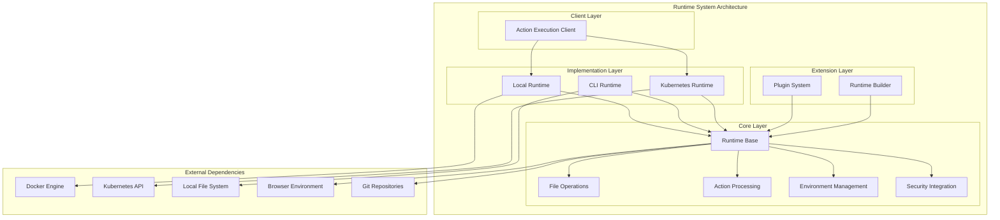
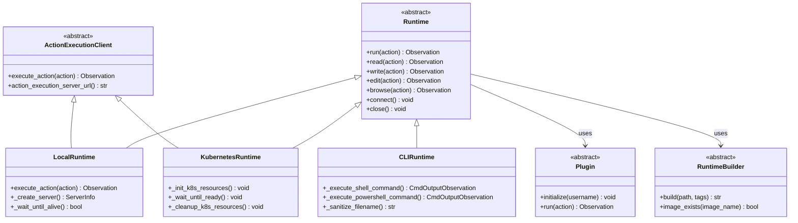
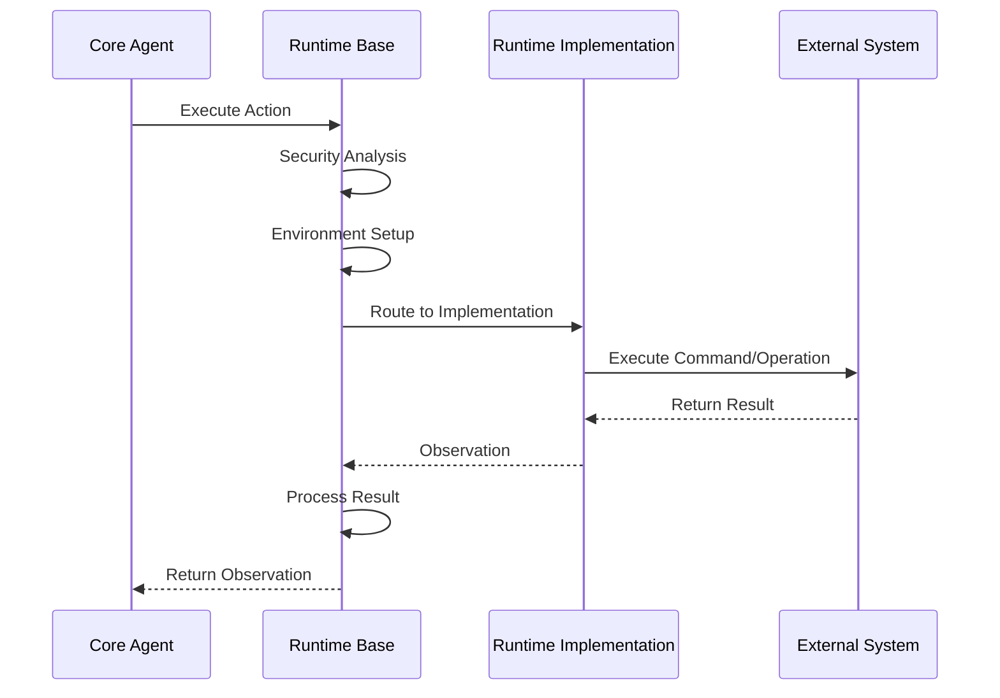

# Runtime System

## Overview

The Runtime System is a core component of OpenHands that provides sandboxed execution environments for AI agents to interact with external systems. It abstracts the complexity of different execution environments while providing a consistent interface for command execution, file operations, browser interactions, and development tools.

## Purpose

The Runtime System serves as the execution layer that:
- **Provides Sandboxed Environments**: Isolates agent operations from the host system
- **Enables Multi-Platform Support**: Supports local, containerized, and cloud-based execution
- **Facilitates Tool Integration**: Integrates development tools like VSCode, Jupyter, and browsers
- **Manages Resource Lifecycle**: Handles creation, management, and cleanup of execution environments
- **Ensures Security**: Implements security controls and access restrictions

## Architecture Overview

The Runtime System follows a layered architecture with clear separation of concerns:



### Component Relationships



## Core Components

### Base Runtime (`openhands.runtime.base.Runtime`)
The abstract base class that defines the runtime interface and common functionality:
- **Environment Management**: Sets up initial environment variables and configurations
- **Action Execution**: Processes and routes different types of actions
- **File Operations**: Provides file read/write/edit capabilities
- **Git Integration**: Handles repository operations and version control
- **Security Integration**: Implements security analysis and controls
- **Plugin System**: Manages runtime plugins and extensions

### Runtime Implementations

#### 1. Local Runtime (`openhands.runtime.impl.local.local_runtime.LocalRuntime`)
Executes actions directly on the local machine using subprocess:
- **Direct Execution**: Runs commands without containerization
- **Development Focus**: Optimized for development and testing scenarios
- **Warm Server Support**: Maintains pre-warmed servers for faster startup
- **Resource Management**: Handles temporary workspaces and cleanup

#### 2. CLI Runtime (`openhands.runtime.impl.cli.cli_runtime.CLIRuntime`)
Lightweight runtime for command-line interface usage:
- **Minimal Overhead**: Direct file system and subprocess operations
- **Cross-Platform**: Supports Windows PowerShell and Unix bash
- **No Sandboxing**: Executes directly on the host system
- **Development Tool**: Ideal for local development and testing

#### 3. Kubernetes Runtime (`openhands.runtime.impl.kubernetes.kubernetes_runtime.KubernetesRuntime`)
Cloud-native runtime for Kubernetes environments:
- **Pod Management**: Creates and manages Kubernetes pods
- **Service Integration**: Exposes services and ingress for external access
- **Resource Control**: Implements resource limits and node selection
- **Persistent Storage**: Manages persistent volume claims for data persistence

### Runtime Builder (`openhands.runtime.builder.base.RuntimeBuilder`)
Abstract interface for building runtime images:
- **Image Building**: Defines interface for building container images
- **Platform Support**: Handles multi-platform builds
- **Tag Management**: Manages image tags and versioning
- **Existence Checking**: Verifies image availability

### Plugin System (`openhands.runtime.plugins.requirement.Plugin`)
Extensible plugin architecture for runtime capabilities:
- **Plugin Interface**: Defines standard plugin contract
- **Initialization**: Handles plugin setup and configuration
- **Action Processing**: Processes plugin-specific actions
- **Requirement Management**: Manages plugin dependencies

## Sub-Modules

### [Runtime Implementations](runtime_implementations.md)
Detailed documentation of specific runtime implementations including Local, CLI, and Kubernetes runtimes with their unique features, configuration options, and use cases.

### [Plugin System](plugin_system.md)
Comprehensive guide to the runtime plugin architecture, plugin development, and available plugins for extending runtime capabilities.

### [Builder System](builder_system.md)
Documentation of the runtime image building system, builder implementations, and container image management for different runtime environments.

## Key Features

### Multi-Runtime Support
The system supports multiple execution environments:
- **Local Runtime**: Direct local execution with Docker integration
- **CLI Runtime**: Lightweight command-line execution
- **Kubernetes Runtime**: Cloud-native container orchestration

### Security Integration
Built-in security features:
- **Security Analysis**: Integrates with the [Security System](security_system.md)
- **Access Control**: Restricts file system access to workspace boundaries
- **Environment Isolation**: Provides sandboxed execution environments

### Development Tools Integration
Seamless integration with development tools:
- **VSCode Server**: Provides web-based IDE access
- **Jupyter Notebooks**: Supports interactive Python execution
- **Browser Environment**: Enables web browsing and interaction

### Git Operations
Comprehensive Git support:
- **Repository Cloning**: Automated repository setup
- **Branch Management**: Handles branch creation and switching
- **Authentication**: Integrates with Git provider tokens
- **Microagent Loading**: Loads organization-level configurations

## Data Flow



## Configuration

Runtime configuration is managed through the OpenHands configuration system:

```yaml
runtime: "local"  # or "cli", "kubernetes"
sandbox:
  runtime_container_image: "ghcr.io/all-hands-ai/runtime:latest"
  timeout: 120
  keep_runtime_alive: false
  local_runtime_url: "http://localhost"
  
kubernetes:
  namespace: "openhands"
  resource_memory_limit: "2Gi"
  resource_cpu_request: "500m"
  pvc_storage_size: "10Gi"
```

## Integration Points

### With Core Agent System
- **Action Processing**: Receives actions from [Core Agent System](core_agent_system.md)
- **State Management**: Coordinates with agent state management
- **Event Streaming**: Integrates with event stream for real-time updates

### With Events & Actions
- **Action Execution**: Processes actions from [Events & Actions](events_and_actions.md)
- **Observation Generation**: Creates observations for agent feedback
- **Event Streaming**: Participates in the event streaming system

### With Security System
- **Security Analysis**: Leverages [Security System](security_system.md) for command analysis
- **Risk Assessment**: Implements security controls and restrictions
- **Audit Logging**: Provides security audit trails

## Usage Examples

### Basic Runtime Usage
```python
from openhands.runtime import get_runtime_cls
from openhands.core.config import OpenHandsConfig

config = OpenHandsConfig()
runtime_cls = get_runtime_cls(config.runtime)
runtime = runtime_cls(config, event_stream, llm_registry)

await runtime.connect()
observation = runtime.run(CmdRunAction(command="ls -la"))
```

### File Operations
```python
# Read a file
read_obs = runtime.read(FileReadAction(path="/workspace/file.txt"))

# Write a file
write_obs = runtime.write(FileWriteAction(
    path="/workspace/output.txt",
    content="Hello, World!"
))

# Edit a file
edit_obs = runtime.edit(FileEditAction(
    path="/workspace/code.py",
    old_str="old_code",
    new_str="new_code"
))
```

## Best Practices

### Runtime Selection
- **Development**: Use CLI Runtime for local development
- **Production**: Use Kubernetes Runtime for scalable deployments
- **Testing**: Use Local Runtime for integration testing

### Resource Management
- **Cleanup**: Always call `runtime.close()` to clean up resources
- **Timeouts**: Set appropriate timeouts for long-running operations
- **Memory Limits**: Configure appropriate resource limits for your use case

### Security Considerations
- **Workspace Isolation**: Keep operations within designated workspace boundaries
- **Environment Variables**: Carefully manage sensitive environment variables
- **Network Access**: Control network access based on security requirements

## Error Handling

The runtime system provides comprehensive error handling:
- **AgentRuntimeDisconnectedError**: Runtime connection lost
- **AgentRuntimeNotFoundError**: Runtime not available
- **PermissionError**: Access denied to resources
- **TimeoutError**: Operation exceeded time limits

## Monitoring and Observability

### Status Callbacks
Runtime implementations support status callbacks for monitoring:
```python
def status_callback(level: str, status: RuntimeStatus, message: str):
    logger.log(level, f"Runtime {status}: {message}")

runtime = RuntimeClass(config, status_callback=status_callback)
```

### Logging
Comprehensive logging throughout the runtime system:
- **Debug**: Detailed execution traces
- **Info**: General operational information
- **Warning**: Non-critical issues
- **Error**: Critical failures requiring attention

## Future Enhancements

- **Remote Runtime**: Support for remote execution environments
- **Container Runtime**: Enhanced Docker-based runtime
- **Plugin Marketplace**: Extensible plugin ecosystem
- **Performance Optimization**: Improved startup times and resource usage
- **Enhanced Security**: Advanced security controls and monitoring