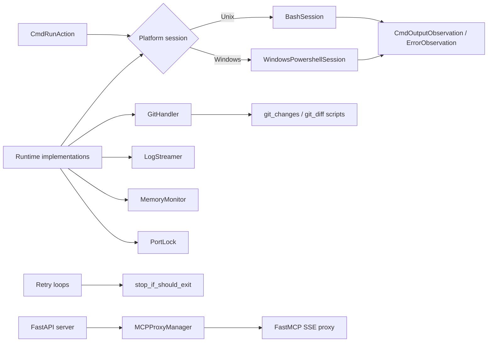
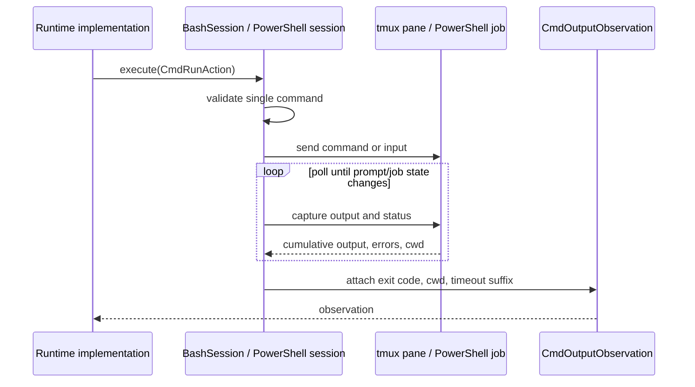
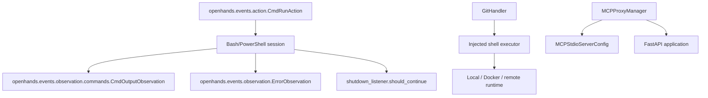

# Runtime Utilities

`runtime_utils` is the reusable support layer beneath OpenHands runtime implementations. It turns agent command actions into persistent shell execution, exposes Git state, streams runtime diagnostics, coordinates scarce ports and shutdown-aware retries, and mounts MCP tools into the server process.

The module is intentionally adapter-oriented: runtime implementations such as [runtime_implementations](runtime_implementations.md), [runtime_implementations_local_execution](runtime_implementations_local_execution.md), and [third_party_runtimes](third_party_runtimes.md) supply the environment, while these utilities provide consistent execution and operational behavior.

## Architecture

### Responsibility boundaries

| Area | Responsibility | Documentation |
|---|---|---|
| Persistent command sessions | Maintain a shell/runspace, preserve working directory, poll output, enforce timeouts, and report event observations. | [runtime_utils_command_sessions](runtime_utils_command_sessions.md) |
| Git inspection | Query branch, changed files, and file diffs through injected shell/file callbacks, with a legacy-runtime script fallback. | [runtime_utils_git](runtime_utils_git.md) |
| Operational telemetry | Forward Docker logs and process memory measurements to OpenHands logging. | [runtime_utils_observability](runtime_utils_observability.md) |
| Coordination and cancellation | Serialize port allocation and make Tenacity retries honor global shutdown state. | [runtime_utils_coordination](runtime_utils_coordination.md) |
| MCP integration | Build and remount a FastMCP proxy inside a FastAPI application. | [runtime_utils_mcp_proxy](runtime_utils_mcp_proxy.md) |

## Command execution flow

Both platform sessions consume `CmdRunAction` and return the event-system observations used by controllers and runtimes. Unix execution uses tmux and a metadata-bearing prompt; Windows execution uses a persistent .NET PowerShell runspace and background jobs.

Important shared behaviors are:

- Empty commands retrieve output only when a previous command is still active; otherwise an error observation is returned.
- New commands are rejected while a timed-out/non-completed command remains active; input/control sequences are handled separately.
- Output is incremental: prior output is removed before constructing the next observation.
- A no-change timeout and a hard timeout are distinct states. The former is suppressed for blocking actions; the latter follows the action timeout.
- Session cleanup is idempotent and releases tmux/runspace and active-job resources.

## Runtime-facing integrations

The utilities depend on shared platform contracts rather than owning them:

`GitHandler` is deliberately decoupled from a concrete runtime through `execute_shell_fn` and `create_file_fn`. This allows local, Docker, and remote runtimes to reuse the same Git API while controlling where commands and fallback scripts execute. See [runtime_image_builders](runtime_image_builders.md) for the separate image-construction pipeline; it is not part of this utility module.

## Lifecycle and failure considerations

1. Create the platform session with a valid working directory and call its initializer before execution.
2. Treat observation metadata as the source of exit code and working directory; command output may be partial after timeout.
3. Close sessions and log streamers during runtime teardown. Destructors provide a fallback but should not replace explicit lifecycle management.
4. Release a `PortLock` after the consumer has bound or no longer needs the selected port. A returned port without its lock is not a safe allocation.
5. Configure the MCP server list before calling `initialize()` or `update_and_remount()`; an empty configuration intentionally skips proxy creation and mounting.

## Related modules

- [runtime_implementations](runtime_implementations.md) — concrete execution environments consuming these helpers.
- [runtime_implementations_action_execution_server](runtime_implementations_action_execution_server.md) — action dispatch boundary for runtime operations.
- [runtime_plugins](runtime_plugins.md) — services mounted or made available inside runtimes.
- Shared platform contracts — `CmdRunAction`, `CmdOutputObservation`, logger adapters, and shutdown listeners provide the event and lifecycle interfaces consumed by this layer.
