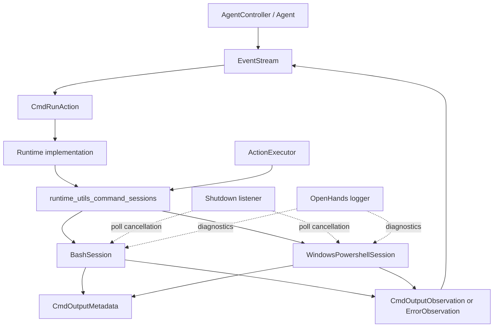
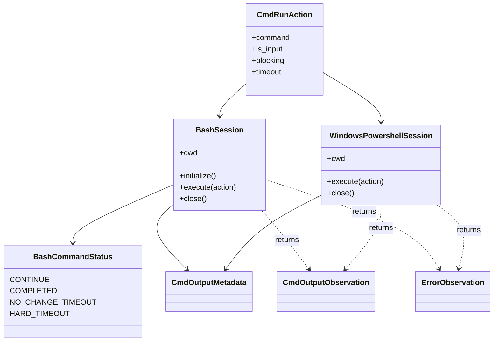
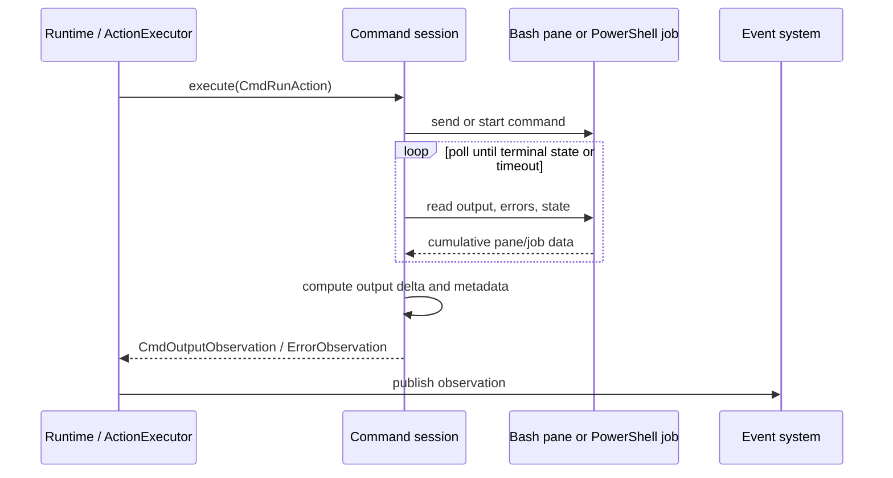

# Runtime Command Sessions

## Purpose

The `runtime_utils_command_sessions` module provides the persistent command-execution abstraction used by OpenHands runtimes. It turns a `CmdRunAction` into a `CmdOutputObservation` or `ErrorObservation` while preserving session state such as the current working directory and any still-running process.

The module has two implementations with the same high-level behavior but platform-native execution mechanisms:

| Sub-module | Main component | Execution mechanism | Detailed documentation |
|---|---|---|---|
| Unix-like sessions | `BashSession`, `BashCommandStatus` | Persistent Bash process inside a `libtmux` pane | [runtime_utils_command_sessions_bash](runtime_utils_command_sessions_bash.md) |
| Windows sessions | `WindowsPowershellSession` | Persistent .NET PowerShell runspace and background jobs | [runtime_utils_command_sessions_powershell](runtime_utils_command_sessions_powershell.md) |

## Architectural position

Command sessions are a low-level part of the [runtime_utils](runtime_utils.md) layer. Concrete runtimes and the in-sandbox [action execution server](runtime_implementations_action_execution_server.md) sit above them; shared actions, observations, logging, and shutdown signaling sit beside or below them.

## Shared execution contract

Both sessions expose the same operational shape:

1. Construct with a working directory and timeout configuration.
2. Initialize a persistent execution context.
3. Execute one action at a time.
4. Return structured output with exit status and working-directory metadata.
5. Preserve an unfinished process for later polling, interaction, or cancellation.
6. Close the underlying process/session and release resources.

The contract intentionally separates a command's output from its transport. Bash extracts output from prompt-delimited tmux history; PowerShell reads job output and error streams. Callers receive the same event types regardless of platform.

## Component relationships

## Cross-platform behavior

| Concern | Bash session | PowerShell session |
|---|---|---|
| Persistence | tmux pane and Bash process | .NET runspace and PowerShell jobs |
| Command validation | `bashlex`; rejects multiple top-level commands | PowerShell AST parser; rejects multiple statements |
| Working directory | Prompt metadata updates cache | `Get-Location` updates cache |
| Long-running work | Pane polling with inactivity and hard timeouts | Background job polling with hard timeout and shutdown checks |
| Interaction | Sends input and control keys through tmux | Direct input unsupported; `C-c` stops active job |
| Cleanup | Kills tmux session | Stops/removes jobs, closes runspace |

For detailed control flow, output extraction, timeout semantics, and platform limitations, see [Bash Command Sessions](runtime_utils_command_sessions_bash.md) and [Windows PowerShell Command Sessions](runtime_utils_command_sessions_powershell.md).

## Data flow

## Operational considerations

- A timeout generally reports the current output without forcibly terminating the process. Callers should poll or interrupt before issuing unrelated commands.
- Empty commands have a defined meaning: retrieve output from an unfinished command; when no command is active, they return a controlled error observation.
- Session cleanup is important because both tmux servers and PowerShell jobs are external resources.
- Platform availability is asymmetric: PowerShell requires CoreCLR, pythonnet, and the PowerShell SDK; Bash requires Bash, tmux/libtmux, and bashlex.
- `CmdOutputMetadata` is the compatibility boundary for exit codes, working-directory updates, and explanatory prefixes/suffixes.

## Related modules

- [runtime_implementations](runtime_implementations.md) — runtime provisioning and action execution paths.
- [runtime_utils](runtime_utils.md) — sibling runtime helpers such as logging, memory monitoring, and port coordination.
- [event_system](event_system.md) — action and observation types exchanged with sessions.
- [logging](logging.md) — diagnostics emitted during parsing, polling, timeout, and cleanup.
