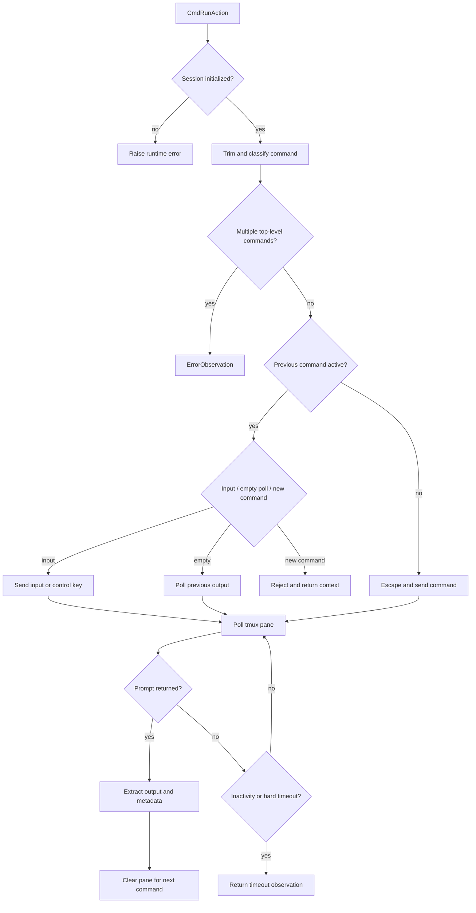

# Bash Command Sessions

`openhands/runtime/utils/bash.py` implements the Unix-like command session used by runtimes that execute shell actions locally or inside a sandbox. Its main design goal is persistence: commands run in one long-lived Bash process, so the working directory, shell state, and running interactive process survive across calls.

## Components

### `BashCommandStatus`

The enum records the session's command lifecycle:

| Status | Meaning |
|---|---|
| `CONTINUE` | A prior command may still be running and can be polled or interacted with. |
| `COMPLETED` | The prior command returned to the instrumented prompt. |
| `NO_CHANGE_TIMEOUT` | No new pane output appeared during the configured inactivity interval. |
| `HARD_TIMEOUT` | The action's absolute timeout elapsed before completion. |

The status controls whether an empty command retrieves output, whether input is allowed, and whether a new command must be rejected while an older one remains active.

### `BashSession`

`BashSession` owns a persistent `libtmux` server, session, window, and pane. `initialize()` creates the pane in `work_dir`, optionally starts Bash through `su` for `root` or `openhands`, configures a machine-readable `PS1`, and clears the pane history. `close()` terminates the tmux session and is also called by the destructor.

The cached `cwd` is updated from prompt metadata after each completed command. The session also retains the previous pane output temporarily so repeated polling does not duplicate observations.

## Command preparation

`split_bash_commands()` parses input with `bashlex` and returns top-level command fragments. `execute()` rejects input containing multiple independent commands, while allowing a single shell expression that chains work with operators such as `&&` or `;`. If parsing fails, the original command is returned as one fragment so the caller receives a controlled validation result rather than a parser crash.

`escape_bash_special_chars()` protects escaped shell separators (`;`, `|`, `&`, `<`, `>`) when text crosses the Python-to-tmux boundary. Quoted strings, command substitutions, and heredocs are preserved. Parse failures fall back to the original command.

## Execution and output extraction

The session sends commands or control keys to the tmux pane, then polls every `POLL_INTERVAL` seconds. Completion is detected when a new metadata prompt appears or the pane ends with the prompt marker. `CmdOutputMetadata` carries the exit code and working directory; `CmdOutputObservation` carries the output and explanatory prefix/suffix text.

## Timeout behavior

There are two timeout paths:

- A non-blocking action returns `NO_CHANGE_TIMEOUT` when the pane has not changed for `NO_CHANGE_TIMEOUT_SECONDS`.
- Any action with a configured `timeout` returns `HARD_TIMEOUT` once its total elapsed time exceeds that limit.

Timeouts do not automatically kill the process. The returned observation explains that the previous process may still be running. A later empty command retrieves output; `is_input=True` can send input. A normal new command is refused until the old process completes.

## Integration points

- [runtime_implementations](runtime_implementations.md) uses the session through local, CLI, and sandbox execution paths.
- [event_system](event_system.md) supplies `CmdRunAction` and consumes `CmdOutputObservation` / `ErrorObservation`.
- [logging](logging.md) receives parsing, lifecycle, polling, and timeout diagnostics.
- `openhands/runtime/utils/bash_constants.py` supplies the shared timeout message and prompt-related constants.
- `openhands/utils/shutdown_listener.py` lets polling stop when application shutdown is requested.

