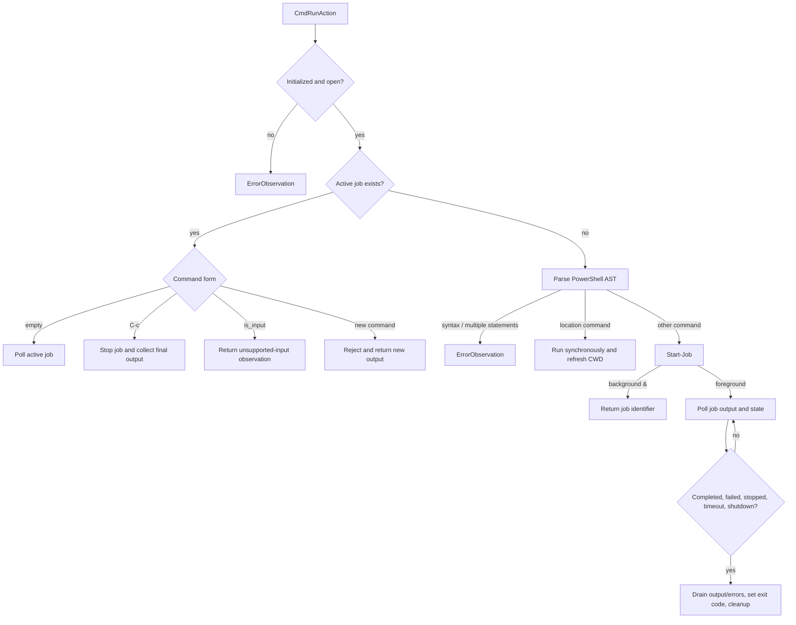

# Windows PowerShell Command Sessions

`openhands/runtime/utils/windows_bash.py` provides `WindowsPowershellSession`, a Windows-specific persistent command session. It uses `pythonnet` to load CoreCLR and `System.Management.Automation`, then creates one PowerShell runspace that remains available across actions.

## Runtime initialization

Module import loads the .NET runtime and searches for the PowerShell SDK in this order:

1. PowerShell 7 under `Program Files`.
2. Windows PowerShell 5.1 under `SystemRoot`.
3. Assembly-name resolution through the .NET loader.

Failure to load CoreCLR, `System`, or `System.Management.Automation` raises `DotNetMissingError`. After construction, the session opens a runspace, sets its initial location, and caches the verified path in `_cwd`. `username` and `max_memory_mb` are retained for API compatibility but are currently not applied.

## Persistent state and synchronization

The session tracks:

- `runspace`: the persistent PowerShell execution context.
- `active_job`: the foreground asynchronous job, if any.
- `_last_job_output` and `_last_job_error`: cumulative values used to emit only new output on later polls.
- `_cwd`: the last confirmed working directory.
- `_job_lock`: an `RLock` protecting job inspection, polling, stopping, and cleanup.

`close()` stops and removes an active job before closing and disposing the runspace. This makes cleanup safe both for explicit shutdown and destructor-triggered cleanup.

## Command classification

PowerShell's `Parser.ParseInput` validates syntax and identifies multiple statements. Independent multi-statement input is rejected with an `ErrorObservation`, while a single pipeline or command is accepted. Location-changing commands (`Set-Location`, `cd`, `Push-Location`, and `Pop-Location`) use a synchronous path so the cached working directory can be refreshed immediately.

Other commands run as PowerShell background jobs. A trailing `&` starts a detached background job and returns immediately; otherwise the job becomes `active_job` and is monitored until completion, timeout, shutdown, or failure.

## Job polling and observations

`_receive_job_output()` reads both the output and error streams. Polling uses `Receive-Job -Keep` to preserve cumulative output, then compares it with the prior observation to calculate a delta. When a job finishes, a final non-keeping receive drains remaining output and the job is removed.

The resulting `CmdOutputMetadata` contains an exit code and escaped working directory. Exit code `-1` indicates a still-running job after timeout or shutdown. Error stream records are appended under an `[ERROR STREAM]` marker and can force a non-zero result. Timeout observations reuse `TIMEOUT_MESSAGE_TEMPLATE` from the shared Bash utility constants so callers see a consistent contract across operating systems.

Unlike the tmux session, direct stdin injection into a running PowerShell process is not implemented. `is_input=True` therefore returns a diagnostic observation; `C-c` is the supported interruption mechanism.

## Integration points

- [runtime_utils_command_sessions](runtime_utils_command_sessions.md) describes the shared cross-platform contract.
- [runtime_implementations](runtime_implementations.md) selects the session for Windows-capable local or sandbox execution.
- [event_system](event_system.md) defines `CmdRunAction`, `CmdOutputObservation`, and `ErrorObservation`.
- `openhands/runtime/utils/windows_exceptions.py` defines `DotNetMissingError`.
- `openhands/utils/shutdown_listener.py` controls cancellation during job monitoring.

