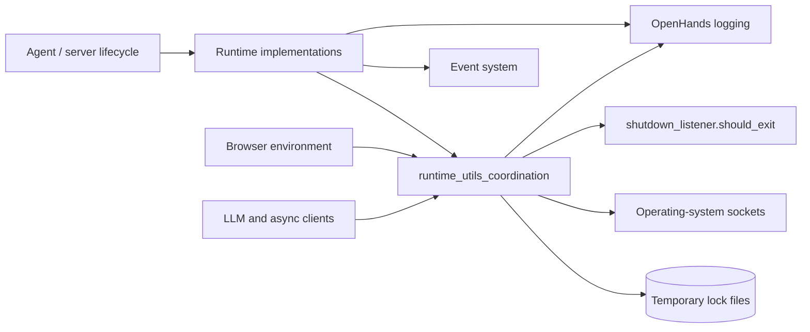
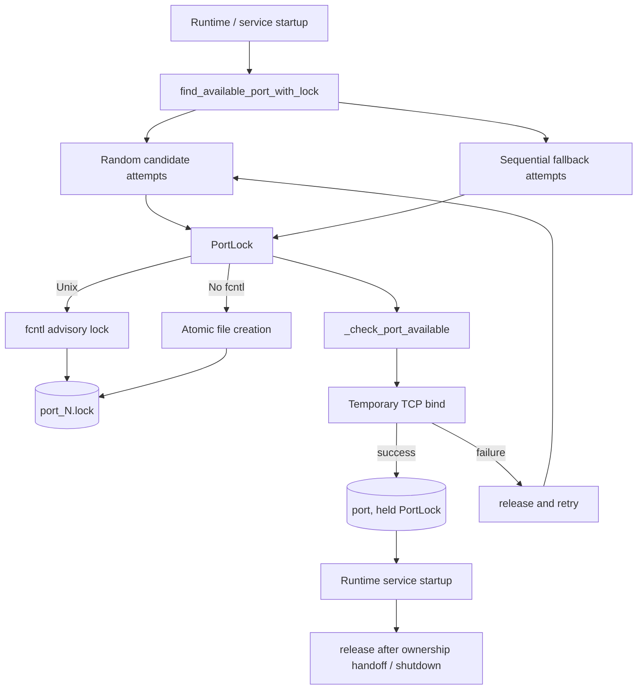
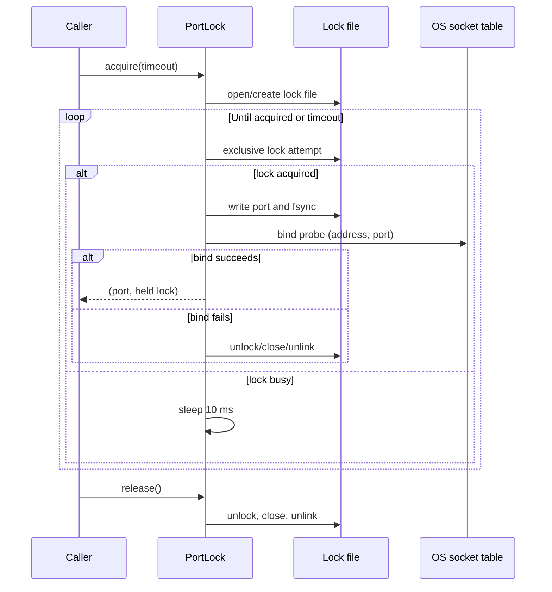
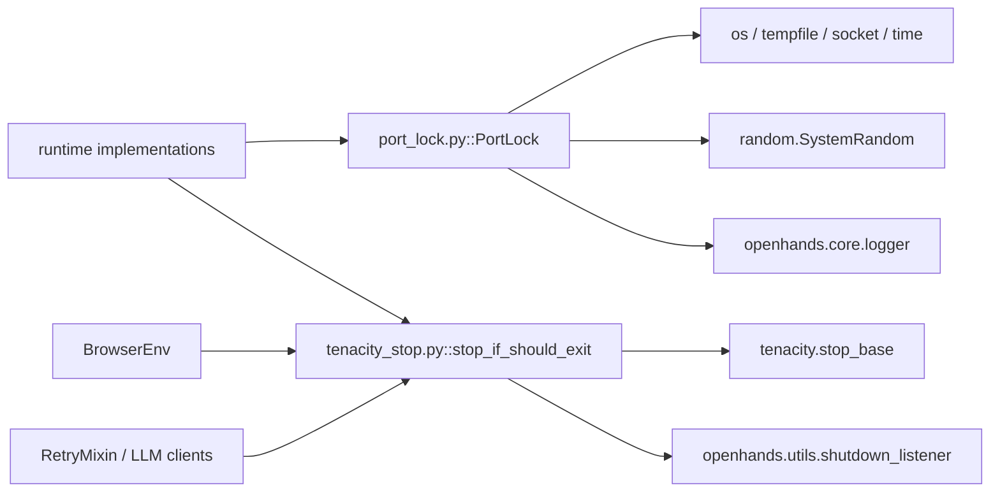

# Runtime Utility Coordination

`runtime_utils_coordination` contains small, process-level coordination helpers used by OpenHands while runtimes and other asynchronous services start, retry, and allocate resources. It has two distinct responsibilities:

- `PortLock` and its helper functions reserve TCP ports across cooperating processes.
- `stop_if_should_exit` adapts the application shutdown flag to Tenacity's retry-stop interface.

The module does not execute commands or own a runtime. It supports the runtime implementations, browser environment, and retrying clients described in [runtime_implementations](runtime_implementations.md), [runtime_utils_command_sessions](runtime_utils_command_sessions.md), and [llm_layer_clients_async_streaming](llm_layer_clients_async_streaming.md).

## Position in the system

Coordination sits below runtime implementations and beside the other runtime utilities. Port allocation protects externally reachable runtime services; shutdown-aware stopping protects retry loops from continuing after application shutdown.



## Components

### `PortLock`

`PortLock(port, lock_dir=None)` represents an exclusive lock for one numeric port. By default it uses `<system temp directory>/openhands_port_locks/port_<port>.lock`; callers can provide a separate directory for isolation or testing. Construction creates the directory if necessary.

State is held in three fields:

| Field | Purpose |
|---|---|
| `port` | Port number represented by the lock. |
| `lock_file_path` | File used for inter-process coordination. |
| `lock_fd` / `_locked` | Open descriptor and in-process ownership state. |

On Unix, `acquire()` opens the lock file and repeatedly attempts a non-blocking `fcntl.flock(LOCK_EX | LOCK_NB)` until `timeout` expires. On platforms without `fcntl` (the intended Windows fallback), it uses exclusive file creation (`O_CREAT | O_EXCL`). Successful acquisition writes the port number to the file and flushes it with `fsync()`, which makes the file useful for diagnostics.

`release()` unlocks and closes the descriptor, removes the lock file, and resets local state. The class is a context manager, so the normal usage is:

```python
with PortLock(port) as lock:
    # Start or configure the service that owns port.
    ...
```

If acquisition fails in a context-manager `__enter__`, an `OSError` is raised. Direct callers should inspect the boolean result of `acquire()` and call `release()` only when ownership was obtained. Re-acquiring an already-held instance is idempotent and returns `True`.

### `find_available_port_with_lock`

`find_available_port_with_lock()` combines reservation and availability checking. It returns `(port, PortLock)` or `None`; the caller owns the returned lock and must release it after the service has taken over the port or when startup is abandoned.

The search uses random candidates for distribution under contention, followed by a bounded sequential search. For every candidate it:

1. Acquires the file lock.
2. Attempts to bind a temporary IPv4 TCP socket to `bind_address` and the candidate port.
3. Returns the still-held lock if binding succeeds.
4. Releases the lock and tries another candidate if binding fails.

The default range is `30000–39999`, with at most 20 attempts and a one-second lock-acquisition timeout per candidate. `SO_REUSEADDR` is enabled for the probe. The probe proves that the port was bindable at that instant; the lock prevents cooperating OpenHands processes from selecting the same candidate during the handoff, but it cannot prevent unrelated applications from racing for the port.

### `_check_port_available`

This private helper creates an IPv4 stream socket, applies `SO_REUSEADDR`, binds it, closes it, and returns `True`; any `OSError` produces `False`. It is intentionally a short-lived probe rather than a listener.

### `cleanup_stale_locks`

`cleanup_stale_locks(max_age_seconds=300)` scans the default lock directory for `port_*.lock` files older than the configured age and attempts to unlink them. It returns the number removed and tolerates files disappearing concurrently or an inaccessible directory. Cleanup is best treated as housekeeping for abandoned files, not as proof that a port is free.

## Port allocation architecture



## Port-lock lifecycle



## Shutdown-aware retry stopping

`stop_if_should_exit` subclasses Tenacity's `stop_base`. Its `__call__` ignores retry details and returns the current value of `openhands.utils.shutdown_listener.should_exit()`.

It is normally OR-composed with a bounded Tenacity stop condition, for example `stop_after_attempt(n) | stop_if_should_exit()`. This gives a retry loop two termination paths: its normal attempt/deadline limit or an application-wide shutdown request. The helper does not cancel an in-flight operation, raise an exception, or perform cleanup; it only prevents another retry once Tenacity evaluates the stop condition.

```mermaid
flowchart TD
    Operation[Retryable startup / health check / request] --> Failure{Retryable failure?}
    Failure -->|no| Success[Return result]
    Failure -->|yes| Stop{Tenacity stop conditions}
    Stop --> Attempts{Attempts or deadline exhausted?}
    Stop --> Exit{should_exit() is true?}
    Attempts -->|yes| End[Stop and propagate outcome]
    Exit -->|yes| End
    Attempts -->|no| Wait[Tenacity wait policy]
    Exit -->|no| Wait
    Wait --> Operation
```

Known consumers include runtime readiness and action-server connection retries, managed runtime startup paths, browser initialization, and LLM retry logic. These consumers decide their own retryable exceptions and wait policies; this module contributes only the shutdown predicate. See [runtime_implementations](runtime_implementations.md), [third_party_runtimes](third_party_runtimes.md), and [llm_layer_clients_async_streaming](llm_layer_clients_async_streaming.md).

## Dependency view



The direct dependencies are deliberately small. The shared OpenHands logger is used for acquisition, release, cleanup, and failure diagnostics. Tenacity owns retry scheduling and evaluation; the shutdown listener owns the process-level flag. The coordination module does not depend on event schemas, storage, or agent state directly.

## Operational guidance and edge cases

- Always release a returned `PortLock`, including startup error paths. A `try/finally` block or context manager is preferred.
- Treat the lock and the socket probe as a reservation protocol for cooperating processes, not a permanent port lease. The lock file is removed when released.
- `PortLock` instances should use the same `lock_dir` when coordinating across processes. A different directory creates a different lock namespace.
- The Windows fallback relies on the lock file's existence. An abruptly terminated process can leave a file behind, which is why stale cleanup exists.
- `cleanup_stale_locks()` only targets the default temporary directory and uses file age. Running it aggressively can race with a live owner; choose `max_age_seconds` conservatively and run it as maintenance, not as part of every allocation attempt.
- The port probe binds only IPv4 (`AF_INET`). IPv6-only availability is outside its check.
- `acquire()` returns `False` on timeout or unexpected errors and logs failures at debug level. `release()` logs cleanup failures at warning level while still resetting local state.
- `stop_if_should_exit` is synchronous and cheap, making it suitable for Tenacity's stop expression. It does not replace explicit cleanup in the caller.

## Related documentation

- [runtime_implementations](runtime_implementations.md) — runtime lifecycle and readiness paths.
- [runtime_utils_command_sessions](runtime_utils_command_sessions.md) — command execution utilities that share runtime lifecycle concerns.
- [runtime_utils_observability](runtime_utils_observability.md) — logging and resource-monitoring helpers.
- [runtime_plugins](runtime_plugins.md) — runtime extensions that may expose services requiring ports.
- [third_party_runtimes](third_party_runtimes.md) — managed sandbox implementations using retry-aware startup.
- [llm_layer_clients_async_streaming](llm_layer_clients_async_streaming.md) — retry infrastructure using shutdown-aware stopping.
