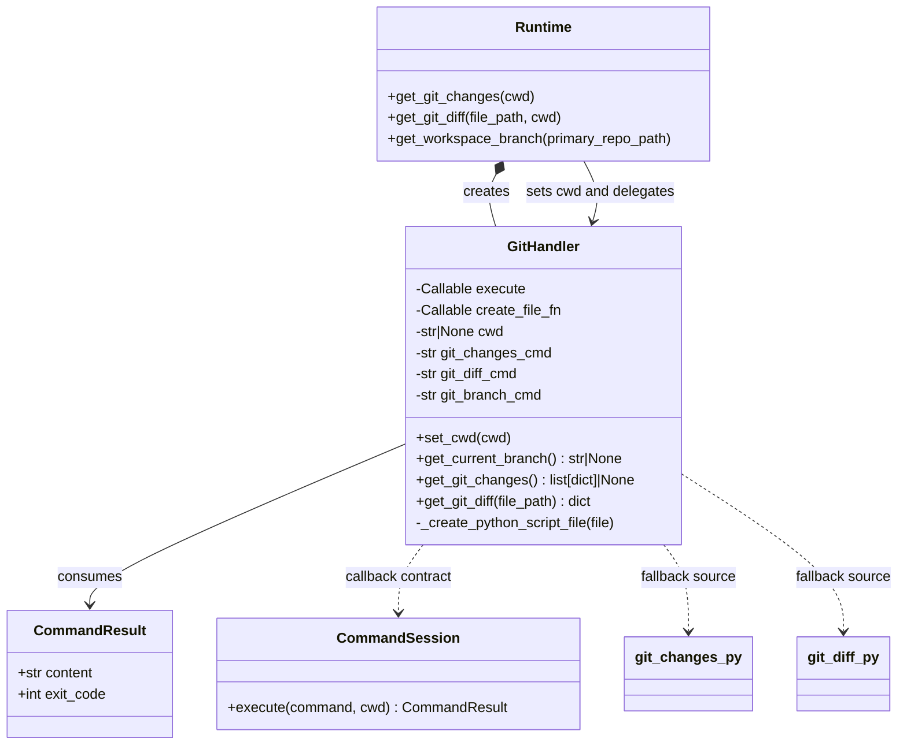
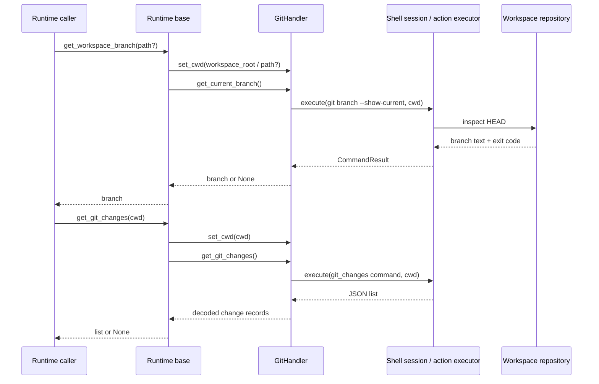
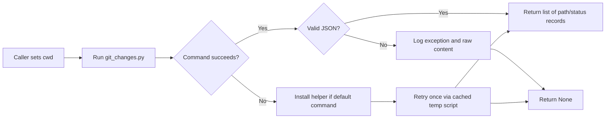
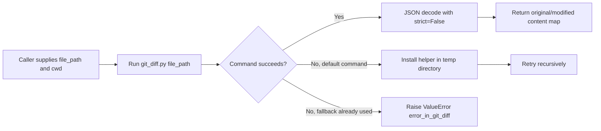

# Runtime Git Utilities

## Introduction

The `runtime_utils_git` module provides the runtime-side Git inspection adapter used by OpenHands. Its `GitHandler` executes Git-oriented commands inside the configured workspace, reports the active branch, enumerates changes across repositories, and returns the original and modified contents for a file. It deliberately depends on injected shell and file-creation callbacks so the same logic can run through Docker, local, remote, Kubernetes, or other runtime implementations.

The module is a focused child of the broader sandboxed execution layer. Runtime implementations own sandbox provisioning and command execution; `GitHandler` owns the Git-specific command protocol and compatibility fallback. See [runtime_implementations](runtime_implementations.md) for the runtime lifecycle and [runtime_utils_command_sessions](runtime_utils_command_sessions.md) for the command-session implementations.

## Architectural position

```mermaid
graph TB
    Agent[Agent / UI request]
    Runtime[Runtime base and concrete runtimes]
    GitHandler[GitHandler\n(runtime_utils_git)]
    Shell[Injected execute_shell_fn]
    Files[Injected create_file_fn]
    Workspace[Sandbox workspace\nconfigured cwd]
    Git[Git CLI and repository metadata]
    Events[Observations / event consumers]

    Agent --> Runtime
    Runtime -->|set cwd; call Git API| GitHandler
    GitHandler --> Shell
    GitHandler --> Files
    Shell --> Workspace
    Workspace --> Git
    Git --> Shell
    Runtime --> Events
```

`GitHandler` is not a Git hosting API client. It does not create commits, branches, pull requests, or push changes. Provider-facing operations belong to the integration layer, while this module inspects the filesystem-visible repository state inside a runtime.

## Components

| Component | Responsibility |
|---|---|
| `CommandResult` | Small value object containing command `content` and integer `exit_code`. |
| `GitHandler` | Maintains the target working directory, executes Git helper commands, parses JSON, and installs missing helper scripts when needed. |
| `GIT_CHANGES_CMD` | Default command for the workspace-wide `git_changes.py` helper. |
| `GIT_DIFF_CMD` | Default command template for the file-specific `git_diff.py` helper. |
| `GIT_BRANCH_CMD` | Direct Git command: `git branch --show-current`. |
| `git_changes` / `git_diff` | Imported helper modules whose source is copied into legacy runtimes if the default `/openhands/code/...` path is unavailable. |

## Dependency and ownership model



The runtime constructs `GitHandler` with two callbacks. The execution callback has the shape `execute_shell_fn(command, cwd) -> CommandResult`; the file callback has the shape `create_file_fn(path, content) -> int`. This inversion of control keeps the utility independent of whether the command is executed by a Bash session, PowerShell session, HTTP action server, or another runtime transport. See [runtime_utils_command_sessions_bash](runtime_utils_command_sessions_bash.md) and [runtime_utils_command_sessions_powershell](runtime_utils_command_sessions_powershell.md) for platform-specific command execution.

## Public behavior

### Working-directory state

`set_cwd(cwd)` changes the directory passed to every subsequent callback invocation. The handler is stateful: callers should set the directory immediately before an operation, as the runtime base does. If `cwd` is unset, `get_current_branch()` and `get_git_changes()` return `None`; `get_git_diff()` raises `ValueError('no_dir_in_git_diff')` because a diff cannot be meaningfully selected without a repository directory.

### Current branch

`get_current_branch()` executes `git branch --show-current` in `cwd`.

- A successful, non-empty result is returned after stripping whitespace.
- A successful empty result returns `None`, which represents detached `HEAD`.
- A non-zero exit code returns `None`, covering non-repositories and command errors.

This method intentionally exposes no exception for ordinary branch-discovery failures.

### Changed files

`get_git_changes()` runs the workspace helper and JSON-decodes its stdout. The helper is designed to inspect direct subdirectories of the workspace for Git repositories and return a list of dictionaries containing file paths and statuses. The handler itself treats the helper's JSON as the serialization boundary and returns the decoded list without reshaping its records.

If JSON decoding fails, the method logs the raw content and returns `None`. If the command fails, the handler performs the compatibility flow described below. A second failure after fallback returns `None` rather than retrying forever.

### File diff

`get_git_diff(file_path)` runs the diff helper with the requested path and JSON-decodes the result using `strict=False`. The returned dictionary contains the original and modified file contents as produced by `git_diff.py`.

Unlike change enumeration, malformed successful JSON is not caught locally and therefore propagates the JSON decoding exception. If command execution fails after the fallback command has already been installed, the method raises `ValueError('error_in_git_diff')`.

## Runtime integration



The runtime base delegates as follows:

| Runtime-level operation | Handler sequence |
|---|---|
| `get_git_changes(cwd)` | `set_cwd(cwd)` → `get_git_changes()` |
| `get_git_diff(file_path, cwd)` | `set_cwd(cwd)` → `get_git_diff(file_path)` |
| `get_workspace_branch(primary_repo_path)` | Resolve workspace or primary-repository path → `set_cwd(...)` → `get_current_branch()` |

This makes the utility available uniformly to all runtime families documented in [runtime_implementations](runtime_implementations.md), including local and remote sandboxes.

## Helper-command compatibility flow

The default helper commands assume that the runtime image contains the OpenHands source tree at `/openhands/code`. Older or custom runtime images may not contain those files. The handler handles that case lazily and per handler instance.

```mermaid
flowchart TD
    Start[get_git_changes or get_git_diff] --> Cwd{cwd configured?}
    Cwd -->|No| Empty[Return None\n(or raise no_dir_in_git_diff)]
    Cwd -->|Yes| Execute[Execute current helper command]
    Execute --> Success{exit_code == 0?}
    Success -->|Yes| Parse[JSON decode result]
    Parse --> Result[Return decoded data]
    Success -->|No| Default{Still using default command?}
    Default -->|No| Fail[Return None for changes\nor raise error_in_git_diff]
    Default -->|Yes| Temp[mktemp -d in cwd]
    Temp --> Copy[Read local helper source\nand create it in temp directory]
    Copy --> Chmod[chmod +x copied script]
    Chmod --> Cache[Replace command on handler]
    Cache --> Execute
```

`_create_python_script_file(file)` obtains a temporary directory through the same injected shell callback, reads the helper source from the host-side Python environment, writes it into the runtime through `create_file_fn`, and makes it executable. The updated command is cached in `git_changes_cmd` or `git_diff_cmd`, so later calls avoid repeating installation. The fallback is bounded by the command comparison: once the command has been replaced, another failure is treated as final.

## Detailed process flows

### Change enumeration



### File diff



## Error and edge-case semantics

| Situation | `get_current_branch()` | `get_git_changes()` | `get_git_diff()` |
|---|---|---|---|
| No `cwd` | `None` | `None` | `ValueError('no_dir_in_git_diff')` |
| Non-zero command exit | `None` | Install fallback, then `None` if retry fails | Install fallback, then `ValueError('error_in_git_diff')` if retry fails |
| Empty branch output | `None` | Not applicable | Not applicable |
| Invalid successful JSON | Not applicable | Log exception and return `None` | JSON exception propagates |
| Detached `HEAD` | `None` | Not applicable | Not applicable |

The handler logs fallback installation at info level and malformed change output at exception level through the shared OpenHands logger. It does not log file contents during normal diff retrieval.

## Operational considerations

- **Call ordering:** Set `cwd` before every logically independent operation when a handler may be reused across repositories.
- **Path safety:** `file_path` is interpolated into a shell command. The caller and runtime command layer must apply the repository's expected path validation/quoting policy; this class does not sanitize or escape it.
- **Fallback placement:** Helper scripts are written into a temporary directory created relative to the runtime's working context. The copied script is persistent for the handler's lifetime, but cleanup of the temporary directory is outside this class.
- **Runtime availability:** The callbacks must preserve command output and exit status accurately; fallback decisions depend on `exit_code`.
- **Scope:** This is local repository inspection. Remote provider operations and Git hosting workflows belong to the code-host automation and provider layers, not this utility.

## Related modules

- [runtime_implementations](runtime_implementations.md) — creates and exposes the runtime abstraction that delegates Git operations to `GitHandler`.
- [runtime_utils_command_sessions](runtime_utils_command_sessions.md) — supplies persistent shell/session behavior used by runtime command execution.
- [runtime_utils_command_sessions_bash](runtime_utils_command_sessions_bash.md) — Bash transport details for Unix-like sandboxes.
- [runtime_utils_command_sessions_powershell](runtime_utils_command_sessions_powershell.md) — PowerShell transport details for Windows environments.
- [runtime_plugins](runtime_plugins.md) — adjacent runtime capabilities that may share the same sandbox and action-execution server.
- [code_host_automation](code_host_automation.md) — provider and issue/PR automation; use that module for remote Git service semantics.
