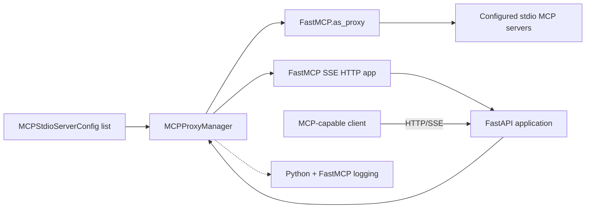
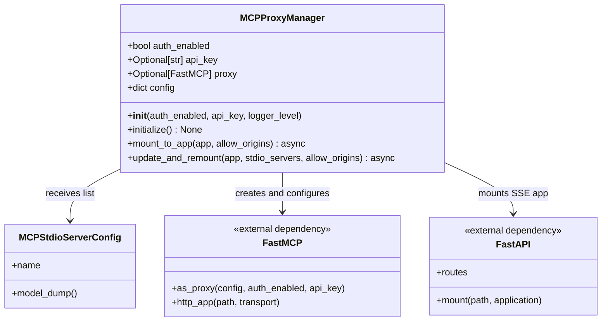
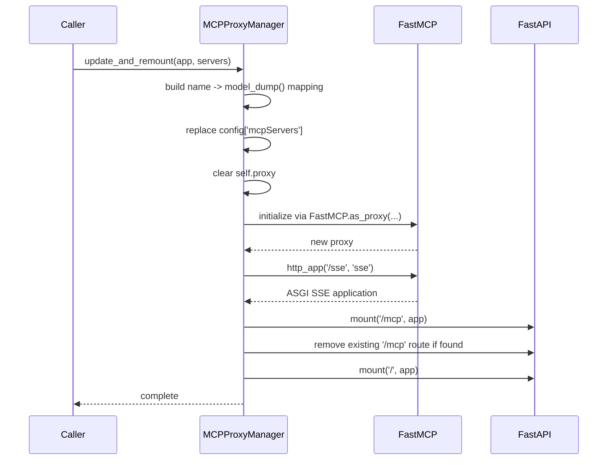
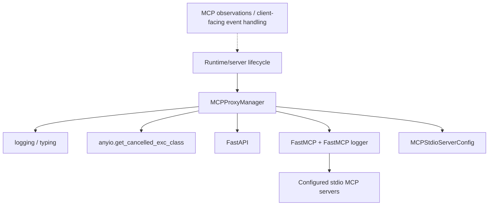

# Runtime MCP Proxy Utilities

`runtime_utils_mcp_proxy` provides the `MCPProxyManager`, a lifecycle wrapper that turns configured stdio MCP servers into a FastMCP proxy and exposes that proxy through a FastAPI application. It belongs to the runtime utility layer, but unlike command-session or port utilities it primarily bridges configuration, the FastMCP transport, and the OpenHands HTTP server.

The manager deliberately has a narrow responsibility: it owns the current MCP server configuration and proxy object, initializes FastMCP when at least one server is configured, and mounts the resulting Server-Sent Events (SSE) application into FastAPI. Runtime selection, sandbox creation, action execution, and MCP client behavior remain in the surrounding runtime and server modules; see [runtime_implementations](runtime_implementations.md) and [runtime_implementations_action_execution_server](runtime_implementations_action_execution_server.md).

## Position in the system



At runtime, the manager is an integration boundary rather than an MCP server implementation. FastMCP handles proxying requests to the configured downstream servers; the manager supplies configuration, optional authentication, and the mounting lifecycle.

## Responsibilities and non-responsibilities

### Responsibilities

- Keep a FastMCP-compatible configuration dictionary under `config`.
- Store authentication settings (`auth_enabled` and `api_key`).
- Set the FastMCP logger level when requested.
- Create a proxy only when `mcpServers` is non-empty.
- Build the SSE HTTP application and mount it into FastAPI.
- Replace an existing proxy configuration through `update_and_remount()`.
- Guard against mounting before initialization.
- Wrap the FastMCP app so a duplicate `http.response.start` is converted into cancellation, addressing the referenced MCP SDK issue.

### Not handled here

- Starting, stopping, or implementing downstream MCP stdio servers.
- Validating the semantic contents of `MCPStdioServerConfig` beyond serializing each model with `model_dump()`.
- Managing FastAPI authentication middleware or application lifetime.
- Implementing CORS. `allow_origins` is accepted by the public methods but is not consumed in the current implementation; any CORS policy must be configured elsewhere until this is changed.

## Component model



The manager starts with `proxy = None` and the valid empty FastMCP configuration `{'mcpServers': {}}`. The proxy is therefore optional by design: an empty configuration means “MCP disabled/no servers configured,” not an initialization failure.

## Configuration lifecycle

`update_and_remount()` converts a list of `MCPStdioServerConfig` instances into the mapping expected by FastMCP:

```python
tools = {server.name: server.model_dump() for server in stdio_servers}
self.config['mcpServers'] = tools
```

The server name is the dictionary key, so duplicate names overwrite earlier entries during conversion. The resulting values are the complete Pydantic model dumps, including whatever command, arguments, environment, or transport fields the configuration model defines.

```mermaid
flowchart TD
    Input["list[MCPStdioServerConfig]"] --> Map["name -> model_dump()"]
    Map --> Config["config['mcpServers']"]
    Config --> Empty{ "Any servers?" }
    Empty -->|No| NoProxy["proxy remains None; skip"]
    Empty -->|Yes| Create["FastMCP.as_proxy(config, auth...)" ]
    Create --> Proxy["self.proxy"]
    Proxy --> HTTP["proxy.http_app(path='/sse', transport='sse')"]
    HTTP --> Mount["mount into FastAPI"]
```

## API reference

### `__init__(auth_enabled=False, api_key=None, logger_level=None)`

Stores authentication options and initializes the empty configuration. `api_key` is passed to FastMCP when creating the proxy; callers should provide it when authentication is enabled. If `logger_level` is not `None`, it is applied to the logger returned by `fastmcp.utilities.logging.get_logger('fastmcp')`.

The constructor does not create a FastMCP object and does not contact any MCP server.

### `initialize() -> None`

If no servers are configured, logs an informational message and returns. Otherwise it replaces `self.proxy` with the result of:

```python
FastMCP.as_proxy(
    self.config,
    auth_enabled=self.auth_enabled,
    api_key=self.api_key,
)
```

Calling `initialize()` more than once creates a new proxy from the current configuration. It does not explicitly close or await shutdown of the previous proxy; callers performing a replacement should follow the same lifecycle assumptions as `update_and_remount()` and ensure the surrounding FastMCP version does not require additional cleanup.

### `mount_to_app(app, allow_origins=None) -> None` (async)

Mounting has three paths:

1. With an empty configuration, log and return.
2. With configured servers but `proxy is None`, raise `ValueError('FastMCP Proxy is not initialized')`.
3. Otherwise, build and mount the SSE application.

The SSE app is created with `proxy.http_app(path='/sse', transport='sse')`. It is wrapped by a local ASGI adapter that tracks whether an `http.response.start` message has already been sent. A second start message raises AnyIO's cancellation exception with a diagnostic pointing to the MCP SDK issue. This protects the host application from the known double-response condition.

The app is first mounted at `/mcp`. The implementation then checks whether the literal string `'/mcp'` is present in `app.routes` and, if so, attempts to remove that value before mounting the same ASGI app at `/`. Because FastAPI normally stores route objects rather than path strings, this cleanup branch may not match a conventional `Mount` route. In practice, route-table behavior and the effective public endpoint should be verified against the FastAPI/Starlette version in use; the method's log message identifies the MCP mount as `/mcp`, while the later root mount is also intentional in the current code.

`allow_origins` is currently unused.

### `update_and_remount(app, stdio_servers, allow_origins=None) -> None` (async)

This convenience method performs configuration replacement and remounting:



An empty `stdio_servers` list clears the configuration. Initialization and mounting then both skip, leaving the manager with no proxy and no new MCP route. Because the method mutates the existing FastAPI route table, it should normally be called during controlled application setup or a serialized reconfiguration operation.

## End-to-end request flow

```mermaid
flowchart LR
    C["MCP client"] -->|SSE/HTTP request| FA["FastAPI"]
    FA --> Root["Mounted FastMCP ASGI app"]
    Root --> Guard{ "Second response-start?" }
    Guard -->|Yes| Cancel["AnyIO cancellation"]
    Guard -->|No| FM["FastMCP proxy"]
    FM --> Down["Named downstream stdio MCP server"]
    Down --> FM
    FM --> Root
    Root --> C
```

The manager is involved during setup and in the ASGI guard, not in each MCP tool invocation. Once mounted, FastMCP owns request routing and downstream communication.

## Dependency view



The module has no direct dependency on agent state, event storage, command sessions, or individual runtime implementations. Those concerns are connected at higher layers. See the focused runtime utility pages [runtime_utils_command_sessions](runtime_utils_command_sessions.md), [runtime_utils_observability](runtime_utils_observability.md), and [runtime_utils_coordination](runtime_utils_coordination.md).

## Operational guidance and edge cases

- Configure `mcpServers` through `update_and_remount()` or by populating the manager before `initialize()`; calling `mount_to_app()` after only setting a non-empty configuration raises `ValueError` because no proxy exists.
- Treat server names as unique identifiers. Duplicate `MCPStdioServerConfig.name` values are collapsed by the dictionary comprehension.
- Authentication is delegated to FastMCP. The manager stores and forwards the values but does not validate API-key format or permissions.
- An empty server list is a supported no-op and is useful when MCP is optional.
- Reconfiguration clears the Python reference to the old proxy, but the implementation does not expose an explicit shutdown method. Confirm the FastMCP release's resource-lifecycle behavior before using frequent live remounts.
- `allow_origins` currently has no effect. Do not assume passing origins enables CORS.
- The duplicate-response wrapper raises a cancellation exception intentionally. It is a containment mechanism for a FastMCP/MCP SDK response-protocol defect, not a normal application error path.
- Mounting mutates `app.routes`, including removing a route and adding a root mount. Avoid concurrent calls to `mount_to_app()` and `update_and_remount()`.
- The supplied implementation's constructor docstring mentions a `name` argument, but no `name` parameter exists. The actual callable signature is authoritative.

## Related documentation

- [runtime_implementations](runtime_implementations.md) — runtime implementations that provide the broader execution environment.
- [runtime_implementations_action_execution_server](runtime_implementations_action_execution_server.md) — action execution inside a runtime sandbox.
- [runtime_plugins](runtime_plugins.md) — services and extensions initialized alongside runtime execution.
- [runtime_utils_command_sessions](runtime_utils_command_sessions.md) — shell and PowerShell command-session utilities.
- [runtime_utils_coordination](runtime_utils_coordination.md) — ports and shutdown-aware retry coordination.
- [runtime_utils_observability](runtime_utils_observability.md) — logging and memory-monitoring helpers.
