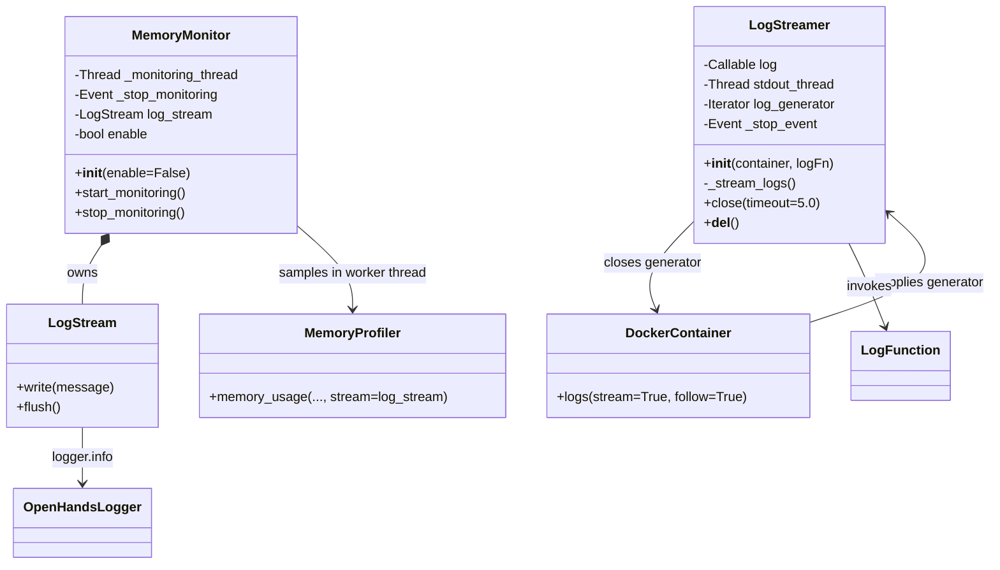
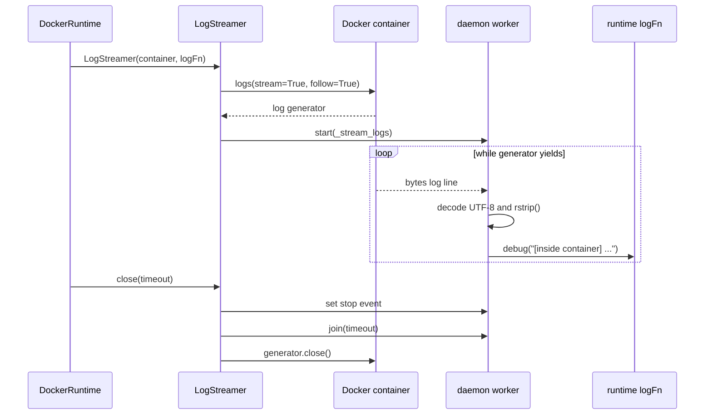
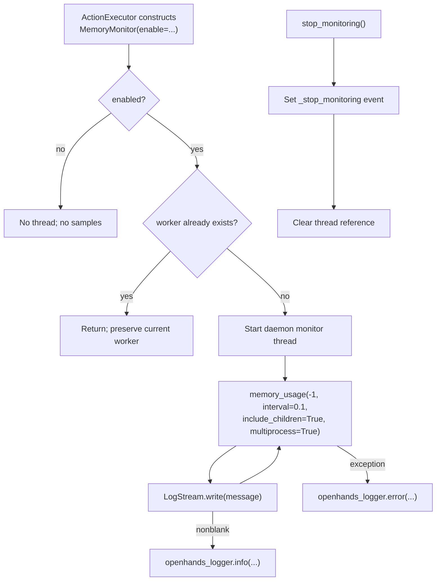
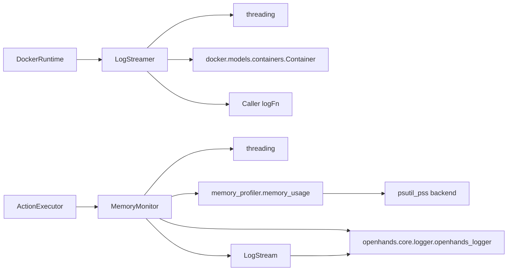
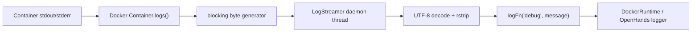
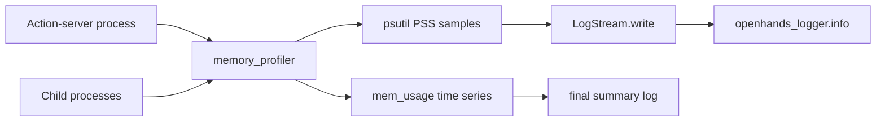
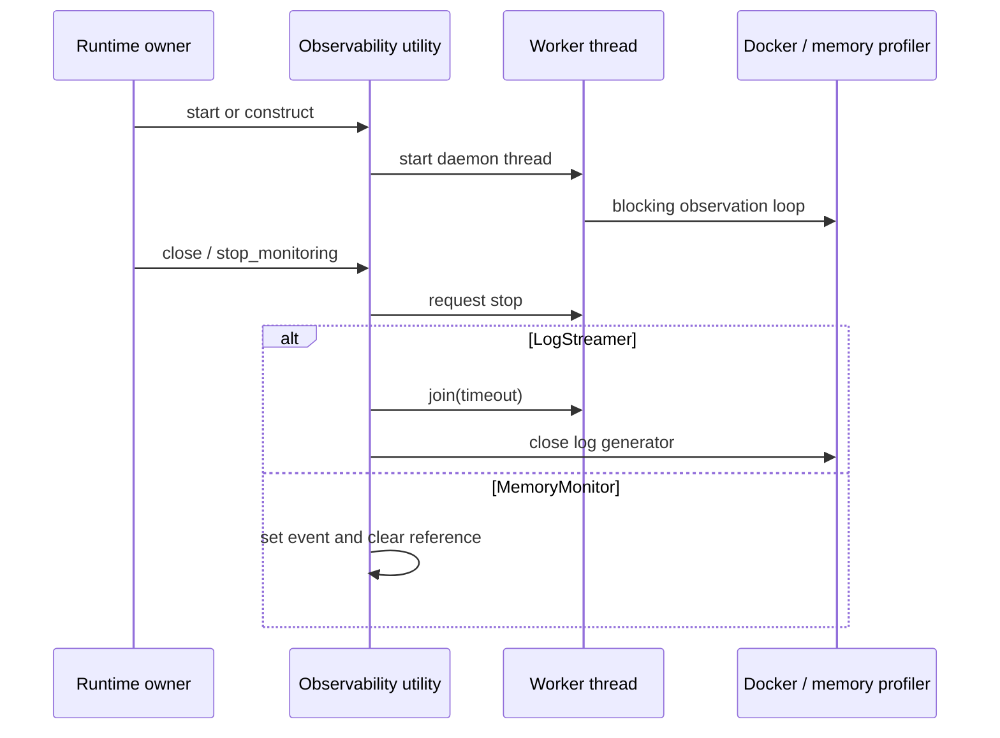

# runtime_utils_observability

## Introduction

`runtime_utils_observability` contains small, runtime-local diagnostics used to make sandbox execution visible and debuggable. It has two deliberately separate responsibilities:

- `LogStreamer` forwards a Docker container's live stdout/stderr stream to a caller-supplied logger.
- `MemoryMonitor` periodically samples the current process and its child processes, forwarding memory-profiler output to the OpenHands logger.

Neither utility controls execution or changes the action protocol. They observe runtime activity asynchronously and report it through logging. The utilities are part of [runtime_utils](runtime_utils.md), which is consumed by the broader [runtime_implementations](runtime_implementations.md) and by the in-sandbox [Action Execution Server](runtime_implementations_action_execution_server.md).

## Position in the system

```mermaid
graph TB
    AC["AgentController<br/>(agent_reasoning_core)"]
    RUNTIME["Runtime implementations<br/>(Docker, local, remote, Kubernetes)"]
    SERVER["ActionExecutor<br/>(action_execution_server)"]

    subgraph OBS["runtime_utils_observability"]
        LS["LogStreamer"]
        MM["MemoryMonitor"]
    end

    DOCKER["Docker daemon / container"]
    LOGGER["OpenHands logger<br/>(core/logger.py)"]
    MP["memory_profiler + psutil backend"]

    AC -->|actions| RUNTIME
    RUNTIME -->|starts and manages| SERVER
    RUNTIME -->|debug container logs| LS
    DOCKER -->|stream=True, follow=True| LS
    SERVER -->|creates / starts| MM
    MM -->|memory_usage samples| MP
    LS -->|logFn(level, message)| LOGGER
    MM -->|LogStream.write| LOGGER

    style OBS fill:#e8f0fe,stroke:#4285f4,stroke-width:2px
```

The utilities sit on opposite sides of the sandbox boundary:

| Utility | Usually owned by | Observes | Output path |
|---|---|---|---|
| `LogStreamer` | `DockerRuntime` | A running Docker container's log generator | Injected `logFn`, commonly the runtime logger |
| `MemoryMonitor` | `ActionExecutor` | The action-server process and child processes | `openhands_logger` through `LogStream` |

See [runtime_implementations_docker](runtime_implementations_docker.md) for container lifecycle and the `DEBUG_RUNTIME` integration, and [runtime_implementations_action_execution_server](runtime_implementations_action_execution_server.md) for action-server startup, environment variables, and shutdown.

## Architecture



The module has no common base class. The shared design is operational rather than object-oriented: both components use a daemon thread, catch failures inside the worker, and emit diagnostic messages instead of propagating errors into the main runtime path.

## Component details

### `LogStreamer`

File: `openhands/runtime/utils/log_streamer.py`

`LogStreamer` adapts Docker's blocking log iterator to a background thread:

1. The constructor stores the supplied `logFn`, initializes all state, and calls `container.logs(stream=True, follow=True)`.
2. If Docker returns a generator, a daemon thread starts `_stream_logs()`.
3. Each non-empty byte line is decoded as UTF-8, trailing whitespace is removed, and the callback receives:

   ```python
   logFn('debug', f'[inside container] {decoded_line}')
   ```

4. `close()` sets `_stop_event`, joins the worker for at most `timeout` seconds, and closes the generator to release its file descriptor.

The callback is intentionally typed as `Callable[[str, str], None]`, so the utility does not depend on one particular logger implementation. Initialization and streaming failures are reported through the callback at the `error` level.



In the Docker runtime, creation is conditional on `DEBUG_RUNTIME`; therefore normal container execution does not necessarily incur a log-streaming thread. The stream is diagnostic and does not feed observations back to the agent.

### `MemoryMonitor` and `LogStream`

Files: `openhands/runtime/utils/memory_monitor.py`

`MemoryMonitor` is opt-in. With `enable=False`, both lifecycle methods return without starting work. When enabled, `start_monitoring()` is idempotent while `_monitoring_thread` is non-`None`.

The worker calls `memory_profiler.memory_usage` with the following policy:

| Setting | Value | Meaning |
|---|---:|---|
| Target | `-1` | Current process |
| Interval | `0.1` seconds | Sample every 100 ms |
| Timeout | `3600` seconds | Maximum one-hour monitoring call |
| `max_usage` | `False` | Collect a time series rather than one maximum |
| `include_children` | `True` | Include child processes |
| `multiprocess` | `True` | Monitor process tree |
| Backend | `psutil_pss` | Proportional set size measurements |
| Stream | `self.log_stream` | Redirect profiler text to logging |

`LogStream.write()` ignores empty/whitespace-only messages and sends all other text to `logger.info` with a `[Memory usage]` prefix. `flush()` is a no-op to satisfy stream-like interfaces.



The monitor logs the final returned `mem_usage` list after `memory_usage` exits. Its purpose is diagnosis—especially investigating memory pressure or OOM behaviour—not enforcing a memory limit. Actual shell limits are configured separately through `RUNTIME_MAX_MEMORY_GB`; see [runtime_implementations_action_execution_server](runtime_implementations_action_execution_server.md).

## Dependencies



There is no dependency from either utility to the agent, LLM, event stream, or storage layers. They are therefore safe to reuse from runtime backends without coupling observability to agent reasoning.

## Runtime integration and data flow

### Docker log flow



### Memory flow



The two streams converge only at logging. Container output is labelled `[inside container]` and emitted through a caller-selected callback; memory output is labelled `[Memory usage]` and uses the module-level OpenHands logger.

## Lifecycle, shutdown, and failure semantics

| Condition | `LogStreamer` behaviour | `MemoryMonitor` behaviour |
|---|---|---|
| Disabled / not requested | Not normally constructed by Docker runtime | `start_monitoring()` and `stop_monitoring()` return immediately |
| Startup failure | Calls `log('error', ...)`; constructor does not re-raise | Worker catches and logs `Memory monitoring failed: ...` |
| Worker failure | Catches and logs `Error streaming docker logs...` | Catches and logs `Memory monitoring failed...` |
| Normal stop | Event, bounded join, generator close | Event set and thread reference cleared |
| Runtime shutdown | `DockerRuntime.close()` should close the streamer; `__del__` is a fallback | `ActionExecutor.close()` calls `stop_monitoring()` |



### Important implementation caveats

- `LogStreamer` decodes every line strictly as UTF-8. A non-UTF-8 Docker log line is handled by the outer exception path and terminates the worker.
- `LogStreamer.close()` bounds the join but closes the generator after the join. If the Docker iterator does not unblock promptly, the thread may remain alive beyond the timeout until the generator is closed.
- `LogStreamer.__del__()` is only a fallback. Deterministic owners should call `close()` explicitly because destructor timing is not guaranteed.
- `MemoryMonitor._stop_monitoring` is set by `stop_monitoring()`, but the supplied implementation does not pass that event into `memory_usage` or otherwise poll it. Consequently, the profiler call may continue until it returns or raises; clearing `_monitoring_thread` permits a subsequent start and can result in overlapping monitor calls.
- `MemoryMonitor.start_monitoring()` records a thread before the worker has completed. If the worker fails, the reference remains non-`None` until `stop_monitoring()` is called.
- The `memory_usage` interval is `0.1` seconds even though the source comment says “every second”; the code value is authoritative.

## Operational guidance

Use `LogStreamer` when diagnosing container startup, action-server boot, or sandbox-side failures. Enable the Docker runtime's debug logging path (`DEBUG_RUNTIME`) and ensure the supplied callback routes `debug` messages to a visible sink.

Use `MemoryMonitor` when investigating memory growth, child-process leaks, or OOM-related failures. Enable it with `RUNTIME_MEMORY_MONITOR=true` (also accepted: `1` and `yes`). Pair it with `RUNTIME_MAX_MEMORY_GB` only when a hard shell memory cap is also desired; monitoring itself does not impose that cap.

For the surrounding runtime lifecycle, see [runtime_implementations_docker](runtime_implementations_docker.md), [runtime_implementations_action_execution_server](runtime_implementations_action_execution_server.md), and [sandboxed_execution_layer](sandboxed_execution_layer.md). For shared logging types and filtering, see [logging](logging.md) if that module documentation is available.

## Summary

`runtime_utils_observability` is a passive diagnostics layer. `LogStreamer` bridges a Docker byte stream into runtime logging, while `MemoryMonitor` bridges process-tree memory samples into the OpenHands logger. Both isolate blocking observation work on daemon threads and report failures as logs, preserving the main runtime and action-execution paths. Explicit shutdown remains important, and the current memory-stop implementation should be treated as best-effort rather than a synchronous cancellation mechanism.
