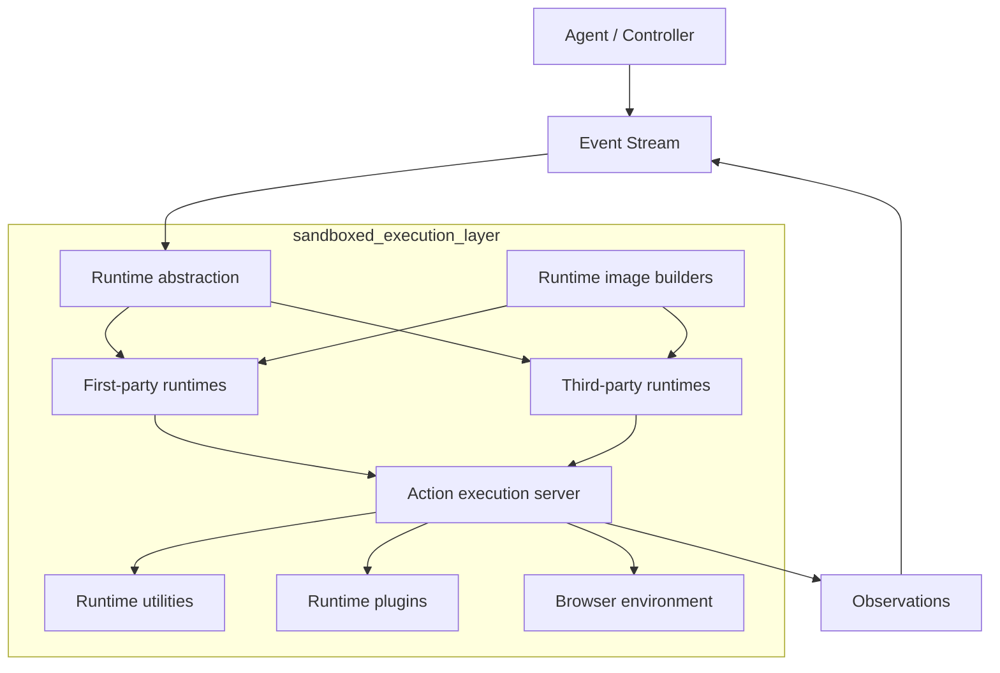
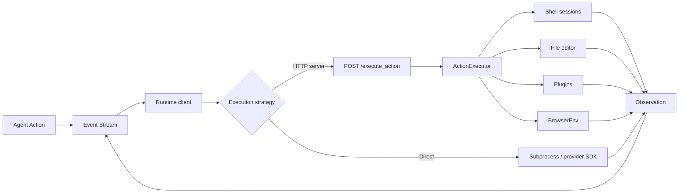
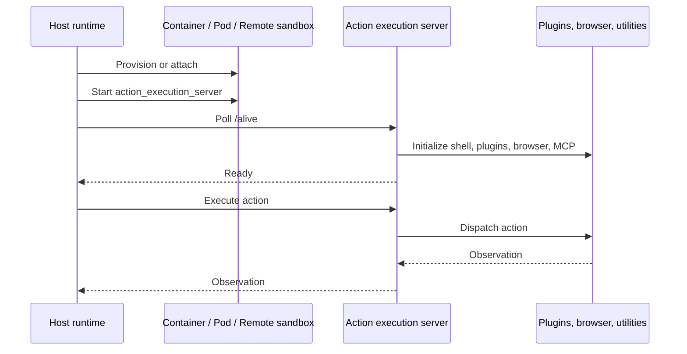

# Sandboxed Execution Layer

## Purpose

The `sandboxed_execution_layer` provides the environments in which OpenHands agents execute commands, edit files, run Python, browse websites, and interact with development tools.

It abstracts sandbox lifecycle and action execution across:

- Local Docker containers
- Host-based local and CLI execution
- Remote and Kubernetes environments
- Third-party providers such as Daytona, Modal, Runloop, and E2B

The layer also builds runtime images, loads sandbox plugins, provides runtime utilities, and hosts the in-sandbox FastAPI action execution server.

## Architecture



### Runtime execution model

Most runtimes use a client/server design. The host provisions a sandbox, starts `action_execution_server`, and sends actions over HTTP. `CLIRuntime` and E2B are direct-execution variants that bypass the standard server.



### Sandbox startup and action flow



## Main components

| Component | Responsibility | Documentation |
|---|---|---|
| Runtime implementations | Docker, local, CLI, remote, and Kubernetes execution backends | [runtime_implementations](runtime_implementations.md) |
| Third-party runtimes | Daytona, Modal, Runloop, and E2B integrations | [third_party_runtimes](third_party_runtimes.md) |
| Runtime image builders | Image naming, caching, Dockerfile generation, and local/remote builds | [runtime_image_builders](runtime_image_builders.md) |
| Runtime plugins | Jupyter, Agent Skills, and VSCode capabilities | [runtime_plugins](runtime_plugins.md) |
| Runtime utilities | Shell sessions, Git integration, logging, coordination, cancellation, and MCP proxying | [runtime_utils](runtime_utils.md) |
| Browser environment | Process-isolated BrowserGym integration | [browser_environment](browser_environment.md) |
| Action execution server | In-sandbox FastAPI service and `ActionExecutor` dispatch engine | [action execution server](runtime_implementations_action_execution_server.md) |

## Module structure

```text
sandboxed_execution_layer
├── openhands/runtime/impl
│   ├── docker
│   ├── local
│   │   ├── local_runtime
│   │   └── cli_runtime
│   ├── remote
│   ├── kubernetes
│   └── action_execution_server
├── third_party/runtime/impl
│   ├── managed sandboxes
│   │   ├── Daytona
│   │   ├── Modal
│   │   └── Runloop
│   └── E2B
├── openhands/runtime/builder
├── openhands/runtime/plugins
├── openhands/runtime/utils
└── openhands/runtime/browser/browser_env.py
```