# Security Analyzers

## Introduction

The `security_analyzers` module is OpenHands' **risk-scoring layer**. Before the agent runs a shell command, executes Python, edits a file, or drives a browser, this module answers one question:

> How dangerous is this action?

The answer is a single value — `LOW`, `MEDIUM`, `HIGH`, or `UNKNOWN`. The module does **not** block anything itself. It only scores. The [agent controller](agent_controller.md) takes that score and decides whether to run the action right away or stop and ask the user first.

The module ships two analyzers:

| Analyzer | Key | Where the judgement comes from | Cost |
| --- | --- | --- | --- |
| `LLMRiskAnalyzer` | `llm` | The agent's own LLM, which tags every tool call with a risk level | Free — no extra call |
| `InvariantAnalyzer` | `invariant` | An external [Invariant Labs](https://github.com/invariantlabs-ai) policy engine running in a Docker container | One Docker container plus one HTTP call per action |

Both live behind one small interface, so the rest of the system never needs to know which one is active.

---

## Module Layout

```
openhands/security/
├── analyzer.py          # SecurityAnalyzer — the base contract (3 methods)
├── options.py           # SecurityAnalyzers registry: name -> class
├── __init__.py          # exports SecurityAnalyzer, LLMRiskAnalyzer
├── llm/
│   └── analyzer.py      # LLMRiskAnalyzer — trusts the LLM's self-assessment
└── invariant/
    ├── analyzer.py      # InvariantAnalyzer — Docker container + policy monitor
    ├── client.py        # InvariantClient (+ nested _Policy, _Monitor) — HTTP wrapper
    ├── parser.py        # Action/Observation -> trace elements; InvariantState
    ├── nodes.py         # Pydantic trace node types: LLM, Function, ToolCall, Message, ToolOutput
    └── policies.py      # DEFAULT_INVARIANT_POLICY — semgrep + secrets rules
```

> **Note on the in-repo `openhands/security/README.md`:** it still describes an older design where analyzers subscribed to the event stream and had `on_event` / `log_event` / `act` methods. That design is gone. The current analyzers are **pull-based** — the controller calls them. Trust this document and the code, not that README.

---

## Architecture

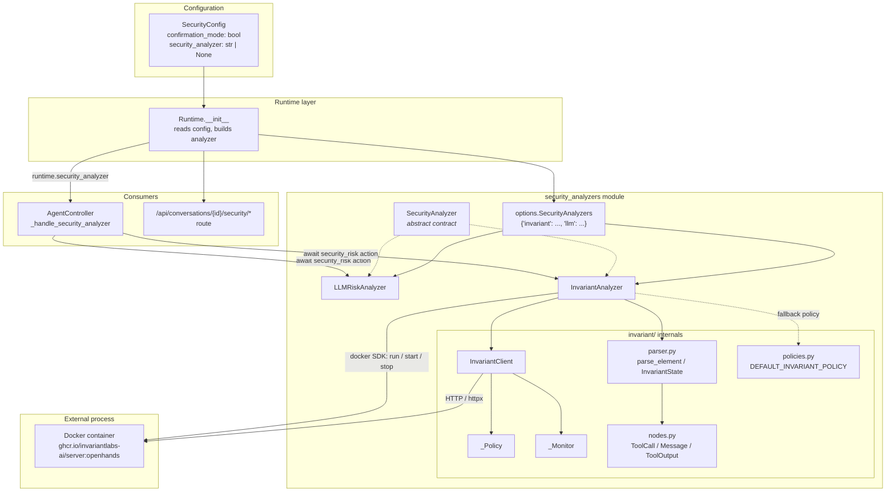

### Key architectural facts

1. **The analyzer is owned by the Runtime, not the session.** `Runtime.__init__` reads `config.security.security_analyzer`, looks the name up in the registry, and instantiates it. See [sandboxed_execution_layer](sandboxed_execution_layer.md).
2. **It is passed down to the controller.** `AgentSession._create_controller` forwards `runtime.security_analyzer` into `AgentController(...)`. See [server_sessions](server_sessions.md) and [agent_controller](agent_controller.md).
3. **It is not an event-stream subscriber.** There is no `EventStreamSubscriber.SECURITY_ANALYZER`. The controller calls `await analyzer.security_risk(action)` directly, inline, in `_step`. See [event_system](event_system.md).
4. **Analyzers are stateless from the caller's point of view** — except `InvariantAnalyzer`, which keeps a growing conversation trace in memory.

---

## The Contract: `SecurityAnalyzer`

Every analyzer implements the same tiny interface (`openhands/security/analyzer.py`):

```python
class SecurityAnalyzer:
    async def handle_api_request(self, request: Request) -> Any: ...   # optional HTTP surface
    async def security_risk(self, action: Action) -> ActionSecurityRisk: ...  # the core method
    async def close(self) -> None: ...                                  # cleanup
```

`security_risk` and `handle_api_request` raise `NotImplementedError` in the base class. `close` is a no-op by default.

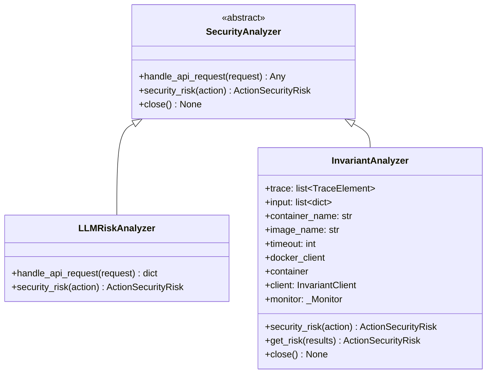

### `ActionSecurityRisk`

Defined in `openhands/events/action/action.py` (see [event_system](event_system.md)):

```python
class ActionSecurityRisk(int, Enum):
    UNKNOWN = -1
    LOW     = 0
    MEDIUM  = 1
    HIGH    = 2
```

It subclasses `int`, which matters in two places:
- `InvariantAnalyzer.get_risk` uses `max(risks)` to pick the worst finding.
- The frontend mirrors the same numbers in its Redux slice. See [frontend_state](frontend_state.md).

---

## Registry and Configuration

`openhands/security/options.py` is the whole registry:

```python
SecurityAnalyzers: dict[str, type[SecurityAnalyzer]] = {
    'invariant': InvariantAnalyzer,
    'llm': LLMRiskAnalyzer,
}
```

Selection is driven by `SecurityConfig` (see [core_configuration](core_configuration.md)):

```toml
[security]
confirmation_mode = true
security_analyzer = "llm"   # or "invariant", or omit for none
```

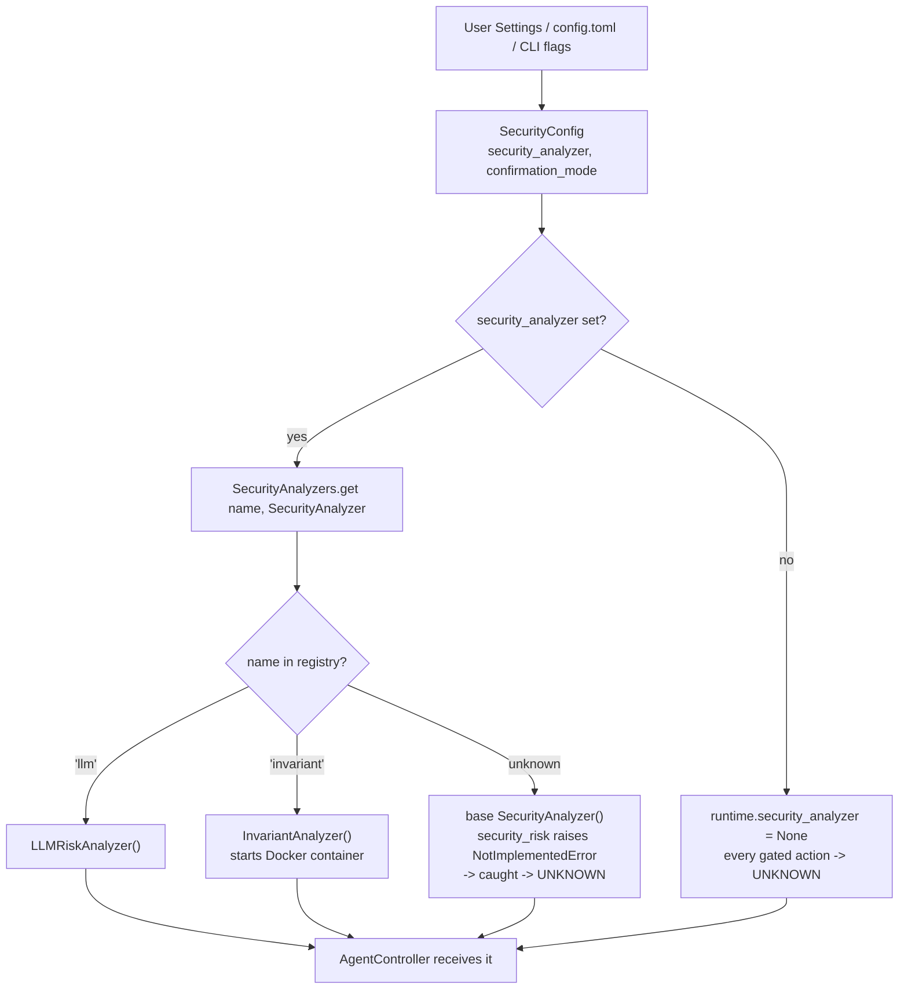

Two places override the config before the runtime is built:
- **Web server**: `WebSession` copies the user's saved `Settings` onto `config.security`. See [server_sessions](server_sessions.md).
- **CLI**: `openhands/cli/main.py` forces `confirmation_mode = True` and `security_analyzer = 'llm'`. See [cli](cli.md).

The list of available names is exposed to the UI via `GET /api/security-analyzers`, which returns `sorted(SecurityAnalyzers.keys())`.

---

## Analyzer 1: `LLMRiskAnalyzer`

This is the **default** analyzer and by far the cheapest. It adds no LLM calls and no containers. It simply reads a field the agent's LLM already filled in.

```python
async def security_risk(self, action: Action) -> ActionSecurityRisk:
    if not hasattr(action, 'security_risk'):
        return ActionSecurityRisk.UNKNOWN
    security_risk = getattr(action, 'security_risk')
    if security_risk in {LOW, MEDIUM, HIGH}:
        return security_risk
    elif security_risk == UNKNOWN:
        return UNKNOWN
    else:
        logger.warning(...)
        return UNKNOWN
```

### Where the value comes from

The risk tag is produced upstream by the CodeAct agent's tool schemas. See [agents](agents.md) and [agents_codeact_variants](agents_codeact_variants.md).

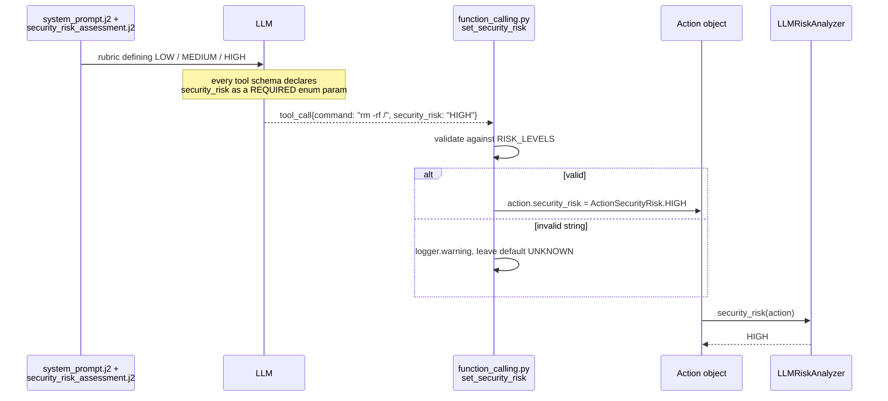

Tools that require the field: `bash`, `ipython`, `str_replace_editor`, `browser`, `llm_based_edit`. Every action dataclass that carries the field defaults it to `ActionSecurityRisk.UNKNOWN`, so a missing tag degrades safely.

### Trade-off

The model grades its own homework. A prompt-injected or confused model can under-report risk. It is fast and cheap, but it is **self-assessment, not independent verification**. That is exactly the gap `InvariantAnalyzer` fills.

---

## Analyzer 2: `InvariantAnalyzer`

This analyzer sends the whole conversation trace to an **independent policy engine** that runs static analysis (semgrep) and secret detection on the agent's proposed commands. The verdict does not depend on the agent's LLM at all.

It is described in code as *"purely analytical"* — it scores and returns, nothing more.

### Sub-component map

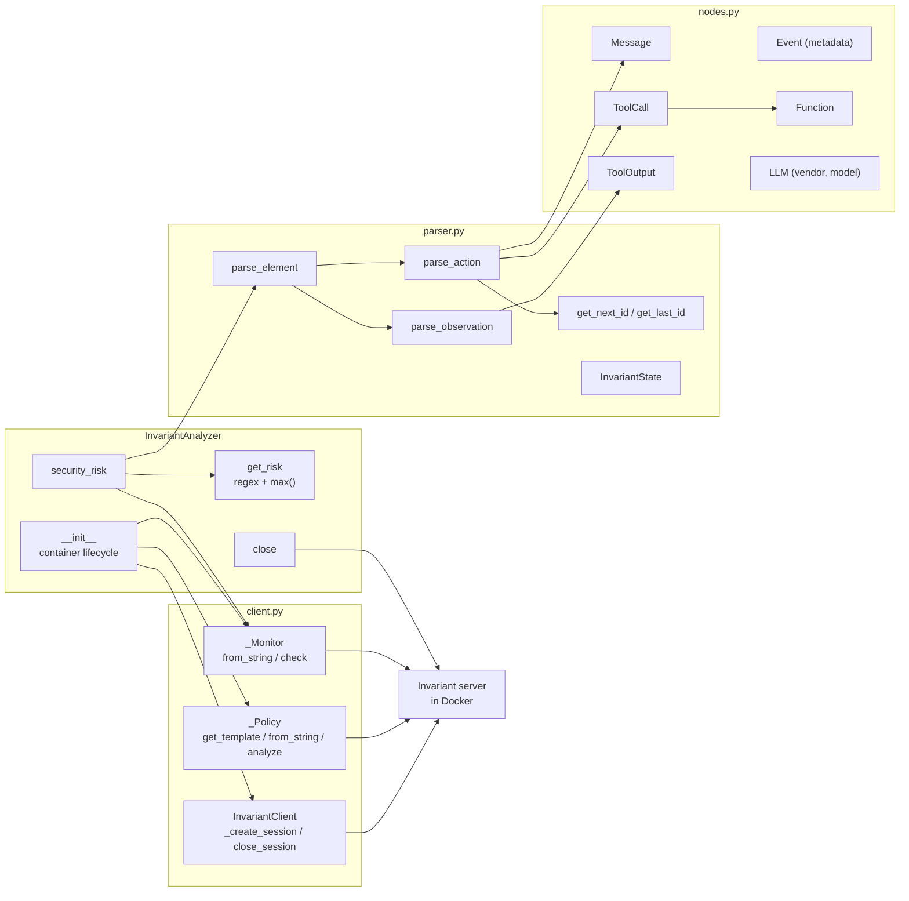

### The trace data model (`nodes.py`)

The Invariant server speaks in OpenAI-chat-like trace elements. `nodes.py` defines them as Pydantic models:

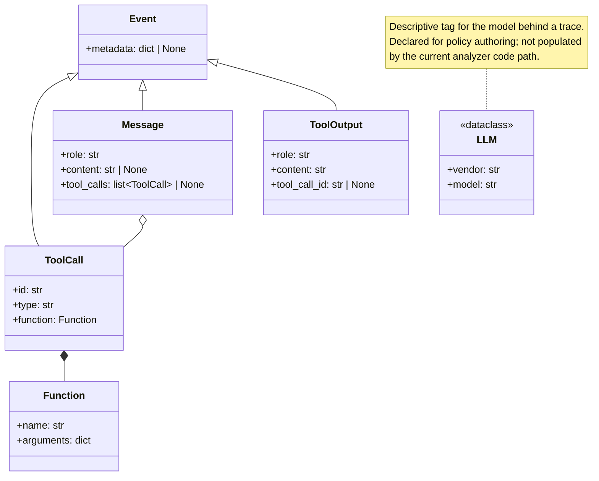

`TraceElement = Message | ToolCall | ToolOutput | Function`.

### Translation rules (`parser.py`)

`parse_element` dispatches on whether the event is an `Action` or an `Observation`. See [event_system](event_system.md) for the event class hierarchy.

| Input | Produces |
| --- | --- |
| `MessageAction` from `EventSource.USER` | `Message(role='user', content=...)` |
| `MessageAction` from the agent | `Message(role='assistant', content=...)` |
| `NullAction`, `ChangeAgentStateAction` | *nothing* — filtered out |
| Any other action with an `action` field | optional `Message(role='assistant', content=thought)` **plus** `ToolCall(id=next_id, type='function', function=Function(name=action.action, arguments=args))` |
| `NullObservation`, `AgentStateChangedObservation` | *nothing* — filtered out |
| Any other observation with `content` | `ToolOutput(role='tool', content=..., tool_call_id=last_id)` |

Two ID helpers keep calls and outputs linked:
- `get_next_id(trace)` — finds the smallest unused numeric string ID among existing `ToolCall`s.
- `get_last_id(trace)` — walks the trace backwards for the most recent `ToolCall` ID, so a `ToolOutput` can point at the call it answers.

The `thought` field is popped out of the action args and emitted as its own assistant `Message`. This keeps the tool arguments clean for policy matching.

`InvariantState` is a small Pydantic holder — `add_action`, `add_observation`, `concatenate` — useful for building a trace outside the analyzer (tests, offline analysis). The analyzer itself keeps its trace in a plain list.

### Container lifecycle

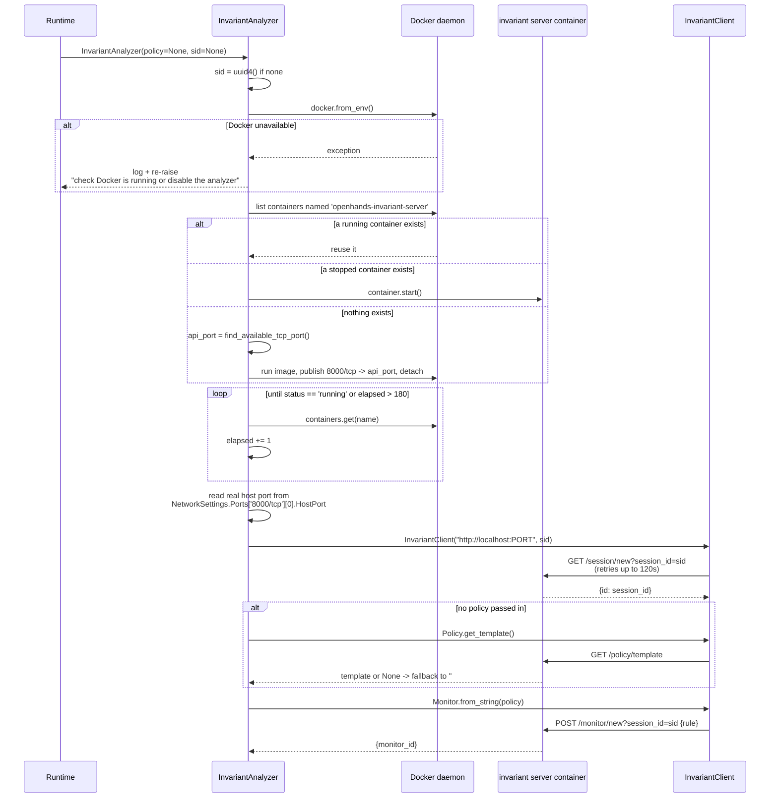

Notes on this flow:
- The container is **shared and long-lived**. It is named, reused across analyzers, and only reachable on `localhost`.
- Port discovery is done twice: `find_available_tcp_port()` for a fresh container, then the *actual* mapped port is read back from container attributes. That second read is what handles the reuse case.
- The startup wait loop breaks after `timeout` (180 iterations) but does **not** raise — the code proceeds and will fail on the port read or the first HTTP call instead.
- `close()` stops the container.

### Per-action risk check

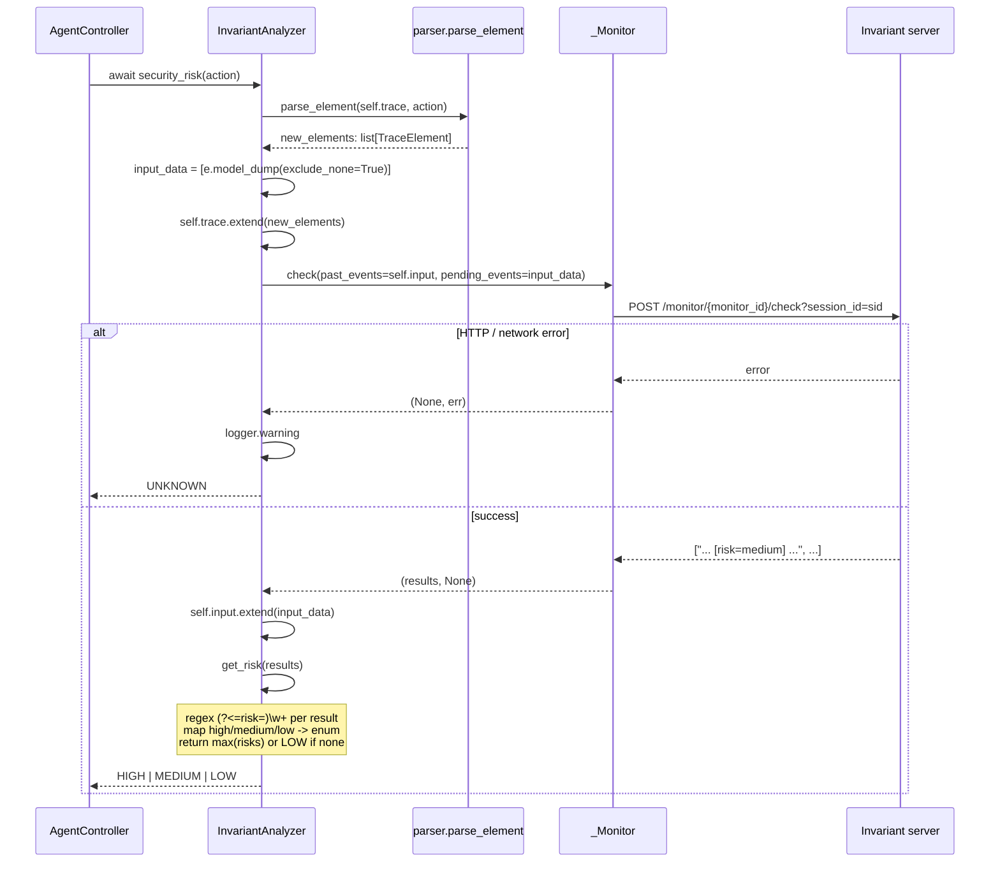

**Important semantics of `get_risk`:** if the policy engine returns **no** findings, the result is `ActionSecurityRisk.LOW`, not `UNKNOWN`. "The policy engine had nothing to say" is treated as "this looks fine". Only a transport/policy *error* yields `UNKNOWN`.

Note also that `self.trace` is extended before the check while `self.input` is extended only on success — so a failed check leaves the two lists briefly out of step.

### The default policy (`policies.py`)

`DEFAULT_INVARIANT_POLICY` is written in Invariant's rule DSL and covers three cases, all at `risk=medium`:

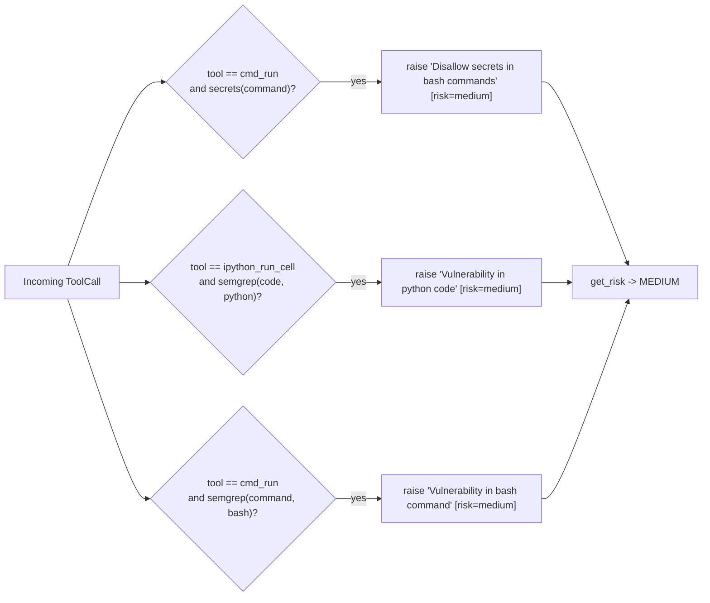

Because every default rule is `medium` and the controller's non-CLI gate only stops on `HIGH`, **the shipped default policy alone will not pause the agent in the web UI.** Operators who want blocking behaviour must supply a policy that raises `[risk=high]`. This is a deliberate "observe first" default, but it is easy to misread.

### `InvariantClient` HTTP surface

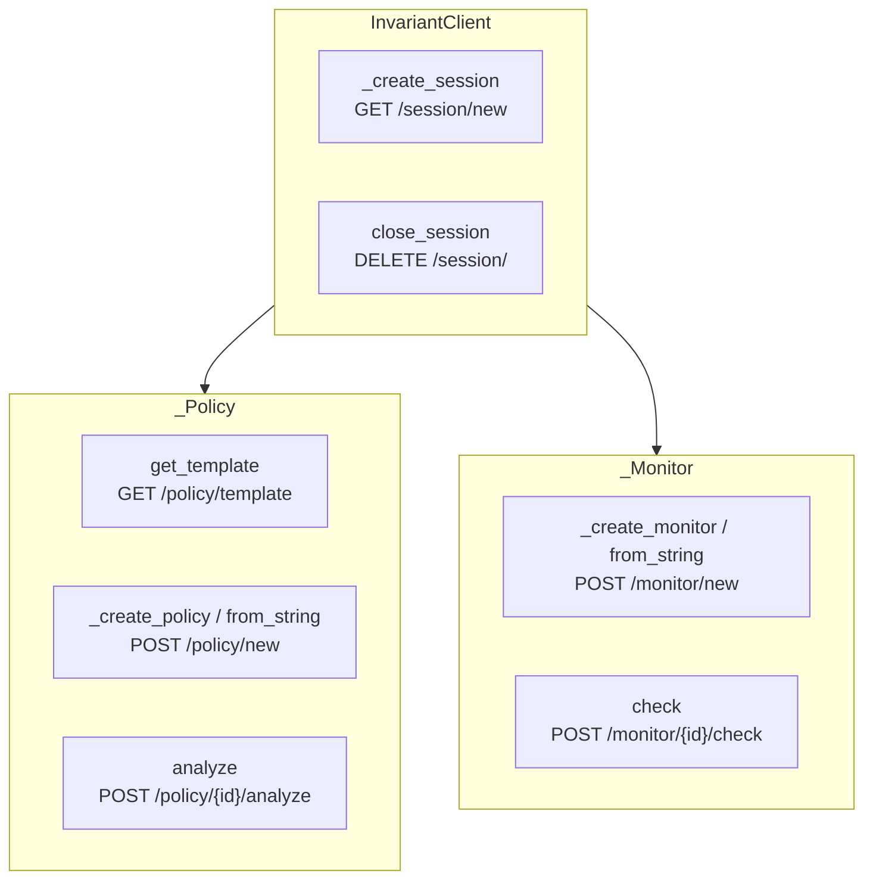

Design points:
- **Errors are returned, not raised.** Every method returns a `(result, error)` tuple. Only `from_string` and the constructor raise.
- **Session creation retries.** `_create_session` loops for up to 120 seconds on `NetworkError` / `TimeoutException`, sleeping 1s per attempt, because the container may still be booting. Other HTTP errors return immediately.
- **All calls use a 60s timeout** and carry `session_id` as a query parameter.
- `_Policy` is stateless-per-check (`analyze` sends a full trace); `_Monitor` is incremental (`check` sends `past_events` + `pending_events`). The analyzer uses the **monitor** path, which is why it keeps `self.input` around.

---

## Integration: Confirmation Mode

The score only matters because of what the [agent controller](agent_controller.md) does with it. The full loop:

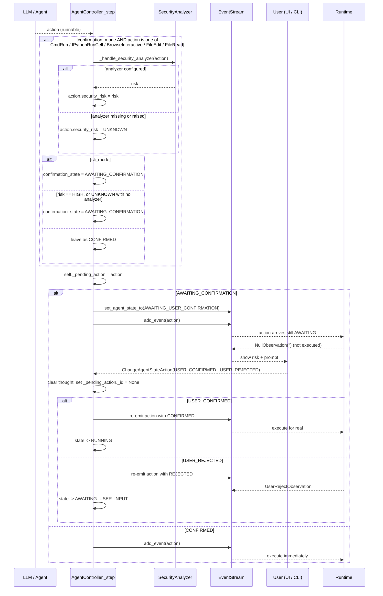

### The gating decision, isolated

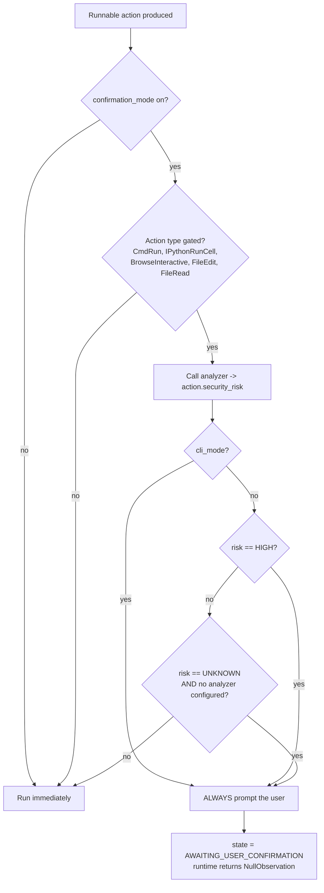

Three behaviours worth internalising:

1. **Fail-safe on error.** If the analyzer throws, or none is configured, `security_risk` becomes `UNKNOWN`. With no analyzer, `UNKNOWN` triggers a prompt — the system asks rather than assumes.
2. **The analyzer overrides the LLM.** `_handle_security_analyzer` *writes back* onto `action.security_risk`. With `InvariantAnalyzer` active, the LLM's own tag is discarded. With `LLMRiskAnalyzer`, the write-back is effectively an identity operation.
3. **Only `HIGH` stops the web UI.** `MEDIUM` runs without asking. CLI mode ignores the level and always prompts (it defers to per-prompt modes like `always` / `auto_highrisk` in the [CLI](cli.md) instead).

Non-gated actions default to `confirmation_state = CONFIRMED` and never touch the analyzer at all — so this layer costs nothing on the common path.

---

## HTTP and UI Surface

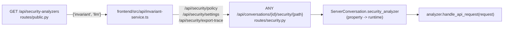

The catch-all route is thin:

```python
@app.route('/security/{path:path}', methods=['GET', 'POST', 'PUT', 'DELETE'])
async def security_api(request, conversation=Depends(get_conversation)) -> Response:
    if not conversation.security_analyzer:
        raise HTTPException(404, detail='Security analyzer not initialized')
    return await conversation.security_analyzer.handle_api_request(request)
```

`ServerConversation` exposes `security_analyzer` as a property that reads through to the runtime. See [server_sessions](server_sessions.md).

### Known gaps in this surface

These are real inconsistencies in the current code, not documentation shortcuts:

- **`InvariantAnalyzer` does not override `handle_api_request`.** Hitting the security route while the invariant analyzer is active reaches the base class and raises `NotImplementedError`.
- **`LLMRiskAnalyzer.handle_api_request` returns `{'status': 'ok'}`** for any path — a health-check stub, not a real API.
- **The frontend calls `/api/security/*`, but the route is mounted under `/api/conversations/{conversation_id}`.** The paths in `invariant-service.ts` (`getPolicy`, `updatePolicy`, `getRiskSeverity`, `updateRiskSeverity`, `getTraces`) do not match the registered route. See [frontend_api_services](frontend_api_services.md).

Treat the analyzer HTTP surface as **vestigial**. The live, working integration is the in-process `security_risk` call from the controller.

---

## Cross-Module Dependencies

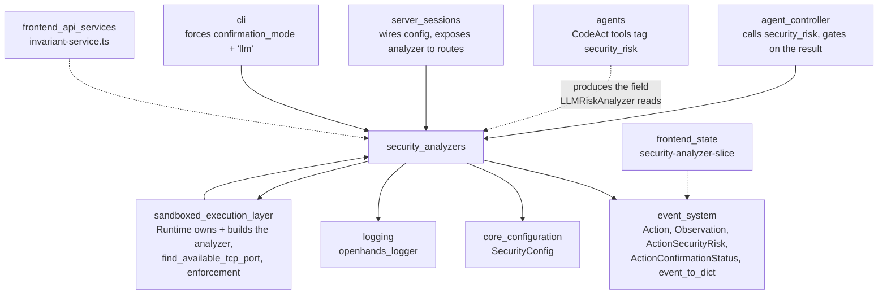

### External dependencies

| Package | Used by | Why |
| --- | --- | --- |
| `docker` | `invariant/analyzer.py` | Start, reuse, inspect, and stop the policy-server container |
| `httpx` | `invariant/client.py` | Sync HTTP calls to the policy server |
| `pydantic` | `invariant/nodes.py`, `invariant/parser.py` | Trace node models and `model_dump` serialisation |
| `fastapi` | `analyzer.py`, `llm/analyzer.py` | `Request` type for `handle_api_request` |

**Import-cycle note:** `openhands/security/__init__.py` deliberately exports only `SecurityAnalyzer` and `LLMRiskAnalyzer`. `InvariantAnalyzer` is left out because it imports `docker` at module scope — pulling it into the package root would make Docker a hard import-time dependency for every OpenHands process. Reach it via `openhands.security.invariant` or `openhands.security.options`.

---

## Comparison and Guidance

| Dimension | `LLMRiskAnalyzer` (`llm`) | `InvariantAnalyzer` (`invariant`) |
| --- | --- | --- |
| Extra infrastructure | None | Docker container, ~180s worst-case startup |
| Latency per action | ~0 | One local HTTP round trip |
| Independence from the agent | None — self-assessment | Full — separate policy engine |
| Detects secrets / CVE patterns | Only if the model notices | Yes, via semgrep + secret detectors |
| Sees conversation history | No — one action at a time | Yes — full incremental trace |
| Default verdict with no finding | `UNKNOWN` if untagged | `LOW` |
| Verdict on internal error | `UNKNOWN` | `UNKNOWN` |
| Customisable rules | Only by editing the prompt rubric | Yes — Invariant policy DSL |
| Cleanup needed | No | `close()` stops the container |
| Shipped default triggers a pause? | Yes, when the LLM says `HIGH` | No — default policy is all `medium` |

**Rules of thumb**

- Leave `llm` on for normal interactive use. It is the default, costs nothing, and catches the obvious cases.
- Use `invariant` when you need a check the agent cannot talk its way past — untrusted repos, prompt-injection exposure, or a compliance requirement for an auditable policy.
- If you enable `invariant` and actually want it to *stop* the agent, write a policy that raises `[risk=high]`. The bundled rules only raise `medium`.
- Turning `confirmation_mode` off disables the whole layer. The analyzer is never called and no action is ever gated.

---

## Extending: Adding a New Analyzer

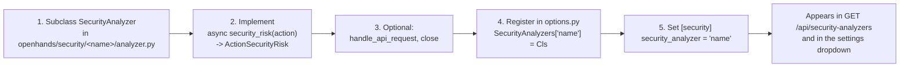

Guidelines for a new implementation:

- **Never raise from `security_risk`.** Catch your own errors and return `ActionSecurityRisk.UNKNOWN`. The controller catches exceptions, but returning explicitly keeps the log clean and intent obvious.
- **Keep it fast.** This call sits on the critical path of every gated action, inside the agent's step loop.
- **Guard heavy imports.** If your analyzer needs a large or optional dependency, keep it out of `openhands/security/__init__.py`, exactly as `InvariantAnalyzer` does with `docker`.
- **Implement `close()`** if you hold a container, socket, subprocess, or connection pool.
- **Return `HIGH` when you mean "stop".** In the web UI, `MEDIUM` does not pause anything.

---

## Related Documentation

- [agent_controller](agent_controller.md) — the consumer; owns `_handle_security_analyzer`, the gating logic, and the confirmation state machine
- [event_system](event_system.md) — `Action`, `Observation`, `ActionSecurityRisk`, `ActionConfirmationStatus`, `EventStream`
- [agents](agents.md) / [agents_codeact_variants](agents_codeact_variants.md) — the tool schemas and prompt rubric that produce `security_risk`
- [core_configuration](core_configuration.md) — `SecurityConfig` and the `[security]` TOML section
- [sandboxed_execution_layer](sandboxed_execution_layer.md) — the Runtime that builds and owns the analyzer, and enforces the confirmation state
- [server_sessions](server_sessions.md) — session wiring and `ServerConversation.security_analyzer`
- [cli](cli.md) — CLI confirmation prompts and the forced `llm` analyzer default
- [frontend_api_services](frontend_api_services.md) — `invariant-service.ts`
- [frontend_state](frontend_state.md) — the Redux mirror of risk levels and confirmation state
- [logging](logging.md) — `openhands_logger` used throughout this module
