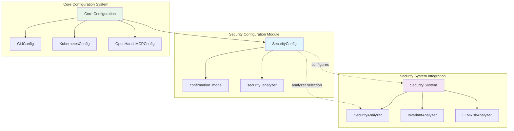
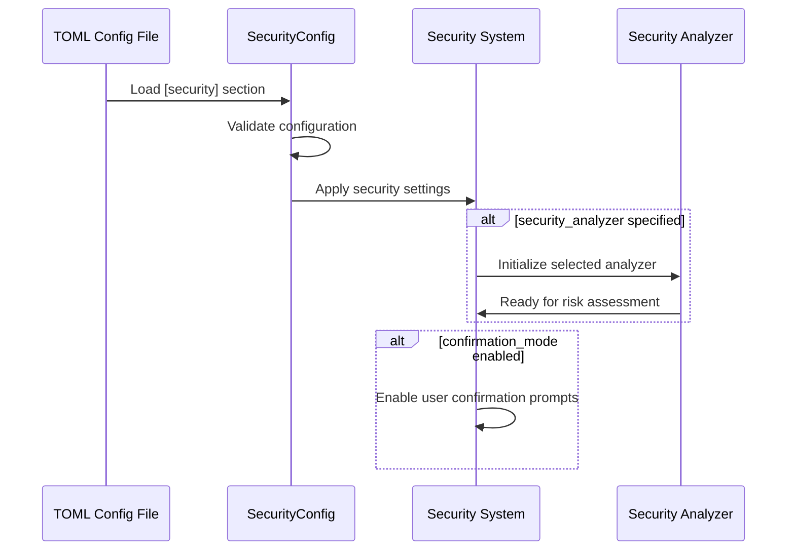
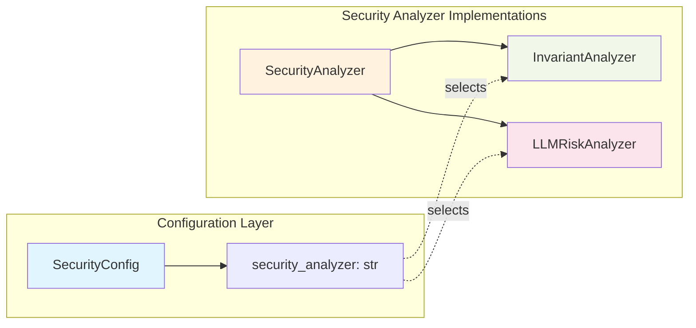
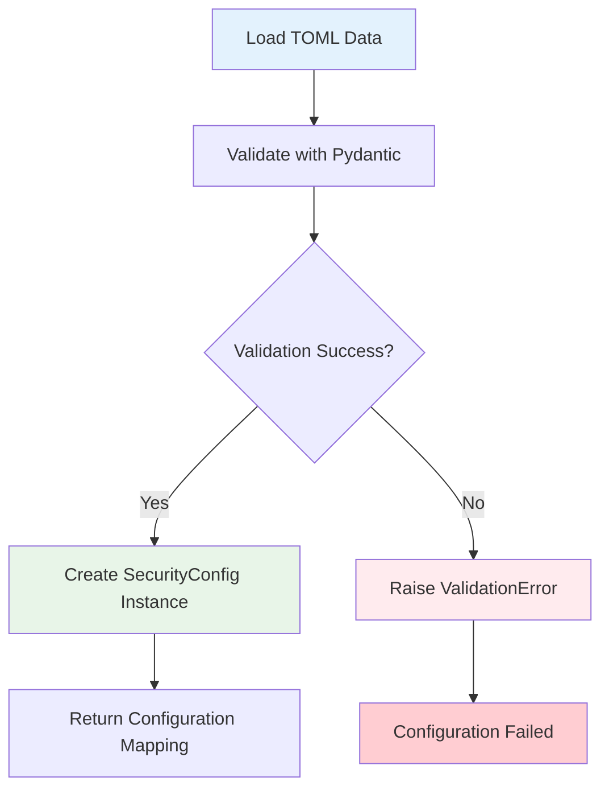
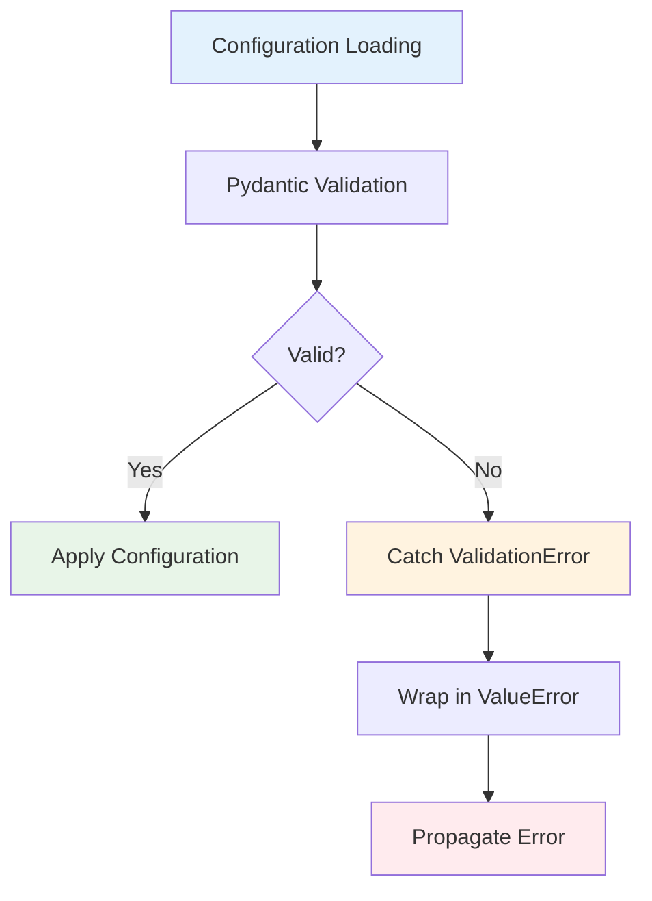

# Security Configuration Module

The security_configuration module provides centralized configuration management for OpenHands' security features, enabling administrators to control security policies, analyzers, and confirmation modes across the system.

## Overview

The SecurityConfig class serves as the primary configuration interface for security-related functionalities within OpenHands. It manages settings that control how the system handles security analysis, user confirmations for potentially risky actions, and integration with various security analyzers.

## Architecture



## Core Components

### SecurityConfig

The `SecurityConfig` class is a Pydantic model that defines the structure and validation rules for security-related configuration settings.

#### Key Features

- **Validation**: Uses Pydantic for automatic validation and type checking
- **TOML Integration**: Supports loading configuration from TOML files
- **Strict Mode**: Forbids extra fields to ensure configuration integrity
- **Default Values**: Provides sensible defaults for all configuration options

#### Configuration Fields

| Field | Type | Default | Description |
|-------|------|---------|-------------|
| `confirmation_mode` | `bool` | `False` | Enables user confirmation prompts for potentially risky actions |
| `security_analyzer` | `str \| None` | `None` | Specifies which security analyzer to use for risk assessment |

## Configuration Flow



## Integration with Security System

The security_configuration module works closely with the [security_system](security_system.md) module to provide comprehensive security management:

### Security Analyzer Integration



### Supported Security Analyzers

1. **InvariantAnalyzer**: Policy-based security analysis using Docker containers
2. **LLMRiskAnalyzer**: LLM-driven risk assessment for actions
3. **Custom Analyzers**: Extensible framework for additional security analyzers

## Configuration Management

### TOML Configuration Loading

The `from_toml_section` class method enables loading security configuration from TOML files:

```python
# Example TOML configuration
[security]
confirmation_mode = true
security_analyzer = "invariant"
```

### Configuration Validation



## Usage Patterns

### Basic Configuration

```python
from openhands.core.config.security_config import SecurityConfig

# Create with defaults
config = SecurityConfig()

# Create with custom settings
config = SecurityConfig(
    confirmation_mode=True,
    security_analyzer="invariant"
)
```

### TOML Integration

```python
# Load from TOML section
toml_data = {
    "confirmation_mode": True,
    "security_analyzer": "llm"
}

config_mapping = SecurityConfig.from_toml_section(toml_data)
security_config = config_mapping["security"]
```

## Security Considerations

### Confirmation Mode

When `confirmation_mode` is enabled:
- Users receive prompts before executing potentially risky actions
- Provides an additional layer of human oversight
- Integrates with the [events_and_actions](events_and_actions.md) system for action interception

### Analyzer Selection

The `security_analyzer` field determines the risk assessment strategy:
- **None**: No security analysis performed
- **"invariant"**: Uses policy-based analysis with Docker containers
- **"llm"**: Leverages LLM-provided risk assessments

## Dependencies

### Internal Dependencies

- **[core_configuration](core_configuration.md)**: Part of the broader configuration system
- **[security_system](security_system.md)**: Provides security analyzer implementations
- **[events_and_actions](events_and_actions.md)**: Action interception for confirmation mode

### External Dependencies

- **Pydantic**: Configuration validation and serialization
- **TOML**: Configuration file format support

## Error Handling



### Common Error Scenarios

1. **Invalid Field Types**: Non-boolean values for `confirmation_mode`
2. **Unknown Analyzers**: Specifying non-existent security analyzers
3. **Extra Fields**: Including unsupported configuration options
4. **TOML Parsing**: Malformed TOML configuration files

## Best Practices

### Configuration Management

1. **Use TOML Files**: Leverage TOML configuration for environment-specific settings
2. **Validate Early**: Perform configuration validation during application startup
3. **Default Safety**: Keep security features disabled by default for backward compatibility
4. **Documentation**: Document all security configuration options clearly

### Security Settings

1. **Enable Confirmation Mode**: For production environments handling sensitive operations
2. **Choose Appropriate Analyzers**: Select analyzers based on security requirements and infrastructure
3. **Monitor Configuration**: Log security configuration changes for audit trails
4. **Test Configurations**: Validate security settings in staging environments

## Future Enhancements

### Planned Features

1. **Dynamic Configuration**: Runtime configuration updates without restart
2. **Multiple Analyzers**: Support for running multiple security analyzers simultaneously
3. **Risk Thresholds**: Configurable risk level thresholds for different actions
4. **Audit Logging**: Enhanced logging for security configuration changes

### Extension Points

1. **Custom Analyzers**: Framework for implementing domain-specific security analyzers
2. **Policy Integration**: Integration with external policy management systems
3. **Compliance Frameworks**: Support for industry-specific compliance requirements

## Related Documentation

- [security_system](security_system.md) - Security analyzer implementations and risk assessment
- [core_configuration](core_configuration.md) - Overall configuration management system
- [events_and_actions](events_and_actions.md) - Action processing and event handling
- [server_and_api](server_and_api.md) - Server-side security middleware integration