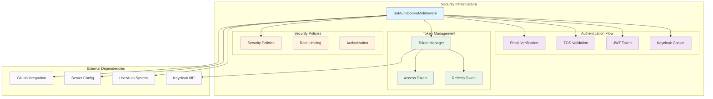
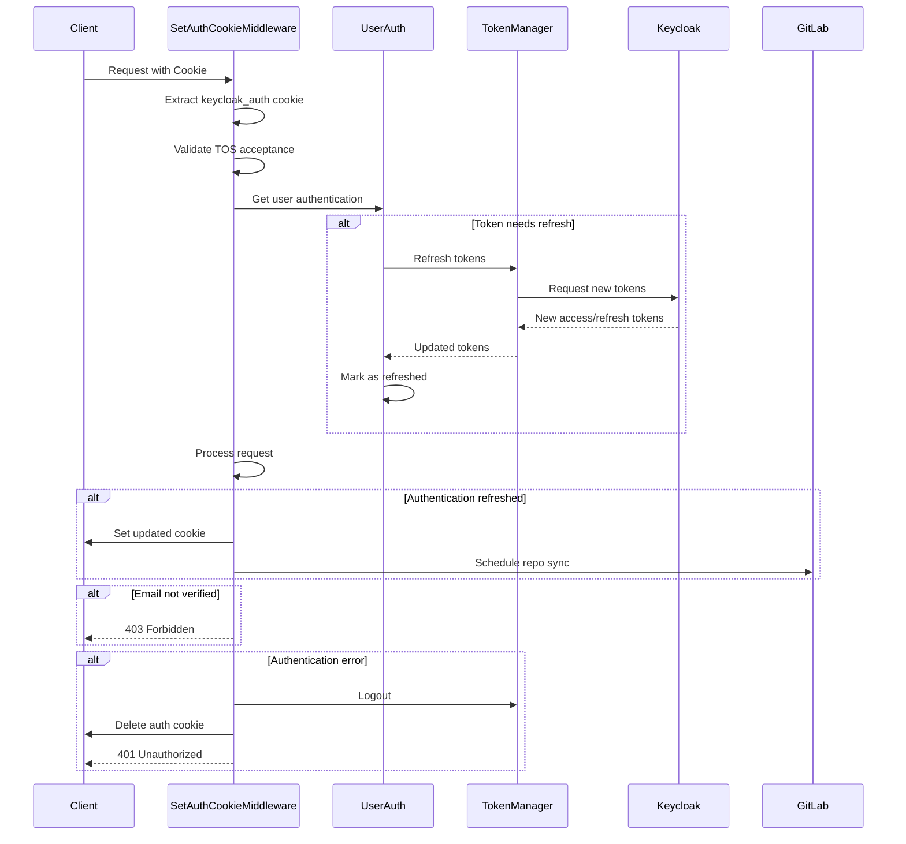
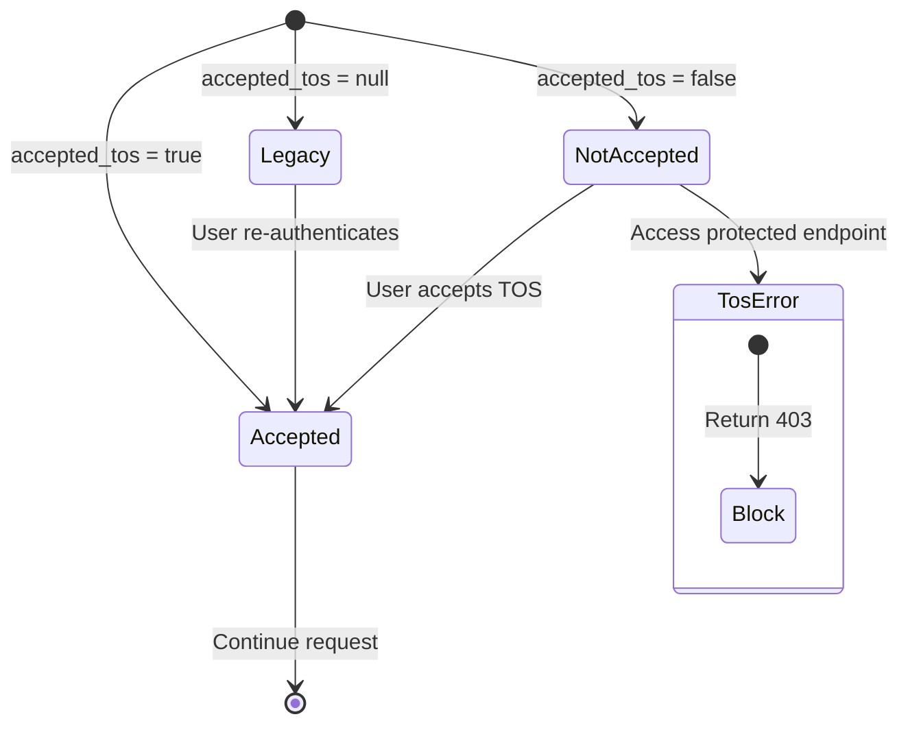
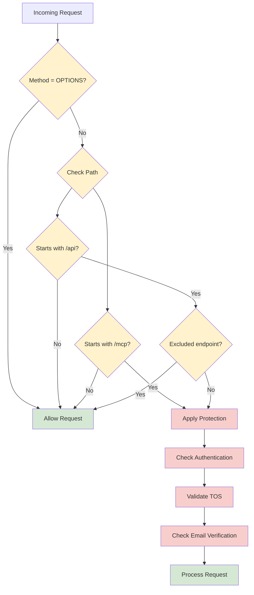
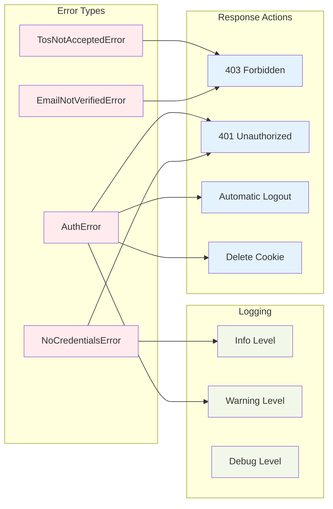

# Security Infrastructure Module

The security_infrastructure module provides enterprise-grade authentication and authorization middleware for the OpenHands platform. This module is part of the enterprise server infrastructure and implements sophisticated cookie-based authentication, token management, and security policy enforcement.

## Overview

The security_infrastructure module serves as the primary security gateway for enterprise deployments, handling:

- **Authentication State Management**: Maintains and refreshes authentication tokens automatically
- **Cookie Security**: Implements secure cookie handling with domain and SameSite policies
- **Terms of Service Enforcement**: Ensures users have accepted current terms before accessing protected resources
- **Email Verification**: Enforces email verification requirements for sensitive operations
- **Token Lifecycle Management**: Handles token refresh, validation, and cleanup
- **Security Policy Enforcement**: Applies security rules consistently across all API endpoints

## Architecture



## Core Components

### SetAuthCookieMiddleware

The `SetAuthCookieMiddleware` is the central component that orchestrates authentication and security policy enforcement for all incoming requests.

#### Key Responsibilities

1. **Authentication State Validation**
   - Validates Keycloak authentication cookies
   - Handles JWT token decoding and verification
   - Manages authentication state across requests

2. **Token Lifecycle Management**
   - Automatically refreshes expired tokens
   - Updates authentication cookies with new tokens
   - Handles token cleanup on authentication errors

3. **Security Policy Enforcement**
   - Enforces Terms of Service acceptance
   - Validates email verification status
   - Applies endpoint-specific security rules

4. **Error Handling and Recovery**
   - Graceful handling of authentication errors
   - Automatic logout on invalid tokens
   - Cookie cleanup on authentication failures

#### Authentication Flow



## Security Policies

### Terms of Service Enforcement

The middleware implements a three-state TOS acceptance model:

- **`null`**: User hasn't re-logged in since TOS changes (legacy state)
- **`false`**: User was shown TOS but hasn't accepted
- **`true`**: User has accepted current TOS



### Email Verification Requirements

Email verification is enforced for most API endpoints except:
- `/api/email/*` - Email management endpoints
- `/api/settings` - User settings
- `/api/logout` - Logout endpoint
- `/api/authenticate` - Authentication endpoint

### Endpoint Protection Strategy

The middleware applies different security policies based on request characteristics:



## Integration Points

### Authentication System Integration

The security infrastructure integrates closely with the [authentication_system](authentication_system.md) module:

- **UserAuth Interface**: Leverages the abstract UserAuth system for authentication operations
- **Token Management**: Coordinates with token managers for refresh operations
- **Settings Integration**: Accesses user settings through the authentication system

### Server Infrastructure Integration

Integration with [web_infrastructure](web_infrastructure.md) components:

- **Rate Limiting**: Works alongside RateLimitMiddleware for comprehensive request control
- **Cookie Management**: Coordinates with server routing for secure cookie handling
- **Error Handling**: Integrates with FastAPI's error handling mechanisms

### Configuration Management

Relies on [security_configuration](security_configuration.md) for:

- **JWT Secret Management**: Secure token signing and validation
- **Security Analyzer Configuration**: Integration with security analysis tools
- **Confirmation Mode**: Enhanced security validation when enabled

## Security Features

### Token Security

1. **JWT Validation**
   - Cryptographic signature verification
   - Expiration time validation
   - Issuer and audience validation

2. **Secure Cookie Handling**
   - HttpOnly cookies for XSS protection
   - Secure flag for HTTPS enforcement
   - SameSite policies for CSRF protection
   - Domain-specific cookie scoping

3. **Token Refresh Strategy**
   - Automatic token refresh before expiration
   - Graceful handling of refresh failures
   - Background token cleanup

### Error Handling and Logging



## Configuration

### Environment Variables

The security infrastructure relies on several configuration parameters:

```yaml
# JWT Configuration
jwt_secret: "your-jwt-secret-key"

# Cookie Configuration
cookie_domain: "your-domain.com"
cookie_samesite: "lax"

# Security Features
confirmation_mode: false
security_analyzer: "default"
```

### Deployment Considerations

1. **HTTPS Requirements**
   - Secure cookies require HTTPS in production
   - Localhost development allows HTTP for testing

2. **Domain Configuration**
   - Proper cookie domain configuration for subdomain access
   - SameSite policy alignment with frontend architecture

3. **Token Expiration**
   - Balance between security and user experience
   - Automatic refresh reduces authentication friction

## Monitoring and Observability

### Security Metrics

The middleware provides comprehensive logging for security monitoring:

- **Authentication Events**: Login, logout, token refresh
- **Security Violations**: TOS violations, email verification failures
- **Error Patterns**: Authentication errors, token validation failures
- **Performance Metrics**: Middleware processing time, token refresh frequency

### Audit Trail

Security events are logged with structured data for audit purposes:

```json
{
  "event": "auth_error",
  "user_id": "user-123",
  "error_type": "InvalidTokenError",
  "endpoint": "/api/protected",
  "timestamp": "2024-01-01T12:00:00Z",
  "ip_address": "192.168.1.1"
}
```

## Best Practices

### Security Hardening

1. **Token Management**
   - Use strong JWT secrets with sufficient entropy
   - Implement proper token rotation policies
   - Monitor for token abuse patterns

2. **Cookie Security**
   - Always use Secure flag in production
   - Implement proper SameSite policies
   - Use HttpOnly to prevent XSS attacks

3. **Error Handling**
   - Avoid information disclosure in error messages
   - Implement consistent error responses
   - Log security events for monitoring

### Performance Optimization

1. **Caching Strategy**
   - Cache user authentication state appropriately
   - Minimize database queries for token validation
   - Use efficient JWT libraries

2. **Request Processing**
   - Optimize middleware order for performance
   - Implement early returns for excluded endpoints
   - Use async/await patterns consistently

## Related Documentation

- [authentication_system](authentication_system.md) - Core authentication interfaces and implementations
- [web_infrastructure](web_infrastructure.md) - Server middleware and request handling
- [security_configuration](security_configuration.md) - Security configuration management
- [enterprise_server](enterprise_server.md) - Enterprise server architecture overview