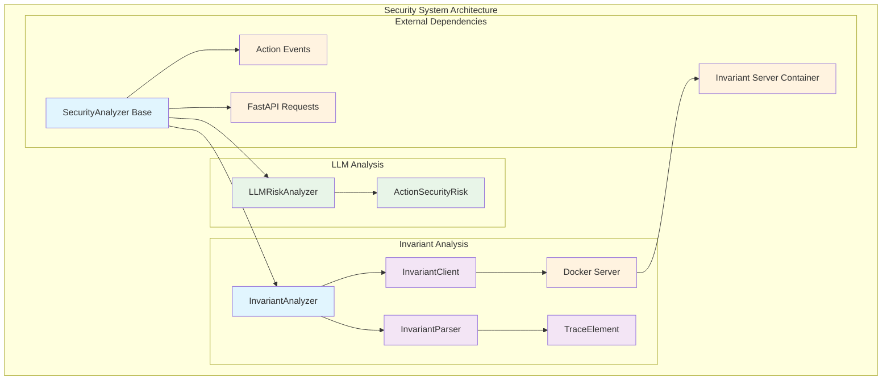
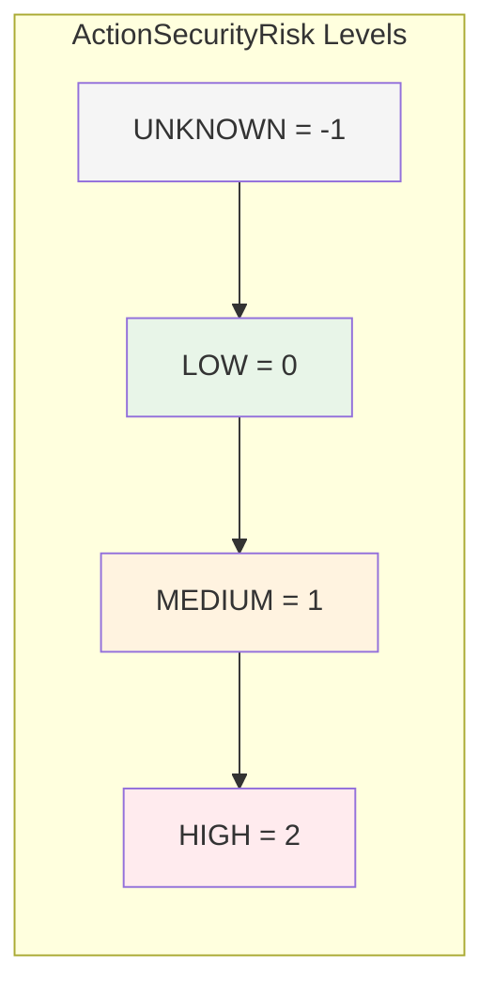
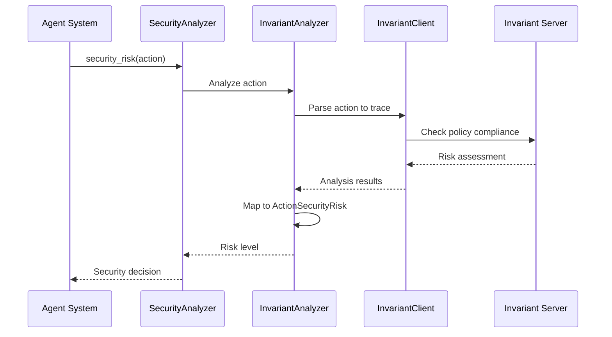

# Security System Module

## Overview

The Security System module provides comprehensive security analysis capabilities for the OpenHands platform, focusing on evaluating agent actions for potential security risks. This module implements a pluggable architecture that supports multiple security analysis strategies, from rule-based invariant checking to LLM-powered risk assessment.

## Purpose

The security system serves as a critical safety layer that:
- **Analyzes agent actions** before execution to identify potential security risks
- **Provides risk assessment** using configurable security analyzers
- **Enables policy enforcement** through invariant-based monitoring
- **Supports multiple analysis strategies** for different security requirements
- **Integrates seamlessly** with the core agent system and action processing pipeline

## Architecture Overview



## Core Components

### Base Security Framework
- **SecurityAnalyzer**: Abstract base class defining the security analysis interface
- **SecurityAnalyzers Registry**: Configuration mapping for available analyzer implementations

### Analysis Implementations
- **InvariantAnalyzer**: Rule-based security analysis using external Invariant service
- **LLMRiskAnalyzer**: LLM-powered risk assessment based on action attributes

### Supporting Infrastructure
- **InvariantClient**: Client interface for communicating with Invariant security service
- **TraceElement Parser**: Converts OpenHands events to Invariant-compatible trace format
- **Risk Assessment Types**: Standardized security risk levels and classifications

## Sub-modules

This module consists of two main analysis strategies, each with detailed documentation:

### [Invariant Analysis](invariant_analysis.md)
Advanced rule-based security analysis using the Invariant Labs security service. This comprehensive sub-module provides:
- Docker-containerized security analysis server management
- Policy-based monitoring and real-time checking capabilities
- Sophisticated trace-based action analysis
- Integration with external Invariant Labs security platform
- Session management and resource lifecycle handling

### [LLM Risk Analysis](llm_risk_analysis.md)
Lightweight security analysis that leverages LLM-provided risk assessments. This streamlined sub-module features:
- Direct integration with LLM-generated security attributes
- Minimal overhead analysis for performance-critical scenarios
- Intelligent fallback risk assessment capabilities
- Trust-based security evaluation approach

## Integration Points

### Core Agent System Integration
The security system integrates with the [core_agent_system](core_agent_system.md) module through:
- **Action Processing**: Security analysis occurs during action validation
- **State Management**: Security state tracking through trace elements
- **Agent Management**: Risk-based action filtering and control

### Events and Actions Integration
Deep integration with [events_and_actions](events_and_actions.md) module:
- **Action Analysis**: All agent actions are evaluated for security risks
- **Event Streaming**: Security events are part of the event stream
- **Risk Classification**: Actions are tagged with security risk levels

### Server and API Integration
Integration with [server_and_api](server_and_api.md) for:
- **API Request Handling**: Security analysis of incoming requests
- **Middleware Integration**: Security checks in request processing pipeline
- **Session Security**: Security context maintenance across sessions

## Security Risk Levels

The system uses a standardized risk classification:



## Data Flow



## Configuration

Security analyzers are configured through the `SecurityAnalyzers` registry:

```python
SecurityAnalyzers = {
    'invariant': InvariantAnalyzer,
    'llm': LLMRiskAnalyzer,
}
```

## Usage Patterns

### Basic Security Analysis
```python
analyzer = SecurityAnalyzer()
risk_level = await analyzer.security_risk(action)
```

### Invariant-based Analysis
```python
analyzer = InvariantAnalyzer(policy="security_policy.txt")
risk_level = await analyzer.security_risk(action)
await analyzer.close()  # Cleanup Docker resources
```

### LLM Risk Analysis
```python
analyzer = LLMRiskAnalyzer()
risk_level = await analyzer.security_risk(action)
```

## Dependencies

### Internal Dependencies
- **Events System**: Action and observation event types
- **Core Configuration**: Security configuration settings
- **Runtime System**: Docker integration for Invariant analyzer
- **LLM Integration**: For LLM-based risk assessment

### External Dependencies
- **Docker**: Required for InvariantAnalyzer container management
- **Invariant Labs Service**: External security analysis service
- **FastAPI**: For API request handling
- **Pydantic**: Data validation and serialization

## Error Handling

The security system implements robust error handling:
- **Container Management**: Graceful Docker container lifecycle management
- **Network Resilience**: Timeout and retry mechanisms for external services
- **Fallback Strategies**: Default to safe risk levels when analysis fails
- **Resource Cleanup**: Proper cleanup of allocated resources

## Performance Considerations

- **Lazy Initialization**: Analyzers are initialized only when needed
- **Container Reuse**: Docker containers are reused across analysis sessions
- **Async Operations**: All analysis operations are asynchronous
- **Minimal Overhead**: LLM analyzer provides lightweight alternative

## Security Considerations

- **Isolation**: Invariant analysis runs in isolated Docker containers
- **Policy Validation**: Security policies are validated before application
- **Risk Escalation**: Unknown risks are treated conservatively
- **Audit Trail**: All security decisions are logged for audit purposes

This security system provides a robust foundation for ensuring safe agent operation while maintaining flexibility for different security requirements and deployment scenarios.