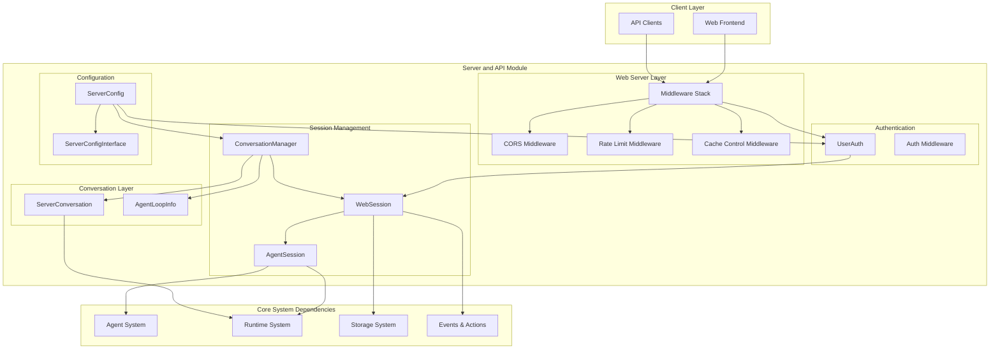
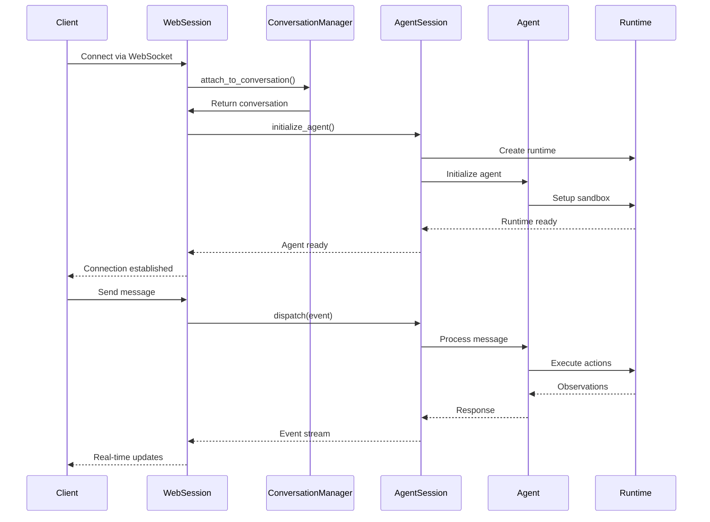
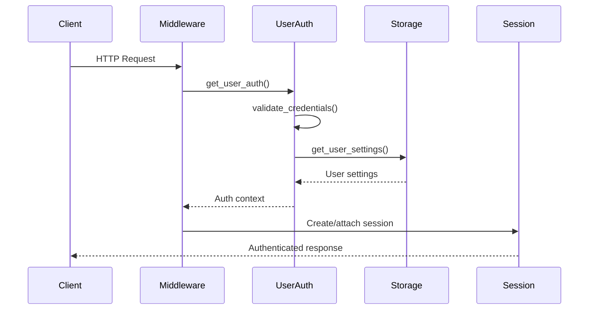

# Server and API Module

## Overview

The `server_and_api` module serves as the core web server infrastructure for OpenHands, providing HTTP/WebSocket APIs, session management, conversation orchestration, and user authentication. This module acts as the primary interface between frontend clients and the underlying agent system, managing the complete lifecycle of user interactions with AI agents.

## Purpose

The server_and_api module enables:
- **Web Server Operations**: FastAPI-based HTTP server with WebSocket support for real-time communication
- **Session Management**: Lifecycle management of user sessions and agent conversations
- **Conversation Orchestration**: Coordination between multiple conversations and agent sessions
- **User Authentication**: Extensible authentication framework supporting multiple auth strategies
- **Request Processing**: Middleware for rate limiting, CORS handling, and request validation
- **Real-time Communication**: WebSocket-based event streaming for live agent interactions

## Architecture Overview



## Core Components

### 1. Session Management Layer
- **[WebSession](session_management.md)**: Web server-bound session wrapper managing client connections and agent lifecycle
- **[AgentSession](session_management.md)**: Core agent session coordinating runtime environments and LLM interactions
- **Event Streaming**: Real-time event communication between client and agent systems

### 2. Conversation Orchestration
- **[ConversationManager](conversation_orchestration.md)**: Abstract conversation management with pluggable implementations
- **[ServerConversation](conversation_orchestration.md)**: Server-side conversation state and runtime management
- **[AgentLoopInfo](conversation_orchestration.md)**: Conversation metadata and status tracking

### 3. Authentication & Authorization
- **[UserAuth](authentication_system.md)**: Extensible authentication framework with multiple provider support
- **Authentication Types**: Cookie-based and bearer token authentication methods
- **Provider Integration**: Git provider tokens and custom secrets management

### 4. Web Server Infrastructure
- **[RateLimitMiddleware](web_infrastructure.md)**: Request rate limiting and DDoS protection
- **CORS Middleware**: Cross-origin request handling with localhost support
- **Cache Control**: Response caching strategies for static and dynamic content

### 5. Configuration Management
- **[ServerConfigInterface](configuration_management.md)**: Abstract server configuration with extensible patterns
- **Environment Integration**: Configuration loading from environment variables
- **Feature Flags**: Runtime feature toggling and deployment-specific settings

## Sub-Module Documentation

### Session Management
The session management module provides the core infrastructure for managing web client sessions and their associated agent interactions. It consists of WebSession for client connection management and AgentSession for agent coordination, handling the complete lifecycle from connection to termination.

**[→ View Session Management Documentation](session_management.md)**

### Conversation Orchestration  
The conversation orchestration module manages multiple concurrent conversations and provides extensible conversation management strategies. It includes ConversationManager for abstract conversation handling, ServerConversation for state management, and AgentLoopInfo for tracking conversation metadata.

**[→ View Conversation Orchestration Documentation](conversation_orchestration.md)**

### Authentication System
The authentication system provides a flexible, extensible framework for user authentication and authorization. It implements an abstract base class pattern supporting multiple authentication methods including cookie-based, bearer token, and custom provider integrations.

**[→ View Authentication System Documentation](authentication_system.md)**

### Web Infrastructure
The web infrastructure module provides foundational web server components including middleware stack for CORS, rate limiting, and cache control. It handles request processing, WebSocket communication, and provides the core HTTP server infrastructure.

**[→ View Web Infrastructure Documentation](web_infrastructure.md)**

### Configuration Management
The configuration management module handles server configuration through the ServerConfigInterface, providing environment-based configuration overrides, feature flags, and extensible configuration patterns for different deployment scenarios.

**[→ View Configuration Management Documentation](configuration_management.md)**

## Key Interactions

### Session Lifecycle Flow


### Authentication Flow


## Integration Points

### Dependencies on Other Modules

1. **[Core Agent System](core_agent_system.md)**: Agent lifecycle management and action processing
2. **[Runtime System](runtime_system.md)**: Sandbox execution and environment management  
3. **[Storage System](storage_system.md)**: Conversation persistence and user data storage
4. **[Events & Actions](events_and_actions.md)**: Event streaming and action processing
5. **[LLM Integration](llm_integration.md)**: Language model communication and management

### External Integrations

1. **Frontend Systems**: WebSocket and HTTP API endpoints for client communication
2. **Authentication Providers**: OAuth, SAML, and custom authentication integrations
3. **Monitoring Systems**: Metrics collection and health monitoring
4. **Load Balancers**: Session affinity and distributed deployment support

## Configuration

### Environment Variables
```bash
# Server Configuration
OPENHANDS_CONFIG_CLS=custom.config.CustomServerConfig
CONVERSATION_MANAGER_CLASS=custom.manager.CustomConversationManager

# Authentication
GITHUB_APP_CLIENT_ID=your_github_client_id
ENABLE_BILLING=true
HIDE_LLM_SETTINGS=false

# CORS Configuration  
PERMITTED_CORS_ORIGINS=http://localhost:3000,https://app.example.com

# Storage Classes
SETTINGS_STORE_CLASS=custom.storage.CustomSettingsStore
SECRET_STORE_CLASS=custom.storage.CustomSecretsStore
CONVERSATION_STORE_CLASS=custom.storage.CustomConversationStore
```

### Extension Points

The server_and_api module provides several extension points for customization:

1. **ConversationManager**: Custom conversation management strategies
2. **UserAuth**: Custom authentication mechanisms  
3. **ServerConfig**: Custom server configuration classes
4. **Storage Classes**: Custom storage implementations
5. **Middleware**: Custom request processing middleware

## Performance Considerations

### Scalability Features
- **Async/Await**: Full asynchronous request handling
- **Connection Pooling**: Efficient WebSocket connection management
- **Rate Limiting**: Configurable request rate limiting
- **Session Affinity**: Support for distributed deployments
- **Resource Cleanup**: Automatic session and resource cleanup

### Monitoring & Observability
- **Health Checks**: Built-in health monitoring endpoints
- **Metrics Collection**: Performance and usage metrics
- **Logging**: Structured logging with session context
- **Error Tracking**: Comprehensive error reporting and tracking

## Security Features

### Request Security
- **CORS Protection**: Configurable cross-origin request handling
- **Rate Limiting**: DDoS protection and abuse prevention
- **Input Validation**: Request payload validation and sanitization
- **Authentication**: Multi-provider authentication support

### Session Security
- **Session Isolation**: Secure session boundary enforcement
- **Token Management**: Secure token handling and rotation
- **Secret Management**: Encrypted secret storage and access
- **Audit Logging**: Security event logging and monitoring

This module serves as the critical bridge between user interfaces and the OpenHands agent system, providing robust, scalable, and secure web server infrastructure for AI agent interactions.