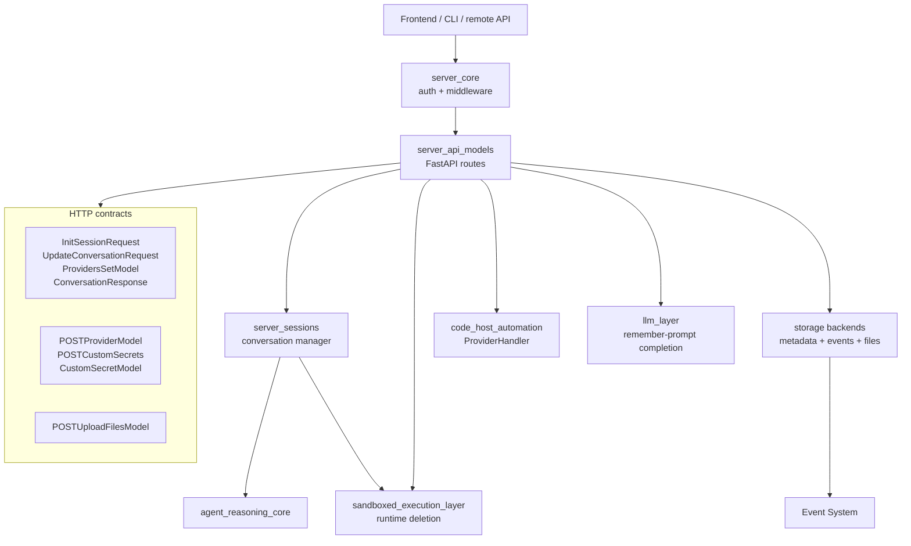
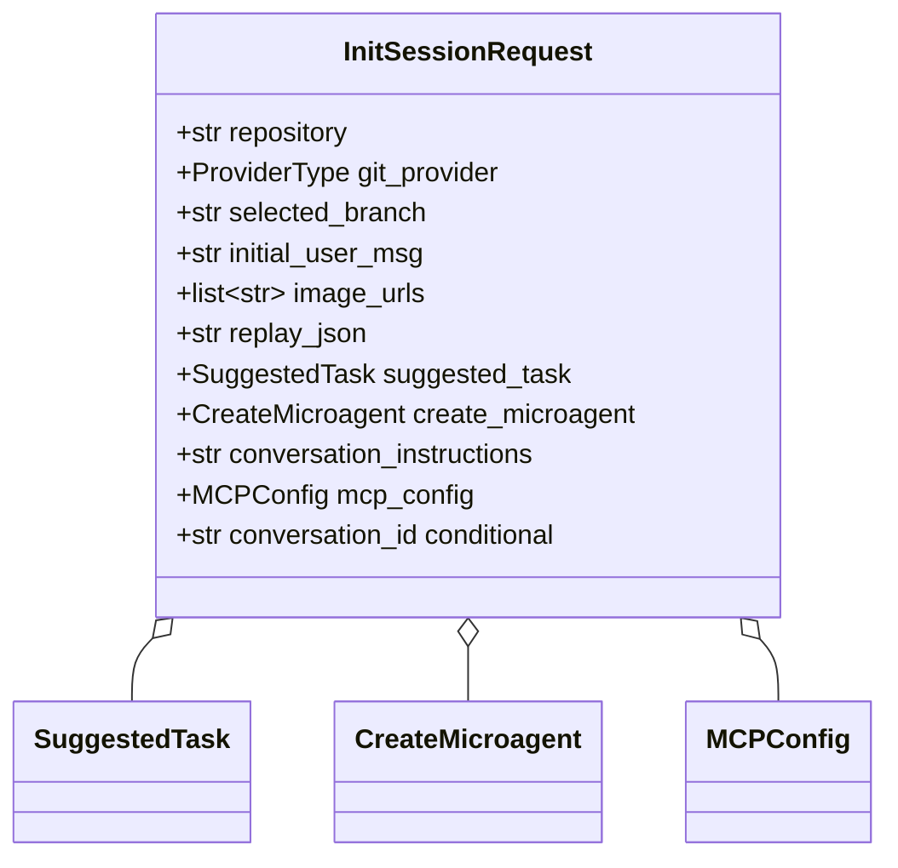
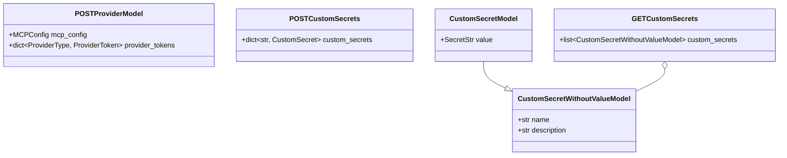
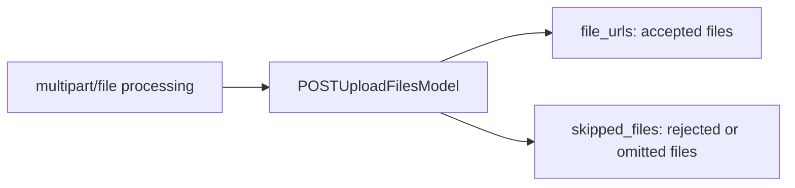
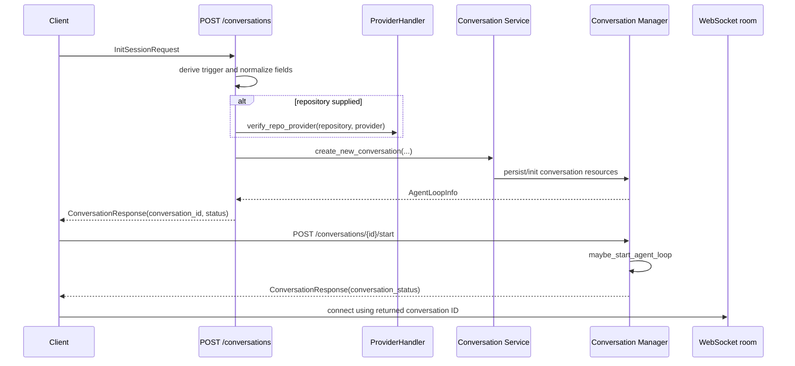
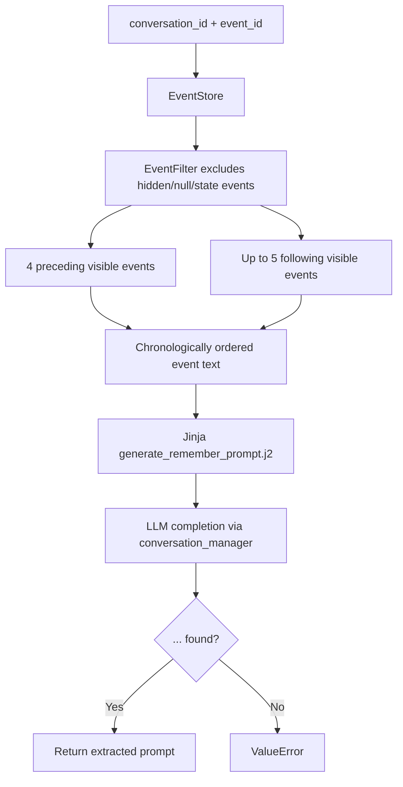
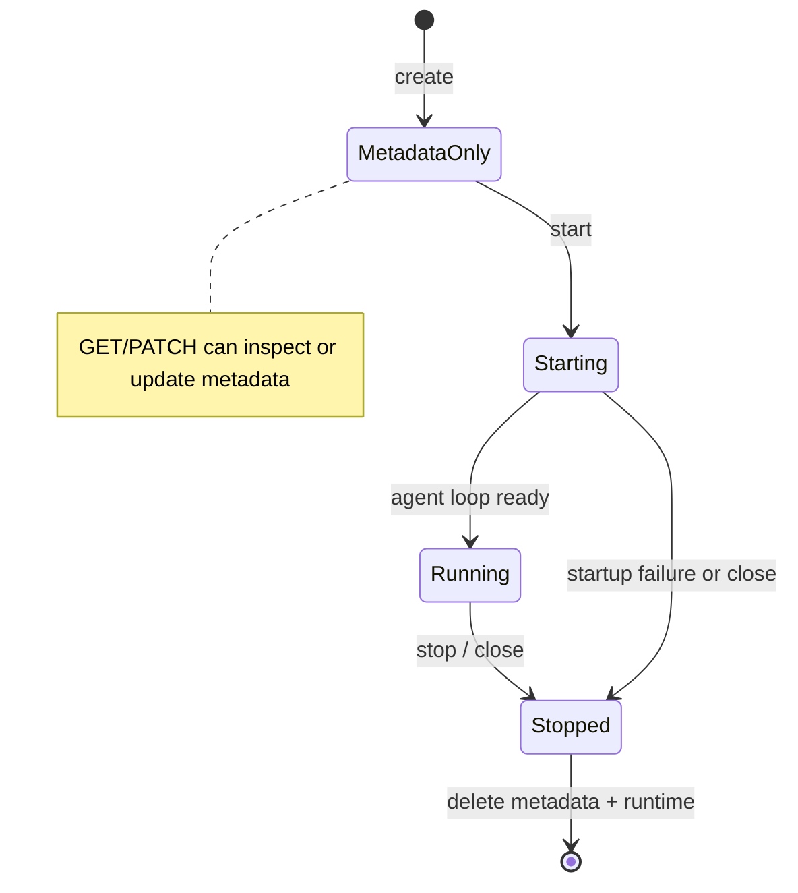

# Server API Models

The `server_api_models` module defines the Pydantic request/response contracts used
by the conversation-management, settings, and file-upload APIs. Its route handlers
also coordinate conversation metadata, agent-loop lifecycle, provider validation,
event-derived prompt generation, and experiment configuration. The models keep the
HTTP boundary explicit; the underlying session orchestration is owned by
[Server Sessions](server_sessions.md), while authentication and middleware are
provided by [Server Core](server_core.md).

## Position in the system



The module is an adapter rather than a domain store. It validates incoming JSON,
resolves FastAPI dependencies, invokes service/store interfaces, and translates
common failures into stable JSON responses. Conversation execution remains in
the session tier; see [Server Sessions](server_sessions.md) for startup, runtime,
controller, and shutdown ownership.

## API contract inventory

| Model | Direction | Purpose |
| --- | --- | --- |
| `InitSessionRequest` | Request | Creates or joins a conversation and optionally supplies repository, branch, initial message, images, replay data, microagent/task data, instructions, MCP configuration, and an explicitly controlled conversation ID. |
| `ConversationResponse` | Response | Returns operation status, conversation ID, optional message, and current `ConversationStatus`. |
| `ProvidersSetModel` | Request | Supplies provider selections when starting an existing conversation. |
| `UpdateConversationRequest` | Request | Replaces a conversation title, constrained to 1–200 characters. |
| `POSTProviderModel` | Request | Carries optional MCP configuration and provider tokens for settings POST operations. |
| `POSTCustomSecrets` | Request | Adds named custom secrets keyed by secret name. |
| `CustomSecretModel` | Request | Represents one custom secret with a write-only `SecretStr` value. |
| `POSTUploadFilesModel` | Response | Reports uploaded file URLs and files skipped by upload processing. |

All request models use Pydantic validation. `InitSessionRequest` and
`UpdateConversationRequest` reject unknown fields (`extra='forbid'`), preventing
clients from silently sending unsupported options. Mutable dictionary defaults in
the settings models are part of the current contract and should be treated as
request-local values by callers.

## Conversation request models

### `InitSessionRequest`



Fields are optional because the GUI can progressively assemble a session request.
The route applies the following precedence and normalization rules:

* `image_urls` becomes an empty list when omitted.
* `suggested_task`, when present, supplies the initial user message through
  `get_prompt_for_task()` and marks the trigger as `SUGGESTED_TASK`.
* `create_microagent` marks the trigger as `MICROAGENT_MANAGEMENT` and can provide
  the repository and provider when those top-level fields are absent.
* bearer-authenticated requests override the trigger with `REMOTE_API_KEY` and
  require an initial user message.
* `conversation_id` is only part of the schema when
  `ALLOW_SET_CONVERSATION_ID=1`; otherwise the server generates a UUID-based ID.
  This limits a capability needed by nested runtimes because caller-selected IDs
  could create an authorization or collision risk.

### `UpdateConversationRequest`

The model contains one required field, `title`. Pydantic enforces the length range;
the route additionally strips surrounding whitespace before persisting the title.
The authenticated user must own the conversation when a user ID is available.

### `ProvidersSetModel` and `ConversationResponse`

`ProvidersSetModel.providers_set` is an optional list of `ProviderType` values and
defaults to an empty list at start-up when omitted. `ConversationResponse.status`
is the route-level operation result (`ok` or an error response may instead be an
HTTP `JSONResponse`). `conversation_status` reflects the agent-loop state, such as
starting, running, or stopped; the enum is defined in the shared storage/status
contracts rather than duplicated here. See [Storage Conversation Status](storage_backends_conversation_status.md).

## Settings and secret models



`POSTProviderModel` combines optional MCP settings with provider credentials for
settings write operations. Provider token semantics belong to the integration
layer and shared platform contracts; see [Shared Platform Foundation](shared_platform_foundation.md).
Secret
values use Pydantic `SecretStr`, allowing the API/application layers to avoid
accidentally exposing raw values in normal representations. The value-free model
is intended for listing secret names and descriptions, while `CustomSecretModel`
is used when accepting a value. `GETSettingsModel` and `GETCustomSecrets` are
supporting read models in the same file even though they are not among the core
components listed for this module.

## File-upload model

`POSTUploadFilesModel` reports two independent outcomes:



The model does not contain file bytes, storage configuration, or validation policy;
it is only the serialized result. File persistence is delegated to the configured
storage backend described in [Storage Backends](storage_backends.md).

## Conversation endpoint behavior

The route set is mounted under `/api` and exposes the following lifecycle surface:

| Endpoint | Behavior |
| --- | --- |
| `POST /conversations` | Validates repository access, derives a trigger, creates metadata/session state, and returns a conversation ID. |
| `GET /conversations` | Searches metadata, removes conversations older than configured maximum age, applies repository/trigger filters, and enriches results with connection and agent-loop information. |
| `GET /conversations/{id}` | Loads one metadata record and enriches it with connection count and agent-loop status. |
| `PATCH /conversations/{id}` | Authorizes the owner, updates the trimmed title and timestamp, persists metadata, and emits a Socket.IO title update. |
| `DELETE /conversations/{id}` | Closes a running loop, deletes runtime state, then deletes conversation metadata. |
| `POST /conversations/{id}/start` | Verifies existence, builds initialization settings from selected providers, and starts or reuses the agent loop. |
| `POST /conversations/{id}/stop` | Closes a running loop; stopping an already stopped loop is idempotent. |
| `GET /conversations/{id}/remember-prompt` | Selects nearby visible events and asks the configured LLM to generate a microagent update prompt. |
| `POST /conversations/{id}/exp-config` | Writes an experiment configuration only if one does not already exist. |
| `GET /microagent-management/conversations` | Returns recent microagent-management conversations for a repository whose latest PR remains open. |

### Create and start flow



Creation initializes the conversation boundary but the client is expected to use
the returned ID for the WebSocket connection and, where applicable, the explicit
`start` endpoint. Repository verification occurs before conversation creation.

### Search and enrichment flow

```mermaid
flowchart TD
    A[ConversationStore.search(page_id, limit)] --> B[Age filter]
    B --> C{Repository and trigger filters}
    C --> D[Collect conversation IDs]
    D --> E[Conversation manager: connections]
    D --> F[Conversation manager: agent-loop info]
    E --> G[Build ConversationInfo records]
    F --> G
    G --> H[ConversationInfoResultSet + next_page_id]
```

Age filtering happens before the optional repository and trigger filters. A
conversation without `created_at` is excluded. Enrichment failures for individual
records are logged and converted to a missing result entry rather than failing the
entire response. The result set preserves the store's pagination cursor.

## Remember-prompt process

The remember-prompt endpoint turns a small event window into an LLM-generated prompt:



The event window is intentionally bounded: four events before the target and up to
five after it. The LLM response must contain an `<update_prompt>` wrapper; arbitrary
text is not returned as a prompt. LLM configuration is loaded from the user's
settings, and the settings/LLM implementation details are owned by the platform and
[LLM Layer](llm_layer.md).

## Lifecycle, authorization, and failure semantics



Important route-level behaviors are:

* Missing settings and LLM authentication failures during creation return HTTP 400
  with stable message IDs (`CONFIGURATION$SETTINGS_NOT_FOUND` and the runtime LLM
  authentication value).
* Starting a nonexistent conversation returns 404; unexpected start/stop failures
  return 500 with a conversation ID and diagnostic message.
* Updating a conversation owned by another authenticated user returns 403. Missing
  metadata returns 404. Socket.IO notification failure is logged but does not roll
  back a successful metadata update.
* Deletion is ordered to close an active agent loop, delete the selected runtime,
  and finally remove metadata. This delegates execution cleanup to the
  [Sandboxed Execution Layer](sandboxed_execution_layer.md).
* Experiment configuration creation is effectively write-once: an existing file
  causes the route to return `False` without modifying it.

## Related modules

Use these documents for the implementation behind each boundary:

* [Server Core](server_core.md) — authentication dependencies, middleware, app mode,
  and server-level errors.
* [Server Sessions](server_sessions.md) — conversation/session lifecycle and manager
  ownership.
* [Storage Backends](storage_backends.md) — metadata, event, file, and settings
  persistence.
* [Event System](event_system.md) — event streams, filtering, and observations used
  by remember-prompt generation.
* [Sandboxed Execution Layer](sandboxed_execution_layer.md) — runtime selection and
  deletion.
* [Shared Platform Foundation](shared_platform_foundation.md) — provider, schema,
  configuration, and storage-adjacent contracts consumed by the API boundary.
* The frontend and CLI clients listed in the module tree consume these contracts;
  their client-specific implementation is outside the generated documentation set.
