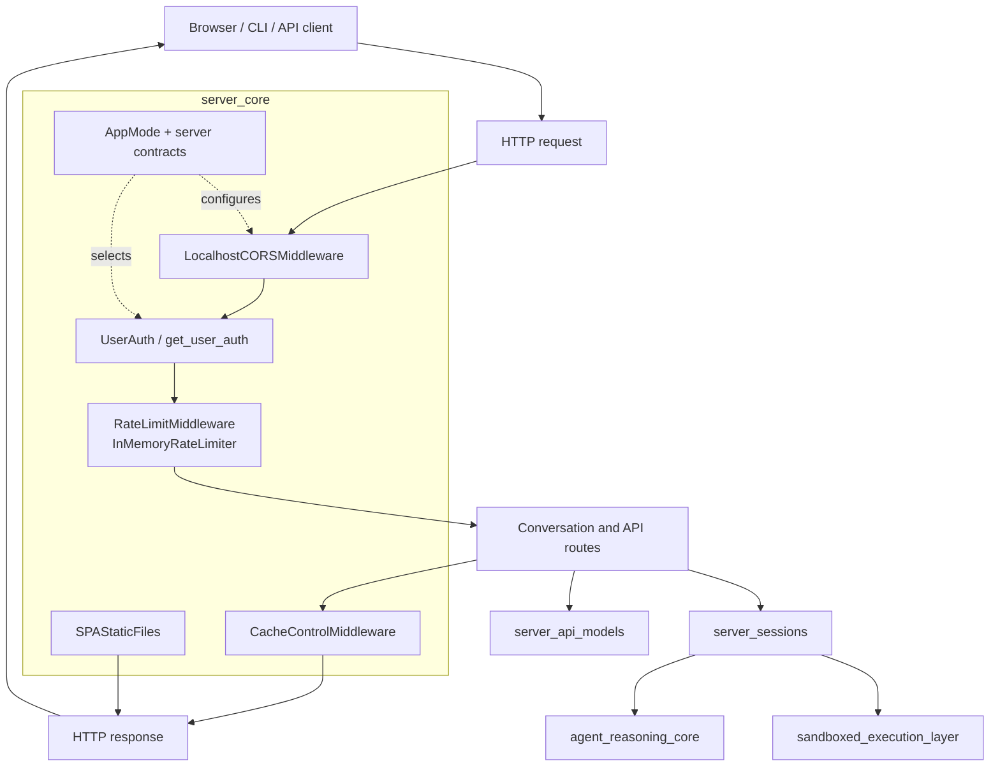
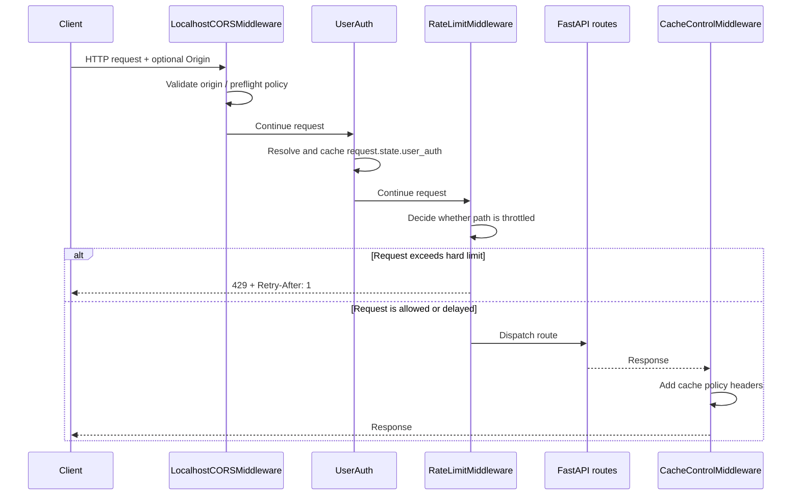
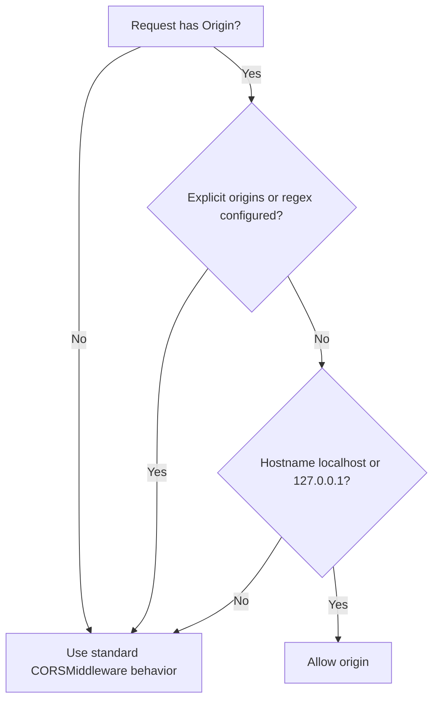
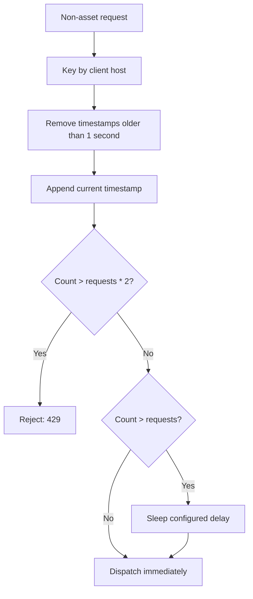
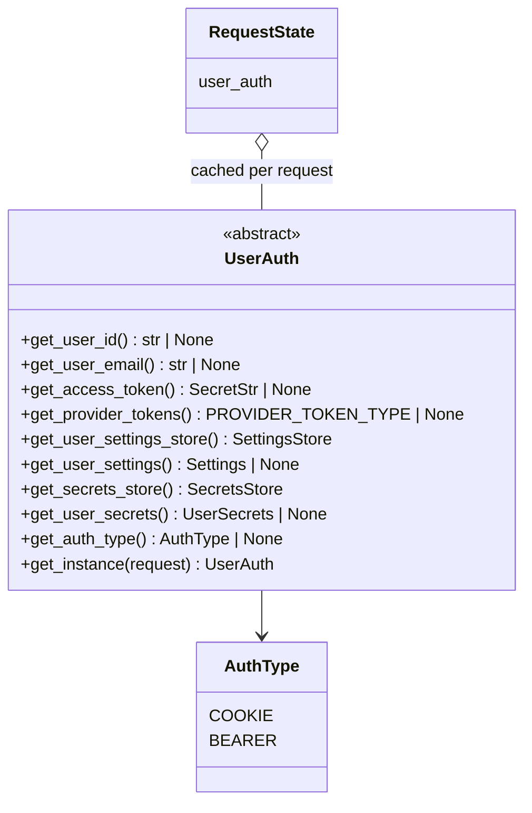
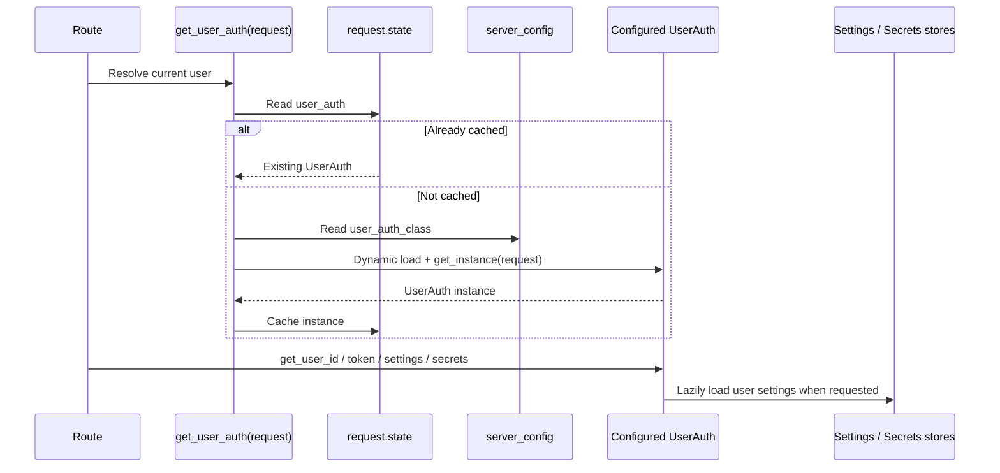

# Server Core

The `server_core` module provides the HTTP-facing infrastructure shared by the
OpenHands conversation service. It establishes browser access rules, response-cache
semantics, request throttling, single-page-application (SPA) serving, application-mode
contracts, and the pluggable user-authentication boundary.

It is deliberately a cross-cutting layer rather than a feature API: conversation
lifecycle behavior belongs to [Server Sessions](server_sessions.md), request/response
schemas belong to [Server API Models](server_api_models.md), and durable events and
storage belong to the [Event System](event_system.md) and [Storage Backends](storage_backends.md).

## Responsibilities and boundaries



The module does not implement conversations, agent control, sandbox execution, or
provider integrations. It supplies the policies and extension points through which
those layers are exposed to clients.

## Request middleware pipeline

The application composes the middleware classes around the ASGI application. Exact
registration order is determined by the server bootstrap; the logical responsibilities
are as follows:



Authentication is shown as a conceptual stage. `get_user_auth()` is a helper used by
routes or dependencies; `UserAuth` is not itself an HTTP middleware class.

## CORS policy

`LocalhostCORSMiddleware` subclasses FastAPI/Starlette `CORSMiddleware` and always
enables credentials, all methods, and all headers. Its origin policy has two modes:

1. If `PERMITTED_CORS_ORIGINS` is set, its comma-separated values become the explicit
   allowed-origin tuple and standard parent-class matching is used.
2. If no explicit origins or regex are configured, any origin whose hostname is exactly
   `localhost` or `127.0.0.1` is accepted, regardless of port.

Missing origins and all other origins are delegated to the parent CORS implementation.
The localhost shortcut is therefore a development convenience, not a general wildcard.



Because credentials are enabled, deployments should use a deliberate
`PERMITTED_CORS_ORIGINS` value when serving non-local clients.

## Cache-control policy

`CacheControlMiddleware` applies headers after the downstream handler returns:

| Path | Policy | Intent |
| --- | --- | --- |
| `/assets...` | `public, max-age=2592000, immutable` | Cache fingerprinted frontend assets for 30 days |
| Everything else | `no-cache, no-store, must-revalidate, max-age=0`, plus `Pragma: no-cache` and `Expires: 0` | Prevent stale application and API responses |

The decision is based only on the URL path prefix. Query parameters and response
content type do not change it.

## Rate limiting

`RateLimitMiddleware` delegates request accounting to an injected
`InMemoryRateLimiter`. Assets are exempt. Other paths currently pass through
`is_rate_limited_request()`, leaving a single extension point for future exemptions.

The limiter stores timestamps per `request.client.host`, removes entries older than
the configured rolling window, and appends the current request before evaluating the
threshold. With defaults (`requests=2`, `seconds=1`, `sleep_seconds=1`):



Thus requests above the soft threshold are delayed, while requests above twice the
configured request count are rejected. The response is a JSON object with
`{"message": "Too many requests"}`, status `429`, and `Retry-After: 1`.

This is process-local, in-memory state: it is not shared across workers or hosts and
is lost on restart. It is suitable for lightweight protection of a single process,
but a distributed deployment needs an external/shared limiter if global enforcement
is required. The fixed `Retry-After` header also reflects the middleware response,
not a dynamically calculated remaining window.

## SPA static-file serving

`SPAStaticFiles` extends Starlette `StaticFiles`. It first attempts normal static-file
resolution. If that operation raises any exception, it serves `index.html` instead.
This supports client-side frontend routes such as `/conversation/...` when the server
has no matching physical file.

```mermaid
flowchart LR
    A[GET frontend path] --> B[StaticFiles.get_response(path)]
    B -->|success| C[Return file]
    B -->|any exception| D[Resolve index.html]
    D --> E[Return SPA shell]
```

The fallback intentionally treats all exceptions as route misses. Consequently,
permission, filesystem, or configuration errors can also fall back to `index.html`;
diagnostics should account for that behavior.

## Application and session contracts

`AppMode` distinguishes the OSS and SaaS deployment modes:

```python
AppMode.OSS   # "oss"
AppMode.SAAS  # "saas"
```

`ServerConfigInterface` defines the configuration surface expected by the server:
configuration path, application mode, frontend-related keys, session middleware path,
validation, and frontend configuration serialization. `SessionMiddlewareInterface` is
a structural protocol used as the extension boundary for session middleware.

`MissingSettingsError` and `LLMAuthenticationError` are server-level value errors used
to distinguish absent settings from LLM credential problems. The underlying settings,
LLM, and provider contracts are owned by the relevant platform and reasoning modules.

## Authentication extension point

`AuthType` identifies the two supported transport conventions:



Applications provide a subclass of `UserAuth` and configure
`server_config.user_auth_class` with its fully qualified name. `get_user_auth(request)`
then:

1. Reuses `request.state.user_auth` when a prior dependency already resolved it.
2. Dynamically loads the configured implementation through `get_impl()`.
3. Calls its asynchronous `get_instance(request)` factory.
4. Raises `ValueError` if no instance can be obtained.
5. Stores the instance on request state for the remainder of the request.

The authentication object also provides access to per-user settings and secrets stores.
Settings are lazily loaded and cached on the `UserAuth` instance; secrets and provider
tokens remain implementation-defined. Persistence options are documented in
[Storage Backends](storage_backends.md).



## Relationship to neighboring modules

- [Server Sessions](server_sessions.md) owns `AgentSession`, `WebSession`,
  `ServerConversation`, and conversation statistics. It consumes the authentication
  and server-mode contracts defined here.
- [Server API Models](server_api_models.md) owns request/settings/upload models used by
  HTTP routes; this module does not duplicate those schemas.
- [Agent Reasoning Core](agent_reasoning_core.md) executes authenticated conversations
  through controllers, agents, memory, and LLM services.
- [Sandboxed Execution Layer](sandboxed_execution_layer.md) provides the runtimes that
  conversations control; server-core only protects and exposes the HTTP boundary.
- [User-Facing Clients](user_facing_clients.md) contains the CLI and frontend clients
  that consume the server responses and SPA assets.
- [Hosted SaaS Overlay](hosted_saas_overlay.md) can add SaaS-specific authentication,
  cookies, rate limits, routes, and monitoring around these OSS server contracts.

## Operational considerations

- Set `PERMITTED_CORS_ORIGINS` explicitly for deployed browser clients.
- Treat the in-memory limiter as per-process protection; coordinate it with the
  deployment topology and any upstream proxy limits.
- Preserve immutable asset filenames when deploying the frontend, since `/assets`
  responses are cached aggressively.
- Ensure `index.html` is available wherever `SPAStaticFiles` is mounted.
- Configure and test the `UserAuth` implementation for both unauthenticated and
  partially configured users; authentication failures can originate from the dynamic
  implementation, settings stores, or provider token stores.
